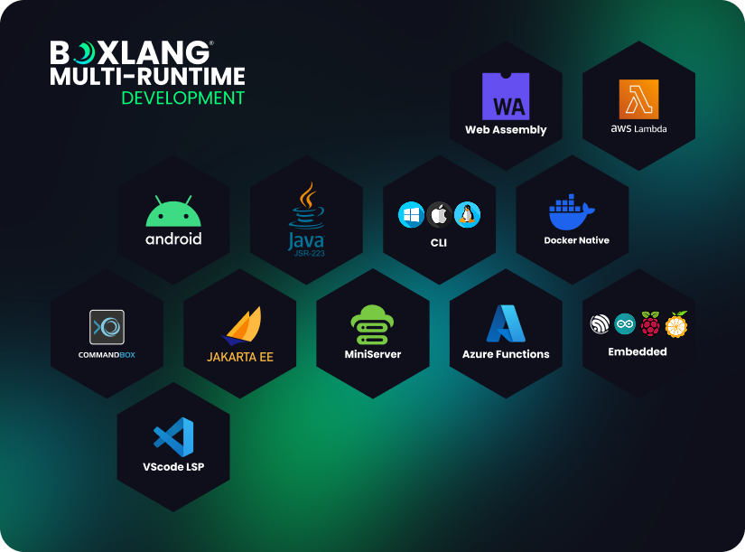

# Introduction

<figure><figcaption></figcaption></figure>

**BoxLang** is a modern dynamic JVM language that can be deployed on multiple runtimes: operating system (Windows/Mac/\*nix/Embedded), web server, lambda, iOS, android, web assembly, and more. BoxLang combines many features from different programming languages, including Java, CFML, Python, Ruby, Go, and PHP, to provide developers with a modern, functional and expressive syntax.

<figure><figcaption>
BoxLang Multi-Runtime
</figcaption></figure>

BoxLang has been designed to be a highly adaptable and dynamic language to take advantage of all the modern features of the JVM and was designed with several goals in mind:

1. Be a rapid application development (RAD) scripting language and middleware.
2. Unstagnate the dynamic language ecosystem in Java.
3. Be dynamic, modular, lightweight, and fast.
4. Be 100% interoperable with Java.
5. Be modern, functional, and fluent (Think mixing CFML, Node, Kotlin, Java, and Clojure)
6. Extend via Modules
7. Be able to support multiple runtime environments:
   1. Native OS Binaries (CLI Tooling, compilers, etc.)
   2. Serverless Computing (AWS Lambda, Azure Functions, etc)
   3. Servlet Containers - CommandBox/Tomcat/Jetty/JBoss/Undertow
   4. Docker Containers
   5. Android/iOS Devices
   6. Web assembly
   7. Etc
8. Compile down to Java ByteCode
9. Framework Capabilities (Scheduling, applications, events, async computing, tasks, queues, modules)
10. [Professional Open-Source Support](https://boxlang.io/plans)
11. Drop-in Replacement for Adobe ColdFusion and Lucee CFML


**BoxLang can also be used as a drop-in replacement for Adobe ColdFusion or Lucee CFML Engines by leveraging our `bx-compat-cfml`module.  NO CODE CHANGES, FASTER, MODERN AND SAVE MONEY.**



[overview](getting-started/overview/)


## Launch Video



## License

BoxLang is open source and licensed under the [Apache 2 ](https://www.apache.org/licenses/LICENSE-2.0.html)License. Copyright and Registered Trademark by Ortus Solutions, Corp.

## BoxLang Subscriptions

BoxLang can also be enhanced by [purchasing subscriptions](https://www.boxlang.io/plans) to give you:

* Business Support with SLAs
* Enhanced builds
* Custom patches and builds
* Dedicated Engineer
* Premium Modules
* Much More...



## Support Open Source

To support us, please consider becoming our patron at [patreon.com/ortussolutions](https://patreon.com/ortussolutions) for as little as $10/month.

## Discussions & Help

The Ortus Community is how to get help: [https://community.ortussolutions.com/c/boxlang/42](https://community.ortussolutions.com/c/boxlang/42)



You can also join our Slack Box Team at: [https://boxteam.ortussolutions.com](https://boxteam.ortussolutions.com/)

## Reporting a Bug 

We all make mistakes from time to time :) So why not let us know about it and help us out? We also love 😍 pull requests, so please star us and fork us at [https://github.com/ortus-boxlang/boxlang](https://github.com/ortus-boxlang/boxlang)

### Jira Issue Tracking

* BoxLang: [https://ortussolutions.atlassian.net/browse/BL](https://ortussolutions.atlassian.net/browse/BL)
* BoxLang IDE: [https://ortussolutions.atlassian.net/browse/BLIDE](https://ortussolutions.atlassian.net/browse/BLIDE)
* BoxLang Modules: [https://ortussolutions.atlassian.net/browse/BLMODULES](https://ortussolutions.atlassian.net/browse/BLMODULES)

## Resources

* Professional Support: [https://www.ortussolutions.com/services/support](https://www.ortussolutions.com/services/support)
* GitHub Org: [https://github.com/ortus-boxlang](https://github.com/ortus-boxlang)
* Twitter: [https://x.com/TryBoxLang](https://x.com/TryBoxLang)
* FaceBook: [https://www.facebook.com/tryboxlang/](https://www.facebook.com/tryboxlang/)
* LinkedIn: [https://www.linkedin.com/company/tryboxlang](https://www.linkedin.com/company/tryboxlang)

## Ortus Solutions, Corp

This book was written and maintained by [Luis Majano](https://www.luismajano.com) and the [Ortus Solutions](https://www.ortussolutions.com) Development Team.

> Ortus Solutions is a company that focuses on building professional open source tools, custom applications and great websites! We're the team behind ColdBox, the de-facto enterprise BoxLang HMVC Platform, TestBox, the BoxLang Testing and Behavior Driven Development (BDD) Framework, ContentBox, a highly modular and scalable Content Management System, CommandBox, the BoxLang \<BoxLang> CLI, package manager, etc, and many more - [https://www.ortussolutions.com/](https://www.ortussolutions.com/)
