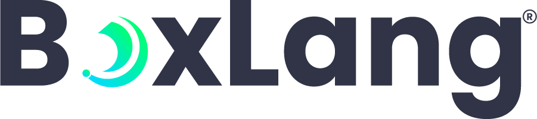
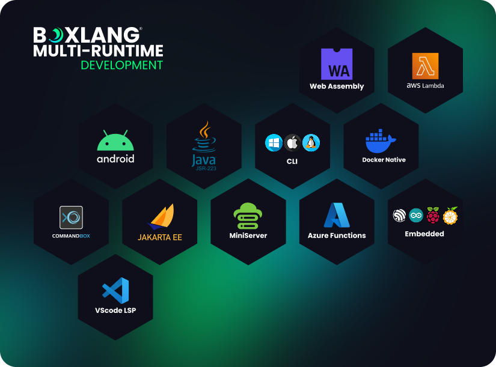
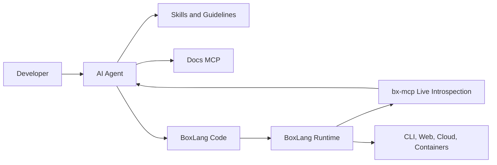

# Introduction

<figure><figcaption></figcaption></figure>

## 🚀 The Software Productivity Platform

**BoxLang is the software productivity platform for building, modernizing and running applications, with developers and AI agents working together.**

* **Built for developers.** A modern, expressive, dynamic JVM language with a batteries-included runtime.
* **Built for AI.** Predictable conventions, agent skills, live runtime introspection over MCP, and a first-class AI framework.
* **Built to ship.** One runtime for the CLI, web servers, containers, serverless, desktop and more. Backed by professional support when you need it.

<figure><figcaption><p>BoxLang Multi-Runtime</p></figcaption></figure>


[overview](getting-started/overview/)


## 🧱 Five Pillars

| Pillar | What you get |
| --- | --- |
| ⚡ **Productivity** | Low ceremony syntax, fluent APIs, and built-in file handling, HTTP, JDBC, async, caching, scheduling, templating and more. Less glue code and less to install. |
| 🔐 **Security** | Configurable [runtime security](getting-started/configuration/security.md), and modules for JWT, ESAPI, CSRF, LDAP and cloud secrets managers. |
| 🏛️ **Governance** | Control what runs and who can call it. Access-controlled MCP tooling for your runtime, and AI guardrails, human approval and audit trails for agents. |
| 📦 **Deployment** | Run it on the OS, CommandBox, MiniServer, Docker, AWS Lambda, Azure Functions, Google Cloud Functions, Spring Boot, WebAssembly and more. Compile to bytecode. |
| 🤖 **AI** | Chat, agents, tools, memory, RAG and MCP through one fluent API, across many providers including OpenAI, Claude, Gemini, Bedrock and local models. |

## 🤖 The Easiest Platform for Agents to Build On

AI agents are most productive on platforms that are predictable, well documented and complete. BoxLang is designed that way:

* **One runtime, few moving parts.** Files, HTTP, databases, async, caching, scheduling, logging and AI ship with the platform, so agents do not have to choose and wire up dozens of libraries.
* **Conventions agents can follow.** Consistent project layouts, `Application.bx` lifecycle, modules and configuration.
* **Skills and guidelines.** Installable `SKILL.md` playbooks teach your agent how to do specific BoxLang tasks the idiomatic way.
* **Docs over MCP.** The BoxLang documentation is available as an MCP server at `https://boxlang.ortusbooks.com/~gitbook/mcp`, so agents read current docs instead of guessing.
* **Live runtime introspection.** With BoxLang+, the `bx-mcp` module lets an agent inspect a running server through MCP, with access control built in.
* **Java under the hood.** 100% Java interoperability gives agents the entire JVM ecosystem when they need it.


```mermaid
flowchart LR
    Dev[Developer] --> Agent[AI Agent]
    Agent --> Skills[Skills and Guidelines]
    Agent --> Docs[Docs MCP]
    Agent --> Code[BoxLang Code]
    Code --> Runtime[BoxLang Runtime]
    Runtime --> MCP[bx-mcp Live Introspection]
    MCP --> Agent
    Runtime --> Ship[CLI, Web, Cloud, Containers]
```

## 🏢 And Ready for the Enterprise

BoxLang is professional open source, built and supported by [Ortus Solutions](https://www.ortussolutions.com). Start free, then add support and productivity as you grow:

* **Professional support** with SLAs, plus dedicated engineer options.
* **Premium modules** for spreadsheets, CSV, Redis, Couchbase, cloud secrets, LDAP, MCP and more.
* **Modernization path.** Run existing Adobe ColdFusion and Lucee CFML applications on BoxLang with the `bx-compat-cfml` module, with no code changes, then modernize at your own pace.
* **Predictable roadmap** and enhanced or custom builds.


**Try every BoxLang+ module free for 60 days.** There is nothing to sign up for. The trial starts automatically the first time you start a BoxLang server or CLI with a BoxLang+ module installed, so you can test whether your idea, update or migration works with no friction. Most modules are open source and free to use. If you want enterprise support and the full productivity stack, [join us](https://www.boxlang.io/plans).



[boxlang-plus](boxlang-framework/boxlang-plus/)




## ⚡ Quick Start

Install BoxLang on Mac or Linux:

```bash
/bin/bash -c "$(curl -fsSL https://install.boxlang.io)"
```

Verify and start the REPL:

```bash
boxlang --version
boxlang
```

Serve a web application:

```bash
boxlang-miniserver --port 8080
```

Add modules, including BoxLang+ modules that start their 60-day trial automatically:

```bash
install-bx-module bx-plus bx-ai bx-mcp
```

See the [installation guide](getting-started/installation/) for Windows, Homebrew, BVM and other options.

## 🧭 Where to Go Next

* 📘 [Overview](getting-started/overview/) - what BoxLang is and how it is put together.
* 🛠️ [Installation](getting-started/installation/) and [Running BoxLang](getting-started/running-boxlang/) - every runtime and deployment target.
* 🔁 [Running CFML Apps](getting-started/overview/running-coldfusion-cfml-apps/) - modernize Adobe ColdFusion and Lucee applications.
* 🧩 [Modules](boxlang-framework/modularity/) - the extension ecosystem.
* 🎓 [BoxLings](https://github.com/ortus-boxlang/boxlings) - learn BoxLang hands-on with an interactive CLI and test-driven exercises.

## 📜 License

BoxLang is open source and licensed under the [Apache 2](https://www.apache.org/licenses/LICENSE-2.0.html) License. Copyright and Registered Trademark by Ortus Solutions, Corp.

## 💬 Discussions & Help

* Community: [community.ortussolutions.com/c/boxlang/42](https://community.ortussolutions.com/c/boxlang/42)
* Slack: [boxteam.ortussolutions.com](https://boxteam.ortussolutions.com/)
* Professional support: [ortussolutions.com/services/support](https://www.ortussolutions.com/services/support)

To support open source, consider becoming a patron at [patreon.com/ortussolutions](https://patreon.com/ortussolutions).

## 🐞 Reporting a Bug <a href="#reporting-a-bug" id="reporting-a-bug"></a>

We all make mistakes from time to time, so why not let us know about it and help us out? We also love pull requests, so please star us and fork us at [github.com/ortus-boxlang/boxlang](https://github.com/ortus-boxlang/boxlang).

### Jira Issue Tracking

* BoxLang: [ortussolutions.atlassian.net/browse/BL](https://ortussolutions.atlassian.net/browse/BL)
* BoxLang IDE: [ortussolutions.atlassian.net/browse/BLIDE](https://ortussolutions.atlassian.net/browse/BLIDE)
* BoxLang Modules: [ortussolutions.atlassian.net/browse/BLMODULES](https://ortussolutions.atlassian.net/browse/BLMODULES)

## 🔗 Resources

* GitHub Org: [github.com/ortus-boxlang](https://github.com/ortus-boxlang)
* Twitter: [x.com/TryBoxLang](https://x.com/TryBoxLang)
* Facebook: [facebook.com/tryboxlang](https://www.facebook.com/tryboxlang/)
* LinkedIn: [linkedin.com/company/tryboxlang](https://www.linkedin.com/company/tryboxlang)

## Ortus Solutions, Corp

.jpg>)

This book was written and maintained by [Luis Majano](https://www.luismajano.com) and the [Ortus Solutions](https://www.ortussolutions.com) Development Team.

> Ortus Solutions is a company that focuses on building professional open source tools, custom applications and great websites! We're the team behind ColdBox, the de-facto enterprise BoxLang HMVC Platform, TestBox, the BoxLang Testing and Behavior Driven Development (BDD) Framework, ContentBox, a highly modular and scalable Content Management System, CommandBox, the BoxLang CLI, package manager, etc, and many more - [https://www.ortussolutions.com/](https://www.ortussolutions.com/)
