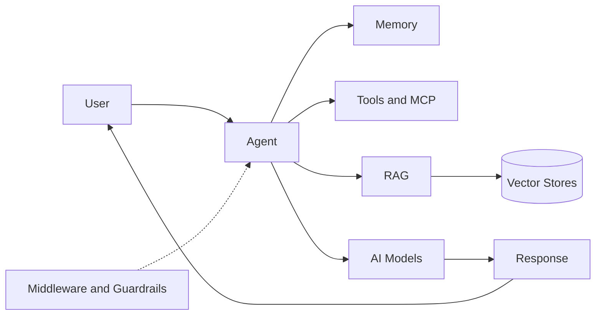

# BoxLang AI

BoxLang is the software productivity platform for building, modernizing and running applications, with developers and AI agents working together. **BoxLang AI** is how you build AI **into** your applications: one fluent API for chat, agents, tools, memory, RAG, MCP, and the governance controls that enterprises need.


This section summarizes the most important parts of BoxLang AI and links to the complete documentation at **[ai.ortusbooks.com](https://ai.ortusbooks.com)** for depth and reference.


## 🤔 Two Different Ideas

| | Agentic development | BoxLang AI |
| --- | --- | --- |
| **What** | Using AI agents to write your BoxLang application | Building AI features **inside** your application |
| **Where** | [Getting Started > Agentic Development](../getting-started/agentic-development/README.md) | This section |

## ✨ What You Can Build



* **Chat** with streaming and typed, structured output
* **Agents** with instructions, memory, tools, skills, and sub-agents
* **Tools** that let models call your code
* **Memory and RAG** with 20+ memory types and many vector store integrations
* **MCP** clients and servers
* **Governance** with guardrails, prompt-injection defense, human approval, and audit trails
* **Multimodal** audio, image generation, and web search
* **Browser agents** that visit pages, fill forms, and click through web applications with [bx-playwright](browser-agents.md)

## ⚡ Quick Start

Install the module:

```bash
install-bx-module bx-ai
```

With CommandBox:

```bash
box install bx-ai
```

Configure a provider in `boxlang.json`, keeping keys in environment variables:

```json
{
  "modules": {
    "bxai": {
      "settings": {
        "provider": "openai",
        "apiKey": "${OPENAI_API_KEY}"
      }
    }
  }
}
```

Your first chat:

```js
answer = aiChat( "What is BoxLang?" )
println( answer )
```

```bash
boxlang hello.bxs
```

Prefer to run models locally with no API costs? Use the `ollama` provider. See [Providers & Gateways](providers-and-gateways.md).

## 🗺️ In This Section


[chat-and-structured-output.md](chat-and-structured-output.md)



[agents.md](agents.md)



[tools-and-skills.md](tools-and-skills.md)



[memory-and-rag.md](memory-and-rag.md)



[mcp.md](mcp.md)



[governance-and-security.md](governance-and-security.md)



[multimodal.md](multimodal.md)



[providers-and-gateways.md](providers-and-gateways.md)


## 🏢 Enterprise Ready

AI in production needs more than a model call. BoxLang AI includes middleware for guardrails, retries and logging, human approval for sensitive actions, prompt-injection defense, multi-tenant memory isolation, and a flight recorder for audit trails. See [Governance & Security](governance-and-security.md).


**Try every BoxLang+ module free for 60 days.** The trial starts automatically the first time you start a BoxLang server or CLI with a BoxLang+ module installed. No sign-up and no key. Pair BoxLang AI with premium modules such as [MCP +](../boxlang-framework/boxlang-plus/modules/bx-mcp/README.md) for live runtime introspection, and [Couchbase +](../boxlang-framework/boxlang-plus/modules/bx-couchbase/aimemory.md) for vector memory. Enterprise support is available when you [join us](https://www.boxlang.io/plans).


## 📚 Full Documentation

* [BoxLang AI documentation](https://ai.ortusbooks.com)
* [Quick Start Guide](https://ai.ortusbooks.com/getting-started/quickstart)
* [Installation](https://ai.ortusbooks.com/getting-started/installation)
* [Built-In Function Reference](https://ai.ortusbooks.com/advanced/reference/built-in-functions)
* Docs MCP server for your agent: `https://ai.ortusbooks.com/~gitbook/mcp`
