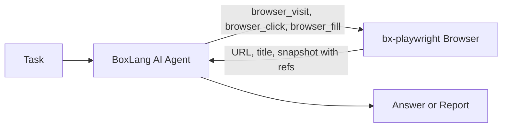

# Browser Agents

An agent with a browser can do what a person does in a web application: sign in, fill forms, follow links, read results, and take screenshots. The [bx-playwright](../boxlang-framework/modularity/playwright.md) module gives any [BoxLang AI agent](agents.md) a set of browser tools with one call: `aiTools()`.


Full reference: **[bxplaywright.boxlang.io/ai](https://bxplaywright.boxlang.io/ai/)**.


## 🔄 How It Works



1. The agent calls a browser tool, such as `browser_visit`.
2. The tool answers with the page URL, title, and an **accessibility snapshot**: a compact, token-efficient outline of the page where every element has a ref such as `e12`.
3. The agent acts on refs (`browser_click( "e12" )`) or on visible text (`browser_click( "Sign in" )`), and gets the new snapshot back.
4. Errors come back as text, not exceptions, so the agent can recover and try again.

## ⚡ Quick Start

```bash
install-bx-module bx-ai bx-playwright
bxPlaywright install chromium
```

```js
agent = aiAgent(
    name: "Browser",
    instructions: "Use the browser tools to complete the task. Report what you found.",
    tools: playwright( { baseURL : "http://localhost:8080" } ).aiTools()
)

println( agent.run( "Sign in as luis@ortussolutions.com with password secret and tell me how many open orders I have" ) )
```

## 🧰 The Tools

| Tool | Arguments | Purpose |
| --- | --- | --- |
| `browser_visit` | `url` | Open a URL, or a path relative to the base URL |
| `browser_snapshot` | | The current URL, title and snapshot with refs |
| `browser_click` | `target` | Click an element ref, or a button or link by its text |
| `browser_fill` | `target`, `value` | Type into an input by ref, label or placeholder |
| `browser_select` | `target`, `value` | Choose an option in a select |
| `browser_press` | `key` | Press a key such as `Enter` or `Control+A` |
| `browser_back` | | Go back one page |
| `browser_text` | `target` | Read the visible text of the page or an element |
| `browser_screenshot` | `path` | Save a screenshot and return its path |
| `browser_close` | | Close the page when the task is done |

## 🎭 Choosing the Browser

`aiTools()` uses the configuration of the `playwright()` call, so profiles and settings apply to the agent's browser too:

```js
// The agent browses as a phone in dark mode
tools = playwright( [ "android", "dark" ], { baseURL : "https://staging.example.com" } ).aiTools()
```

## 💡 Use Cases

* **Smoke testing in plain language**: "Open the store, add the cheapest product to the cart and check out as a guest. Report any errors."
* **Monitoring flows**: a [scheduled task](../boxlang-framework/asynchronous-programming/scheduled-tasks.md) that asks an agent to sign in and confirm the dashboard loads.
* **Data from web applications without an API**: let the agent navigate and read, then return [structured output](chat-and-structured-output.md).
* **Verifying agent-built applications**: see [Build an App End to End](../getting-started/agentic-development/end-to-end-with-playwright.md).

## 🔌 Other Frameworks and MCP

* `playwright().aiToolDefinitions()` returns the same tools in a neutral format, `[ { name, description, arguments, handler } ]`, for any agent framework.
* `bxPlaywright mcp` starts Playwright's MCP server for MCP clients such as Claude, Cursor and VS Code.


A browser agent acts with whatever access its browser session has. Point it at test or staging environments, give it test accounts, and use [governance controls](governance-and-security.md) such as human approval for anything that changes real data.

