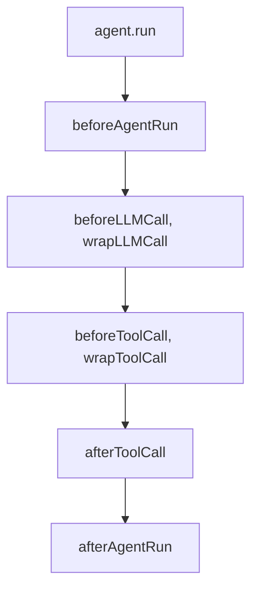

# Governance & Security

Enterprises adopt AI when they can control it. BoxLang AI puts governance in a **middleware** layer that wraps model and tool calls, so you add controls without changing agent logic.

## 🧅 Middleware

Middleware can observe, modify, retry, reject, suspend, or cancel work around every model and tool call.



Attach it to an agent:

```js
agent = aiAgent(
    name: "assistant",
    middleware: [
        new LoggingMiddleware(),
        new RetryMiddleware( maxRetries: 3 ),
        new GuardrailMiddleware( blockedTools: [ "deleteRecord" ] )
    ]
)
```

## 🛡️ Built-In Controls

| Concern | Middleware |
| --- | --- |
| **Observability** | `LoggingMiddleware`, `FlightRecorderMiddleware` for an audit trail |
| **Reliability** | `RetryMiddleware`, `MaxToolCallsMiddleware` |
| **Policy** | `GuardrailMiddleware` blocks tools or argument patterns |
| **Approval** | `HumanInTheLoopMiddleware` |
| **Prompt injection** | `InputSanitizerMiddleware` scans inbound content and tool results |
| **Output safety** | `OutputGuardMiddleware` redacts sensitive output offline |
| **AI-assisted review** | `LLMGuardMiddleware` classifies content with an LLM as judge |

Security middleware is opt-in and can be tested offline.

## 🚫 Guardrails

Block tools outright and validate arguments with patterns:

```js
guardrail = new bxModules.bxai.models.middleware.core.GuardrailMiddleware(
    blockedTools: [ "deleteUser" ],
    argPatterns: {
        runSQL: [
            { query: "(?i)^\\s*select\\b" },
            { query: "(?i)drop|truncate|delete" }
        ]
    }
)
```

## 🧑‍⚖️ Human in the Loop

Some actions should never run unsupervised: deleting records, moving money, deploying to production. `HumanInTheLoopMiddleware` pauses the run and asks a person to approve, reject, or edit the call.

```js
import bxModules.bxai.models.middleware.core.HumanInTheLoopMiddleware

agent = aiAgent(
    tools: [ deployTool ],
    middleware: [ new HumanInTheLoopMiddleware(
        mode: "web",
        toolsRequiringApproval: [ "deploy" ]
    ) ],
    checkpointer: aiMemory( "cache" )
)

result = agent.run( "Deploy the new version", {}, { threadId: "deploy-1" } )

if ( result.isSuspended() ) {
    notifyApprovers( "deploy-1", result.getData().pendingActions )
}
```

Later, when a person decides:

```js
finalResponse = agent.resume( "approve", "deploy-1" )
```

In CLI mode the prompt appears in the terminal. In web mode the run suspends and resumes when the decision arrives, even days later.

## 🌐 Gateways

A **gateway** presents approvals and messages on the right channel: the CLI, signed HTTP webhooks, or a platform module you register. HTTP gateways sign requests with HMAC, bound them by timestamp, deduplicate nonces, and claim decisions atomically.

```js
agent = aiAgent(
    tools: [ deployTool ],
    middleware: [ new HumanInTheLoopMiddleware(
        toolsRequiringApproval: [ "deploy" ],
        gateway: aiGateway( "http", { secret: getSecret() } )
    ) ],
    checkpointer: aiMemory( "cache" )
)
```

See [Providers & Gateways](providers-and-gateways.md).

## 🔐 More Security Practices

* Keep API keys in environment variables or a secrets manager. BoxLang+ offers [AWS](../boxlang-framework/boxlang-plus/modules/bx-aws-secrets/README.md), [Azure](../boxlang-framework/boxlang-plus/modules/bx-azure-secrets/README.md), and [Google](../boxlang-framework/boxlang-plus/modules/bx-google-secrets/README.md) secrets modules.
* Isolate every user's memory with `userId` and `conversationId`.
* Fence untrusted content with `aiFence`.
* Give agents least privilege, and expose only the tools they need.


**Try every BoxLang+ module free for 60 days.** The trial starts automatically with no sign-up and no key. Enterprise support, governance guidance, and premium modules are available when you [join us](https://www.boxlang.io/plans).


## 🔍 Go Deeper

* [Middleware overview](https://ai.ortusbooks.com/main-components/middleware)
* [GuardrailMiddleware](https://ai.ortusbooks.com/main-components/middleware/guardrail)
* [InputSanitizerMiddleware](https://ai.ortusbooks.com/main-components/middleware/input-sanitizer)
* [Human-in-the-Loop](https://ai.ortusbooks.com/main-components/human-in-the-loop)
* [Gateways](https://ai.ortusbooks.com/main-components/gateways)
* [Security Guide](https://ai.ortusbooks.com/deployment/security)
* [Production Guide](https://ai.ortusbooks.com/deployment/production)
