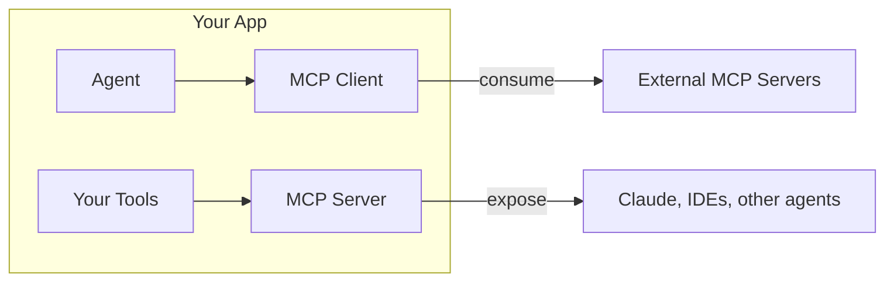

# MCP

The **Model Context Protocol (MCP)** is an open standard that lets AI applications connect to tools, resources, and prompts. BoxLang AI supports it in both directions.



## 📥 MCP Client: Consume Tools

Connect to any MCP server and call its tools:

```js
client = MCP( "http://localhost:3000" )

result = client.send( "searchDocs", {
    query: "BoxLang syntax",
    limit: 10
} )

if ( result.getSuccess() ) {
    println( result.getData() )
}
```

Or seed an agent with an MCP server's tools:

```js
agent = aiAgent(
    name: "ResearchAgent",
    mcpServers: [
        {
            url: "http://localhost:3000/mcp",
            toolNames: [ "web_search", "fetch_page" ]
        }
    ]
)
```

## 📤 MCP Server: Expose Your Tools

Register tools when your application starts:

```js
// Application.bx
class {

    function onApplicationStart() {
        MCPServer( "myApp" )
            .setDescription( "My Application MCP Server" )
            .setVersion( "1.0.0" )
            .registerTool(
                aiTool( "search", "Search for documents", ( query ) => {
                    return searchService.search( query )
                } )
            )
    }

}
```

The module provides an HTTP endpoint, so any MCP client can list and call your tools:

```bash
curl -X POST "http://localhost/~bxai/mcp.bxm?server=myApp" \
  -H "Content-Type: application/json" \
  -d '{"jsonrpc":"2.0","method":"tools/list","id":"1"}'
```

Servers can also register resources and prompts, discover tools from annotations, run over HTTP or STDIO, and be built as classes.

## 🔍 Live Runtime Introspection With MCP +

The BoxLang+ **[MCP +](../boxlang-framework/boxlang-plus/modules/bx-mcp/README.md)** module is a ready-made MCP server for a **running BoxLang runtime**. Agents and monitoring tools can inspect JVM health, caches, datasources, HTTP traffic, schedulers, and modules, with bearer tokens, security profiles, and IP allowlists for governance.


**Try every BoxLang+ module free for 60 days.** The trial starts automatically with no sign-up and no key. See [BoxLang MCP](../getting-started/agentic-development/boxlang-mcp.md).


## 🧱 ColdBox

ColdBox routes can expose agents and MCP servers directly with `toAi()` and `toMCP()`, and the `cbMCP` module lets agents introspect a running ColdBox application. See [Agentic MVC with ColdBox](https://coldbox.ortusbooks.com/getting-started/agentic-development).

## 🔍 Go Deeper

* [MCP Servers](https://ai.ortusbooks.com/model-context-protocol-mcp/server)
* [Getting Started with MCP Servers](https://ai.ortusbooks.com/model-context-protocol-mcp/server/getting-started)
* [Transports (HTTP and STDIO)](https://ai.ortusbooks.com/model-context-protocol-mcp/server/transports)
* [MCP Clients](https://ai.ortusbooks.com/model-context-protocol-mcp/client)
