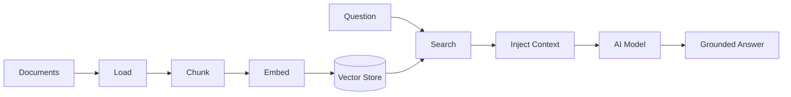

# Memory & RAG

## 💭 Memory

Memory lets an AI keep context across turns. BoxLang AI ships more than 20 memory types, and every one supports multi-tenant isolation with `userId` and `conversationId`.

| Kind | Types | Use it for |
| --- | --- | --- |
| **Conversation** | Windowed, Summary, Session, File, Cache, JDBC | Chat history and context |
| **Vector** | BoxVector, Chroma, Postgres, MySQL, OpenSearch, TypeSense, Pinecone, Qdrant, Weaviate, Milvus | Semantic search and RAG |
| **Hybrid** | Recent plus semantic | Best of both |

Isolate memory per user and per conversation:

```js
chat = aiMemory(
    memory: "window",
    key: createUUID(),
    userId: "user123",
    conversationId: "support-ticket-456",
    config: { maxMessages: 10 }
)
```

Multi-tenant isolation is built in, so one customer's conversation never leaks into another's.

## 📚 RAG

**Retrieval-Augmented Generation** grounds answers in your own documents. It reduces hallucinations, keeps knowledge current without retraining, and tracks which sources informed an answer.



A complete RAG system in a few lines:

```js
// 1. Create vector memory
vectorMemory = aiMemory( memory: "chroma", config: {
    collection: "knowledge_base",
    embeddingProvider: "openai",
    embeddingModel: "text-embedding-3-small"
} )

// 2. Ingest documents
aiDocuments( "/docs", {
    type: "directory",
    recursive: true,
    extensions: [ "md", "txt", "pdf" ]
} ).toMemory(
    memory = vectorMemory,
    options = { chunkSize: 1000, overlap: 200 }
)

// 3. Create an agent that retrieves automatically
agent = aiAgent(
    name: "Knowledge Assistant",
    instructions: "Answer using the provided documentation. If unsure, say so.",
    memory: vectorMemory
)

println( agent.run( "How do I create a custom loader?" ) )
```

## 📥 Document Loaders

Load content from text, Markdown, HTML, CSV, JSON, XML, PDF, logs, HTTP, feeds, SQL queries, whole directories, and web crawlers. Loaders chunk documents and send them straight to memory.

## 🔍 Go Deeper

* [Memory Systems](https://ai.ortusbooks.com/main-components/memory)
* [Vector Memory](https://ai.ortusbooks.com/main-components/memory/vector-memory)
* [Multi-Tenant Memory](https://ai.ortusbooks.com/main-components/memory/multi-tenant-memory)
* [Embeddings](https://ai.ortusbooks.com/rag/embeddings)
* [Document Loaders](https://ai.ortusbooks.com/rag/document-loaders)
* [RAG](https://ai.ortusbooks.com/rag/rag)


Use Couchbase as a vector memory backend with the [Couchbase + AI Memory](../boxlang-framework/boxlang-plus/modules/bx-couchbase/aimemory.md) module. Every BoxLang+ module is free to try for 60 days.

