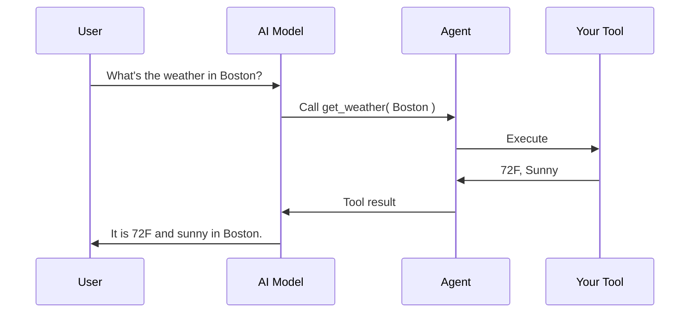

# Tools & Skills

## 🛠️ Tools

**Tools** are functions the model can call. This is how AI reaches real-time data, APIs, databases, and your business logic.



Define a tool with `aiTool()`:

```js
weatherTool = aiTool(
    "get_weather",
    "Get current weather for a location",
    location => getWeatherData( location )
).describeLocation( "City and country, e.g. Boston, MA" )
```

The model decides when to call it. You control what it can reach.

## 🗄️ Global Tool Registry

Register a tool once by name, then reference it by string everywhere:

```js
agent = aiAgent(
    name: "Assistant",
    tools: [ "webSearch@bxai" ]
)
```

This keeps tool definitions in one place and makes them easy to share across agents.

## 🎯 Skills

**Skills** are reusable blocks of knowledge, written as `SKILL.md` files, that are injected into an agent's system context at runtime.

* **Always-on skills** are added to every request.
* **Lazy skills** are loaded only when the model asks for them, which keeps context small.

```js
agent = aiAgent(
    name: "CodeReviewer",
    instructions: "Review code for quality and security",
    skills: aiSkill( ".ai/skills/security" ),
    availableSkills: aiSkill( ".ai/skills/languages" )
)
```


These are skills for agents that run **inside your application**. Skills for the coding agent that **writes** your application are covered in [Skills & Guidelines](../getting-started/agentic-development/skills-and-guidelines.md).


## 🔒 Keep Tools Safe

Tools act on real systems. Restrict and supervise them:

* Block dangerous tools or argument patterns with guardrails
* Require human approval for sensitive calls
* Cap the number of tool calls per run

See [Governance & Security](governance-and-security.md).

## 🔍 Go Deeper

* [AI Tools](https://ai.ortusbooks.com/main-components/tools)
* [Tool Registry](https://ai.ortusbooks.com/main-components/tool-registry)
* [AI Skills](https://ai.ortusbooks.com/main-components/skills)
* [Custom Tools](https://ai.ortusbooks.com/extending-boxlang-ai/custom-tools)
