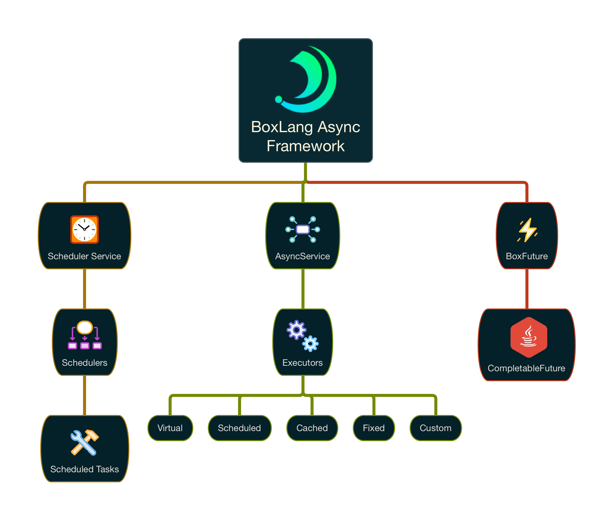

# Async Programming

**Note: This section of our documentation covers features coming soon to BoxLang 1.4.0.**

We already covered basic threading in our core syntax and semantics section. In this section, we will discover the power behind the asynchronous framework behind Boxlang which is powered by the JDKs CompletableFutures, Executors, and much more.


We leverage Java `Executors`, `CompletableFutures` and much more classes from the concurrent packages in the JDK.


## BoxLang Async Framework

Below you can see a diagram of our async framework and a brief description of its capabilities.

<figure><figcaption></figcaption></figure>

### Async Service

The AsyncService in BoxLang is in charge of coordinating executors, schedulers and configuration for the runtime.  Any executor you use via our BIFs or internal facitlities will end up being managed by this service.

### Executors

All of our tasks and computing futures execute in the server's common `ForkJoin` pool the JDK provides. However, the JDK since version 8 provides you a framework for simplifying the execution of asynchronous tasks. It can automatically provide you with a pool of threads and a simple API for assigning tasks or work loads to them.

### Scheduler Service

Our scheduler service is in charge of creating and managing all BoxLang schedulers, whether they are global, dynamic or from contributed modules.

### Schedulers

Schedulers can be written in BoxLang or in Java and will end up being managed by the scheduler service.  Each scheduler has a collection of scheduled tasks it can monitor, execute and manage.  Each scheduler is bound to a specific executor.

### Scheduled Tasks

Schedule tasks execute in an executor of choice and will be most likely managed by a scheduler.  There are times where tasks can be sent for execution directly to executors as well.

### BoxFuture

Our `BoxFuture` is a sub-class of the JDKs `CompletableFuture` but enhanced for dynamic programming.\
