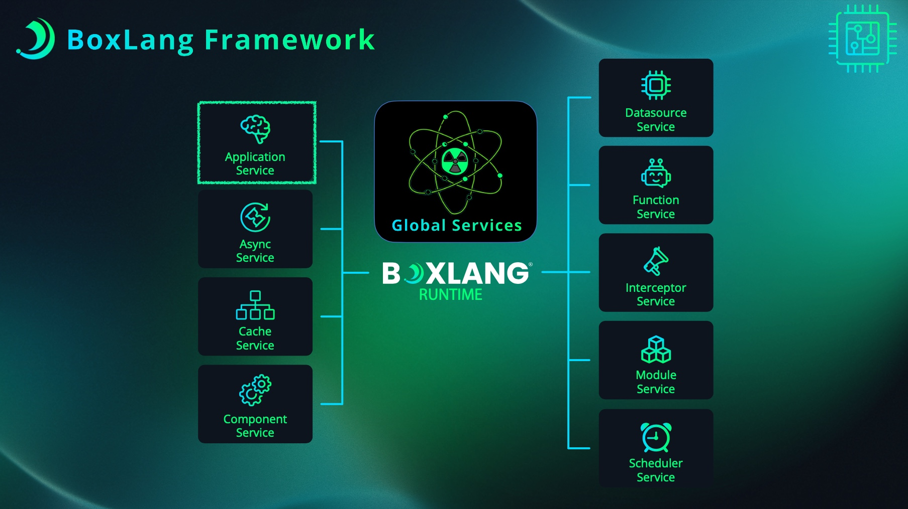

# Cache Service

<figure><figcaption></figcaption></figure>

The Cache Service is the central management layer for all caching functionality in BoxLang. It acts as a registry and orchestrator for cache providers, handling their lifecycle, configuration, and providing a unified interface for cache operations across your application.

## Overview

The Cache Service serves as the foundation of BoxLang's caching infrastructure by:

* **Managing Cache Providers**: Registering, creating, and maintaining multiple cache instances
* **Lifecycle Coordination**: Handling startup, shutdown, and maintenance operations
* **Provider Registry**: Managing both core and custom cache provider implementations
* **Event Broadcasting**: Announcing cache-related events throughout the system
* **Global Operations**: Providing system-wide cache management capabilities

### Core Concepts

#### Cache Providers vs Cache Service

* **Cache Providers** (`ICacheProvider`): Individual cache instances that handle specific caching needs
* **Cache Service** (`CacheService`): The service layer that manages multiple cache providers

Think of the Cache Service as a "cache manager" that coordinates multiple specialized cache instances within your application.

#### Service Lifecycle

The Cache Service follows BoxLang's service lifecycle pattern:

1. **Configuration Load**: Reads cache configurations from BoxLang settings
2. **Startup**: Creates and initializes all configured caches
3. **Operation**: Provides access to registered caches during runtime
4. **Shutdown**: Gracefully shuts down all cache providers

## Getting Started

### Accessing the Cache Service

The Cache Service is available through the `cacheService()` BIF

```javascript
// Get the cache service
cacheService = cacheService(

// Access the default cache
defaultCache = cacheService.getDefaultCache();

// Access a named cache  
myCache = cacheService.getCache("myCache

// Using BIFs (recommended)
defaultCache = cache();
myCache = cache("myCache");
```

### Working with Caches

**Basic Cache Operations**

```javascript
// Get a cache instance
userCache = cache("userCache"

// Store data
userCache.set("user:123", userData);

// Retrieve data
result = userCache.get("user:123")
if (result.isPresent()) {
    user = result.get();
}

// Check if key exists
exists = userCache.lookup("user:123")

// Remove data
userCache.clear("user:123")
```

**Cache Validation**

```javascript
// Check if a cache exists
if (arrayContains(cacheNames(), "sessionCache")) {
    sessionCache = cache("sessionCache")
    // Use the cache...
}

// Get available caches
registeredCaches = cacheNames()
```

## Cache Management

**Creating Default Caches**

The simplest way to create a new cache:

```javascript
// Create a cache with default BoxLang provider and settings
newCache = cacheService().createDefaultCache("myNewCache")

// Create with custom configuration
config = {
    "name": "myCache",
    "maxObjects": 5000,
    "defaultTimeout": 1800, // 30 minutes
    "evictionPolicy": "LRU"


customCache = cacheService().createDefaultCache("myCache", config);
```

**Creating Custom Provider Caches**

```javascript
// Create cache with specific provider
properties = {
    "maxObjects": 10000,
    "defaultTimeout": 3600,
    "objectStore": "ConcurrentHashMap"
}

cache = cacheService().createCache(
    "highPerformanceCache", 
    "BoxLang", 
    properties
)
```

**Conditional Cache Creation**

```javascript
// Create only if it doesn't exist
cache = cacheService().createCacheIfAbsent(
    "conditionalCache",
    "BoxLang",
    defaultProperties
)
```

**Manual Registration**

If you have a pre-configured cache provider:

```javascript
// Create and configure your cache
myCache = new CustomCacheProvider()
    .setName("myCustomCache")
    .configure(cacheService(), config);

// Register it with the service
cacheService().registerCache(myCache);
```

**Cache Replacement**

```javascript
// Replace an existing cache with a new implementation
newImplementation = new ImprovedCacheProvider()
    .setName("existingCache")
    .configure(cacheService(), newConfig);

cacheService().replaceCache("existingCache", newImplementation);
```

**Individual Cache Shutdown**

```javascript
// Shutdown and remove a specific cache
cacheService().shutdownCache("temporaryCache");
```

**Bulk Operations**

```javascript
// Clear all data from all caches
cacheService().clearAllCaches();

// Trigger reaping (cleanup) on all caches
cacheService().reapAllCaches();

// Remove and shutdown all caches
cacheService().removeAllCaches();
```

## BoxLang BIF Integration

BoxLang provides convenient Built-in Functions (BIFs) that offer a developer-friendly interface to the Cache Service functionality. These BIFs abstract the Java API complexity and provide native BoxLang syntax for common caching operations.

#### Available Cache BIFs

| BIF                | Cache Service Equivalent                | Purpose                                 |
| ------------------ | --------------------------------------- | --------------------------------------- |
| `cache()`          | `cacheService.getCache()`               | Get a cache instance by name            |
| `cacheFilter()`    | N/A (Utility function)                  | Create filters for cache key operations |
| `cacheNames()`     | `cacheService.getRegisteredCaches()`    | List all registered cache names         |
| `cacheProviders()` | `cacheService.getRegisteredProviders()` | List all registered cache providers     |
| `cacheService()`   | Direct access                           | Access the cache service directly       |


**Basic Cache Operations**

```javascript
// BoxLang BIF approach
userCache = cache("userSessions");
userCache.set("user:123", userData, 1800);
user = userCache.get("user:123");

// Equivalent direct service calls
userCache = cacheService().getCache("userSessions");
userCache.set("user:123", userData, 1800, 0);
user = userCache.get("user:123");
```

**Service Discovery**

```javascript
// BoxLang BIFs
allCaches = cacheNames();
allProviders = cacheProviders();

// Check if cache exists
if (arrayContains(cacheNames(), "myCache")) {
    cache("myCache").clearAll();
}
```

```javascript
// Equivalent direct service calls
allCaches = cacheService().getRegisteredCaches();
allProviders = cacheService().getRegisteredProviders();

// Check if cache exists
if (cacheService().hasCache("myCache")) {
    cacheService().getCache("myCache").clearAll();
}
```

**Advanced Service Operations**

```javascript
// BoxLang BIF approach - Direct service access
service = cacheService();
service.createCache("dynamicCache", "BoxLang", {
    "maxObjects": 5000,
    "defaultTimeout": 1800
});

// Bulk operations
service.clearAllCaches();
service.reapAllCaches();
```

```javascript
// Equivalent explicit service access
service = getBoxContext().getRuntime().getCacheService();
service.createCache("dynamicCache", "BoxLang", properties);

// Bulk operations
service.clearAllCaches();
service.reapAllCaches();
```

**Filter Operations**

```javascript
// BoxLang BIF approach with filters
userFilter = cacheFilter("user:*");
cache().clear(userFilter);

// Regex filtering
emailFilter = cacheFilter(".*@domain\.com$", true);
cache().get(emailFilter);

// Custom filter functions
cache().clear(function(key) {
    return key.getName().startsWith("temp_");
});
```

The equivalent direct service operations would require implementing `ICacheKeyFilter` or using the built-in filter classes.


**BoxLang Application Integration**

```javascript
// Application startup - using BIFs
function initializeApplicationCaches() {
    service = cacheService();
    
    // Create application-specific caches
    service.createCache("userSessions", "BoxLang", {
        "maxObjects": 10000,
        "defaultTimeout": 1800,
        "evictionPolicy": "LRU"
    });
    
    service.createCache("apiResponses", "BoxLang", {
        "maxObjects": 5000,
        "defaultTimeout": 300,
        "evictionPolicy": "LFU"
    });
    
    // Verify caches were created
    writeOutput("Created caches: " & arrayToList(cacheNames()));
}

// Application operations - using cache BIFs
function getUserData(userID) {
    var cacheKey = "user:#userID#";
    var userData = cache("userSessions").get(cacheKey);
    
    if (userData.isPresent()) {
        return userData.get();
    }
    
    // Load and cache user data
    userData = loadUserFromDatabase(userID);
    cache("userSessions").set(cacheKey, userData, 1800);
    
    return userData;
}
```

**Mixed Java/BoxLang Usage**

```javascript
// BoxLang service layer calling Java
class {
    
    property name="cacheManager" inject="CacheManager";
    
    function setupApplicationCaches() {
        // Call Java service to create caches
        cacheManager.setupApplicationCaches();
        
        // The cache will be accessible from BoxLang BIFs
        writeLog("Created system cache, accessible via cache('systemCache')", "info");
    }
}
```

```javascript
// BoxLang usage of Java-created caches
systemData = cache("systemCache").get("config");
cache("systemCache").set("lastUpdate", now());

// BoxLang component using mixed approach
component {
    
    function initializeCaches() {
        // Create some caches via BoxLang
        cacheService().createDefaultCache("userSessions");
        
        // Create others via Java (if you have Java modules)
        var javaService = createObject("java", "com.mycompany.CacheSetupService");
        javaService.createAdvancedCaches();
        
        // All caches accessible via BIFs
        writeOutput("Available caches: " & arrayToList(cacheNames()));
    }
}
```

## Advanced Usage

#### Task Scheduling Integration

The Cache Service provides a shared task scheduler for cache operations:

```javascript
// Access the cache service task scheduler
scheduler = cacheService().getTaskScheduler();

// Use it for cache-related background tasks
scheduler.submit(function() {
    // Custom cache maintenance logic
    performCustomMaintenance();
});
```

#### Event Integration

The Cache Service broadcasts events throughout cache lifecycles:

```javascript
// Events are announced automatically:
// - BEFORE_CACHE_SERVICE_STARTUP / AFTER_CACHE_SERVICE_STARTUP
// - BEFORE_CACHE_SERVICE_SHUTDOWN / AFTER_CACHE_SERVICE_SHUTDOWN
// - BEFORE_CACHE_SHUTDOWN / AFTER_CACHE_SHUTDOWN
// - BEFORE_CACHE_REMOVAL / AFTER_CACHE_REMOVAL
// - BEFORE_CACHE_REPLACEMENT
// - AFTER_CACHE_REGISTRATION

// Listen to cache events through the interceptor service
interceptorService = getBoxContext().getRuntime().getInterceptorService();
interceptorService.register("MyCacheListener", new CacheListener());
```

#### Error Handling

```javascript
try {
    cache = cacheService().getCache("nonExistentCache");
} catch (any e) {
    // Handle cache not found
    writeLog("Cache not found: " & e.message, "warn");
    
    // Create the cache if needed
    cache = cacheService().createDefaultCache("nonExistentCache");
}
```

## Monitoring and Diagnostics

#### Cache Inspection

```javascript
// Get cache information
registeredCaches = cacheNames();
registeredProviders = cacheProviders();

// Inspect individual caches
cache = cache("myCache");
stats = cache.getStats();
cacheSize = cache.getSize();
isEnabled = cache.isEnabled();
```

#### Performance Monitoring

```javascript
// Monitor cache performance
function monitorCaches() {
    caches = cacheNames();
    
    for (var cacheName in caches) {
        cache = cache(cacheName);
        stats = cache.getStats();
        
        writeLog("Cache [#cacheName#]: Hits=#stats.getHits()#, Misses=#stats.getMisses()#, Size=#cache.getSize()#", "info");
    }
}
```

## Best Practices

#### Cache Naming Conventions

```javascript
// Use descriptive, hierarchical names
cacheService().createDefaultCache("user.sessions");
cacheService().createDefaultCache("product.catalog");
cacheService().createDefaultCache("api.responses.v1");
```

#### Resource Management

```javascript
// Always shutdown caches when done (if managing manually)
function cleanupTemporaryCache(cacheName) {
    try {
        cache = cache(cacheName);
        // Use the cache...
    } finally {
        // Clean up if it's a temporary cache
        if (left(cacheName, 5) == "temp.") {
            cacheService().shutdownCache(cacheName);
        }
    }
}
```

#### Provider Selection

```javascript
// Choose providers based on requirements
function createOptimalCache(name, requirements) {
    var provider = "";
    var properties = {};
    
    if (requirements.isDistributed) {
        provider = "Redis";
        properties.host = requirements.redisHost;
        properties.port = requirements.redisPort;
    } else if (requirements.isPersistent) {
        provider = "BoxLang";
        properties.objectStore = "Disk";
        properties.diskPath = requirements.diskPath;
    } else {
        provider = "BoxLang";
        properties.objectStore = "ConcurrentHashMap";
    }
    
    properties.maxObjects = requirements.maxSize;
    properties.defaultTimeout = requirements.timeoutSeconds;
    
    return cacheService().createCache(name, provider, properties);
}
```

#### Error Recovery

```javascript
// Implement graceful fallbacks
function getOrCreateCache(cacheName) {
    try {
        return cache(cacheName);
    } catch (any e) {
        writeLog("Cache [#cacheName#] not found, creating default cache", "warn");
        return cacheService().createDefaultCache(cacheName);
    }
}
```

## Integration Patterns

#### Application Startup

```javascript
// Initialize application-specific caches during startup
function initializeApplicationCaches() {
    var service = cacheService();
    
    // User session cache
    service.createDefaultCache("user.sessions", {
        "name": "user.sessions",
        "provider": "BoxLang",
        "properties": {
            "maxObjects": 10000,
            "defaultTimeout": 1800,
            "evictionPolicy": "LRU"
        }
    });
    
    // API response cache
    service.createDefaultCache("api.responses", {
        "name": "api.responses", 
        "provider": "BoxLang",
        "properties": {
            "maxObjects": 5000,
            "defaultTimeout": 300,
            "evictionPolicy": "LFU"
        }
    });
}
```

#### Module Integration

```javascript
// BoxLang component for module integration
class {
    
    function onStartup(runtime) {
        var cacheService = runtime.getCacheService();
        
        // Register custom provider
        cacheService.registerProvider("MyModuleCache", createObject("java", "com.mymodule.MyModuleCacheProvider"));
        
        // Create module-specific caches
        cacheService.createCache("module.data", "MyModuleCache", moduleConfig);
    }
}
```

#### Application Usage Patterns

**Service Layer Integration**

```javascript
// Cache-enabled service component
class {
    
    function getUserById(userID) {
        var cacheKey = "user:#userID#";
        var result = cache("users").get(cacheKey);
        
        if (result.isPresent()) {
            return result.get();
        }
        
        // Load from database
        var user = userDAO.findById(userID);
        
        // Cache for 30 minutes
        cache("users").set(cacheKey, user, 1800);
        
        return user;
    }
    
    function invalidateUser(userID) {
        var cacheKey = "user:#userID#";
        cache("users").clear(cacheKey);
    }
}
```

**Request-Scoped Caching**

```javascript
// Request-level cache management
class {
    
    function onRequestStart() {
        // Create request-specific cache
        var requestCache = cacheService().createDefaultCache("request.#createUUID()#");
        request.cache = requestCache;
    }
    
    function onRequestEnd() {
        // Cleanup request cache
        if (structKeyExists(request, "cache")) {
            cacheService().shutdownCache(request.cache.getName());
        }
    }
}
```

## Conclusion

The Cache Service provides a robust foundation for all caching needs in BoxLang applications. By centralizing cache management, it enables:

* **Scalable Architecture**: Easy addition of new cache providers and instances
* **Consistent Interface**: Uniform access patterns across different cache implementations
* **Lifecycle Management**: Proper resource handling and cleanup
* **Event Integration**: Seamless integration with BoxLang's event system
* **Flexible Configuration**: Runtime and configuration-based cache setup

Whether you're using built-in providers or creating custom implementations, the Cache Service ensures your caching infrastructure remains manageable, performant, and maintainable as your application grows.
