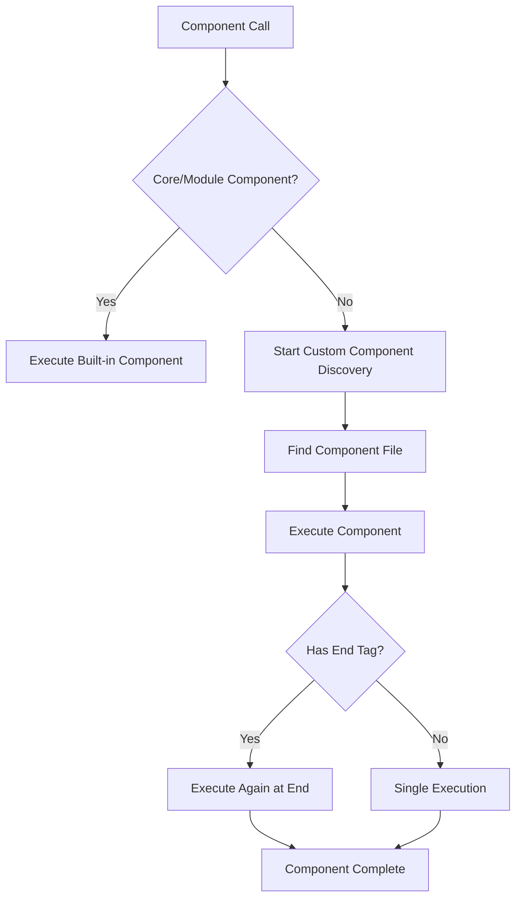
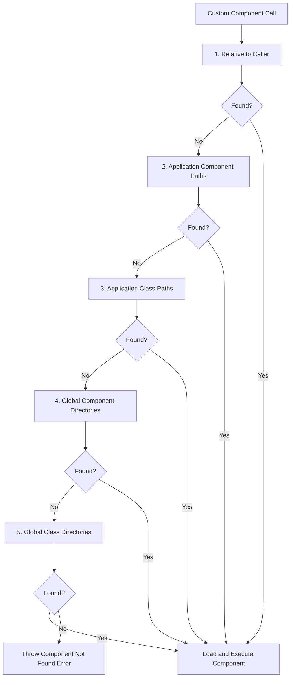

# Components

BoxLang components are reusable blocks of code that extend the language's capabilities without modifying the parser. They provide a powerful way to create custom language constructs, encapsulate complex logic, and build modular applications.  They are analogous to web components.

## Why Components Matter

Components solve common development challenges:

* **Eliminate Code Duplication**: Write once, use everywhere
* **Extend the Language**: Create custom block constructs that feel native
* **Encapsulate Logic**: Keep complex operations contained and testable
* **Cross-Context Usage**: BoxLang components work seamlessly in both script and template contexts

## Basic Principles

### Component Syntax

Components can be called using either script-based or template-based syntax according to where they are being used:

#### **Script Context:**

```cfscript
// Self-closing
bx:myComponent;
bx:myComponent attribute="value";

// With body content
bx:myComponent attribute="value" {
    // Content and logic here
}
```

#### **Template Context:**

```xml
<!--- Self-closing --->
<bx:myComponent attribute="value" />

<!--- With body content --->
<bx:myComponent attribute="value">
    Content and logic here
</bx:myComponent>
```

### Component Execution Flow

When BoxLang encounters a component call, it follows this process:



## Core and Module Components

### Core Components

BoxLang ships with many core components that extend the language with framework capabilities.  You can find them in the [reference section.](../boxlang-language/reference/components/)

```cfscript
// HTTP operations
bx:http url="https://api.example.com/users" result="apiResponse";

// Database queries
bx:query name="users" datasource="myDB" {
    SELECT id, name, email FROM users WHERE active = 1
}

// File operations  
bx:file action="read" file="/path/to/data.txt" variable="fileContent";

// Conditional logic
bx:if condition="#user.isAdmin#" {
    writeOutput( "Admin content here" );
}
```

### Module Components

Any BoxLang module can also register and collaborate with components to the runtime.

```cfscript
// Example: A caching module might provide
bx:cache key="userList" timeout="3600" {
    // Expensive operation cached for 1 hour
    bx:query name="expensiveQuery" datasource="myDB" {
        SELECT * FROM complex_view WHERE processing_intensive = 1
    }
}

// Example: A PDF module might provide  
bx:pdf action="generate" filename="report.pdf" {
    // PDF content here
}
```


Core and module components are **registered** with the runtime and don't go through the discovery process.  They leverage the core Component Service to achieve this.


## Creating Custom Components

Custom components are user-defined components written in BoxLang that will allow you to extend the language with your own features.  It will also allow you to create expressive contributions to the templating language.

### Basic Custom Component Structure

Let's start with a simple example:

**File: `components/greeting.bxm`**

```xml
<!--- 
Simple greeting component that takes a name attribute
Usage: <bx:greeting name="Alice" />
--->

<div class="greeting-card">
    <h2>Hello, #attributes.name ?: "World"#!</h2>
    <p>Welcome to our application.</p>
</div>
```

### Component Input: The `attributes` Scope

All data passed to your component is available in the `attributes` scope:

```markup
<!--- File: components/userCard.bxm --->

<!--- Best practice: Parameterize your attributes with validation --->
<bx:param name="attributes.userId" type="string" required="true">
<bx:param name="attributes.name" type="string" required="true">
<bx:param name="attributes.email" type="string" required="true">
<bx:param name="attributes.showAvatar" type="boolean" default="false">
<bx:param name="attributes.theme" type="string" default="light">

<div class="user-card theme-#attributes.theme#" data-user-id="#attributes.userId#">
    <bx:if condition="#attributes.showAvatar#">
        
    </bx:if>
    
    <div class="user-info">
        <h3>#attributes.name#</h3>
        <p class="email">#attributes.email#</p>
    </div>
</div>
```

**Script syntax for parameterization:**

```cfscript
// In a .bxs component file
bx:param name="attributes.userId" type="string" required="true";
bx:param name="attributes.data" default="#arrayNew()#" type="array";
bx:param name="attributes.maxItems" default="10" type="numeric";
```

### Component Content: The `thisTag` Scope

When components have start and end tags, BoxLang provides the `thisTag` scope to manage content and execution:

**The `thisTag` scope contains:**

* `executionMode`: "start" or "end"
* `hasEndTag`: boolean indicating if component has closing tag
* `generatedContent`: Content between start and end tags

**File: `components/boldWrapper.bxm`**

```markup
<!--- Component that wraps content in bold tags --->

<bx:if condition="#thisTag.executionMode IS 'end'#">
    <bx:output><b>#thisTag.generatedContent#</b></bx:output>
    <bx:set thisTag.generatedContent = "">
</bx:if>
```

**Usage:**

```markup
<bx:boldWrapper>This text will be bold</bx:boldWrapper>
<!-- Outputs: <b>This text will be bold</b> -->
```

### Complex Component with Start/End Logic

**File: `components/section.bxm`**

```markup
<!--- Advanced component demonstrating full execution cycle --->

<bx:param name="attributes.title" type="string" required="true">
<bx:param name="attributes.collapsible" type="boolean" default="false">
<bx:param name="attributes.collapsed" type="boolean" default="false">

<bx:if condition="#thisTag.executionMode IS 'start'#">
    <!--- Opening section markup --->
    <section class="content-section">
        <header class="section-header">
            <h2>#attributes.title#</h2>
            <bx:if condition="#attributes.collapsible#">
                <button class="toggle-btn" data-collapsed="#attributes.collapsed#">
                    #attributes.collapsed ? "Expand" : "Collapse"#
                </button>
            </bx:if>
        </header>
        <div class="section-content" 
             style="#attributes.collapsed ? 'display:none' : ''#">
</bx:if>

<bx:if condition="#thisTag.executionMode IS 'end'#">
    <!--- Process any nested content --->
    #thisTag.generatedContent#
    
    <!--- Closing section markup --->
        </div>
    </section>
    
    <!--- Clear the content so it's not output again --->
    <bx:set thisTag.generatedContent = "">
</bx:if>
```

**Usage:**

```markup
<bx:section title="User Information" collapsible="true">
    <p>This content appears inside the section.</p>
    <bx:userCard userId="123" name="John Doe" email="john@example.com" />
</bx:section>
```


Please note that I have written these components in the same templating language, but you can easily wrap this in a \<bx:script> and write them in script if needed.


## Custom Component Discovery

Custom component discovery is a hierarchical lookup process that occurs when BoxLang encounters a component call that isn't a registered core or module component.



## Discovery Configuration

BoxLang component locations can be defined globally or on a per-app basis.

### **Global Configuration (`boxlang.json`):**

```json
{
    "customComponentsDirectory": [
        "${boxlang-home}/global/components"
    ],
    "classPaths": [
        "${boxlang-home}/global/classes"
    ]
}
```

### **Application Configuration (`Application.bx`):**

```cfscript
class {
    // Component paths for .bxm, .bxs template files
    this.customComponentPaths = [ 
        "/absolute/path/to/components", 
        "./relative/path/components" 
    ];
    
    // Class paths for .bx class files
    this.classPaths = [ 
        "/absolute/path/to/classes" 
    ];
}
```

### File Extensions Searched

During discovery, BoxLang looks for files with these extensions in order:

1. `.bxm` (BoxLang template)
2. `.bxs` (BoxLang script)
3. `.cfc` (CFML component - for compatibility)
4. `.cfm` (CFML template - for compatibility)

## Calling Custom Components

### Method 1: Using `bx:component`

**Script Syntax:**

```cfscript
// Basic call
bx:component template="greeting" name="Alice";

// With body content
bx:component template="userCard" userId="123" name="John Doe" {
    writeOutput( "<p>Additional content here</p>" );
}

// With relative or absolute paths
bx:component template="./components/greeting" name="Alice";
bx:component template="/shared/components/layout" title="My Page";
```

**Template Syntax:**

```markup
<!--- Basic call --->
<bx:component template="greeting" name="Alice" />

<!--- With body content --->
<bx:component template="userCard" userId="123" name="John Doe">
    <p>Additional content here</p>
</bx:component>
```

### Method 2: Convention-Based Calling

BoxLang looks for a component file matching the name after `bx:`:

**Script Syntax:**

```cfscript
// Looks for greeting.bxm, greeting.bxs, etc.
bx:greeting name="Alice";

bx:userCard userId="123" name="John Doe" {
    writeOutput( "<p>Additional content</p>" );
}
```

**Template Syntax:**

```markup
<!--- Looks for greeting.bxm, greeting.bxs, etc. --->
<bx:greeting name="Alice" />

<bx:userCard userId="123" name="John Doe">
    <p>Additional content</p>
</bx:userCard>
```

## Component Scopes Deep Dive

### The `attributes` Scope

Contains all attributes passed to the component call:

```markup
<!--- Component: productDisplay.bxm --->
<bx:param name="attributes.productId" type="string" required="true">
<bx:param name="attributes.showPrice" type="boolean" default="true">
<bx:param name="attributes.currency" type="string" default="USD">

<div class="product" data-id="#attributes.productId#">
    <h3>#attributes.name#</h3>
    <bx:if condition="#attributes.showPrice#">
        <p class="price">#attributes.price# #attributes.currency#</p>
    </bx:if>
</div>
```

### The `variables` Scope

A localized scope for the component's internal logic:

```markup
<!--- Component: calculator.bxm --->
<bx:param name="attributes.operation" type="string" required="true">
<bx:param name="attributes.a" type="numeric" required="true">
<bx:param name="attributes.b" type="numeric" required="true">

<bx:switch expression="#attributes.operation#">
    <bx:case value="add">
        <bx:set variables.result = attributes.a + attributes.b />
    </bx:case>
    <bx:case value="multiply">
        <bx:set variables.result = attributes.a * attributes.b />
    </bx:case>
    <bx:defaultcase>
        <bx:set variables.result = "Invalid operation" />
    </bx:defaultcase>
</bx:switch>

<div class="calculation-result">
    <p>Result: #variables.result#</p>
</div>
```

### The `caller` Scope

Provides access to the calling context (use sparingly):

```markup
<!--- Component: debugInfo.bxm --->
<bx:if condition="#isDefined( 'caller.request.debug' ) AND caller.request.debug#">
    <div class="debug-panel">
        <h4>Debug Information</h4>
        <p>Current Template: #caller.getCurrentTemplatePath()#</p>
        <p>Variables Count: #structCount( caller.variables )#</p>
    </div>
</bx:if>
```

### The `thisTag` Scope

Manages component execution and content:

```markup
<!--- Component: accordion.bxm --->
<bx:param name="attributes.title" type="string" required="true">
<bx:param name="attributes.expanded" type="boolean" default="false">

<bx:if condition="#thisTag.executionMode IS 'start'#">
    <div class="accordion-item">
        <button class="accordion-header" onclick="toggleAccordion(this)">
            #attributes.title#
        </button>
        <div class="accordion-content" style="#attributes.expanded ? '' : 'display:none'#">
</bx:if>

<bx:if condition="#thisTag.executionMode IS 'end'#">
    #thisTag.generatedContent#
        </div>
    </div>
    <bx:set thisTag.generatedContent = "">
</bx:if>
```

## Advanced Component Patterns

### Component Composition

Components can call other components for powerful composition:

```markup
<!--- Component: pageLayout.bxm --->
<bx:param name="attributes.title" type="string" required="true">
<bx:param name="attributes.showSidebar" type="boolean" default="true">

<bx:if condition="#thisTag.executionMode IS 'start'#">
    <!DOCTYPE html>
    <html>
    <head>
        <title>#attributes.title#</title>
        <bx:stylesheet href="/css/main.css" />
    </head>
    <body>
        <bx:header siteName="My Site" />
        
        <div class="main-container">
            <bx:if condition="#attributes.showSidebar#">
                <aside class="sidebar">
                    <bx:navigation />
                </aside>
            </bx:if>
            
            <main class="content">
</bx:if>

<bx:if condition="#thisTag.executionMode IS 'end'#">
    #thisTag.generatedContent#
            </main>
        </div>
        
        <bx:footer />
    </body>
    </html>
    <bx:set thisTag.generatedContent = "">
</bx:if>
```

### Conditional Component Loading

```markup
<!--- Component: roleBasedContent.bxm --->
<bx:param name="attributes.userRole" type="string" required="true">

<bx:switch expression="#attributes.userRole#">
    <bx:case value="admin">
        <bx:adminDashboard userId="#attributes.userId#" />
    </bx:case>
    <bx:case value="moderator">
        <bx:moderatorPanel userId="#attributes.userId#" />
    </bx:case>
    <bx:defaultcase>
        <bx:userDashboard userId="#attributes.userId#" />
    </bx:defaultcase>
</bx:switch>
```

## Best Practices

#### 1. Always Use `bx:param` for Attribute Validation

```markup
<!--- Good: Explicit parameter definition --->
<bx:param name="attributes.userId" type="string" required="true">
<bx:param name="attributes.maxItems" type="numeric" default="10">

<!--- Avoid: Accessing attributes without validation --->
<!--- <p>User: #attributes.userId#</p> --->
```

#### 2. Handle Execution Modes Properly

```markup
<!--- Good: Proper execution mode handling --->
<bx:if condition="#thisTag.executionMode IS 'end'#">
    <div class="wrapper">
        #thisTag.generatedContent#
    </div>
    <bx:set thisTag.generatedContent = "">
</bx:if>

<!--- Avoid: Not checking execution mode (causes double execution) --->
<!--- <div class="wrapper">#thisTag.generatedContent#</div> --->
```

#### 3. Use Descriptive Component Names

```markup
<!--- Good --->
<bx:_userProfileCard userId="123" />
<bx:_productListingGrid products="#variables.products#" />

<!--- Avoid --->
<bx:_card data="123" />
<bx:_list items="#variables.items#" />
```

#### 4. Document Your Components

```markup
<!---
Component: userProfileCard.bxm
Description: Displays a user profile with avatar, name, and contact info
Attributes:
  - userId (string, required): User's unique identifier
  - showEmail (boolean, default: true): Whether to show email address
  - theme (string, default: "light"): Visual theme (light|dark)
Example:
  <bx:userProfileCard userId="123" showEmail="false" theme="dark" />
--->
```

#### 5. Minimize Use of `caller` Scope

```markup
<!--- Good: Self-contained component --->
<bx:param name="attributes.data" type="array" required="true">

<!--- Avoid: Reaching into caller scope --->
<!--- <bx:set variables.data = caller.variables.someData> --->
```

## Migration from CFML Custom Tags

BoxLang components provide enhanced functionality over CFML custom tags:

| CFML Custom Tags             | BoxLang Components               |
| ---------------------------- | -------------------------------- |
| `<cf_customTag>`             | `<bx:_customTag>`                |
| `<cfmodule template="path">` | `<bx:component template="path">` |
| Template context only        | **Script and template contexts** |
| `attributes` scope           | `attributes` scope               |
| `caller` scope               | `caller` scope                   |
| `thisTag` scope              | `thisTag` scope                  |
| Limited discovery            | **Enhanced discovery system**    |

**Key Advantages in BoxLang:**

* Components work seamlessly in both script and template contexts
* Enhanced parameter validation with `bx:param`
* Improved discovery system with multiple lookup paths
* Better error handling and debugging support
