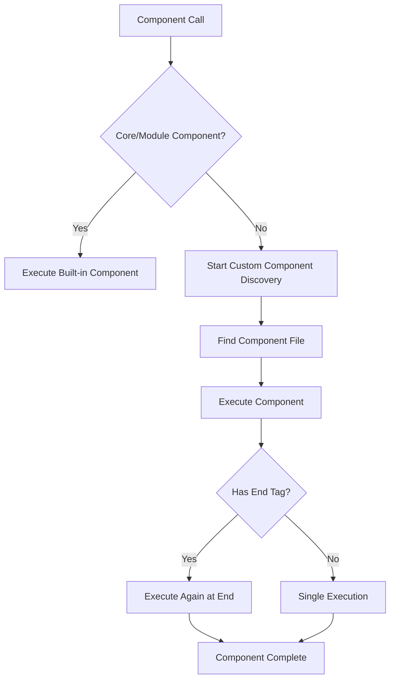
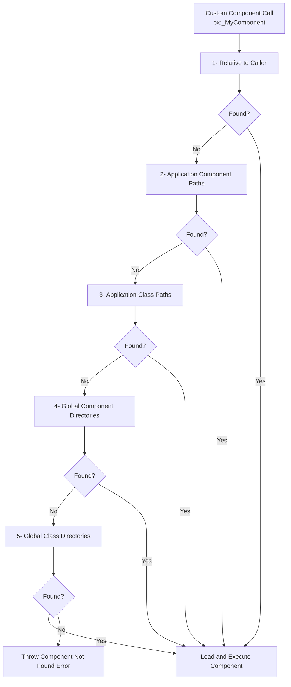
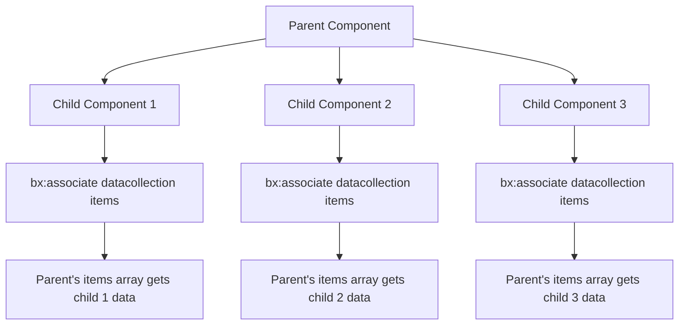

# Components

BoxLang components are reusable blocks of code that extend the language's capabilities without modifying the parser. They provide a powerful way to create custom language constructs, encapsulate complex logic, and build modular applications. They are analogous to web components. Here is a super simple example of a component that outputs a greeting:

**Greeting.bxm**

```xml
<bx:output>
    <h1>Hello, #attributes.yourname ?: "None Passed"#!</h1>
</bx:output>
```

Now I can call it in my BoxLang script:

```js
// In a BoxLang script
bx:_greeting yourname="World";
```

Or in a BoxLang template:

```xml
<bx:_greeting yourname="World">
```

This will output:

```html
<h1>Hello, World!</h1>
```

This simple example illustrates how components allow you to encapsulate functionality and reuse it across your BoxLang applications. Components can be as simple or complex as needed, and they can include attributes, logic, and even nested content.

## Why Components Matter

Components solve common development challenges:

* **Eliminate Code Duplication**: Write once, use everywhere
* **Extend the Language**: Create custom block constructs that feel native
* **Encapsulate Logic**: Keep complex operations contained and testable
* **Cross-Context Usage**: BoxLang components work seamlessly in both script and template contexts

## Basic Principles

### Component Syntax

Components can be called using either script-based or template-based syntax according to where they are being used:

#### **Script Context:**

```js
// Self-closing
bx:_myComponent;
bx:_myComponent attribute="value";

// With body content
bx:_myComponent attribute="value" {
    // Content and logic here
}
```

#### **Template Context:**

```xml
<!-- With no body -->
<bx:_myComponent attribute="value">

<!-- With body content -->
<bx:_myComponent attribute="value">
    Content and logic here
</bx:_myComponent>
```

### Component Execution Flow

When BoxLang encounters a component call, it follows this process:



## Core and Module Components

### Core Components

BoxLang ships with many core components that extend the language with framework capabilities. You can find them in the [reference section.](../boxlang-language/reference/components/)

```js
// HTTP operations
bx:http url="https://api.example.com/users" result="apiResponse";

// Database queries
bx:query name="users" datasource="myDB" {
    writeoutput( "SELECT id, name, email FROM users WHERE active = 1 " )
}

// File operations
bx:file action="read" file="/path/to/data.txt" variable="fileContent";
```

### Module Components

Any BoxLang module can also register and collaborate with components to the runtime.

```js
// Example: A caching module might provide
bx:cache key="userList" timeout="3600" {
    // Expensive operation cached for 1 hour
    bx:query name="expensiveQuery" datasource="myDB" {
        writeOutput( "SELECT * FROM complex_view WHERE processing_intensive = 1" )
    }
}

// Example: A PDF module might provide
bx:pdf action="generate" filename="report.pdf" {
    // PDF content here
}
```


Core and module components are **registered** with the runtime and don't go through the discovery process. They leverage the core Component Service to achieve this.


## Creating Custom Components

Custom components are user-defined components written in BoxLang that will allow you to extend the language with your own features. It will also allow you to create expressive contributions to the templating language.

Custom components can be created using two approaches:

* **Template-based components** (`.bxm` files): Use BoxLang's templating syntax
* **Script-based components** (`.bxs` files): Use pure BoxLang script syntax

### Basic Custom Component Structure

Let's start with simple examples using both approaches:

#### Template-based Component

**File: `components/greeting.bxm`**

```xml
<!--
Simple greeting component that takes a name attribute
Usage: <bx:greeting name="Alice" />
-->

<div class="greeting-card">
    <h2>Hello, #attributes.yourname ?: "World"#!</h2>
    <p>Welcome to our application.</p>
</div>
```

#### Script-based Component

**File: `components/greeting.bxs`**

```js
/*
Simple greeting component that takes a name attribute
Usage: bx:greeting name="Alice";
*/

writeOutput( '<div class="greeting-card">' );
writeOutput( '<h2>Hello, ' & ( attributes.yourname ?: "World" ) & '!</h2>' );
writeOutput( '<p>Welcome to our application.</p>' );
writeOutput( '</div>' );
```

### Component Input: The `attributes` Scope

All data passed to your component is available in the `attributes` scope. Both template and script-based components can validate and process these attributes. Note that the attribute name `name` is reserved and is only used when invoking components via `bx:component` .

#### Template-based Component with Attributes

```xml
<!-- File: components/userCard.bxm -->

<!-- Best practice: Parameterize your attributes with validation -->
<bx:param name="attributes.userId" type="string" required="true">
<bx:param name="attributes.username" type="string" required="true">
<bx:param name="attributes.email" type="string" required="true">
<bx:param name="attributes.showAvatar" type="boolean" default="false">
<bx:param name="attributes.theme" type="string" default="light">

<div class="user-card theme-#attributes.theme#" data-user-id="#attributes.userId#">
    <bx:if attributes.showAvatar>
        
    </bx:if>

    <div class="user-info">
        <h3>#attributes.username#</h3>
        <p class="email">#attributes.email#</p>
    </div>
</div>
```

#### Script-based Component with Attributes

```js
// File: components/userCard.bxs

// Best practice: Parameterize your attributes with validation
bx:param name="attributes.userId" type="string" required="true";
bx:param name="attributes.username" type="string" required="true";
bx:param name="attributes.email" type="string" required="true";
bx:param name="attributes.showAvatar" type="boolean" default="false";
bx:param name="attributes.theme" type="string" default="light";

writeOutput( '<div class="user-card theme-' & attributes.theme & '" data-user-id="' & attributes.userId & '">' );

if ( attributes.showAvatar ) {
    writeOutput( '' );
}

writeOutput( '<div class="user-info">' );
writeOutput( '<h3>' & attributes.username & '</h3>' );
writeOutput( '<p class="email">' & attributes.email & '</p>' );
writeOutput( '</div>' );
writeOutput( '</div>' );
```

### Component Content: The `thisComponent` Scope

When components have start and end tags, BoxLang provides the `thisComponent` scope to manage content and execution. This works the same way in both template and script-based components.

**The `thisComponent` scope contains:**

* `executionMode`: "start" or "end"
* `hasEndTag`: boolean indicating if component has closing tag
* `generatedContent`: Content between start and end tags

#### Template-based Component with `thisComponent`

**File: `components/boldWrapper.bxm`**

```xml
<!-- Component that wraps content in bold tags -->

<bx:if thisComponent.executionMode eq "end">
    <bx:output><b>#thisComponent.generatedContent#</b></bx:output>
    <bx:set thisComponent.generatedContent = "">
</bx:if>
```

#### Script-based Component with `thisComponent`

**File: `components/boldWrapper.bxs`**

```js
// Component that wraps content in bold tags

if ( thisComponent.executionMode == "end" ) {
    writeOutput( "<b>" & thisComponent.generatedContent & "</b>" );
    thisComponent.generatedContent = "";
}
```

**Usage (same for both):**

```xml
<bx:boldWrapper>This text will be bold</bx:boldWrapper>
<!-- Outputs: <b>This text will be bold</b> -->
```

### Complex Component with Start/End Logic

Here's an advanced component demonstrating the full execution cycle, shown in both template and script syntax:

#### Template-based Version

**File: `components/section.bxm`**

```xml
<!-- Advanced component demonstrating full execution cycle -->
<bx:param name="attributes.title" type="string" required="true">
<bx:param name="attributes.collapsible" type="boolean" default="false">
<bx:param name="attributes.collapsed" type="boolean" default="false">

<bx:if thisComponent.executionMode eq "start">
    <!-- Opening section markup -->
    <section class="content-section">
        <header class="section-header">
            <h2>#attributes.title#</h2>
            <bx:if thisComponent.attributes.collapsible>
                <button class="toggle-btn" data-collapsed="#attributes.collapsed#">
                    #attributes.collapsed ? "Expand" : "Collapse"#
                </button>
            </bx:if>
        </header>
        <div class="section-content"
             style="#attributes.collapsed ? 'display:none' : ''#">
</bx:if>

<bx:if thisComponent.executionMode eq "end">

    <!-- Closing section markup -->
        </div>
    </section>

</bx:if>
```

#### Script-based Version

**File: `components/section.bxs`**

```js
// Advanced component demonstrating full execution cycle
bx:param name="attributes.title" type="string" required="true";
bx:param name="attributes.collapsible" type="boolean" default="false";
bx:param name="attributes.collapsed" type="boolean" default="false";

if ( thisComponent.executionMode == "start" ) {
    // Opening section markup
    writeOutput( '<section class="content-section">' );
    writeOutput( '<header class="section-header">' );
    writeOutput( '<h2>' & attributes.title & '</h2>' );

    if ( attributes.collapsible ) {
        writeOutput( '<button class="toggle-btn" data-collapsed="' & attributes.collapsed & '">' );
        writeOutput( attributes.collapsed ? "Expand" : "Collapse" );
        writeOutput( '</button>' );
    }

    writeOutput( '</header>' );
    writeOutput( '<div class="section-content"' );
    if ( attributes.collapsed ) {
        writeOutput( ' style="display:none"' );
    }
    writeOutput( '>' );
}

if ( thisComponent.executionMode == "end" ) {

    // Closing section markup
    writeOutput( '</div>' );
    writeOutput( '</section>' );

}
```

**Usage (same for both template and script versions):**

```xml
<bx:_section title="User Information" collapsible="true">
    <p>This content appears inside the section.</p>
    <bx:userCard userId="123" name="John Doe" email="john@example.com" />
</bx:_section>
```

## Custom Component Discovery

Custom component discovery is a hierarchical lookup process that occurs when BoxLang encounters a component call that isn't a registered core or module component.



## Discovery Configuration

BoxLang component locations can be defined globally or on a per-app basis.

### **Global Configuration (`boxlang.json`):**

```json
{
    "customComponentsDirectory": [
        "${boxlang-home}/global/components"
    ],
    "classPaths": [
        "${boxlang-home}/global/classes"
    ]
}
```

### **Application Configuration (`Application.bx`):**

```js
class {
    // Component paths for .bxm, .bxs template files
    this.customComponentPaths = [
        "/absolute/path/to/components",
        "./relative/path/components"
    ];

    // Class paths for .bx class files
    this.classPaths = [
        "/absolute/path/to/classes"
    ];
}
```

### File Extensions Searched

During discovery, BoxLang looks for files with these extensions in order:

1. `.bxm` (BoxLang template)
2. `.bxs` (BoxLang script)
3. `.cfc` (CFML component - for compatibility)
4. `.cfm` (CFML template - for compatibility)

## Calling Custom Components

### Method 1: Using `bx:component`

**Script Syntax:**

```js
// Basic call
bx:_component template="greeting" username="Alice";

// With body content
bx:_component template="userCard" userId="123" username="John Doe" {
    writeOutput( "<p>Additional content here</p>" );
}

// With relative or absolute paths
bx:_component template="./components/greeting" username="Alice";
bx:_component template="/shared/components/layout" title="My Page";
```

**Template Syntax:**

```xml
<!-- Basic call -->
<bx:_component template="greeting" username="Alice" />

<!-- With body content -->
<bx:_component template="userCard" userId="123" username="John Doe">
    <p>Additional content here</p>
</bx:_component>
```

### Method 2: Convention-Based Calling

BoxLang looks for a component file matching the name after `bx:`:

**Script Syntax:**

```js
// Looks for greeting.bxm, greeting.bxs, etc.
bx:_greeting name="Alice";

bx:_userCard userId="123" username="John Doe" {
    writeOutput( "<p>Additional content</p>" );
}
```

**Template Syntax:**

```xml
<!-- Looks for greeting.bxm, greeting.bxs, etc. -->
<bx:_greeting username="Alice" />

<bx:_userCard userId="123" username="John Doe">
    <p>Additional content</p>
</bx:_userCard>
```

## Component Scopes Deep Dive

### The `attributes` Scope

Contains all attributes passed to the component call:

```xml
<!-- Component: productDisplay.bxm -->
<bx:param name="attributes.productId" type="string" required="true">
<bx:param name="attributes.showPrice" type="boolean" default="true">
<bx:param name="attributes.currency" type="string" default="USD">

<div class="product" data-id="#attributes.productId#">
    <h3>#attributes.username#</h3>
    <bx:if "#attributes.showPrice#">
        <p class="price">#attributes.price# #attributes.currency#</p>
    </bx:if>
</div>
```

### The `variables` Scope

A localized scope for the component's internal logic:

```xml
<!-- Component: calculator.bxm -->
<bx:param name="attributes.operation" type="string" required="true">
<bx:param name="attributes.a" type="numeric" required="true">
<bx:param name="attributes.b" type="numeric" required="true">

<bx:switch expression="#attributes.operation#">
    <bx:case value="add">
        <bx:set variables.result = attributes.a + attributes.b />
    </bx:case>
    <bx:case value="multiply">
        <bx:set variables.result = attributes.a * attributes.b />
    </bx:case>
    <bx:defaultcase>
        <bx:set variables.result = "Invalid operation" />
    </bx:defaultcase>
</bx:switch>

<div class="calculation-result">
    <p>Result: #variables.result#</p>
</div>
```

### The `caller` Scope

Provides access to the calling context (use sparingly):

```xml
<!-- Component: debugInfo.bxm -->
<bx:if "#isDefined( 'caller.request.debug' ) AND caller.request.debug#">
    <div class="debug-panel">
        <h4>Debug Information</h4>
        <p>Current Template: #caller.getCurrentTemplatePath()#</p>
        <p>Variables Count: #structCount( caller.variables )#</p>
    </div>
</bx:if>
```

### The `thisComponent` Scope

Manages component execution and content:

```xml
<!-- Component: accordion.bxm -->
<bx:param name="attributes.title" type="string" required="true">
<bx:param name="attributes.expanded" type="boolean" default="false">

<bx:if thisComponent.executionMode eq "start">
    <div class="accordion-item">
        <button class="accordion-header" onclick="toggleAccordion(this)">
            #attributes.title#
        </button>
        <div class="accordion-content" style="#attributes.expanded ? '' : 'display:none'#">
</bx:if>

<bx:if thisComponent.executionMode eq "end">
        </div>
    </div>
</bx:if>
```

## Associating Subtag Data with Base Tags

BoxLang provides the `bx:associate` component to create relationships between child components and their parent components. This powerful feature allows you to build hierarchical component structures where child components can pass data up to their parent components.

### How Component Association Works

When you use `bx:associate` inside a child component, it creates a data structure in the parent component that contains all the associated data from its children. This enables complex component hierarchies like forms with fields, menus with items, or layouts with sections.



### Basic Association Syntax

**Script Syntax:**

```js
bx:associate dataCollection="collectionName";
```

**Template Syntax:**

```xml
<bx:associate dataCollection="collectionName" />
```

### Simple Example: Menu with Menu Items

**Parent Component: `menu.bxm`**

```xml
<!-- File: components/menu.bxm -->
<bx:param name="attributes.id" type="string" required="true">
<bx:param name="attributes.class" type="string" default="nav-menu">

<bx:if thisComponent.executionMode eq "start">
    <nav id="#attributes.id#" class="#attributes.class#">
        <ul class="menu-list">
</bx:if>

<bx:if thisComponent.executionMode eq "end">

    <!-- Now render all associated menu items -->
    <bx:if "#isDefined( 'thisComponent.menuItems' ) AND isArray( thisComponent.menuItems )#">
        <bx:loop array="#thisComponent.menuItems#" index="menuItem">
            <li class="menu-item">
                <a href="#menuItem.url#"
                   class="#menuItem.class ?: ''#"
                   #menuItem.target ? 'target="' & menuItem.target & '"' : ''#>
                    #menuItem.label#
                </a>
            </li>
        </bx:loop>
    </bx:if>

        </ul>
    </nav>

</bx:if>
```

**Child Component: `menuItem.bxm`**

```xml
<!-- File: components/menuItem.bxm -->
<bx:param name="attributes.label" type="string" required="true">
<bx:param name="attributes.url" type="string" required="true">
<bx:param name="attributes.class" type="string" default="">
<bx:param name="attributes.target" type="string" default="">

<!-- Associate this menu item data with the parent menu -->
<bx:associate dataCollection="menuItems" />
```

**Usage:**

```xml
<bx:_menu id="mainNav" class="primary-navigation">
    <bx:_menuItem label="Home" url="/" />
    <bx:_menuItem label="About" url="/about" />
    <bx:_menuItem label="Products" url="/products" class="dropdown-trigger" />
    <bx:_menuItem label="Contact" url="/contact" />
    <bx:_menuItem label="External Link" url="https://example.com" target="_blank" />
</bx:_menu>
```

### Advanced Example: Form with Form Fields

**Parent Component: `form.bxm`**

```xml
<!-- File: components/form.bxm -->
<bx:param name="attributes.action" type="string" required="true">
<bx:param name="attributes.method" type="string" default="POST">
<bx:param name="attributes.id" type="string" default="">
<bx:param name="attributes.class" type="string" default="form">
<bx:param name="attributes.validateOnSubmit" type="boolean" default="true">

<bx:if thisComponent.executionMode eq "start">
    <form action="#attributes.action#"
          method="#attributes.method#"
          #len( attributes.id ) ? 'id="' & attributes.id & '"' : ''#
          class="#attributes.class#"
          #attributes.validateOnSubmit ? 'data-validate="true"' : ''#>
</bx:if>

<bx:if thisComponent.executionMode eq "end">

    <!-- Render all associated form fields -->
    <bx:if "#isDefined( 'thisComponent.formFields' ) AND isArray( thisComponent.formFields )#">
        <bx:loop array="#thisComponent.formFields#" index="field">
            <div class="form-group field-type-#field.type#">
                <bx:if "#len( field.label ?: '' )#">
                    <label for="#field.fieldname#" class="form-label">
                        #field.label#
                        <bx:if "#field.required#">
                            <span class="required">*</span>
                        </bx:if>
                    </label>
                </bx:if>

                <bx:switch expression="#field.type#">
                    <bx:case value="text,email,password,number,tel,url">
                        <input type="#field.type#"
                               name="#field.fieldname#"
                               id="#field.name#"
                               value="#field.value ?: ''#"
                               class="form-control #field.class ?: ''#"
                               #field.required ? 'required' : ''#
                               #len( field.placeholder ?: '' ) ? 'placeholder="' & field.placeholder & '"' : ''# />
                    </bx:case>

                    <bx:case value="textarea">
                        <textarea name="#field.fieldname#"
                                  id="#field.fieldname#"
                                  class="form-control #field.class ?: ''#"
                                  #field.required ? 'required' : ''#
                                  #len( field.placeholder ?: '' ) ? 'placeholder="' & field.placeholder & '"' : ''#
                                  rows="#field.rows ?: 4#">#field.value ?: ''#</textarea>
                    </bx:case>

                    <bx:case value="select">
                        <select name="#field.fieldname#"
                                id="#field.fieldname#"
                                class="form-control #field.class ?: ''#"
                                #field.required ? 'required' : ''#>
                            <bx:if "#len( field.placeholder ?: '' )#">
                                <option value="">#field.placeholder#</option>
                            </bx:if>
                            <bx:if "#isDefined( 'field.options' ) AND isArray( field.options )#">
                                <bx:loop array="#field.options#" index="option">
                                    <option value="#option.value#"
                                            #option.value EQ ( field.value ?: '' ) ? 'selected' : ''#>
                                        #option.label#
                                    </option>
                                </bx:loop>
                            </bx:if>
                        </select>
                    </bx:case>
                </bx:switch>

                <bx:if "#len( field.helpText ?: '' )#">
                    <small class="form-help">#field.helpText#</small>
                </bx:if>
            </div>
        </bx:loop>
    </bx:if>

    <!-- Render any additional content (like buttons) -->
    <bx:if "#isDefined( 'thisComponent.formActions' ) AND isArray( thisComponent.formActions )#">
        <div class="form-actions">
            <bx:loop array="#thisComponent.formActions#" index="action">
                <button type="#action.type ?: 'button'#"
                        class="btn #action.class ?: 'btn-primary'#"
                        #len( action.onclick ?: '' ) ? 'onclick="' & action.onclick & '"' : ''#>
                    #action.label#
                </button>
            </bx:loop>
        </div>
    </bx:if>

    </form>


</bx:if>
```

**Child Components:**

**`formField.bxm`**

```xml
<!-- File: components/formField.bxm -->
<bx:param name="attributes.fieldname" type="string" required="true">
<bx:param name="attributes.type" type="string" default="text">
<bx:param name="attributes.label" type="string" default="">
<bx:param name="attributes.value" type="string" default="">
<bx:param name="attributes.placeholder" type="string" default="">
<bx:param name="attributes.required" type="boolean" default="false">
<bx:param name="attributes.class" type="string" default="">
<bx:param name="attributes.helpText" type="string" default="">
<bx:param name="attributes.rows" type="numeric" default="4">

<!-- Associate this field data with the parent form -->
<bx:associate dataCollection="formFields" />
```

**`formOption.bxm`**

```xml
<!-- File: components/formOption.bxm -->
<bx:param name="attributes.value" type="string" required="true">
<bx:param name="attributes.label" type="string" required="true">

<!-- Associate this option with the parent form field -->
<bx:associate dataCollection="options" />
```

**`formAction.bxm`**

```xml
<!-- File: components/formAction.bxm -->
<bx:param name="attributes.label" type="string" required="true">
<bx:param name="attributes.type" type="string" default="submit">
<bx:param name="attributes.class" type="string" default="btn-primary">
<bx:param name="attributes.onclick" type="string" default="">

<!-- Associate this action with the parent form -->
<bx:associate dataCollection="formActions" />
```

**Usage:**

```xml
<bx:_form action="/contact/submit" method="POST" id="contactForm">
    <bx:_formField fieldname="firstName"
                  type="text"
                  label="First Name"
                  required="true"
                  placeholder="Enter your first name" />

    <bx:_formField fieldname="email"
                  type="email"
                  label="Email Address"
                  required="true"
                  helpText="We'll never share your email" />

    <bx:_formField fieldname="country"
                  type="select"
                  label="Country"
                  required="true"
                  placeholder="Select your country">
        <bx:_formOption value="us" label="United States" />
        <bx:_formOption value="ca" label="Canada" />
        <bx:_formOption value="uk" label="United Kingdom" />
    </bx:_formField>

    <bx:_formField fieldname="message"
                  type="textarea"
                  label="Message"
                  placeholder="Enter your message"
                  rows="6" />

    <bx:_formAction label="Send Message" type="submit" />
    <bx:_formAction label="Reset Form" type="reset" class="btn-secondary" />
</bx:_form>
```

### Key Points About `bx:associate`

#### 1. **Data Collection Names**

The `dataCollection` attribute specifies the name of the array that will be created in the parent component's `thisComponent` scope.

#### 2. **Automatic Array Creation**

If the specified collection doesn't exist, BoxLang automatically creates it as an empty array.

#### 3. **Attribute Inheritance**

All attributes from the child component are automatically added to the collection item.

#### 4. **Execution Timing**

Association happens during the child component's execution, so data is available when the parent reaches its "end" execution mode.

#### 5. **Nested Associations**

You can have multiple levels of association for complex hierarchies.

### Advanced Pattern: Tab Container

**Parent Component: `tabContainer.bxm`**

```xml
<bx:param name="attributes.id" type="string" required="true">
<bx:param name="attributes.activeTab" type="string" default="">

<bx:if thisComponent.executionMode eq "start">
    <div id="#attributes.id#" class="tab-container">
        <ul class="tab-nav" role="tablist">
</bx:if>

<bx:if thisComponent.executionMode eq "end">

    <!-- Render tab navigation -->
    <bx:if "#isDefined( 'thisComponent.tabs' ) AND isArray( thisComponent.tabs )#">
        <bx:loop array="#thisComponent.tabs#" index="tab" item="i">
            <li class="tab-nav-item">
                <button class="tab-button #( i EQ 1 OR tab.id EQ attributes.activeTab ) ? 'active' : ''#"
                        data-tab="#tab.id#"
                        role="tab">
                    #tab.title#
                </button>
            </li>
        </bx:loop>

        </ul>

        <!-- Render tab content -->
        <div class="tab-content">
            <bx:loop array="#thisComponent.tabs#" index="tab" item="i">
                <div id="#tab.id#"
                     class="tab-pane #( i EQ 1 OR tab.id EQ attributes.activeTab ) ? 'active' : ''#"
                     role="tabpanel">
                    #tab.content#
                </div>
            </bx:loop>
        </div>
    </bx:if>

    </div>

</bx:if>
```

**Child Component: `tab.bxm`**

```xml
<bx:param name="attributes.id" type="string" required="true">
<bx:param name="attributes.title" type="string" required="true">

<bx:if thisComponent.executionMode eq "end">
    <!-- Capture the tab content -->
    <bx:set variables.tabContent = thisComponent.generatedContent />
    <bx:set thisComponent.generatedContent = "">

    <!-- Set the content in attributes for association -->
    <bx:set attributes.content = variables.tabContent />
</bx:if>

<!-- Associate this tab with the parent container -->
<bx:associate dataCollection="tabs" />
```

**Usage:**

```xml
<bx:_tabContainer id="mainTabs" activeTab="profile">
    <bx:_tab id="overview" title="Overview">
        <h3>Account Overview</h3>
        <p>Welcome to your account dashboard.</p>
    </bx:_tab>

    <bx:_tab id="profile" title="Profile">
        <h3>Profile Settings</h3>
        <bx:_form action="/profile/update">
            <bx:_formField name="name" label="Full Name" required="true" />
            <bx:_formAction label="Update Profile" />
        </bx:_form>
    </bx:tab>

    <bx:_tab id="settings" title="Settings">
        <h3>Account Settings</h3>
        <p>Manage your account preferences.</p>
    </bx:_tab>
</bx:_tabContainer>
```

This association pattern enables powerful component composition where child components contribute data to their parents, creating flexible and reusable component hierarchies.

## Advanced Component Patterns

### Component Composition

Components can call other components for powerful composition:

```xml
<!-- Component: pageLayout.bxm -->
<bx:param name="attributes.title" type="string" required="true">
<bx:param name="attributes.showSidebar" type="boolean" default="true">

<bx:if thisComponent.executionMode eq "start">
    <!DOCTYPE html>
    <html>
    <head>
        <title>#attributes.title#</title>
        <bx:stylesheet href="/css/main.css" >
    </head>
    <body>
        <bx:_header siteName="My Site" >

        <div class="main-container">
            <bx:if "#attributes.showSidebar#">
                <aside class="sidebar">
                    <bx:_navigation >
                </aside>
            </bx:if>

            <main class="content">
</bx:if>

<bx:if thisComponent.executionMode eq "end">

            </main>
        </div>

        <bx:_footer />
    </body>
    </html>

</bx:if>
```

### Conditional Component Loading

```xml
<!-- Component: roleBasedContent.bxm -->
<bx:param name="attributes.userRole" type="string" required="true">

<bx:switch expression="#attributes.userRole#">
    <bx:case value="admin">
        <bx:adminDashboard userId="#attributes.userId#" />
    </bx:case>
    <bx:case value="moderator">
        <bx:moderatorPanel userId="#attributes.userId#" />
    </bx:case>
    <bx:defaultcase>
        <bx:userDashboard userId="#attributes.userId#" />
    </bx:defaultcase>
</bx:switch>
```

## Best Practices

### 1. Always Use `bx:param` for Attribute Validation

**Template-based components:**

```xml
<!-- Good: Explicit parameter definition -->
<bx:param name="attributes.userId" type="string" required="true">
<bx:param name="attributes.maxItems" type="numeric" default="10">

<!-- Avoid: Accessing attributes without validation -->
<!-- <p>User: #attributes.userId#</p> -->
```

**Script-based components:**

```js
// Good: Explicit parameter definition
bx:param name="attributes.userId" type="string" required="true";
bx:param name="attributes.maxItems" type="numeric" default="10";

// Avoid: Accessing attributes without validation
// writeOutput( "User: " & attributes.userId );
```

### 2. Use Descriptive Component Names

```xml
<!-- Good -->
<bx:_userProfileCard userId="123" />
<bx:_productListingGrid products="#variables.products#" />

<!-- Avoid -->
<bx:_card data="123" />
<bx:_list items="#variables.items#" />
```

### 3. Document Your Components

**Template-based components:**

````xml
<!--
Component: userProfileCard.bxm
Description: Displays a user profile with avatar, name, and contact info
Attributes:
  - userId (string, required): User's unique identifier
  - showEmail (boolean, default: true): Whether to show email address
  - theme (string, default: "light"): Visual theme (light|dark)
Example:

```xml
<!--
Component: userProfileCard.bxm
Description: Displays a user profile with avatar, name, and contact info
Attributes:
  - userId (string, required): User's unique identifier
  - showEmail (boolean, default: true): Whether to show email address
  - theme (string, default: "light"): Visual theme (light|dark)
Example:
  <bx:userProfileCard userId="123" showEmail="false" theme="dark" />
-->
````

**Script-based components:**

```js
/*
Component: userProfileCard.bxs
Description: Displays a user profile with avatar, name, and contact info
Attributes:
  - userId (string, required): User's unique identifier
  - showEmail (boolean, default: true): Whether to show email address
  - theme (string, default: "light"): Visual theme (light|dark)
Example:
  bx:userProfileCard userId="123" showEmail="false" theme="dark";
*/
```

### 4. Minimize Use of `caller` Scope

**Template-based components:**

```xml
<!-- Good: Self-contained component -->
<bx:param name="attributes.data" type="array" required="true">

<!-- Avoid: Reaching into caller scope -->
<!-- <bx:set variables.data = caller.variables.someData> -->
```

**Script-based components:**

```js
// Good: Self-contained component
bx:param name="attributes.data" type="array" required="true";

// Avoid: Reaching into caller scope
// variables.data = caller.variables.someData;
```

## Migration from CFML Custom Tags

BoxLang components provide enhanced functionality over CFML custom tags:

| CFML Custom Tags             | BoxLang Components               |
| ---------------------------- | -------------------------------- |
| `<cf_customTag>`             | `<bx:_customTag>`                |
| `<cfmodule template="path">` | `<bx:component template="path">` |
| Template context only        | **Script and template contexts** |
| `attributes` scope           | `attributes` scope               |
| `caller` scope               | `caller` scope                   |
| `thisComponent` scope              | `thisComponent` scope                  |
| Limited discovery            | **Enhanced discovery system**    |

**Key Advantages in BoxLang:**

* Components work seamlessly in both script and template contexts
* Enhanced parameter validation with `bx:param`
* Improved discovery system with multiple lookup paths
* Better error handling and debugging support
