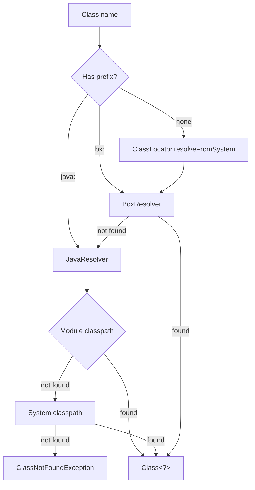
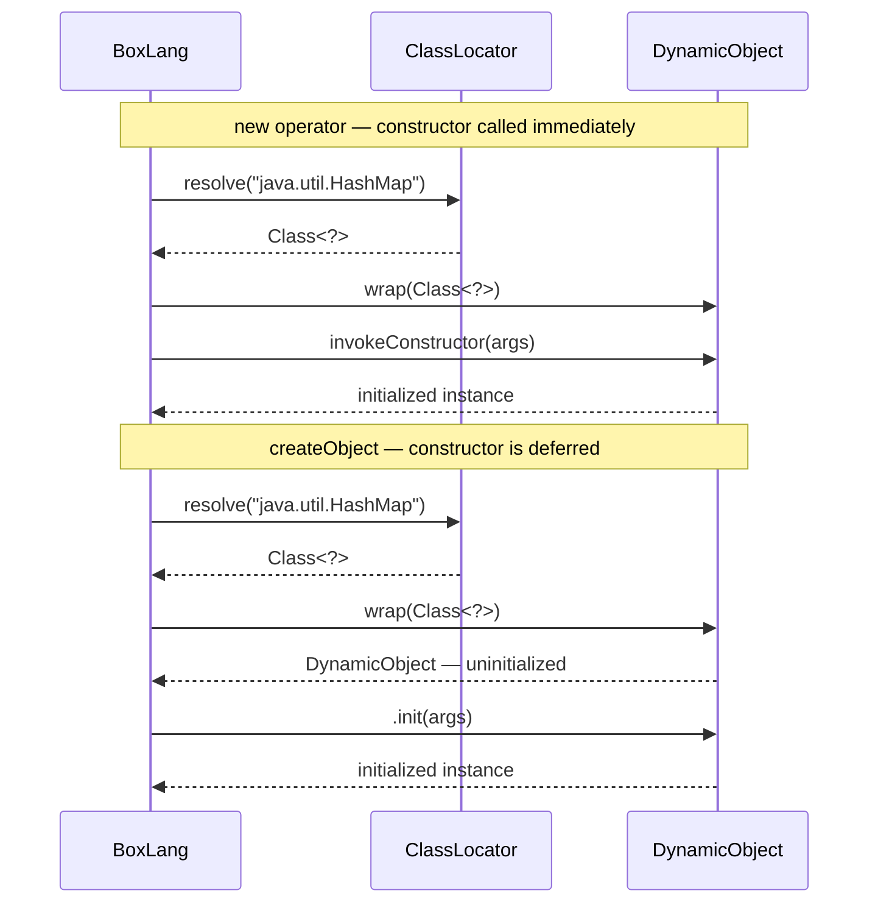
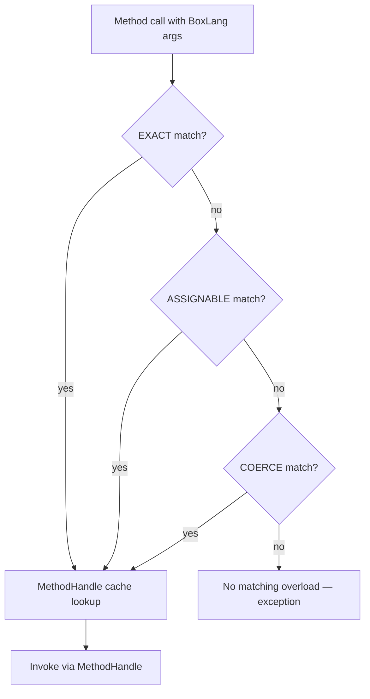
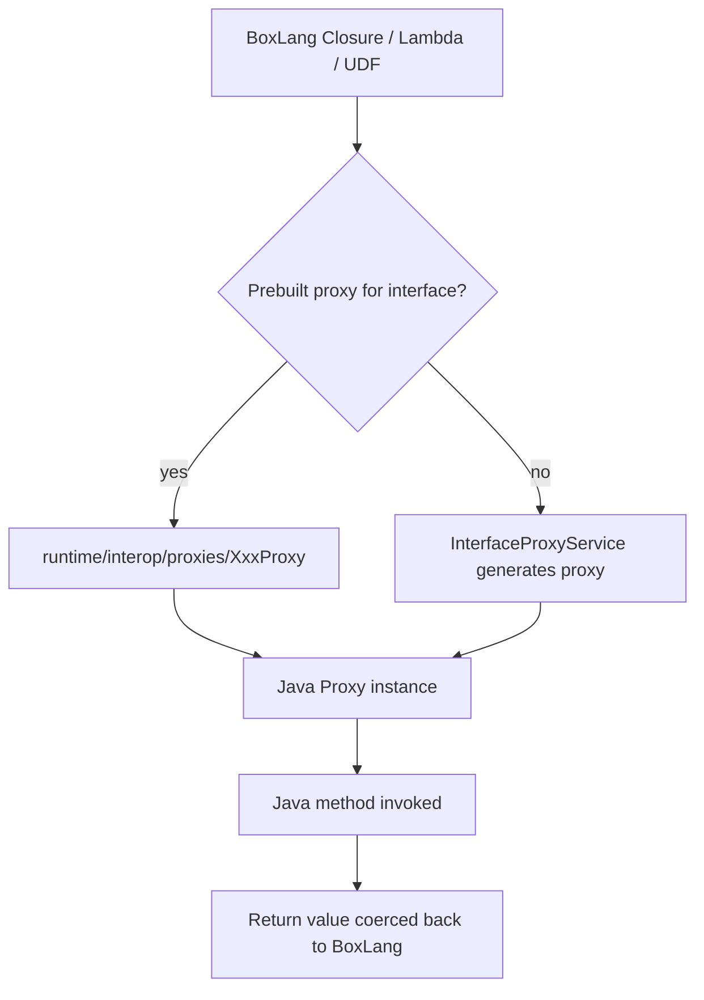
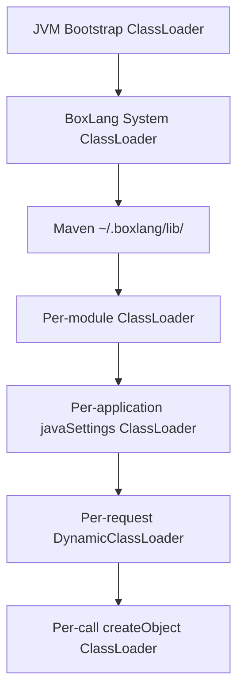

# Java Interop

BoxLang compiles to JVM bytecode and runs directly on the JVM, making Java classes first-class citizens. The runtime resolves Java names through a `ClassLocator` → resolver pipeline and handles coercion in both directions — BoxLang values passed to Java methods and Java return values coming back. Any Java library on the classpath is immediately usable without glue code.

## DynamicObject — The Engine Behind Java Interop

Every Java reference in BoxLang — instance, static, or the value returned by `createObject` — is wrapped in a `DynamicObject`. All dot-access, method calls, field reads, and operator forms (`castAs`, `instanceOf`, `new`) are sugar over `DynamicObject` + `DynamicInteropService`.

Key behaviours live in those two classes:

- **Constructor dispatch** — `invokeConstructor(args)` finds the best-matching overload.
- **Method dispatch** — EXACT → ASSIGNABLE → COERCE matching; hot paths are cached via `MethodHandle`.
- **Field access** — public instance and static fields are readable and writable.
- **Varargs** — packed transparently into the expected array type.
- **SAM auto-coercion** — any BoxLang closure/lambda/UDF passed where a `@FunctionalInterface` is expected is auto-wrapped (see the SAM Interfaces section below).

Sources: `runtime/interop/DynamicObject.java`, `runtime/interop/DynamicInteropService.java`.

## Resolver Prefixes (`bx:` and `java:`)

BoxLang ships two built-in class resolvers:

| Prefix | Resolver | Resolves |
| --- | --- | --- |
| `bx:` (default) | `BoxResolver` | BoxLang classes and modules |
| `java:` | `JavaResolver` | JDK and classpath Java classes |

The prefix is **optional**. When omitted, `ClassLocator.resolveFromSystem()` walks `bx:` → `java:` automatically (`DEFAULT_RESOLVER = BX_PREFIX`). Use an explicit prefix to force a resolver, disambiguate a name collision, or make the Java origin visually clear in the source.

```java
// explicit prefix — unambiguous, self-documenting
var map = new java:java.util.HashMap();

// no prefix — resolver cascade picks it up automatically
var map2 = new java.util.HashMap();
```

**Custom resolvers** are a Java-only API: `ClassLocator.registerResolver(IClassResolver)`. This is an advanced extensibility point for module authors embedding BoxLang.

**Cache clearing** after dynamic class reloads:

```java
SystemCacheClear( "class" );  // clear class resolver cache
PagePoolClear();               // or flush the page pool (also clears class cache)
```

See [SystemCacheClear](../boxlang-language/reference/built-in-functions/system/SystemCacheClear.md) and [PagePoolClear](../boxlang-language/reference/built-in-functions/system/PagePoolClear.md).



## Importing Java Classes

Use `import` at the top of a script or inside a class body to bring a Java type into scope.

```java
// fully qualified
import java:java.util.HashMap;
import java:java.util.ArrayList;

// alias — avoid repetitive FQCNs
import java:java.util.LinkedHashMap as OrderedMap;

// wildcard — resolved lazily; first use of each class pays the lookup cost
import java:java.util.*;
```

Inside a class:

```java
class {
    import java:java.lang.String as JString;

    function compareIgnoreCase( required string a, required string b ) {
        return new JString( a ).compareToIgnoreCase( b );
    }
}
```

## Creating Java Objects

### The `new` Operator

`new` resolves the class, invokes the best-matching constructor via `DynamicObject.invokeConstructor`, and returns an initialized instance ready to use.

```java
// prefixed — resolver is explicit
var sb = new java:java.lang.StringBuilder( "hello" );

// unprefixed after import
import java:java.util.HashMap;
var map = new HashMap();

// FQCN as a string literal
var file = new "java.io.File"( getCurrentTemplatePath() );

// FQCN in a variable
var className = "java.util.ArrayList";
var list      = new "#className#"();
```

### Class References as Constructors

Imported Java classes are class references, and class references are callable constructors. This gives Java classes the same construction model as BoxLang classes: use `new`, call `.init()` on the class reference, or invoke the class reference directly.

```java
import java:java.lang.StringBuilder;

// These three forms are equivalent
var b1 = new StringBuilder( "abc" );
var b2 = StringBuilder.init( "abc" );
var b3 = StringBuilder( "abc" );
```

The same pattern applies to BoxLang classes:

```java
import models.User;

var u1 = new User( "Luis" );
var u2 = User.init( "Luis" );
var u3 = User( "Luis" );
```

Because class references are callable, they can be passed directly to higher-order functions. This is useful when mapping raw data into Java objects without wrapping the constructor in a lambda.

```java
import java:java.math.BigDecimal;

var values   = [ "1.25", "2.50" ];
var decimals = values.map( BigDecimal );
```

If the class reference is stored in a variable or returned from a function, invoke that reference the same way:

```java
import java:java.lang.StringBuilder;

var builderClass = StringBuilder;
var builder      = builderClass( "hello" );
```

### `createObject()`

```java
createObject( type, className [, loadPaths [, externalOnly [, classloader ]]] )
```

For `type = "java"`, `createObject` returns an **uninitialized** `DynamicObject`. You must call `.init(args)` explicitly to invoke a constructor. Static methods and fields are accessible without calling `.init()`.

```java
// Uninitialized — NO constructor called yet
var sb = createObject( "java", "java.lang.StringBuilder" );

// Explicit constructor call required
sb.init( "hello" );
sb.append( " world" );
writeOutput( sb.toString() );  // "hello world"
```

Side-by-side comparison:

```java
// new — single call, always initialized
var a = new java:java.util.HashMap( 16 );

// imported class reference — explicit init()
import java:java.util.HashMap;
var b = HashMap.init( 16 );

// imported class reference — functional constructor
var c = HashMap( 16 );

// createObject — two calls needed when a constructor is required
var d = createObject( "java", "java.util.HashMap" ).init( 16 );

// createObject — static access needs no init()
var sys = createObject( "java", "java.lang.System" );
writeOutput( sys.currentTimeMillis() );
```

### Static Method and Field Access

Static members are accessible on an uninitialized `DynamicObject` without calling `.init()`.

```java
var math    = createObject( "java", "java.lang.Math" );
var pi      = math.PI;
var rounded = math.round( 3.7159 );

var thread  = createObject( "java", "java.lang.Thread" );
thread.sleep( 100 );
```



## Type Coercion

### Automatic Coercion

`DynamicObject` tries three strategies in order when matching a BoxLang value to a Java method parameter:

1. **EXACT** — type identity.
2. **ASSIGNABLE** — the value's type is a subtype or implements the interface.
3. **COERCE** — BoxLang runtime coercion (e.g., `String` → `int`).

Resolved `MethodHandle` instances are cached so the matching cost is paid only on the first call.

### `castAs` Operator (Preferred)

`castAs` is the preferred approach for explicit casting. It is a native language operator and reads more naturally than a BIF call.

```java
// primitives
var age    = someValue castAs int
var price  = someValue castAs double
var active = someValue castAs boolean

// object types
var name = someValue castAs String
var tags = someValue castAs String[]

// unquoted identifiers are treated as string literals
var n = someValue castAs Long   // same as: someValue castAs "Long"
```

See [Operators — CastAs](../boxlang-language/operators.md) for the full syntax reference.

### `javaCast()` BIF

Use `javaCast()` when the function-call form is needed — for example, inside array literals or nested expressions.

```java
var intObj = createObject( "java", "java.lang.Integer" );
var maxInt = intObj.max( javaCast( "int", 5 ), javaCast( "int", 6 ) );
```

Full primitive table:

| Type | Description |
| --- | --- |
| `boolean` | primitive `boolean` |
| `byte` | primitive `byte` |
| `char` | primitive `char` |
| `short` | primitive `short` |
| `int` | primitive `int` |
| `long` | primitive `long` |
| `float` | primitive `float` |
| `double` | primitive `double` |
| `bigdecimal` | `java.math.BigDecimal` |
| `string` | `java.lang.String` |
| `null` | null reference |

Append `[]` to cast to an array type:

```java
var stream = createObject( "java", "java.util.Arrays" )
    .stream( javaCast( "java.lang.Object[]", listToArray( myList, "," ) ) );
```

See [JavaCast](../boxlang-language/reference/built-in-functions/system/JavaCast.md) for the full BIF reference.

### When to Cast Manually

- **Overload disambiguation** — two overloads have the same arity; automatic coercion picks the wrong one.
- **Variadic `Object...` methods** — auto-coercion may not pack arguments into the expected array.
- **Typed array parameters** — methods expecting `int[]`, `String[]`, `byte[]`, etc.



## Working with Java Collections and Arrays


Java arrays are **1-based** in BoxLang. `javaArray[1]` is the first element. Accessing index `0` throws an `IndexOutOfBoundsException`.


```java
// Java array — 1-based indexing
var arr = javaCast( "int[]", [ 10, 20, 30 ] );
writeOutput( arr[1] );  // 10
writeOutput( arr[3] );  // 30

// Java List (ArrayList, LinkedList, etc.) — also 1-based via DynamicInteropService
var list = new java:java.util.ArrayList();
list.add( "alpha" );
list.add( "beta" );
writeOutput( list[1] );  // "alpha"

// Java Map — subscript works via DynamicInteropService
var map = new java:java.util.HashMap();
map.put( "key", "value" );
writeOutput( map["key"] );  // "value"
```

## Java Nulls

The `null` keyword is the preferred way to pass a Java null. The legacy BIF alternatives remain available.

```java
// preferred
someJavaObject.setName( null );

// legacy alternatives — equivalent
someJavaObject.setName( nullValue() );
someJavaObject.setName( javaCast( "null", "" ) );
```

Use `isNull()`, the safe-navigation operator `?.`, and the Elvis operator `?:` to guard null return values from Java methods:

```java
var result = someJavaObject.mayReturnNull();

if ( isNull( result ) ) {
    // handle null case
}

// terse null-guard pattern
var name = person?.getName() ?: "anonymous";
```

See [Null and Nothingness](../boxlang-language/null-and-nothingness.md) for the full language treatment.

## Auto-coercing BoxLang Functions to Java Lambdas / SAM Interfaces

When a Java method expects a `@FunctionalInterface` (Single Abstract Method interface), BoxLang automatically wraps any closure (`=>`), lambda (`->`), or UDF. No manual `createDynamicProxy` call is needed.

```java
import java:java.util.Arrays;
import java:java.util.stream.Collectors;

// Predicate — closure auto-wrapped
var numbers = [ 1, 2, 3, 4, 5, 6 ];
var evens = createObject( "java", "java.util.Arrays" )
    .stream( javaCast( "int[]", numbers ) )
    .filter( n -> n % 2 == 0 )
    .boxed()
    .collect( Collectors.toList() );

// Runnable — lambda auto-wrapped
var executor = createObject( "java", "java.util.concurrent.Executors" )
    .newSingleThreadExecutor();
executor.submit( () => doWork() );
executor.shutdown();

// Comparator — UDF auto-wrapped
function byLength( a, b ) {
    return a.length() - b.length();
}
var sorted = myJavaList.stream()
    .sorted( byLength )
    .collect( Collectors.toList() );
```

**Built-in proxy types** in `runtime/interop/proxies/` (no proxy generation needed):

`Function`, `BiFunction`, `Consumer`, `BiConsumer`, `Supplier`, `Predicate`, `BiPredicate`, `Comparator`, `UnaryOperator`, `BinaryOperator`, `Runnable`, `Callable`, `ToIntFunction`, `ToLongFunction`, `ToDoubleFunction`

For any SAM interface not in that list, `InterfaceProxyService` generates the proxy at runtime.



## Extending Java Classes

A BoxLang class can extend a Java class by using the `extends` attribute with the `java:` prefix.

```java
class extends="java:java.io.FilterInputStream" {

    function init( required inputStream wrapped ) {
        super.init( arguments.wrapped );
        return this;
    }

    @overrideJava
    int function read() {
        var byte = super.read();
        // transform or inspect byte here
        return byte;
    }
}
```

Key points:

- `ClassLocator` resolves the Java parent class at load time.
- `super.init(args)` calls the Java parent constructor.
- `super.methodName(args)` delegates to the Java parent method implementation.
- `super.FIELD_NAME` reads an inherited public or protected field.

### `@overrideJava` Annotation

Apply `@overrideJava` to any BoxLang method that overrides a Java parent method. Without it, the runtime may dispatch incorrectly — particularly when the Java parent has multiple overloaded forms.

```java
class extends="java:com.example.BaseProcessor" {

    @overrideJava
    string function process( required string input ) {
        return super.process( input.uCase() );
    }
}
```

## Implementing Java Interfaces

A BoxLang class can implement one or more Java interfaces using the `implements` attribute.

```java
// Single interface
class implements="java:java.util.function.Consumer" {

    void function accept( required any t ) {
        writeOutput( t );
    }
}

// Multiple interfaces
class implements="java:java.lang.Runnable,java:java.io.Closeable" {

    void function run() {
        // do work
    }

    void function close() {
        // release resources
    }
}
```

Backed by `InterfaceProxyService`. Return values from BoxLang methods are coerced back to the Java return type via `GenericProxy.coerceReturnValue`.

**Constraints:**

- The target must be a Java interface, not a class or abstract class.
- The interface must be non-sealed and non-hidden.
- The BoxLang class must implement every abstract method declared by the interface.

For a real-world example, see [Custom Eviction Policies](caching/custom-eviction-policies.md), which uses `implements="java:ortus.boxlang.runtime.cache.policies.ICachePolicy"`.

## Dynamic Proxies (`createDynamicProxy`)

`createDynamicProxy` is the programmatic alternative — useful when you need a stateful or multi-method proxy and the automatic SAM coercion in §7 is not sufficient.

```java
createDynamicProxy( class, interfaces [, classloader] )
```

```java
// Wrap a BoxLang class as a java.util.function.Consumer
var proxy = createDynamicProxy(
    new proxies.Consumer( arguments.handler ),
    [ "java.util.function.Consumer" ]
);
javaService.onEvent( proxy );
```

See [CreateDynamicProxy](../boxlang-language/reference/built-in-functions/java/CreateDynamicProxy.md) for the full BIF reference.

### `BaseProxy` and `loadContext()`

When a proxy method is invoked from a Java-managed thread (e.g., inside a thread pool), the BoxLang request context is not on that thread. Call `loadContext()` at the top of each interface method to restore it.

```java
class extends="BaseProxy" {

    function init( required f ) {
        super.init( arguments.f );
        return this;
    }

    void function accept( required any t ) {
        loadContext();             // required when called from a Java-managed thread
        variables.target( t );
    }
}
```

Prebuilt proxy classes live in `runtime/interop/proxies/` and cover the same functional types listed in the SAM section above.

## Loading Custom JARs and Class Loaders

Four layered mechanisms from broadest to narrowest scope:

### 1. Maven (Recommended)

Add dependencies to `~/.boxlang/pom.xml`, run `mvn install`, and the JARs land in `~/.boxlang/lib/`, which BoxLang loads at startup.

```xml
<!-- ~/.boxlang/pom.xml -->
<dependency>
    <groupId>org.apache.commons</groupId>
    <artifactId>commons-lang3</artifactId>
    <version>3.14.0</version>
</dependency>
```

```bash
mvn install
```


`~/.boxlang/lib/` is scanned **once at startup**. Restart the BoxLang runtime after running `mvn install`.


See [Maven Integration](../getting-started/maven-integration.md) for the complete workflow.

### 2. `this.javaSettings` in Application.bx

Declare per-application class loading in `Application.bx`:



```java
class {

    this.javaSettings = {
        loadPaths           : [
            expandPath( "./lib" ),
            expandPath( "./jars/mylib.jar" )
        ],
        loadSystemClassPath : false,      // include JVM system classpath — default: false
        reloadOnChange      : false,      // hot-reload on file change — default: false
        watchInterval       : 60,         // seconds between change checks — default: 60
        watchExtensions     : ".class,.jar"  // file types to monitor — default: .class,.jar
    };

}
```



| Key | Type | Default | Description |
| --- | --- | --- | --- |
| `loadPaths` | Array | `[]` | Dirs, JARs, or individual `.class` files. Missing paths are silently ignored. |
| `loadSystemClassPath` | Boolean | `false` | Include the JVM system classpath in the application loader. |
| `reloadOnChange` | Boolean | `false` | Hot-reload updated classes and JARs without restarting. |
| `watchInterval` | Numeric | `60` | Seconds between file-change checks (requires `reloadOnChange = true`). |
| `watchExtensions` | String | `.class,.jar` | Comma-separated extensions to watch. |

See [Application.bx](applicationbx.md) for the full reference.

### 3. Per-Call Class Loading

Pass a path (string) or array of paths as the third argument to `createObject` for isolated, one-off class loading:

```java
var LIB_PATH = expandPath( "/myapp/lib/pdfbox.jar" );
var doc = createObject( "java", "org.apache.pdfbox.pdmodel.PDDocument", LIB_PATH );
```

This is useful for task runners, scripted utilities, or components that must use an isolated class loader.

### 4. Programmatic (`getBoxContext` / `getRequestClassLoader`)

Retrieve the per-request `DynamicClassLoader` and pass it explicitly to `createObject` or `createDynamicProxy`:

```java
var ctx    = getBoxContext();
var loader = getRequestClassLoader();  // DynamicClassLoader for this request
var obj    = createObject( "java", "com.example.Foo", [], false, loader );
```

This is the narrowest scope — the class is visible only within the current request.

See [GetBoxContext](../boxlang-language/reference/built-in-functions/system/GetBoxContext.md) and [GetRequestClassLoader](../boxlang-language/reference/built-in-functions/system/GetRequestClassLoader.md).



## Type Checking — the `instanceOf` Operator

The `instanceOf` operator is preferred over the `IsInstanceOf()` BIF for inline boolean expressions.

```java
// Java classes — full FQCN or short name (case-insensitive)
result = "hello"   instanceOf 'java.lang.String'  // true
result = "hello"   instanceOf 'String'            // true

// BoxLang scalar types
result = true      instanceOf 'Boolean'           // true
result = 42        instanceOf 'Numeric'           // true

// BoxLang class instances
user   = new User();
result = user instanceOf 'User'                   // true
```


`instanceOf` performs case-insensitive matching and supports short names (e.g., `String` instead of `java.lang.String`).


See [Operators — InstanceOf](../boxlang-language/operators.md) for syntax details and [IsInstanceOf](../boxlang-language/reference/built-in-functions/system/IsInstanceOf.md) for the BIF form.

## Java Interop BIFs

Quick reference for built-in functions directly relevant to Java interop:

| BIF | Purpose |
| --- | --- |
| [CreateObject](../boxlang-language/reference/built-in-functions/system/CreateObject.md) | Instantiate a Java class; returns an uninitialized `DynamicObject` for `type="java"`. |
| [JavaCast](../boxlang-language/reference/built-in-functions/system/JavaCast.md) | Explicitly cast a value to a Java primitive or typed array. |
| [CreateDynamicProxy](../boxlang-language/reference/built-in-functions/java/CreateDynamicProxy.md) | Wrap a BoxLang class as a Java proxy implementing one or more interfaces. |
| [IsInstanceOf](../boxlang-language/reference/built-in-functions/system/IsInstanceOf.md) | BIF form of the `instanceOf` operator. |
| [Invoke](../boxlang-language/reference/built-in-functions/system/Invoke.md) | Invoke a method by name at runtime (reflection-style). |
| [GetClassMetadata](../boxlang-language/reference/built-in-functions/system/GetClassMetadata.md) | Return metadata (methods, fields, constructors) for a Java class. |
| [GetBoxContext](../boxlang-language/reference/built-in-functions/system/GetBoxContext.md) | Return the current `IBoxContext` for programmatic class loading. |
| [GetRequestClassLoader](../boxlang-language/reference/built-in-functions/system/GetRequestClassLoader.md) | Return the per-request `DynamicClassLoader`. |
| [SystemCacheClear](../boxlang-language/reference/built-in-functions/system/SystemCacheClear.md) | Clear the class resolver cache: `SystemCacheClear("class")`. |
| [PagePoolClear](../boxlang-language/reference/built-in-functions/system/PagePoolClear.md) | Flush the page pool (also clears the class cache). |

## Method References and Higher-Order Functions

### Passing BoxLang Functions to Java

Any BoxLang closure, lambda, or UDF can be passed directly to a Java method that expects a `@FunctionalInterface`. Auto-coercion handles the wrapping transparently:

```java
import java:java.util.stream.Collectors;

var words   = [ "banana", "apple", "cherry" ];
var sorted  = createObject( "java", "java.util.Arrays" )
    .stream( javaCast( "java.lang.Object[]", words ) )
    .sorted( ( a, b ) -> a.compareToIgnoreCase( b ) )
    .collect( Collectors.toList() );

// Closures work too
var lengths = sorted.stream()
    .map( w => w.length() )
    .collect( Collectors.toList() );
```

### Capturing and Passing Method References

Bind a method from a Java object into a variable and invoke it later like any BoxLang UDF:

```java
var sb = new java:java.lang.StringBuilder( "hello" );

// Method reference stored in a variable via reflection
var appendFn = ( str ) => sb.append( str );
appendFn( " world" );
writeOutput( sb.toString() );  // "hello world"

// Passing a BoxLang wrapper around a Java instance method
function wrapToString( javaObj ) {
    return () => javaObj.toString();
}
var describe = wrapToString( sb );
writeOutput( describe() );
```

## Gotchas

- **`new` vs `createObject`**: `new` always calls a constructor; `createObject` does not — you must call `.init(args)` explicitly after `createObject`.
- **Overload disambiguation**: If automatic coercion selects the wrong overload, use `castAs` or `javaCast` to pin the argument type.
- **Checked exceptions**: Java checked exceptions surface as `JavaException` in BoxLang and can be caught with `catch( type="java.lang.Exception" )` or a more specific type.
- **Wildcard import latency**: Imports like `import java:java.util.*` resolve each class lazily — the first use of each class in the package pays the lookup cost.
- **`implements=` interfaces only**: Target must be a non-sealed, non-hidden Java interface. Abstract classes and concrete classes are not supported.
- **Silent `loadPaths` misses**: Paths in `this.javaSettings.loadPaths` that do not exist are silently ignored. Verify with `fileExists()` if class loading fails unexpectedly.
- **Maven restart required**: `~/.boxlang/lib/` is scanned at startup only. Restart the runtime after `mvn install`.
- **Java arrays are 1-indexed in BoxLang**: Index `0` throws. The first element is always `arr[1]`.
- **`@overrideJava` is required**: Omitting `@overrideJava` on a BoxLang method that overrides a Java parent method may cause incorrect dispatch, especially for overloaded methods.
