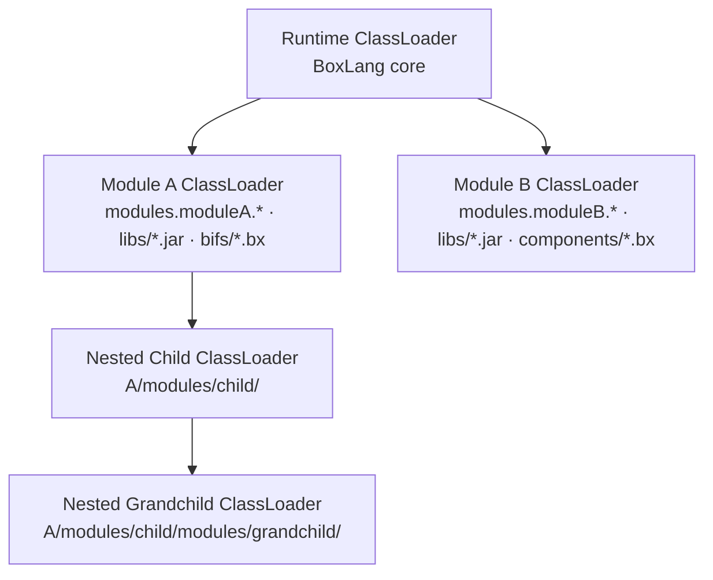

# Module Architecture

BoxLang modules operate within an isolated architecture that prevents classpath conflicts, enables independent lifecycle management, and supports automatic discovery of capabilities.

## Core Principles




**Isolation**
Each module receives its own class loader, preventing dependency conflicts between modules.





**Convention over Configuration**
Standard folder names (`bifs/`, `components/`, `libs/`, `public/`) are auto-discovered without explicit registration.







**Unified Interface**
Both BoxLang descriptors (`ModuleConfig.bx`) and Java descriptors (`IModuleConfig`) share the same lifecycle contract.





**ServiceLoader Discovery**
Java capabilities (BIFs, services, schedulers) are discovered via Java's standard ServiceLoader mechanism.




## Class Loader Isolation

The class loader hierarchy mirrors the module hierarchy. Top-level modules hang off the runtime class loader; a module nested inside another (see [Module Inception](module-inception.md)) hangs off *its parent module's* loader, chaining upward until it reaches the runtime.



Each module's class loader loads:

1. **Compiled classes** from the `modules.{moduleName}` package prefix
2. **JAR files** from the module's `libs/` directory
3. **BoxLang files** from `bifs/` and `components/` (compiled at runtime)

If a class isn't found, the loader falls back to its parent — the module that contains it for a nested module, or the runtime class loader for a top-level one.


This isolation means two modules can bundle different versions of the same library without conflict. A nested module is the deliberate exception: because its loader chains to its parent's, it can see what its parent bundles in `libs/`, while staying isolated from its siblings.



Module class loaders create a genuine isolation boundary, so they pass `null` as the standard `ClassLoader` parent and track the real parent themselves. If you inspect the chain from Java, use `DynamicClassLoader.getDynamicParent()` — the standard `getParent()` returns `null` for a module loader.


## Discovery Process

When the runtime starts, modules are discovered through a multi-step process:



### Scan Module Paths

The `ModuleService` walks configured module directories (from `boxlang.json` `modulesDirectory` setting) looking for two kinds of module:

- **Module folders** — directories containing `ModuleConfig.bx` or `box.json`
- **Module JARs** — a `*.jar` file sitting directly in the modules folder is a module in its own right, its descriptor found via ServiceLoader on its own class loader

**Default paths:**
- `./modules/`
- `{runtime-home}/modules/`
- Any paths added via `addModulePath()`

Every discovered module is then scanned for a `modules/` folder of its own, recursively and to any depth. See [Module Inception](module-inception.md).




### Build Registry

Each discovered module becomes a `ModuleRecord` in the registry. Duplicates are resolved first-come-first-served (first path scanned wins).

The module name is determined by:
1. `box.json` → `boxlang.moduleName`
2. For a JAR module, `@BoxModule( name = "..." )` if declared
3. Falls back to the directory name, or the JAR's base name

Nested modules land in the same flat registry as everything else, so they stay globally addressable. Their parent/child relationship is recorded on the records themselves: a parent exposes `nestedModules`, a child knows its `parentModule`.




### Load Descriptor

The descriptor (`ModuleConfig.bx` or Java `IModuleConfig`) is loaded to determine:
- Module metadata (version, author, dependencies)
- Configuration (settings, interceptors)
- Custom registration logic




### Discover Capabilities

Auto-discovery scans for:
- `bifs/` → BoxLang BIF files
- `components/` → BoxLang component files
- ServiceLoader entries → Java BIFs, components, services, schedulers, cache providers, JDBC drivers
- `public/` → Public web folder mapping




## Module Class Packaging

Java-compiled classes in a module must follow the package convention:

```
modules.{moduleName}.{rest-of-package}
```

For example, a module named `myModule` with a class `MyService`:

```
src/main/java/modules/myModule/MyService.java
```

This ensures the module's class loader can find and isolate the class correctly.


Classes not under the `modules.{moduleName}` package prefix are loaded from the parent class loader, which may cause version conflicts with other modules.


## Dual Descriptor Priority

A module can provide both `ModuleConfig.bx` and a Java `IModuleConfig`. When both exist:

**Java `IModuleConfig` wins** — the `ModuleConfig.bx` is ignored entirely.

This allows hybrid modules to use the most appropriate descriptor while keeping a BoxLang fallback for simpler configurations.

For details on both descriptor formats, see [Module Descriptor](module-descriptor.md).

## Next Steps

- [Module Descriptor](module-descriptor.md) — Configure `box.json` and your descriptor
- [Lifecycle](lifecycle.md) — Complete registration and activation flow
- [Mappings & Class Resolution](mappings.md) — How classes are addressed and loaded
