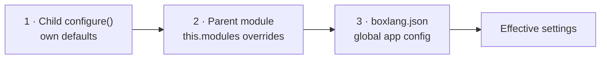

# Configuration

Module settings are defined in `configure()` and can be overridden at runtime through `boxlang.json`. Modules can also declare dependencies on other modules.

## Module Settings

Define settings in your descriptor's `configure()` method:



```js
function configure() {
    settings = {
        apiKey: "",
        timeout: 30,
        debug: false,
        endpoints: {
            primary: "https://api.example.com/v1",
            fallback: "https://api.example.com/v2"
        }
    };
}
```



```java
@Override
public void configure( IBoxContext context, ModuleRecord record ) {
    record.settings.put( Key.of( "apiKey" ), "" );
    record.settings.put( Key.of( "timeout" ), 30 );
    record.settings.put( Key.of( "debug" ), false );

    IStruct endpoints = new Struct();
    endpoints.put( Key.of( "primary" ), "https://api.example.com/v1" );
    endpoints.put( Key.of( "fallback" ), "https://api.example.com/v2" );
    record.settings.put( Key.of( "endpoints" ), endpoints );
}
```



## Runtime Overrides

Users can override module settings in `boxlang.json`:

```json
{
  "modules": {
    "myModule": {
      "enabled": true,
      "settings": {
        "apiKey": "sk-abc123",
        "debug": true
      }
    }
  }
}
```

### Merge Behavior

Runtime settings are **deep-merged** on top of `configure()` defaults:

| configure() setting | boxlang.json override | Effective value |
|---------------------|-----------------------|-----------------|
| `apiKey: ""` | `apiKey: "sk-abc123"` | `"sk-abc123"` (overridden) |
| `timeout: 30` | (not set) | `30` (default preserved) |
| `debug: false` | `debug: true` | `true` (overridden) |
| `endpoints.primary` | (not set) | `"https://api..."` (nested preserved) |

## Settings Precedence

A module nested inside another (see [Module Inception](module-inception.md)) has a third layer in the middle: its parent module. Effective settings are built in this order, each merged on top of the last:



The global app config is applied last and always wins, so a deployment can override anything a module author chose — including what a parent module decided for its own child.

A parent declares its overrides with a `modules` struct that mirrors the `boxlang.json` shape:



```js
class {

    this.version = "1.0.0"

    /**
     * Per-child overrides for the modules nested inside this one
     */
    this.modules = {
        "childModule" : {
            enabled  : true,
            settings : {
                timeout : 60
            }
        }
    }

}
```



```java
@Override
public IStruct modules() {
    IStruct childSettings = new Struct();
    childSettings.put( Key.of( "timeout" ), 60 );

    IStruct childOverrides = new Struct();
    childOverrides.put( Key.enabled, true );
    childOverrides.put( Key.settings, childSettings );

    IStruct overrides = new Struct();
    overrides.put( Key.of( "childModule" ), childOverrides );
    return overrides;
}
```




The merge is additive. Settings the parent doesn't mention keep the child's own defaults — a parent overriding `timeout` doesn't wipe out the child's other settings.


## Disabling Modules

Modules can be disabled via runtime config:

```json
{
  "modules": {
    "myModule": {
      "enabled": false
    }
  }
}
```

The module is still discovered but skipped during registration — no BIFs, components, or services are loaded.

`enabled` follows the same precedence as settings, so a parent module can switch one of its nested modules off with `this.modules`, and the global config can override that decision either way.


Disabling a module also skips every module nested inside it. A nested module's class loader chains to its parent's, so it cannot load without it.


## Accessing Settings

Access module settings from anywhere:

```js
// From ModuleConfig.bx
var timeout = settings.timeout

// From module code
var moduleService = boxRuntime.getModuleService()
var settings = moduleService.getModuleSettings( "myModule" )
var timeout = settings.timeout
```

## Dependencies

Declare module dependencies to control activation order:



```js
class {
    this.dependencies = [ "bx-plus", "bx-compat-cfml" ];
}
```



```java
@BoxModule( dependencies = { "bx-plus", "bx-compat-cfml" } )
public class MyModuleConfig implements IModuleConfig { }
```



**How dependencies work:**
- Dependencies are activated **before** the dependent module
- Resolution is recursive (a dependency's dependencies are also activated first)
- Missing dependencies cause a warning but don't prevent activation
- Use `box.json` `dependencies` for ForgeBox package dependencies


`this.dependencies` controls activation order, while `box.json` `dependencies` controls package installation. Both should list your module's dependencies.


## Inter-Module Communication

Check for and interact with other loaded modules:

```js
function onLoad() {
    var moduleService = boxRuntime.getModuleService()

    // Check if another module is loaded
    if ( moduleService.hasModule( "bx-spreadsheet" ) ) {
        var spreadsheetSettings = moduleService.getModuleSettings( "bx-spreadsheet" )
        // Read or modify (use cautiously)
    }
}
```

## Next Steps

- [Advanced Collaboration](advanced-collaboration.md) — System settings providers and class resolvers
- [Packaging & Publishing](packaging-publishing.md) — Build and distribute your module
- [Testing](testing.md) — TestBox integration and CI/CD patterns
