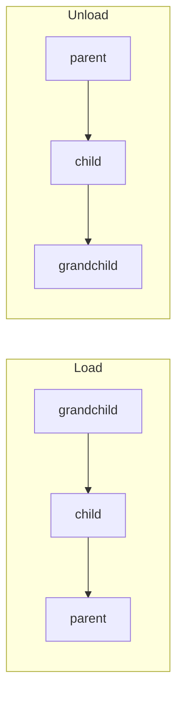
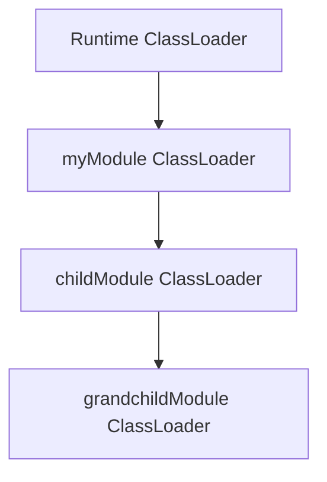
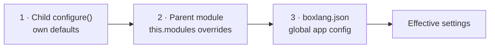

# Module Inception

A module can carry other modules inside it. Drop a `modules/` folder into your module, put modules in it, and BoxLang discovers, registers and activates them **before** your module itself — recursively, to any depth.

This lets you ship one self-contained artifact that brings everything it needs with it, rather than asking users to install a list of separate modules in the right order.

## The Convention

Any modules folder — a top-level configured `modulesDirectory` **or** a module's own nested `modules/` folder — may hold two kinds of module:




**Module folders**

Ordinary module directories with a `ModuleConfig.bx` and/or `box.json`, exactly as you'd write a top-level module. Each may carry a `modules/` folder of its own.





**Module JARs**

A `*.jar` sitting directly in the modules folder **is** a module. It gets its own record and class loader, and its `IModuleConfig` is found via ServiceLoader on that loader.




```
myModule/
├── box.json
├── ModuleConfig.bx
├── bifs/
├── libs/
│   └── some-dependency.jar        ← a plain library on myModule's classpath
└── modules/                       ← modules bundled inside this one
    ├── childModule/               ← a full module folder
    │   ├── ModuleConfig.bx
    │   └── modules/               ← which may nest further, to any depth
    │       └── grandchildModule/
    │           └── ModuleConfig.bx
    └── javaHelper.jar             ← a JAR module, not just a library
```


`libs/` and `modules/` are not the same thing. A JAR in `libs/` is a **library** added to your module's classpath. A JAR in `modules/` is a **module** with its own lifecycle, settings, and class loader.


## Load Order

Nested modules load from the inside out and unload from the outside in:



Registering or activating a parent cascades down the whole tree first, so by the time your module's `onLoad()` runs, everything it bundles is already active and usable. Unloading reverses it: children come down before the parent, because their class loaders depend on it.


Disabling a module also skips every module nested inside it. A nested module's class loader chains to its parent's, so it cannot load without it.


## Class Loader Chaining

The class loader hierarchy mirrors the module hierarchy. A nested module's loader is parented to **its parent module's** loader, chaining upward until a top-level module, whose loader is parented to the runtime.



The practical effect: a child can see the classes and `libs/` JARs its parent bundles, without redeclaring them — while staying isolated from its siblings and from unrelated modules. Put a shared dependency in the parent's `libs/` once and every module nested inside it can use it.


Module class loaders create a real isolation boundary, so they pass `null` as the standard `ClassLoader` parent and track the real one themselves. From Java, walk the chain with `DynamicClassLoader.getDynamicParent()` — the standard `getParent()` returns `null` for a module loader.


## Parent and Child Records

The relationship is recorded on both `ModuleRecord`s, so either can find the other:

| Member | On | Description |
|---|---|---|
| `nestedModules` | parent | Array of the names of modules nested directly inside this one |
| `getNestedModule( Key )` | parent | The record for one direct child, or `null` if it isn't one |
| `hasNestedModule( Key )` | parent | Whether a module is a direct child of this one |
| `parentModule` | child | The `Key` of the module this one is nested inside, or `null` if top-level |
| `isJarModule()` | either | Whether this module is packaged as a single JAR |

Nested modules live in the same flat registry as everything else, so they stay globally addressable by name and their BIFs, components and mappings work exactly as they would at the top level.

```js
// From a parent module's ModuleConfig.bx
var child = moduleRecord.getNestedModule( createObject( "java", "ortus.boxlang.runtime.scopes.Key" ).of( "childModule" ) )
log.info( "Child version: #child.version#" )
```

### Inspecting the Whole Tree

To see the hierarchy from outside any one module's own code — a script, an admin dashboard, a debug session — use the `getModuleTree()` BIF. It returns every top-level module as a struct, and every node carries a `children` struct of the modules nested inside it, recursively:

```js
tree = getModuleTree()

for ( moduleName in tree ) {
    node = tree[ moduleName ]
    writeOutput( "#moduleName# (v#node.version#)" )
    for ( childName in node.children ) {
        writeOutput( "  ↳ #childName#" )
    }
}
```

Pass a module name to get the subtree rooted at that module instead of the whole forest:

```js
subtree = getModuleTree( "myModule" )
// subtree.children holds myModule's direct nested modules, each with its own .children
```

An unregistered module name returns an empty struct rather than throwing. From Java (or a module's own `ModuleConfig.bx`), the same data is available via `ModuleService.getModuleTree()` and `ModuleService.getModuleTree( Key )`.


Nested modules never appear at the top level of `getModuleTree()`'s result — find them under their parent's `children` entry. `getModuleList()` and `getModuleInfo()`, by contrast, still address every module by name in one flat collection, nested or not; `getModuleTree()` is the one that shows the shape.


## Overriding a Child's Settings

A parent can override the settings of the modules it bundles. Declare a `modules` struct mirroring the `boxlang.json` shape:



```js
class {

    this.version = "1.0.0"

    /**
     * Per-child overrides for the modules nested inside this one
     */
    this.modules = {
        "childModule" : {
            enabled  : true,
            settings : {
                timeout  : 60,
                endpoint : "https://internal.example.com"
            }
        }
    }

}
```



```java
@Override
public IStruct modules() {
    IStruct childSettings = new Struct();
    childSettings.put( Key.of( "timeout" ), 60 );
    childSettings.put( Key.of( "endpoint" ), "https://internal.example.com" );

    IStruct childOverrides = new Struct();
    childOverrides.put( Key.enabled, true );
    childOverrides.put( Key.settings, childSettings );

    IStruct overrides = new Struct();
    overrides.put( Key.of( "childModule" ), childOverrides );
    return overrides;
}
```



These land in the middle of a three-layer precedence chain, each merged on top of the last:



The global app config is applied last and always wins, so a deployment can override anything — including a parent's decision about its own child. `enabled` follows the same order, so a parent can switch a bundled module off and the global config can switch it back on.

The merge is additive: settings the parent doesn't mention keep the child's own defaults.

## JAR Modules

A JAR module needs no surrounding folder at all. Its descriptor is a Java `IModuleConfig` registered through `META-INF/services/ortus.boxlang.runtime.modules.IModuleConfig`, and its metadata comes from the `@BoxModule` annotation:

```java
@BoxModule(
    name        = "javaHelper",
    version     = "1.0.0",
    author      = "Ortus Solutions",
    description = "A module shipped as a single JAR"
)
public class JavaHelperModule implements IModuleConfig {

    @Override
    public void configure( IBoxContext context, ModuleRecord moduleRecord ) {
        moduleRecord.settings.put( Key.of( "mode" ), "fast" );
    }

}
```

Without `name`, a JAR module is named after the JAR file itself — `javaHelper.jar` becomes `javaHelper`. Declaring `name` lets the module name stand independent of the filename, which matters when your build stamps versions into JAR names.


A JAR that exposes no `IModuleConfig` is disabled with a warning rather than failing the runtime, so a stray JAR dropped into a modules folder logs a complaint instead of breaking startup.


## Known Limitation

Shutdown ordering across *unrelated* modules is not dependency-aware — `unloadAll()` visits the registry in unspecified order. Nesting order is handled: a module's children always unload before it does.

## Next Steps

- [Architecture](architecture.md) — Class loader isolation and the discovery process
- [Lifecycle](lifecycle.md) — Registration, activation, and the events each phase fires
- [Configuration](configuration.md) — Settings, runtime overrides, and precedence
- [Packaging & Publishing](packaging-publishing.md) — Shipping a module that bundles others
