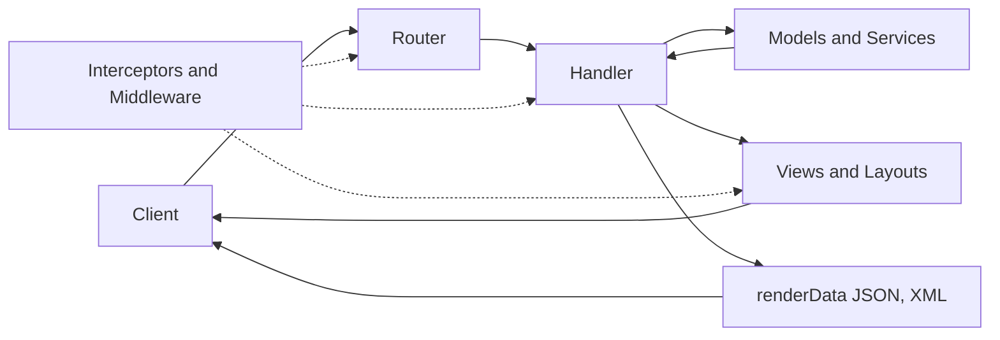
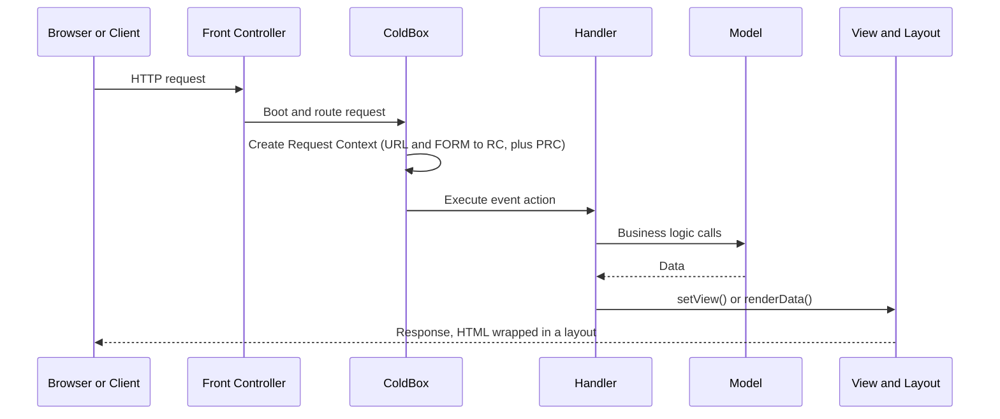
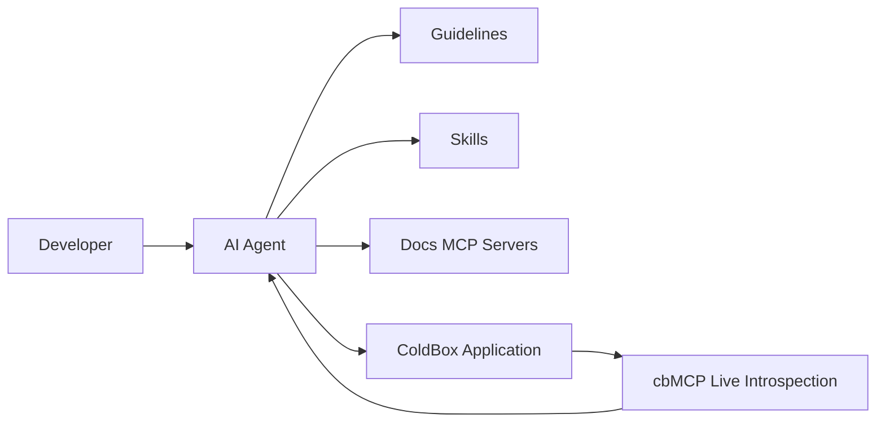

# Agentic MVC with ColdBox

**ColdBox** is the enterprise HMVC (Hierarchical Model-View-Controller) platform for BoxLang, built and supported by Ortus Solutions. Its strong conventions make it a natural fit for AI agents: when an agent adds a handler, it knows exactly where it goes, and routes, models, views, and modules follow predictable patterns.

This guide covers the modern ColdBox request lifecycle and how to set your project up so developers and AI agents can build on it together.

## 🧱 MVC in One Minute

MVC separates an application into three responsibilities:

* **Model:** business logic, data, and services
* **View:** presentation of that data
* **Controller (handler):** receives the request, calls the model, and chooses the view or response

ColdBox adds a **router** in front and **interceptors** around the lifecycle, and organizes large applications into self-contained **modules**.



## 🔁 The Request Lifecycle



For a request such as `?event=home.about`:

1. The request context is created and URL and FORM values populate the **request collection** (`rc`). A separate **private request collection** (`prc`) is for data you do not want a client to control.
2. The event is resolved to a handler and action.
3. The action runs, for example `about()` in `handlers/home.bx`.
4. The handler calls models for business logic.
5. The view set in the event renders, for example `views/home/about.bxm`.
6. The view is wrapped in the layout and returned.

### Interception Points

Interceptors let you hook the lifecycle without touching handlers. Common points include `onRequestCapture`, `preProcess`, `preEvent`, `postEvent`, `postProcess`, `preLayout`, `preRender`, `postRender`, `preViewRender`, `postViewRender`, and `onException`.

## 🚀 Create an Application

Install the ColdBox CLI and generate an application:

```bash
box install coldbox-cli
coldbox create app myApp
```

The default template is a BoxLang application. Add `--ai` to configure agent tooling at creation time, and see `coldbox create app --help` for options such as Docker, Vite, migrations, and REST-only apps.

## 🎮 Handlers, Models, and Views

A **handler** receives the event and coordinates the response:

```js
class extends="coldbox.system.EventHandler" {

    property name="userService" inject="UserService";

    function index( event, rc, prc ) {
        prc.message = "Hello From ColdBox"
        event.setView( "main/index" )
    }

    function list( event, rc, prc ) {
        event.renderData( type="json", data=userService.getAll() )
    }

}
```

A **model** holds the business logic. WireBox, the dependency injection container, creates it and injects it for you:

```js
class {

    function getAll() {
        return [
            { id: 1, name: "Ada" },
            { id: 2, name: "Grace" }
        ]
    }

}
```

Three injection styles are available: property injection with `inject`, constructor injection, and `getInstance( "UserService" )` when you need to look one up. See the [WireBox documentation](https://wirebox.ortusbooks.com).

## 🛣️ Routing

Routes live in `config/Router.bx`. The router supports resources, route-scoped middleware, and terminators such as `to()` and `toAction()`. See the [ColdBox routing documentation](https://coldbox.ortusbooks.com/the-basics/routing/routing-dsl).

## 🧩 Modules: HMVC

A ColdBox **module** is a self-contained sub-application with its own handlers, models, views, routes, interceptors, and schedulers, described by a `ModuleConfig.bx`. Modules keep large applications organized and make features reusable and shareable. A module's routes can be reached through the module router, and handlers can call each other across modules with `runRoute()`.

## 🆕 What Is New in ColdBox 8

| Release | Highlights |
| --- | --- |
| **8.0** | Native BoxLang support across WireBox, CacheBox, and LogBox, virtual-thread executors, an AI-powered error page, a revamped CLI, and new application templates |
| **8.1** | `toAi()` and `toMCP()` route terminators |
| **8.2** | `toAiGateway()`, conversation context on AI routes, route-scoped middleware, HTTP caching helpers, and Server-Sent Events |

See the [ColdBox release notes](https://coldbox.ortusbooks.com/release-history/whats-new-with-8.2.0) for the full list.

## 🤖 Agentic ColdBox

ColdBox ships an agent toolkit so AI coding assistants generate idiomatic ColdBox code instead of generic guesses.



### One Command Setup

```bash
coldbox ai install
```

The wizard lets you choose your agents (Claude, Copilot, Cursor, Codex, Gemini, and others), your language, and which guidelines, skills, and MCP servers to configure. It writes agent files such as `AGENTS.md` and `CLAUDE.md`, an `.agents/` directory, and an `.mcp.json` file into your project.

### Guidelines and Skills

* **Guidelines** teach the agent what the framework is: architecture, conventions, and APIs.
* **Skills** teach the agent how to do specific tasks with step-by-step playbooks, and are read only when the task needs them.

See [Skills & Guidelines](../getting-started/agentic-development/skills-and-guidelines.md) for installing BoxLang skills from skills.boxlang.io, and the [ColdBox agentic documentation](https://coldbox.ortusbooks.com/getting-started/agentic-development) for the ColdBox-specific toolkit.

### cbMCP: Live Introspection

**cbMCP** exposes your running ColdBox application to agents over MCP, so they can inspect routes, handlers, modules, WireBox mappings, caches, logs, and schedulers instead of guessing. It is BoxLang only and requires ColdBox 8 and `bx-ai`, and it serves its endpoint at `/cbmcp`.

```bash
coldbox ai mcp install
```


cbMCP is mostly read-only, but a few tools change state, such as clearing caches and running or pausing scheduled tasks. Restrict its CORS origins, use HTTPS in production, and keep it away from untrusted clients. See the [ColdBox MCP server](https://coldbox.ortusbooks.com/ai/coldbox-mcp-server) documentation.


### Build AI Into Your Routes

With BoxLang AI, routes can expose agents and MCP servers directly:

```js
route( "/api/assistant" ).toAi( "models.AssistantAgent" )
route( "/mcp/:mcpServer" ).toMCP()
```

`toAiGateway()` mounts a gateway for platforms such as Slack. These require BoxLang and the `bx-ai` module. See [BoxLang AI](../boxlang-ai/README.md) and the [ColdBox AI routing](https://coldbox.ortusbooks.com/the-basics/routing/routing-dsl/ai-routing) documentation.

## 💬 Prompt Recipes

```text
Read AGENTS.md and the ColdBox guidelines. Add a REST resource for [entity] with a
handler, a service model, routes, and validation. Write the integration tests first,
then implement. Run boxlang check after each edit, then run the tests.
```

```text
Use the cbMCP server to list the registered routes and the WireBox mappings for
[module], then explain how a request to [URL] reaches its handler.
```

```text
Add a module named [name] with its own routes, handler, model, and tests, following
the ColdBox module conventions in the guidelines.
```

## ✅ Test It

ColdBox tests extend `BaseModelTest` for unit tests and `BaseIntegrationTest` for full request tests. See [Agentic Testing with TestBox](testing.md).


**Try every BoxLang+ module free for 60 days.** The trial starts automatically the first time you start a BoxLang server or CLI with a BoxLang+ module installed. No sign-up and no key. Pair ColdBox with [MCP +](boxlang-plus/modules/bx-mcp/README.md) to give agents live runtime insight, and get enterprise support when you [join us](https://www.boxlang.io/plans).


## 📚 Resources

* [ColdBox documentation](https://coldbox.ortusbooks.com)
* [Agentic Development with ColdBox](https://coldbox.ortusbooks.com/getting-started/agentic-development)
* [Request Lifecycle](https://coldbox.ortusbooks.com/getting-started/request-lifecycle)
* [ColdBox CLI](https://coldbox.ortusbooks.com/getting-started/coldbox-cli)
* [Application Templates](https://coldbox.ortusbooks.com/getting-started/application-templates)
* [WireBox dependency injection](https://wirebox.ortusbooks.com)
* [ColdBox on GitHub](https://github.com/ColdBox/coldbox-platform)
