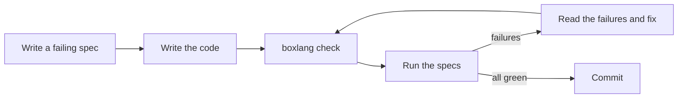

# Agentic Testing with TestBox

**TestBox** is the testing and mocking framework for BoxLang. It gives you BDD and xUnit styles, a fluent expectations library, mocking and stubbing with MockBox, multiple reporters, and a command line runner built for BoxLang.

Tests matter even more when AI agents write code. Tests are the objective check that tells you, and the agent, that the code actually works.


Want to learn testing hands-on? [BoxLings](https://github.com/ortus-boxlang/boxlings) teaches BoxLang with visible TestBox specs so you can practice BDD and TDD while learning the language.


## 🔁 The Agentic Test Loop



1. Write, or ask the agent to write, a **failing spec** that describes the behavior.
2. Implement the code.
3. Validate syntax with [`boxlang check`](../getting-started/agentic-development/validate-your-code.md).
4. Run the specs, and feed the failures back to the agent.
5. Repeat until green.

## 📦 Install

With CommandBox:

```bash
box install testbox
```

A typical project layout:

```
/myproject
├── Application.bx
├── models/
│   └── Calculator.bx
├── tests/
│   ├── Application.bx
│   └── specs/
│       └── CalculatorSpec.bx
└── box.json
```

Bundles are discovered by name. The default pattern matches files such as `*Spec*.bx`, `*Test*.bx`, `*Spec*.cfc`, and `*Test*.cfc`, and the default directory is `tests.specs`.

## 🧪 Writing Specs

### BDD

Behavior-driven specs read like documentation:

```js
class extends="testbox.system.BaseSpec" {

    function run() {

        describe( "A calculator", function() {

            beforeEach( function() {
                variables.calc = new models.Calculator()
            } )

            it( "adds two numbers", function() {
                expect( variables.calc.add( 2, 3 ) ).toBe( 5 )
            } )

            it( "rejects invalid input", function() {
                expect( function() {
                    variables.calc.add( "a", 1 )
                } ).toThrow()
            } )

        } )

    }

}
```

`describe()`, `it()`, `beforeEach()`, `afterEach()`, `aroundEach()`, nested suites, labels, and skip and focus flags are all supported. `feature()`, `story()`, `given()`, `when()`, and `then()` are aliases for a Given-When-Then style.

### xUnit

Prefer classic test methods? Name them `test*`:

```js
class extends="testbox.system.BaseSpec" {

    function testAdd() {
        $assert.isEqual( 5, new models.Calculator().add( 2, 3 ) )
    }

}
```

## ✅ Expectations

The fluent `expect()` API covers equality, types, strings, collections, exceptions, and more. TestBox 7.1 added:

* **Grouped assertions** so one spec can report several failures at once
* **Collection modes** `expectAll`, `expectAny`, `expectSome`, and `expectNone`
* **`withContext()`** to attach a message to an expectation
* New matchers such as `toBeTruthy`, `toBeFalsy`, `toBeSameInstanceAs`, `toHaveSize`, and `toThrowMatching`
* **BoxLang-only matchers** for Sets, Ranges, and data navigation with paths

See the [TestBox 7.1 release notes](https://testbox.ortusbooks.com/readme/release-history/whats-new-with-7.1.0) for details.

## 🎭 Mocking With MockBox

MockBox creates mocks and stubs so you can test a unit in isolation:

```js
// A stub standing in for a data access object
dao = createStub()
dao.$( "find" ).$args( 1 ).$results( { id: 1, name: "Ada" } )

// Mock the class under test and inject the stub
service = createMock( "models.UserService" )
service.$property( propertyName="dao", mock=dao )

expect( service.getUser( 1 ).name ).toBe( "Ada" )
expect( dao.$count( "find" ) ).toBe( 1 )
```

Useful methods include `$()` to mock a method, `$args()` to match arguments, `$results()` and `$throws()` to control returns, `$callback()` for custom logic, `$spy()` to observe a real method, and `$count()`, `$times()`, `$never()`, and `$callLog()` to verify calls.

## 🏃 Running Tests

### BoxLang CLI Runner

The BoxLang runner needs no web server:

```bash
./testbox/run --directory=tests.specs
./testbox/run --bundles=tests.specs.CalculatorSpec
```

| Option | Purpose |
| --- | --- |
| `--directory`, `--bundles` | What to run |
| `--labels`, `--excludes` | Run or skip labeled suites |
| `--filter-bundles`, `--filter-suites`, `--filter-specs` | Narrow to a specific bundle, suite, or spec |
| `--reporter` | Choose a reporter such as `console` or `json` |
| `--dry-run` | Discover tests without running them |
| `--eager-failure` | Stop at the first failure |
| `--verbose` | Detailed progress |
| `--write-report`, `--write-json-report`, `--reportpath` | Write reports to disk |

Pass bundles as `--bundles=...` rather than as a bare argument.

### CommandBox

```bash
box testbox run
box testbox run directory=tests.specs reporter=json
box testbox watch
```

`testbox watch` reruns tests as files change. If your specs use BoxLang-only features, prefer the BoxLang CLI runner, since the CommandBox runner may execute through a CFML engine.

### Reporters

TestBox includes many reporters, including `console`, `json`, `junit`, `xml`, `tap`, `text`, `min`, and `dots`. Use `junit` or `json` in CI.

### TestBox RUN

TestBox also ships a browser-based test IDE and a streaming runner that reports results as they complete. See the [TestBox documentation](https://testbox.ortusbooks.com/getting-started/running-tests/testbox-run-ide).

## 🤖 Let Agents Drive the Tests

Options that make the runner fast and easy for an agent to read:

```bash
# Discover what exists, as JSON
./testbox/run --directory=tests.specs --dry-run=json

# Stream only failures with short stack traces, showing the first 5
./testbox/run --directory=tests.specs --stream --show-failed-only --stacktrace=short --max-failures=5

# Machine-readable results
./testbox/run --directory=tests.specs --reporter=json --write-json-report=true

# Rerun one failing spec
./testbox/run --bundles=tests.specs.CalculatorSpec --filter-specs="rejects invalid input"
```

### Install the Testing Skill

```bash
npx skills add ortus-boxlang/skills/boxlang-developer/testing
```

The skill teaches your agent BDD and xUnit structure, expectations, MockBox, and lifecycle hooks. See [Skills & Guidelines](../getting-started/agentic-development/skills-and-guidelines.md).

### Tell the Agent in AGENTS.md

```markdown
## Testing

- Validate syntax first: `boxlang check --source ./src`
- Run tests: `./testbox/run --directory=tests.specs`
- Write a failing spec before implementing a feature or fixing a bug.
- Never skip or delete a failing test to make the run pass.
- Run one spec while iterating, and the full suite before finishing.
```

### Prompt Recipes

```text
Read AGENTS.md and the testing skill. Write specs for [feature] that describe the
expected behavior, including edge cases and error cases. Run them and confirm they
fail for the right reason. Then implement the code until they pass.
```

```text
This spec fails: [paste output]. Explain the cause, fix the code rather than the
test, and rerun the spec.
```

```text
Read [file] and list behaviors that have no spec. Propose specs, then write them.
```

## 🧱 Testing ColdBox Applications

ColdBox tests extend `BaseModelTest` for unit tests of models and `BaseIntegrationTest` for full request tests against handlers, routes, and views. See [Agentic MVC with ColdBox](mvc.md).

## 📊 Coverage

TestBox coverage relies on FusionReactor and is opt-in. It applies to the CFML runner, so check the [code coverage documentation](https://testbox.ortusbooks.com/digging-deeper/code-coverage) for what your setup supports.

## 🚦 Continuous Integration

Run the same commands in CI that you run locally, syntax check first:

```bash
boxlang check --source ./src
./testbox/run --directory=tests.specs --reporter=junit --write-report=true
```

Publish the JUnit output with your CI provider's test reporting.


**Try every BoxLang+ module free for 60 days.** The trial starts automatically the first time you start a BoxLang server or CLI with a BoxLang+ module installed. No sign-up and no key. Enterprise support is available when you [join us](https://www.boxlang.io/plans).


## 📚 Resources

* [TestBox documentation](https://testbox.ortusbooks.com)
* [BoxLang CLI Runner](https://testbox.ortusbooks.com/getting-started/running-tests/boxlang-cli-runner)
* [Streaming Runner](https://testbox.ortusbooks.com/getting-started/running-tests/streaming-runner)
* [TestBox CLI](https://testbox.ortusbooks.com/getting-started/testbox-cli)
* [Reporters](https://testbox.ortusbooks.com/digging-deeper/reporters)
* [MockBox](https://testbox.ortusbooks.com/mocking/mockbox/some-examples)
* [TestBox on GitHub](https://github.com/Ortus-Solutions/TestBox)
