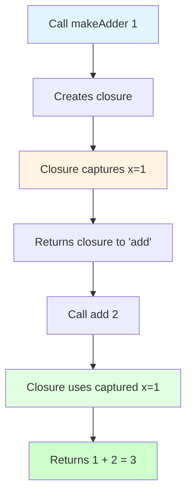
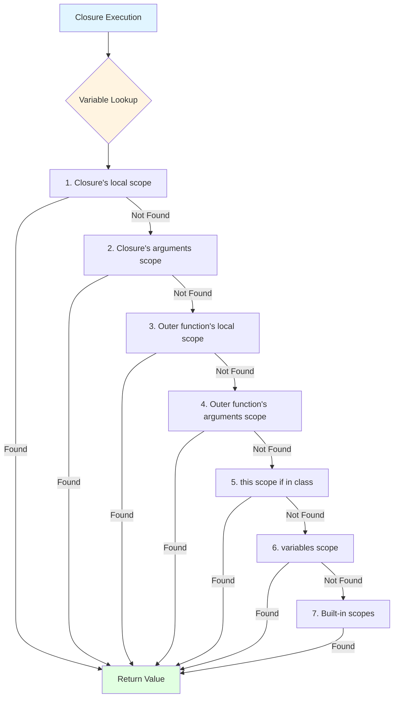

# 🎯 Closures: Context-Aware Functions

> A closure is the combination of a function and the lexical environment within which that function was declared.

Closures are one of BoxLang's most powerful features for functional programming. They are anonymous functions that **capture and retain access to variables from their surrounding scope** - even after the outer function has finished executing.

## 🎭 What Makes Closures Special?

**Functions (UDFs)**, **closures**, and **lambdas** are all objects in BoxLang, but there are crucial differences:

✅ **Closures (`=>`)** - Have access to the lexical environment where they were declared (capture surrounding scope)

✅ **Lambdas (`->`)** - Are deterministic and only access their own arguments and local variables (no surrounding scope)

✅ **Functions** - Are static and only access their own arguments and local variables

✅ **All Three** - Can be passed around, stored in variables, returned from functions, and manipulated at runtime


**Important**: Closures (`=>`) and Lambdas (`->`) are **NOT the same** in BoxLang! Closures capture surrounding scope, while lambdas are deterministic and only use arguments and function-local variables. See [Lambdas](syntax/lambdas.md) for more details.


### Closure vs Lambda Example

```js
multiplier = 10

// ✅ Closure (=>) - captures 'multiplier' from outer scope
closureFn = ( n ) => n * multiplier
println( closureFn( 5 ) )  // 50 (uses multiplier from outer scope)

// ❌ Lambda (->) - does NOT capture 'multiplier', only uses arguments
lambdaFn = ( n ) -> n * multiplier  // Error! multiplier not in scope
lambdaFn = ( n ) -> n * 2           // ✅ Works - only uses argument 'n'
println( lambdaFn( 5 ) )            // 10 (deterministic, no scope capture)
```

### Key Capabilities

Closures can be:

🔹 **Defined inline** without a name (anonymous functions)

🔹 **Assigned** to variables, array items, structs, or any variable scope

🔹 **Returned** directly from functions (higher-order functions)

🔹 **Passed** as arguments to other functions (callbacks, iterators)

🔹 **Nested** within other closures (creating closure chains)

## 📝 Closure Syntax

BoxLang provides **two equivalent syntaxes** for creating closures. Both use the **fat arrow (`=>`)** and capture surrounding scope - choose whichever you prefer!


**Closure Arrow**: Closures use the **fat arrow** `=>` which captures surrounding scope. This is different from the **skinny arrow** `->` used for [Lambdas](syntax/lambdas.md), which are deterministic and don't capture scope.


### Full Syntax (Traditional)

Use the `function` keyword with explicit body:

```js
// Full syntax with function keyword
myClosureVar = function( arg1, arg2 ) {
    return arg1 + arg2;
};

// With no arguments
greet = function() {
    return "Hello!";
};

// With typed arguments
calculate = function( numeric x, numeric y ) {
    return x * y;
};
```

### Fat Arrow Syntax (Shortcut)

Use the fat arrow operator `=>` for more concise syntax:

```js
// Arrow syntax - equivalent to above
myClosureVar = ( arg1, arg2 ) => arg1 + arg2

// With no arguments
greet = () => "Hello!"

// With typed arguments
calculate = ( numeric x, numeric y ) => x * y

// One argment you can skip the parentheses
increment = n => n + 1

// Multi-line arrow syntax (requires braces and explicit return)
complex = ( x, y ) => {
    result = x * y
    return result + 10
}
```


**No Difference**: Both syntaxes create identical closures with the same capabilities and performance. Arrow syntax is more concise for simple operations, while full syntax is clearer for complex logic.


### Syntax Comparison

```mermaid
graph LR
    A[Closure Syntax] --> B[Full: function]
    A --> C[Fat Arrow: =>]

    B --> D[function args { body }]
    C --> E[args => expression]
    C --> F[args => { body }]

    G[NOT Closures] --> H[Skinny Arrow: ->]
    H --> I[No scope capture]

    style A fill:#e1f5ff
    style B fill:#fff4e1
    style C fill:#e1ffe1
    style G fill:#ffcccc
    style H fill:#ffcccc
```

| Feature | Full Syntax | Fat Arrow Syntax |
|---------|-------------|------------------|
| Keyword | `function( args ) { }` | `( args ) => { }` |
| Scope Capture | ✅ Yes (surrounding scope) | ✅ Yes (surrounding scope) |
| Single Expression | Requires `return` | Implicit return |
| Multi-line | `{ statements; return; }` | `{ statements; return; }` |
| Readability | More verbose, explicit | More concise |
| Use Case | Complex logic, clarity | Simple transforms, callbacks |

**Note**: Both closure syntaxes use `=>` (fat arrow) and capture scope. For deterministic functions without scope capture, use [Lambdas](syntax/lambdas.md) with `->` (skinny arrow).

```js
// ✅ Both work identically
fullSyntax = function( n ) { return n * 2; }
arrowSyntax = n => n * 2

println( fullSyntax( 5 ) )  // 10
println( arrowSyntax( 5 ) )  // 10
```

---

## 🔄 Assigned Closures

```js
function hello() {
    name = "Luis"

    // Closure captures 'name' from outer scope
    display = function() {
        println( "Hello, #name#!" )
    };

    display()  // Outputs: Hello, Luis!
}

hello()
```

```js
// Arrow syntax equivalent - same behavior
function hello() {
    name = "Luis"

    // Arrow closure also captures 'name'
    display = () => println( "Hello, #name#!" )

    display()  // Outputs: Hello, Luis!
}

hello()
```

The `display` closure has **full access to its surrounding scope**, including the `name` variable. It can:

✅ Read variables from outer scope

✅ Modify variables from outer scope

✅ Call other functions from outer scope

✅ Access class properties (if defined in a class)

### Scope Capture Example

```js
function counter() {
    count = 0

    return {
        "increment": function() { count++ },
        "decrement": function() { count-- },
        "getValue": function() { return count }
    };
}

myCounter = counter()
myCounter.increment()
myCounter.increment()
println( myCounter.getValue() )  // 2
myCounter.decrement()
println( myCounter.getValue() )  // 1
```

All three closures share access to the same `count` variable captured from the outer scope!

## 🎪 Returned Closures (Higher-Order Functions)

Closures become truly powerful when returned from functions. The returned closure retains access to the outer function's variables even after the outer function completes.

### Full Syntax

```js
function makeAdder( required x ) {
    return function( required y ) {
        return x + y
    }
}

add = makeAdder( 1 )
println( add( 2 ) )     // 3
println( add( 10 ) )    // 11
```

### Arrow Syntax

```js
// Equivalent with arrow syntax
makeAdder = ( required x ) => {
    return ( required y ) => x + y
};

// Or even more concise
makeAdder = x  => y  => x + y

add = makeAdder( 1 )
println( add( 2 ) )    // 3
println( add( 10 ) )  // 11
```

### How It Works



The `makeAdder` function creates a closure that **remembers** the value of `x` from when it was created. This is called **closure over variables**.

### Practical Example: Custom Validators

```js
function createValidator( minLength ) {
    return function( value ) {
        return value.len() >= minLength
    }
}

// Create specific validators
validatePassword = createValidator( 8 )
validateUsername = createValidator( 3 )

println( validatePassword( "secret" ) )    // false (6 chars)
println( validatePassword( "secretpass" ) )  // true (10 chars)
println( validateUsername( "Al" ) )         // false (2 chars)
println( validateUsername( "Alice" ) )     // true (5 chars)
```

**Powerful Pattern**: Each validator closure "remembers" its own `minLength` value!

## 🎁 Passed Closures (Callbacks)

Closures are perfect for functional programming patterns. BoxLang provides many built-in methods that accept closures: `map()`, `filter()`, `reduce()`, `each()`, `sort()`, and more.

### Full Syntax Example

```js
fruitArray = [
    { fruit: "apple", rating: 4 },
    { fruit: "banana", rating: 1 },
    { fruit: "orange", rating: 5 },
    { fruit: "mango", rating: 2 },
    { fruit: "kiwi", rating: 3 }
]

// Filter with full syntax
favoriteFruits = fruitArray.filter( function( item ) {
     return item.rating >= 3
} );

println( favoriteFruits );
// [{ fruit: "apple", rating: 4 }, { fruit: "orange", rating: 5 }, { fruit: "kiwi", rating: 3 }]
```

### Arrow Syntax Example

```js
// Identical using arrow syntax - more concise!
favoriteFruits = fruitArray.filter( item  => item.rating >= 3 )

// Even more examples with arrow syntax
fruitNames = fruitArray.map( item => item.fruit )
// ["apple", "banana", "orange", "mango", "kiwi"]

topRated = fruitArray.filter( item => item.rating === 5 )
// [{ fruit: "orange", rating: 5 }]

totalRating = fruitArray.reduce( ( sum, item ) => sum + item.rating, 0 )
// 15
```

### Comparison: Both Syntaxes

```js
// Full syntax
numbers = [ 1, 2, 3, 4, 5 ]
doubled = numbers.map( function( n ) { return n * 2; } )

// Arrow syntax - identical behavior
doubled = numbers.map( n  => n * 2 )

// Both produce: [2, 4, 6, 8, 10]
```

### Custom Functional Methods

```js
// Create your own higher-order functions
function retry( fn, maxAttempts ) {
    attempts = 0

    while ( attempts < maxAttempts ) {
        try {
            return fn()  // Execute the closure
        } catch ( any e ) {
            attempts++
            if ( attempts >= maxAttempts ) throw( e )
        }
    }
}

// Use with closure
result = retry(
    () => makeAPICall(),
    maxAttempts: 3
)
```


**Pro Tip**: Fat arrow syntax (`=>`) shines in functional programming patterns - it reduces visual noise and makes data transformations more readable. Use lambdas (`->`) when you need deterministic functions without scope capture.


## ⏰ Delayed Execution

Closures are **blueprints** - they're not executed until you explicitly invoke them. This makes them perfect for:

🔹 **Observers** - React to events when they happen

🔹 **Filters** - Apply transformations later

🔹 **Iterators** - Process collections on demand

🔹 **Lazy evaluation** - Compute values only when needed

🔹 **Event handlers** - Execute code in response to events

### Test Framework Example

```js
// BDD-style testing - closures executed later
describe( "A Calculator", () =>{

    it( "should add numbers correctly", () =>{
        result = add( 2, 3 )
        expect( result ).toBe( 5 )
    } )

    it( "should handle negative numbers", () =>{
        result = add( -1, 1 )
        expect( result ).toBe( 0 )
    } )

} )
```

### Event Handler Pattern

```js
// Register event handlers (delayed execution)
eventBus = {
    handlers: {},

    on: function( eventName, handler ) {
        if ( !this.handlers.keyExists( eventName ) ) {
            this.handlers[ eventName ] = []
        }
        this.handlers[ eventName ].append( handler )
    },

    emit: ( eventName, data ) => {
        if ( this.handlers.keyExists( eventName ) ) {
            this.handlers[ eventName ].each( handler => handler( data ) )
        }
    }
};

// Register handlers (closures stored, not executed)
eventBus.on( "userLogin", user => println( "Welcome, #user.name#!" ) )
eventBus.on( "userLogin", user => logActivity( user ) )

// Later, emit event (closures execute now)
eventBus.emit( "userLogin", { name: "Alice", id: 123 } );
```

### Lazy Computation

```js
// Expensive operation wrapped in closure
function createLazyValue( computeFn ) {
    cached = null
    computed = false

    return function() {
        if ( !computed ) {
            cached = computeFn()  // Execute closure only once
            computed = true
        }
        return cached
    };
}

// Create lazy value (not computed yet)
getExpensiveData = createLazyValue( () => {
    println( "Computing expensive data..." )
    sleep( 1000 )
    return complexCalculation()
} );

// First call: computes and caches
data = getExpensiveData()  // Prints "Computing expensive data..."

// Subsequent calls: returns cached value
data = getExpensiveData()  // No print, returns cached
```

## 🔍 Closure Scopes & Variable Access

Closures **capture and retain access to variables** from their surrounding lexical environment. This is what makes them "closures" - they "close over" the variables in their scope.

### Scope Access Diagram



### Available Scopes by Context

| Definition Context | Accessible Scopes |
|-------------------|-------------------|
| **In a class method** | `arguments`, `local`, enclosing function's `local` and `arguments`, `this`, `variables`, `super` |
| **In a standalone function** | `arguments`, `local`, enclosing function's `local` and `arguments`, `variables` |
| **As a function argument** | `arguments`, `local`, `variables`, `this` (if in class), `super` (if in class) |
| **In a script file** | `arguments`, `local`, `variables`, all built-in scopes |

### Scope Resolution Order

When a closure references an unscoped variable, BoxLang searches in this order:

1. ✅ **Closure's `local` scope** - Variables defined inside the closure
2. ✅ **Closure's `arguments` scope** - Parameters passed to the closure
3. ✅ **Outer function's `local` scope** - Variables in the enclosing function
4. ✅ **Outer function's `arguments` scope** - Enclosing function's parameters
5. ✅ **`this` scope** - If defined inside a class/component
6. ✅ **`variables` scope** - Top-level variables
7. ✅ **Built-in scopes** - `server`, `application`, `session`, `request`, `cgi`, `url`, `form`, etc.

### Scope Capture Examples

#### Capturing Local Variables

```js
function createGreeter( salutation ) {
    // 'salutation' is in outer function's arguments scope
    prefix = "Hello";

    return function( name ) {
        // Closure captures both 'salutation' and 'prefix'
        return "#salutation# #prefix#, #name#!";
    };
}

formalGreet = createGreeter( "Good morning" );
casualGreet = createGreeter( "Hey" );

println( formalGreet( "Dr. Smith" ) );  // "Good morning Hello, Dr. Smith!"
println( casualGreet( "buddy" ) );       // "Hey Hello, buddy!"
```

#### Capturing Class Scope

```js
class UserManager {
    property name="adminEmail" default="admin@example.com";

    function createNotifier() {
        // Closure captures 'this' scope
        return function( message ) {
            println( "Sending to #this.adminEmail#: #message#" )
        }
    }
}

manager = new UserManager()
notify = manager.createNotifier()
notify( "System alert!" )  // "Sending to admin@example.com: System alert!"
```

#### Multiple Nested Closures

```js
function outer( a ) {
    b = 10

    return function middle( c ) {
        d = 20

        return function inner( e ) {
            // Inner closure has access to ALL outer scopes
            return a + b + c + d + e
        }
    }
}

result = outer( 1 )( 2 )( 3 )
println( result )  // 36 (1 + 10 + 2 + 20 + 3)
```


**Scope Capture Note**: Closures capture **references** to variables, not copies. If the outer variable changes, the closure sees the updated value.


### Variable Scope Demonstration

```js
function scopeDemo() {
    outerVar = "outer"

    closure = function() {
        closureVar = "closure"

        println( "outerVar: #outerVar#" )     // Accessible: outer scope
        println( "closureVar: #closureVar#" )  // Accessible: local scope
    }

    closure()

    // outerVar is accessible here
    println( "outerVar: #outerVar#" )  // "outer"

    // closureVar is NOT accessible here (local to closure)
    // println( closureVar );  // Would throw error
}

scopeDemo()
```

## 🔧 isClosure() BIF

BoxLang provides the `isClosure()` built-in function to check if a variable is a closure:

```js
// Check if variable is a closure
if ( isClosure( arguments.callback ) ) {
    arguments.callback()
} else {
    throw( "Expected a closure callback" )
}
```

### Practical Usage

```js
function executeIfClosure( fn ) {
    if ( isClosure( fn ) ) {
        println( "Executing closure..." )
        return fn()
    } else {
        println( "Not a closure: #getMetadata( fn ).type#" )
        return null
    }
}

// Test with closure
myClosure = () => "Hello from closure"
result = executeIfClosure( myClosure )  // "Executing closure..."

// Test with regular function
function myFunction() { return "Hello from function" }
result = executeIfClosure( myFunction )  // "Not a closure: function"
```

## ⚡ Fat Arrow Syntax (Closure Shorthand)

The fat arrow (`=>`) provides a concise syntax for creating closures. It works **identically** to full-syntax closures with one exception: **single-expression arrows have implicit return**.


**Critical Distinction**: The **fat arrow** `=>` creates **closures** that capture surrounding scope. Do NOT confuse this with the **skinny arrow** `->` which creates **lambdas** - deterministic functions that only access arguments and local variables. See [Lambdas](syntax/lambdas.md) for details on `->` syntax.


### Single Expression (Implicit Return)

```js
// Full syntax: explicit return required
makeSix = function() { return 5 + 1; }

// Arrow syntax: implicit return
makeSix = () => 5 + 1

println( makeSix() );  // 6
```

### Multiple Arguments

```js
// Full syntax
add = function( numeric x, numeric y ) { return x + y; }

// Arrow syntax - identical behavior
add = ( numeric x, numeric y ) => x + y

println( add( 1, 3 ) ) // 4
```

### Multi-line Body (Explicit Return)

```js
// Full syntax
isOdd = function( numeric n ) {
    if ( n % 2 == 0 ) {
        return "even"
    } else {
        return "odd"
    }
};

// Arrow syntax - requires braces and explicit return
isOdd = ( numeric n ) => {
    if ( n % 2 == 0 ) {
        return "even"
    } else {
        return "odd"
    }
};

println( isOdd( 1 ) )   // "odd"
println( isOdd( 10 ) )  // "even"
```

### Syntax Rules

| Form | Syntax (Closure `=>`) | Return Behavior |
|------|----------------------|----------------|
| **Single expression** | `( args ) => expression` | Implicit return |
| **Multi-line** | `( args ) => { statements }` | Explicit `return` required |
| **No arguments** | `() => expression` | Parentheses required |
| **Single argument** | `arg => expression` | Parentheses optional |
| **Multiple arguments** | `( arg1, arg2 ) => expression` | Parentheses required |


**Reminder**: All these examples use the **fat arrow** `=>` for closures. For lambdas with **skinny arrow** `->`, see [Lambdas](syntax/lambdas.md).


### Comparison Table

```js
// ✅ All these are equivalent:

// 1. Full syntax with explicit return
double = function( n ) { return n * 2; }

// 2. Arrow with implicit return
double = ( n ) => n * 2

// 3. Arrow without parameter parens (single arg)
double = n => n * 2

// All produce the same result
println( double( 5 ) )  // 10
```

### When to Use Arrow Syntax

✅ **Use Arrow Syntax For:**

- Simple transformations and calculations
- Array/collection operations (`map`, `filter`, `reduce`)
- Short callbacks
- Functional programming patterns

✅ **Use Full Syntax For:**

- Complex multi-line logic
- When explicit `function` keyword improves readability
- When you need to emphasize it's a function
- Team preference for consistency

### Real-World Examples

```js
// Array transformations - arrow syntax shines
numbers = [ 1, 2, 3, 4, 5 ]

// Concise and readable
squared = numbers.map( n => n * n )
evens = numbers.filter( n => n % 2 == 0 )
sum = numbers.reduce( ( acc, n ) => acc + n, 0 )

// Multi-line when needed
processed = numbers.map( n => {
    doubled = n * 2
    squared = doubled * doubled
    return squared
} )
```

---

## 💡 Best Practices

### 1. Choose Syntax Consistently

```js
// ✅ Good: Consistent style within a context
users
    .filter( u => u.active )
    .map( u => u.name )
    .sort( ( a, b ) => a.localeCompare( b ) )

// ❌ Avoid: Mixing styles unnecessarily
users
    .filter( function( u ) { return u.active } )
    .map( u => u.name )
    .sort( function( a, b ) { return a.localeCompare( b ) } )
```

### 2. Use Descriptive Names

```js
// ✅ Good: Clear purpose
validateEmail = ( email ) => email.reFind( "@" ) > 0
isAdult = ( age ) => age >= 18

// ❌ Avoid: Cryptic names
v = ( e ) => e.reFind( "@" ) > 0
x = ( a ) => a >= 18
```

### 3. Keep Closures Focused

```js
// ✅ Good: Single responsibility
getActiveUsers = users.filter( u => u.active )
getUserNames = activeUsers.map( u => u.name )

// ❌ Avoid: Too much in one closure
result = users.filter( u => {
    if ( !u.active ) return false
    u.name = u.name.toUpperCase()
    u.processed = true
    return true
} )
```

### 4. Document Complex Closures

```js
// ✅ Good: Comment complex logic
validatePassword = ( pwd ) => {
    // Must be 8+ chars with uppercase, lowercase, and number
    return pwd.len() >= 8
        && pwd.reFind( "[A-Z]" )
        && pwd.reFind( "[a-z]" )
        && pwd.reFind( "[0-9]" )
}
```

### 5. Leverage Scope Capture Wisely

```js
// ✅ Good: Clear scope capture
function createMultiplier( factor ) {
    return ( n ) => n * factor  // Captures 'factor'
}

multiplyBy10 = createMultiplier( 10 )
result = multiplyBy10( 5 )  // 50

// ⚠️ Careful: Closures capture references
functions = []
for ( i = 0; i < 3; i++ ) {
    functions.append( () => println( i ) )  // All capture same 'i'
}
functions.each( fn => fn() )  // Prints: 3, 3, 3

// ✅ Fix: Capture value explicitly
for ( i = 0; i < 3; i++ ) {
    functions.append( ( ( val ) => () => println( val ) )( i ) )
}
functions.each( fn => fn() )  // Prints: 0, 1, 2
```

---

## 📋 Summary

**Closures** are powerful tools for functional programming in BoxLang:

✅ **Two Syntaxes** - `function() {}` and `() => {}` (fat arrow) are equivalent

✅ **Scope Capture** - Access variables from surrounding scope

✅ **First-Class** - Pass around, return, and store like any value

✅ **Delayed Execution** - Define now, execute later

✅ **Functional Patterns** - Perfect for `map`, `filter`, `reduce`, callbacks

✅ **Flexible** - Use whichever syntax fits your style
⚠️ **Not Lambdas** - Closures (`=>`) capture scope; for deterministic functions use [Lambdas](syntax/lambdas.md) (`->`)


**Pro Tip**: Master closures to unlock BoxLang's functional programming capabilities. They're essential for modern, expressive code! Use closures (`=>`) when you need scope access, and [Lambdas](syntax/lambdas.md) (`->`) for pure, deterministic functions.


---

## 🔗 Related Documentation

- [Lambdas](syntax/lambdas.md) - Deterministic functions with `->` (skinny arrow)
- [Functions](../reference/functions.md) - User-defined functions
- [Variable Scopes](../variable-scopes.md) - Understanding BoxLang scopes
- [Arrays](../arrays.md) - Array methods that use closures
- [Structures](../structures.md) - Struct methods with closures
- [Operators](../operators.md) - Functional operators
