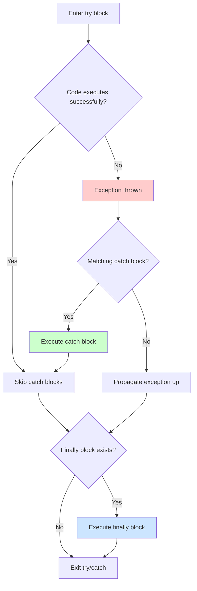

# 🛡️ Exception Management

> BoxLang provides powerful exception handling with try/catch/finally constructs, multi-catch support, Java exception interop, and a rich exception type hierarchy.

Exception management in BoxLang allows you to gracefully handle errors, recover from failures, and maintain application stability. BoxLang supports traditional structured exception handling, multi-type catching, nested catches, and seamless interoperability with Java exceptions.

## 🎯 Try/Catch/Finally Basics

The BoxLang exception handling system consists of three core constructs:

| Construct | Purpose | Required |
|-----------|---------|----------|
| **`try`** | Wraps code that might throw exceptions | ✅ Yes |
| **`catch`** | Handles specific exception types when they occur | ⚠️ At least one |
| **`finally`** | Executes cleanup code regardless of success/failure | ❌ Optional |

### Basic Try/Catch Structure

```js
try {
    // Code that might throw an exception
    result = riskyOperation()
} catch ( any e ) {
    // Handle any type of exception
    logError( e )
    result = defaultValue
} finally {
    // Always executes - perfect for cleanup
    closeConnections()
}
```

### Exception Flow Diagram



### Execution Guarantee

The `finally` block is **guaranteed to execute** regardless of:

- ✅ Whether an exception occurs
- ✅ Whether a catch block handles the exception
- ✅ Whether a `return` statement is encountered
- ✅ Whether another exception is thrown in the catch block

```js
function processFile( filePath ) {
    fileHandle = fileOpen( filePath )

    try {
        // Process file - might fail
        data = fileRead( fileHandle )
        return processData( data )
    } catch ( any e ) {
        // Handle errors
        logError( "Failed to process file", e )
        return null
    } finally {
        // ALWAYS closes the file, even if return was called above
        fileClose( fileHandle )
    }
}
```

## 🎭 Catch Block Syntax

BoxLang offers **flexible syntax** for catch blocks, allowing both quoted and unquoted type names:

### Syntax Variations

```js
// Option 1: Quoted type (traditional)
catch ( "DatabaseException" e ) { }

// Option 2: Unquoted type (modern)
catch ( DatabaseException e ) { }

// Option 3: Any type
catch ( any e ) { }

// Option 4: Multiple types (multi-catch)
catch ( DatabaseException | IOException e ) { }
```


**Flexible Naming**: The exception variable name (`e` in the examples above) can be **any valid identifier**. Common conventions include `e`, `ex`, `exception`, or descriptive names like `dbError`, `ioEx`, etc.


### Catch Block Order

Catch blocks are evaluated **top to bottom**, and the **first matching type** is executed. Order from **most specific to most general**:

```js
try {
    riskyDatabaseOperation()
} catch ( KeyNotFoundException e ) {
    // Most specific - missing key
    println( "Key not found: #e.message#" )
} catch ( DatabaseException e ) {
    // More general - any database error
    println( "Database error: #e.message#" )
} catch ( any e ) {
    // Most general - catches everything else
    println( "Unknown error: #e.message#" )
}
```


**Order Matters**: If you put `catch( any e )` first, all subsequent catch blocks become unreachable because `any` matches all exceptions!


## 🔀 Multi-Catch Statements

BoxLang supports **multi-catch** syntax using the pipe (`|`) operator, allowing a single catch block to handle multiple exception types:

### Multi-Catch Syntax

```js
try {
    performOperation()
} catch ( IOException | NetworkException | TimeoutException e ) {
    // Single handler for multiple exception types
    logError( "Communication error occurred", e )
    retryOperation()
}
```

### Grammar Definition

From the BoxLang grammar (`BoxGrammar.g4`):

```antlr
catches
    : CATCH LPAREN ct += expression? (PIPE ct += expression)* ex = expression RPAREN normalStatementBlock
```

This allows:
- Zero or more exception types before the variable name: `ct += expression?`
- Multiple types separated by pipes: `(PIPE ct += expression)*`
- The exception variable name at the end: `ex = expression`

### Multi-Catch Examples

```js
// Handle related exceptions together
try {
    data = fetchFromAPI( url )
    processData( data )
} catch ( NetworkException | TimeoutException | ConnectionException e ) {
    // All network-related errors
    println( "Network error: #e.message#" )
    useCache()
}

// Handle multiple specific types
try {
    result = complexCalculation()
} catch ( DivideByZeroException | OverflowException | UnderflowException e ) {
    // All arithmetic errors
    println( "Math error: #e.message#" )
    return 0
}

// Mix multi-catch with single catch
try {
    processFile( filePath )
} catch ( FileNotFoundException | MissingIncludeException e ) {
    // File not found errors
    println( "File missing: #e.message#" )
} catch ( IOException e ) {
    // Other IO errors
    println( "IO error: #e.message#" )
} catch ( any e ) {
    // Everything else
    println( "Unknown error: #e.message#" )
}
```

### Multi-Catch Benefits

✅ **Reduces Code Duplication** - Handle similar exceptions with the same logic

✅ **Improves Readability** - Groups related exception handling together

✅ **Maintains Specificity** - Still allows granular error handling when needed

## 📦 Exception Types

BoxLang has a rich exception type hierarchy supporting native exceptions, custom exceptions, and Java exceptions.

### Exception Type Categories

| Category | Description | Example Types |
|----------|-------------|---------------|
| **Native** | Built into BoxLang runtime | `DatabaseException`, `KeyNotFoundException` |
| **Custom** | User-defined exception types | `InvalidOrderException`, `PaymentFailedException` |
| **Java** | Java exceptions from interop | `java.io.IOException`, `java.sql.SQLException` |

### Native BoxLang Exceptions

BoxLang provides comprehensive built-in exception types:

<details>
<summary><strong>Application & Runtime Exceptions</strong></summary>

- **`BoxRuntimeException`** - Base exception for BoxLang runtime errors
- **`ExpressionException`** - Expression or evaluation errors
- **`CustomException`** - Base for user-defined exceptions
- **`AbortException`** - Application abort/stop requests
- **`UnmodifiableException`** - Modification of immutable objects
- **`BoxValidationException`** - Validation failures

</details>

<details>
<summary><strong>Data & Type Exceptions</strong></summary>

- **`KeyNotFoundException`** - Missing struct key
- **`NoElementException`** - Variable does not exist
- **`BoxCastException`** - Type casting failure
- **`ScopeNotFoundException`** - Scope not available in runtime

</details>

<details>
<summary><strong>Database Exceptions</strong></summary>

- **`DatabaseException`** - Base for all database errors
  - Connection failures
  - Query execution errors
  - Transaction errors

</details>

<details>
<summary><strong>I/O Exceptions</strong></summary>

- **`BoxIOException`** - I/O operation failures
- **`MissingIncludeException`** - Template file not found

</details>

<details>
<summary><strong>Java Interop Exceptions</strong></summary>

- **`ClassNotFoundBoxLangException`** - Java class not found
- **`NoMethodException`** - Method doesn't exist or match arguments
- **`NoFieldException`** - Field doesn't exist on Java class
- **`NoConstructorException`** - Constructor doesn't match arguments
- **`AbstractClassException`** - Cannot instantiate abstract class

</details>

<details>
<summary><strong>Parsing & Configuration Exceptions</strong></summary>

- **`ParseException`** - Source file parsing errors
- **`ConfigurationException`** - Runtime/module configuration errors

</details>

<details>
<summary><strong>Concurrency Exceptions</strong></summary>

- **`LockException`** - Lock acquisition or timeout failures

</details>


**Complete Reference**: See the [Exception Types Reference](reference/Exceptions.md) for detailed documentation on all native exceptions, including when they're thrown and how to handle them.


### Custom Exception Types

Define your own exception types for application-specific errors:

```js
// Throw a custom exception
throw(
    type = "InvalidOrderException",
    message = "Order total cannot be negative",
    detail = "Order #orderId# has total: #orderTotal#",
    errorCode = "ORD-001"
)

// Catch the custom exception
try {
    processOrder( order )
} catch ( InvalidOrderException e ) {
    // Handle invalid orders specifically
    println( "Invalid order: #e.message#" )
    println( "Error code: #e.errorCode#" )
    sendToManualReview( order )
}
```

### Custom Exception Naming Conventions

| Convention | Example | Use Case |
|------------|---------|----------|
| **Descriptive** | `InvalidEmailException` | Clear, self-documenting |
| **Domain-specific** | `PaymentDeclinedException` | Business logic errors |
| **Technical** | `CircularDependencyException` | System/framework errors |
| **Module-prefixed** | `MyModule.ValidationException` | Avoid name conflicts |

## 🚀 Throwing Exceptions

Use the `throw()` function to raise exceptions in your code. BoxLang provides flexible exception throwing with multiple syntax options.

### Throw Syntax Options

```js
// Script syntax
throw( "Error message" )
throw( message="Error message", type="ValidationError" )

// Template syntax
<bx:throw message="Error message" detail="More details" />

// Throw Java exception object directly
throw( javaExceptionObject )

// Throw with expression
throw new java:java.lang.IllegalArgumentException( "Invalid argument" )
```

### Throw Parameters

| Parameter | Type | Required | Description |
|-----------|------|----------|-------------|
| **`message`** | any | ⚠️ * | Main error message (can also be exception object) |
| **`type`** | string | ❌ | Exception type (default: `"Custom"`) |
| **`detail`** | string | ❌ | Detailed description of the error |
| **`errorCode`** | string | ❌ | Custom error code for tracking |
| **`extendedInfo`** | any | ❌ | Additional data (struct, array, string, etc.) |
| **`object`** | Throwable | ❌ | Java exception object to throw or wrap |


**Flexible Message**: The `message` parameter can accept a string OR a Java exception object. If an exception object is provided, it's automatically moved to the `object` parameter.


### Basic Throw Examples

```js
// Simple message
throw( "Something went wrong!" )

// With type
throw(
    message = "Invalid email address",
    type = "ValidationError"
)

// Complete exception
throw(
    message = "Payment processing failed",
    type = "PaymentException",
    detail = "Credit card was declined",
    errorCode = "PAY-403",
    extendedInfo = {
        cardType: "Visa",
        lastFour: "1234",
        responseCode: "declined"
    }
)
```

### Throw with Extended Info

The `extendedInfo` parameter can hold **any data type**, making it perfect for passing context:

```js
try {
    validateOrder( order )
} catch ( ValidationError e ) {
    // extendedInfo contains the full order data
    println( "Order validation failed:" )
    println( "Customer: #e.extendedInfo.customer#" )
    println( "Items: #e.extendedInfo.items.len()#" )
}

function validateOrder( order ) {
    if ( order.total < 0 ) {
        throw(
            message = "Order total cannot be negative",
            type = "ValidationError",
            errorCode = "VAL-001",
            extendedInfo = order  // Pass entire order struct
        )
    }
}
```

### Throwing Objects

You can throw **Java exception objects** directly or **wrap them** in BoxLang exceptions:

```js
// Throw Java exception directly
javaException = new java:java.lang.IllegalArgumentException( "Bad arg" )
throw( javaException )

// Wrap Java exception with custom message
try {
    javaMethod()
} catch ( any e ) {
    throw(
        message = "Failed to call Java method",
        type = "InteropException",
        object = e  // Original Java exception becomes the cause
    )
}

// Throw new Java exception inline
throw new java:java.io.IOException( "File not found" )
```

### Exception Object Structure

When caught, exceptions provide a rich structure:

```js
try {
    throw(
        message = "Test error",
        type = "TestException",
        detail = "Additional details here",
        errorCode = "TEST-001",
        extendedInfo = { userId: 123, action: "test" }
    )
} catch ( any e ) {
    // Exception structure
    println( e.message )       // "Test error"
    println( e.type )          // "TestException"
    println( e.detail )        // "Additional details here"
    println( e.errorCode )     // "TEST-001"
    println( e.extendedInfo )  // { userId: 123, action: "test" }
    println( e.stackTrace )    // Full stack trace string
    println( e.tagContext )    // Array of execution context
}
```

## 🔁 Rethrowing Exceptions

The `rethrow` statement re-raises the current exception, **preserving all original information** including the stack trace, type, and message.

### Rethrow Syntax

```js
// Script syntax
rethrow

// Template syntax
<bx:rethrow />
```


**No Semicolon**: `rethrow` is a statement and does NOT require a semicolon in BoxLang (semicolons are optional).


### When to Use Rethrow

Use `rethrow` when you want to:
- ✅ Log an exception but let it propagate up
- ✅ Perform cleanup before re-raising the error
- ✅ Add context in a catch block then pass it on
- ✅ Conditionally handle some exceptions and rethrow others

### Rethrow vs Throw

| Statement | Behavior | Stack Trace | Use Case |
|-----------|----------|-------------|----------|
| **`rethrow`** | Re-raises current exception | ✅ Preserved | Logging, cleanup, partial handling |
| **`throw( e )`** | Throws new exception | ❌ New stack trace | Wrapping, transformation |

### Rethrow Examples

#### Example 1: Logging Before Propagating

```js
try {
    criticalOperation()
} catch ( any e ) {
    // Log the error for debugging
    logError( "Critical operation failed", e )

    // Send alert
    sendAdminAlert( e )

    // Rethrow to let caller handle it
    rethrow
}
```

#### Example 2: Cleanup with Rethrow

```js
try {
    fileHandle = fileOpen( filePath )
    processFile( fileHandle )
} catch ( any e ) {
    // Clean up resources
    if ( !isNull( fileHandle ) ) {
        fileClose( fileHandle )
    }

    // Log the error
    logError( "File processing failed: #filePath#", e )

    // Rethrow - caller needs to know about the failure
    rethrow
} finally {
    // Note: finally also runs, even with rethrow
    releaseFileLock( filePath )
}
```

#### Example 3: Conditional Rethrow

```js
try {
    result = externalAPICall()
} catch ( TimeoutException e ) {
    // Handle timeouts by retrying
    result = retryWithBackoff( externalAPICall )
} catch ( any e ) {
    // Log all other errors
    logError( "API call failed", e )

    // But don't handle them - rethrow
    rethrow
}
```

#### Example 4: Rethrow After Adding Context

```js
function processUserOrders( userId ) {
    try {
        orders = getOrders( userId )
        return processOrders( orders )
    } catch ( any e ) {
        // Add context to help debugging
        println( "Failed processing orders for user: #userId#" )
        println( "Exception: #e.message#" )

        // Rethrow so caller can decide what to do
        rethrow
    }
}
```

### Rethrow in Finally

You can use `rethrow` in a finally block to re-raise exceptions after cleanup:

```js
try {
    connection = openDatabaseConnection()
    executeQuery( connection )
} catch ( any e ) {
    logError( "Query failed", e )
    throw( "Database operation failed" )  // Throw new exception
} finally {
    // Always close connection
    closeDatabaseConnection( connection )

    // If there's an active exception, rethrow it
    if ( !isNull( e ) ) {
        rethrow
    }
}
```


**Rethrow Without Catch**: You can only use `rethrow` inside a catch block or after an exception has been caught. Using it outside a catch context will result in an error.


<details>

<summary>☕ Java Exception Interop</summary>

BoxLang provides **seamless interoperability** with Java exceptions, allowing you to catch and throw Java exceptions just like native BoxLang exceptions.

### Catching Java Exceptions

You can catch Java exceptions using their **fully qualified class name** or **simple class name**:

```js
try {
    javaObject.methodThatThrowsException()
} catch ( java.io.IOException e ) {
    // Catch using fully qualified name
    println( "IO Exception: #e.message#" )
} catch ( java.sql.SQLException e ) {
    // Catch using fully qualified name
    println( "SQL Exception: #e.message#" )
}
```

### Simplified Java Exception Names

BoxLang also supports catching Java exceptions by their simple class name:

```js
try {
    javaFile.read()
} catch ( IOException e ) {
    // Simple name works too!
    println( "IO error: #e.message#" )
}
```

### Catching Any Java Exception

Use `any` to catch all exceptions, including Java exceptions:

```js
try {
    callJavaLibrary()
} catch ( any e ) {
    // Catches both BoxLang and Java exceptions
    println( "Exception type: #e.type#" )
    println( "Exception class: #e.class.name#" )

    // Check if it's a Java exception
    if ( e.class.name.startsWith( "java." ) ) {
        println( "This is a Java exception" )
    }
}
```

### Throwing Java Exceptions

You can throw Java exceptions directly:

```js
// Create and throw Java exception
throw new java:java.lang.IllegalArgumentException( "Invalid argument provided" )

// Throw existing Java exception object
javaException = new java:java.io.IOException( "File not found" )
throw( javaException )
```

### Java Exception Hierarchy

BoxLang respects Java's exception hierarchy when catching:

```js
try {
    javaMethod()
} catch ( java.io.FileNotFoundException e ) {
    // Most specific - file not found
    println( "File not found" )
} catch ( java.io.IOException e ) {
    // More general - any IO exception
    println( "IO error" )
} catch ( java.lang.Exception e ) {
    // Even more general - any Java exception
    println( "Java exception" )
} catch ( any e ) {
    // Most general - anything
    println( "Any error" )
}
```

### Java Exception Examples

#### Example 1: File Operations

```js
try {
    fileReader = new java:java.io.FileReader( "/path/to/file.txt" )
    data = fileReader.read()
} catch ( java.io.FileNotFoundException e ) {
    println( "File not found: #e.message#" )
} catch ( java.io.IOException e ) {
    println( "Error reading file: #e.message#" )
} finally {
    if ( !isNull( fileReader ) ) {
        fileReader.close()
    }
}
```

#### Example 2: JDBC Database Operations

```js
try {
    connection = java:java.sql.DriverManager.getConnection( url, user, pass )
    statement = connection.createStatement()
    result = statement.executeQuery( "SELECT * FROM users" )
} catch ( java.sql.SQLException e ) {
    println( "Database error: #e.message#" )
    println( "SQL State: #e.getSQLState()#" )
    println( "Error Code: #e.getErrorCode()#" )
} finally {
    if ( !isNull( statement ) ) statement.close()
    if ( !isNull( connection ) ) connection.close()
}
```

#### Example 3: Multi-Catch with Java Exceptions

```js
try {
    processJavaLibrary()
} catch ( java.io.IOException | java.net.SocketException | java.net.UnknownHostException e ) {
    // Handle network-related Java exceptions together
    println( "Network error: #e.message#" )
    retryWithBackoff()
}
```

### Accessing Java Exception Properties

Java exceptions caught in BoxLang provide access to Java methods:

```js
try {
    javaOperation()
} catch ( any e ) {
    // BoxLang exception properties
    println( e.message )
    println( e.type )
    println( e.detail )

    // Java exception methods (if it's a Java exception)
    if ( isInstanceOf( e, "java.lang.Throwable" ) ) {
        println( e.getCause() )
        println( e.getLocalizedMessage() )
        println( e.getStackTrace() )

        // SQLException specific
        if ( isInstanceOf( e, "java.sql.SQLException" ) ) {
            println( e.getSQLState() )
            println( e.getErrorCode() )
        }
    }
}
```

</details>

<details>

<summary>🪆 Nested Exception Handling</summary>

BoxLang supports **nested try/catch blocks**, allowing you to handle exceptions at multiple levels with different strategies.

### Why Nest Try/Catch?

- ✅ **Granular Error Handling** - Handle specific operations differently
- ✅ **Cleanup Isolation** - Separate cleanup logic for different resources
- ✅ **Error Recovery** - Attempt recovery at different levels
- ✅ **Context-Specific Handling** - Different error strategies in different contexts

### Nested Try/Catch Example

```js
function complexOperation() {
    try {
        // Outer try - general operation
        setupResources()

        try {
            // Inner try - critical section
            performCriticalOperation()
        } catch ( CriticalException e ) {
            // Handle critical errors specifically
            logCritical( "Critical operation failed", e )
            attemptRecovery()
            rethrow
        }

        try {
            // Another inner try - different operation
            saveResults()
        } catch ( DatabaseException e ) {
            // Handle database errors specifically
            logError( "Failed to save results", e )
            saveToCache()  // Fallback
        }

    } catch ( any e ) {
        // Outer catch - handles any unhandled exceptions
        logError( "Operation failed", e )
        cleanupAll()
        throw( "Complex operation failed" )
    } finally {
        // Always runs - final cleanup
        releaseResources()
    }
}
```

### Nested Catch with Different Strategies

```js
function processUserData( userId ) {
    try {
        // Outer level - general user processing
        user = loadUser( userId )

        try {
            // Inner level - email processing
            sendWelcomeEmail( user )
        } catch ( EmailException e ) {
            // Don't fail the whole operation if email fails
            logWarning( "Welcome email failed for user #userId#", e )
            queueEmailForRetry( user )
            // Don't rethrow - continue processing
        }

        try {
            // Inner level - payment processing
            processPayment( user )
        } catch ( PaymentException e ) {
            // Payment failure IS critical
            logError( "Payment failed for user #userId#", e )
            rethrow  // Stop processing
        }

        return { success: true, user: user }

    } catch ( any e ) {
        // Outer catch - general failure
        logError( "User processing failed for #userId#", e )
        return { success: false, error: e.message }
    }
}
```

### Nested Try in Catch Block

You can use try/catch **inside catch blocks** for error recovery:

```js
try {
    primaryOperation()
} catch ( any e ) {
    logError( "Primary operation failed", e )

    // Try to recover
    try {
        fallbackOperation()
    } catch ( any fallbackError ) {
        // Fallback also failed
        logError( "Fallback operation also failed", fallbackError )
        throw( "Both primary and fallback operations failed" )
    }
}
```

### Nested Try in Finally Block

You can use try/catch in finally blocks for safe cleanup:

```js
try {
    connection = openConnection()
    performWork( connection )
} catch ( any e ) {
    logError( "Work failed", e )
    rethrow
} finally {
    // Safe cleanup with nested try/catch
    try {
        closeConnection( connection )
    } catch ( any cleanupError ) {
        // Don't let cleanup errors mask the original error
        logWarning( "Cleanup failed", cleanupError )
    }
}
```

### Complex Nested Example

```js
function processFiles( fileList ) {
    results = []
    errors = []

    try {
        // Outer try - overall operation
        validateFileList( fileList )

        for ( file in fileList ) {
            try {
                // Inner try - per-file processing
                println( "Processing: #file#" )

                try {
                    // Nested inner try - file reading
                    content = fileRead( file )
                } catch ( FileNotFoundException e ) {
                    logWarning( "File not found: #file#", e )
                    continue  // Skip this file
                }

                try {
                    // Nested inner try - file processing
                    processed = processContent( content )
                    results.append( { file: file, data: processed } )
                } catch ( ProcessingException e ) {
                    logError( "Processing failed: #file#", e )
                    errors.append( { file: file, error: e.message } )
                }

            } catch ( any e ) {
                // Per-file catch - log but continue
                logError( "Unexpected error processing: #file#", e )
                errors.append( { file: file, error: e.message } )
            }
        }

    } catch ( ValidationException e ) {
        // Validation errors stop everything
        throw( "Invalid file list: #e.message#" )
    } catch ( any e ) {
        // Unexpected errors at outer level
        logError( "File processing failed", e )
        throw( "Batch processing failed: #e.message#" )
    }

    return {
        processed: results.len(),
        failed: errors.len(),
        results: results,
        errors: errors
    }
}
```

</details>

<details open>

<summary>💡 Best Practices</summary>

### 1. Catch Specific Exceptions First

Always order catch blocks from **most specific to most general**:

```js
// ✅ Good: Specific to general
try {
    operation()
} catch ( FileNotFoundException e ) {
    // Most specific
} catch ( IOException e ) {
    // More general
} catch ( any e ) {
    // Most general
}

// ❌ Bad: General first makes specific catches unreachable
try {
    operation()
} catch ( any e ) {
    // This catches everything - other catches never execute!
} catch ( IOException e ) {
    // Unreachable code
}
```

### 2. Always Include Finally for Cleanup

Use `finally` blocks to guarantee resource cleanup:

```js
// ✅ Good: Resources always cleaned up
connection = null
try {
    connection = openConnection()
    performWork( connection )
} catch ( any e ) {
    logError( "Work failed", e )
    throw e
} finally {
    if ( !isNull( connection ) ) {
        closeConnection( connection )
    }
}
```

### 3. Provide Meaningful Error Messages

Include context in your exception messages:

```js
// ❌ Bad: Generic message
throw( "Error" )

// ✅ Good: Descriptive with context
throw(
    message = "Failed to process order #orderId# for customer #customerId#",
    type = "OrderProcessingException",
    detail = "Payment validation failed: insufficient funds",
    errorCode = "ORD-PAY-001",
    extendedInfo = { orderId: orderId, customerId: customerId, amount: amount }
)
```

### 4. Use Extended Info for Debugging

Pass structured data in `extendedInfo` for better debugging:

```js
try {
    processTransaction( transaction )
} catch ( any e ) {
    throw(
        message = "Transaction processing failed",
        type = "TransactionException",
        errorCode = "TXN-001",
        extendedInfo = {
            transactionId: transaction.id,
            amount: transaction.amount,
            timestamp: now(),
            userId: transaction.userId,
            originalError: e
        }
    )
}
```

### 5. Don't Swallow Exceptions

Avoid empty catch blocks that hide errors:

```js
// ❌ Bad: Silent failure
try {
    importantOperation()
} catch ( any e ) {
    // Do nothing - error is lost
}

// ✅ Good: Log at minimum
try {
    importantOperation()
} catch ( any e ) {
    logError( "Important operation failed", e )
    // Consider rethrowing or using fallback
}

// ✅ Better: Log and handle
try {
    importantOperation()
} catch ( any e ) {
    logError( "Important operation failed", e )
    useFallback()
}
```

### 6. Use Multi-Catch for Similar Handling

Group related exceptions with multi-catch:

```js
// ✅ Good: Related exceptions handled together
try {
    networkOperation()
} catch ( TimeoutException | ConnectionException | SocketException e ) {
    // All network errors handled the same way
    logError( "Network error", e )
    retryWithBackoff()
}
```

### 7. Rethrow After Adding Context

Add context before rethrowing to help debugging:

```js
function processUserOrder( userId, orderId ) {
    try {
        return doProcessOrder( orderId )
    } catch ( any e ) {
        // Add context before rethrowing
        logError( "Failed processing order #orderId# for user #userId#", e )
        println( "User: #userId#, Order: #orderId#, Time: #now()#" )
        rethrow
    }
}
```

### 8. Validate Early, Fail Fast

Validate inputs before processing to throw clear exceptions:

```js
function processPayment( amount, cardNumber ) {
    // ✅ Good: Validate early
    if ( isNull( amount ) || amount <= 0 ) {
        throw(
            type = "ValidationException",
            message = "Amount must be greater than zero",
            errorCode = "VAL-001"
        )
    }

    if ( isNull( cardNumber ) || cardNumber.len() != 16 ) {
        throw(
            type = "ValidationException",
            message = "Invalid card number format",
            errorCode = "VAL-002"
        )
    }

    // Now safe to process
    return chargeCard( amount, cardNumber )
}
```

### 9. Use Custom Exception Types

Create domain-specific exception types for clarity:

```js
// ✅ Good: Clear, domain-specific types
throw( type="InvalidEmailException", message="Email format invalid" )
throw( type="PaymentDeclinedException", message="Card declined" )
throw( type="InsufficientInventoryException", message="Out of stock" )

// ❌ Bad: Generic types
throw( type="ValidationError", message="Something is invalid" )
throw( type="Error", message="Failed" )
```

### 10. Document Exception Types

Document what exceptions your functions throw:

```js
/**
 * Process a customer order
 *
 * @param orderId The order ID to process
 *
 * @return Struct with order status
 *
 * @throws InvalidOrderException - Order ID is invalid or not found
 * @throws PaymentFailedException - Payment processing failed
 * @throws InsufficientInventoryException - Items out of stock
 * @throws DatabaseException - Database error during processing
 */
function processOrder( orderId ) {
    // Implementation
}
```

</details>

<details>

<summary>📊 Exception Handling Patterns</summary>

### Pattern 1: Try-Catch-Log-Rethrow

```js
try {
    criticalOperation()
} catch ( any e ) {
    logError( "Critical operation failed", e )
    sendAlert( e )
    rethrow
}
```

### Pattern 2: Try-Catch-Recover

```js
try {
    primaryService()
} catch ( ServiceException e ) {
    logWarning( "Primary service failed, using fallback", e )
    return fallbackService()
}
```

### Pattern 3: Try-Catch-Cleanup-Rethrow

```js
try {
    resource = acquireResource()
    useResource( resource )
} catch ( any e ) {
    releaseResource( resource )
    logError( "Operation failed", e )
    rethrow
}
```

### Pattern 4: Try-Catch-Wrap

```js
try {
    lowLevelOperation()
} catch ( any e ) {
    throw(
        message = "High-level operation failed",
        type = "ApplicationException",
        object = e  // Wrap original exception
    )
}
```

### Pattern 5: Try-Catch-Accumulate

```js
errors = []
for ( item in items ) {
    try {
        process( item )
    } catch ( any e ) {
        errors.append( { item: item, error: e } )
    }
}
if ( errors.len() > 0 ) {
    throw(
        message = "Batch processing had errors",
        extendedInfo = errors
    )
}
```

</details>

## 🔗 Related Documentation

- [Exception Types Reference](reference/Exceptions.md) - Complete list of native BoxLang exceptions
- [Validation](../extra-credit/testing.md) - Testing exception handling
- [Logging](../boxlang-framework/logging.md) - Logging exceptions
- [Java Integration](../boxlang-framework/java-integration.md) - Working with Java exceptions

---

## 📋 Summary

BoxLang exception management provides:

✅ **Try/Catch/Finally** - Structured exception handling

✅ **Multi-Catch** - Handle multiple exception types in one block

✅ **Flexible Syntax** - Quoted/unquoted types, any variable names

✅ **Rich Exception Types** - Native, custom, and Java exceptions

✅ **Throw/Rethrow** - Create and propagate exceptions

✅ **Java Interop** - Seamless Java exception handling

✅ **Nested Handling** - Multi-level error strategies

✅ **Extended Info** - Pass structured data with exceptions


**Pro Tip**: Use specific exception types, provide meaningful messages, always clean up resources in `finally` blocks, and use multi-catch to reduce code duplication!

