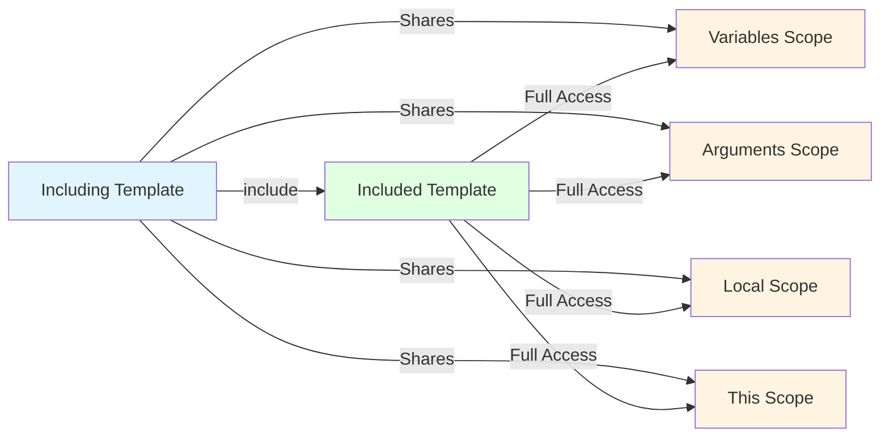
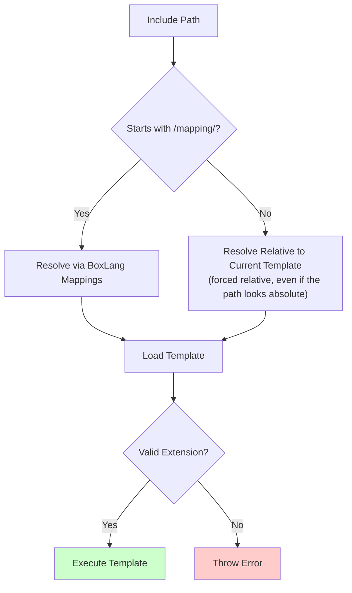

# 📥 Template Includes

> BoxLang's include system allows you to merge templates together for code reuse, with full scope absorption and dynamic template execution.

Template includes are BoxLang's server-side inclusion mechanism that **embeds one template into another** at runtime. When you include a template, it becomes part of the current execution context with **complete access to all scopes** in the including template.

## 🎯 What Are Includes?

An **include** is a file that is **embedded** (or **included**) within another file, making it part of the current execution. The included template has **complete access** to the including template's scopes.

### Key Characteristics

✅ **Runtime Merging** - Templates are merged at execution time

✅ **Scope Absorption** - Included templates inherit all parent scopes

✅ **Bidirectional Access** - Both templates can read/write shared variables

✅ **Dynamic Execution** - Template paths can be computed at runtime

✅ **Multiple Formats** - Script and template syntax supported

### Common Use Cases

- **Header/Footer Templates** - Shared site layouts
- **Utility Functions** - Reusable function libraries
- **Configuration Files** - Shared settings and constants
- **Mixins** - Injecting helper methods into contexts
- **Partial Views** - Reusable UI components


**Modern Term**: In object-oriented programming, this pattern is called a **mixin** - a class/template that provides methods for use by other classes/templates without requiring inheritance.


## 📝 Include Syntax

BoxLang provides multiple syntax options for including templates:

### Script Syntax

```js
// Basic include
include "path/to/template.bxm"

// With template attribute
include template="path/to/template.bxm"

// With externalOnly flag
include template="path/to/template.bxm" externalOnly=true
```

### Template Syntax

```xml
<!-- BoxLang template syntax -->
<bx:include template="path/to/template.bxm" />

<!-- CFML compatibility syntax -->
<cfinclude template="path/to/template.cfm" />
```

### Include Attributes

| Attribute | Type | Required | Default | Description |
|-----------|------|----------|---------|-------------|
| **`template`** | string | ✅ Yes | - | Path to template file (relative or mapping — as of 1.17.0, an absolute-looking path is forced relative rather than read from the OS filesystem) |
| **`externalOnly`** | boolean | ❌ No | `false` | If true, prevents including templates from within classes |

### Syntax Examples

```js
// Simple relative path
include "includes/header.bxm"

// BoxLang mapping
include "/app/includes/functions.bxm"

// Dynamic path
templatePath = "includes/" & getTemplateName()
include template=templatePath

// External only (prevents class internal includes)
include template="external-lib.bxm" externalOnly=true

// Template syntax with attributes
<bx:include template="footer.bxm" />
```

## 🔄 Scope Absorption

The most important characteristic of includes is **complete scope absorption**. When a template is included, it has **full access** to all scopes in the including template.

### How Scope Absorption Works



### Bidirectional Access

Both the including and included templates can read and write shared variables:

**main.bxm:**
```js
// Variables in including template
myVar = "Hello"
counter = 1

// Include another template
include "helper.bxm"

// Access variables set by included template
println( helperVar )  // "World" (set by helper.bxm)
println( counter )     // 2 (modified by helper.bxm)
```

**helper.bxm:**
```js
// Access variables from including template
println( myVar )  // "Hello" (from main.bxm)

// Modify existing variables
counter++

// Create new variables (visible in including template)
helperVar = "World"
```

### Scope Access Example

```js
// Function with local variables
function processData() {
    local.data = "original"
    variables.config = { debug: true }

    // Include template - has access to ALL scopes
    include "process-helper.bxm"

    return local.result  // Set by included template
}
```

**process-helper.bxm:**

```js
// Access local scope
println( local.data )  // "original"

// Access variables scope
if ( variables.config.debug ) {
    println( "Debug mode enabled" )
}

// Set result in local scope
local.result = "processed"
```

### Scope Visibility Comparison

| Scope | Included Template Access | Can Modify |
|-------|-------------------------|------------|
| **Variables** | ✅ Full | ✅ Yes |
| **Local** | ✅ Full | ✅ Yes |
| **Arguments** | ✅ Full | ✅ Yes |
| **This** | ✅ Full | ✅ Yes |
| **Application** | ✅ Full | ✅ Yes |
| **Session** | ✅ Full | ✅ Yes |
| **Request** | ✅ Full | ✅ Yes |
| **Server** | ✅ Full | ✅ Yes |
| **CGI** | ✅ Full | ❌ Read-only |
| **Form** | ✅ Full | ✅ Yes |
| **URL** | ✅ Full | ✅ Yes |


**Critical**: Included templates have **complete access** to ALL scopes. This means they can read, modify, or delete ANY variable in the including template. Be careful with what you include!


### Practical Scope Examples

#### Example 1: Shared Utility Functions

**main.bxm:**
```js
// Include utility functions
include "utils/string-helpers.bxm"

// Use functions from included template
result = formatCurrency( 1234.56 )  // "$1,234.56"
```

**utils/string-helpers.bxm:**
```js
// Define utility functions in variables scope
function formatCurrency( amount ) {
    return "$" & numberFormat( amount, "0.00" )
}

function slugify( text ) {
    return text.lCase().reReplace( "[^a-z0-9]+", "-", "all" )
}
```

#### Example 2: Configuration Mixin

**app.bxm:**
```js
// Include configuration
include "config/settings.bxm"

// Use configuration variables
println( "App Name: #appName#" )
println( "Version: #appVersion#" )
```

**config/settings.bxm:**
```js
// Set configuration in variables scope
appName = "My Application"
appVersion = "1.0.0"
apiUrl = "https://api.example.com"
debugMode = true
```

#### Example 3: Function Scope Access

```js
function processOrder( orderId ) {
    arguments.status = "processing"
    local.startTime = now()

    // Include processor - has access to arguments and local
    include "order-processor.bxm"

    return local.result
}
```

**order-processor.bxm:**
```js
// Access function arguments
println( "Processing order: #arguments.orderId#" )
println( "Status: #arguments.status#" )

// Access and modify local variables
duration = dateDiff( "s", local.startTime, now() )

// Set result
local.result = {
    success: true,
    duration: duration,
    orderId: arguments.orderId
}
```

## 🗺️ Template Path Resolution

BoxLang resolves template paths using multiple strategies:

### Path Types

| Path Type | Example | Resolution |
|-----------|---------|------------|
| **Relative** | `"includes/header.bxm"` | Relative to current template directory |
| **Absolute-looking** | `"/var/www/app/shared.bxm"` | As of 1.17.0, **forced relative** — resolved against configured mappings/webroot, not the OS filesystem |
| **Mapping** | `"/app/includes/util.bxm"` | BoxLang mapping (starts with `/mapping/`) |
| **Dot-Notation** | `"../shared/functions.bxm"` | Parent directory traversal |


**Security hardening (1.17.0)**: `include` no longer resolves an absolute-looking path (`/etc/passwd`, `C:\secrets.txt`) directly against the OS filesystem. It is always coerced to resolve relative to your application's mappings/webroot instead — closing a local-file-inclusion class of bug where a dynamically built include path could reach outside the application. See [What's New in 1.17.0](../readme/release-history/1.17.0.md).


### Path Resolution Examples

```js
// Relative to current template
include "header.bxm"
include "includes/functions.bxm"
include "partials/nav.bxm"

// Parent directory
include "../shared/utilities.bxm"
include "../../global/config.bxm"

// BoxLang mapping (configured in Application.bx or boxlang.json)
include "/app/includes/header.bxm"
include "/shared/utilities.bxm"

// An absolute-looking path is forced relative — it resolves against
// your mappings/webroot instead of the OS filesystem
include "/var/www/myapp/shared/functions.bxm"
```

### Dynamic Path Resolution

```js
// Computed paths
templateName = "header-" & request.deviceType & ".bxm"
include template=templateName

// Conditional includes
if ( debugMode ) {
    include "debug-tools.bxm"
} else {
    include "production-tools.bxm"
}

// Loop-based includes
for ( module in modules ) {
    include "modules/#module#/init.bxm"
}
```

### Path Resolution Algorithm




Before 1.17.0, a path that looked like an OS-absolute path (`/etc/passwd`, `C:\...`) had its own branch here and was read directly off the filesystem. That branch no longer exists — every non-mapping path, absolute-looking or not, resolves relative to the current template.


## ⚙️ Configuration

You can configure which file extensions BoxLang will process as valid templates using the `validTemplateExtensions` setting in `boxlang.json`.

### Default Template Extensions

BoxLang includes these **core template extensions** by default:

- **`.bxs`** - BoxLang script
- **`.bxm`** - BoxLang markup (template)
- **`.bxml`** - BoxLang XML
- **`.cfm`** - ColdFusion markup
- **`.cfml`** - ColdFusion markup language
- **`.cfs`** - ColdFusion script

### Adding Custom Extensions

**boxlang.json:**
```json
{
  "validTemplateExtensions": [
    "html",
    "inc",
    "txt"
  ]
}
```


**Note**: The `validTemplateExtensions` array is **additive** - it adds to the core extensions, not replaces them. You don't need to include `.bxm`, `.cfm`, etc. as they're always available.


### Allow All Extensions

Use the wildcard `*` to allow **any extension** to be processed as a template:

**boxlang.json:**
```json
{
  "validTemplateExtensions": [ "*" ]
}
```


**Security Warning**: Using `*` allows ALL file extensions to be executed as templates. This can be a security risk if you have user-uploaded files or other non-template files in accessible directories!


### Configuration Examples

#### Example 1: Add Custom Extensions

```json
{
  "validTemplateExtensions": [
    "inc",      // Include files
    "part",     // Partials
    "tmpl"      // Templates
  ]
}
```

#### Example 2: Development vs Production

```json
{
  "validTemplateExtensions": [
    "dev",      // Development-only templates
    "debug"     // Debug templates
  ]
}
```

### Extension Validation Process

From `Configuration.java`:

```java
// Core extensions (always available)
Set<String> coreTemplateExtensions = new HashSet<>(
    Arrays.asList( "bxs", "bxm", "bxml", "cfm", "cfml", "cfs" )
);

// Additional extensions from configuration
Set<String> validTemplateExtensions = new HashSet<>();

// Resolution process
if ( includeAll || VALID_TEMPLATE_EXTENSIONS.contains( ext ) ) {
    // Process as template
}
```

### Template Extension Best Practices

✅ **Use Standard Extensions** - Stick to `.bxm`, `.cfm`, `.cfs` when possible
✅ **Descriptive Custom Extensions** - Use `.inc` for includes, `.part` for partials
✅ **Avoid Wildcards** - Don't use `*` in production environments
✅ **Document Custom Extensions** - Make custom extensions clear to your team
❌ **Don't Override Security** - Don't allow dangerous extensions like `.exe`, `.dll`

## 📚 Use Cases

### Use Case 1: Header/Footer Templates

**layout.bxm:**
```js
<!DOCTYPE html>
<html>
<head>
    <title>#pageTitle#</title>
</head>
<body>
    <bx:include template="includes/header.bxm" />

    <!-- Page content -->
    <bx:output>#content#</bx:output>

    <bx:include template="includes/footer.bxm" />
</body>
</html>
```

**includes/header.bxm:**
```xml
<header>
    <nav>
        <ul>
            <li><a href="/">Home</a></li>
            <li><a href="/about">About</a></li>
            <li><a href="/contact">Contact</a></li>
        </ul>
    </nav>
</header>
```

### Use Case 2: Function Libraries

**main.bxm:**
```js
// Include utility functions
include "lib/string-utils.bxm"
include "lib/date-utils.bxm"
include "lib/array-utils.bxm"

// Use included functions
result = slugify( "Hello World" )  // From string-utils
formatted = formatRelativeDate( now() )  // From date-utils
unique = arrayUnique( myArray )  // From array-utils
```

### Use Case 3: Configuration Mixins

**Application.bx:**
```js
component {
    this.name = "MyApp"

    function onApplicationStart() {
        // Include configuration
        include "config/datasources.bxm"
        include "config/cache-settings.bxm"
        include "config/mail-settings.bxm"

        return true
    }
}
```

### Use Case 4: ColdBox Framework Mixins

ColdBox allows mixin injection at runtime:

```js
// In a ColdBox handler
component {
    // Inject helper functions into this handler
    function preHandler( event, rc, prc ) {
        include "/includes/view-helpers.bxm"
        // Now all view helpers are available in this handler
    }
}
```

### Use Case 5: Dynamic Partial Loading

```js
// Load device-specific partials
deviceType = request.deviceType ?: "desktop"
include "partials/nav-#deviceType#.bxm"

// Load feature-specific includes
if ( hasFeature( "premium" ) ) {
    include "features/premium-dashboard.bxm"
}

// Load locale-specific content
locale = session.locale ?: "en"
include "i18n/#locale#/messages.bxm"
```

## 💡 Best Practices

### 1. Use Descriptive Naming

```js
// ✅ Good: Clear purpose
include "includes/header.bxm"
include "partials/user-profile.bxm"
include "lib/date-utils.bxm"

// ❌ Bad: Unclear purpose
include "stuff.bxm"
include "misc.bxm"
include "functions.bxm"
```

### 2. Organize Includes in Directories

```
/includes/
  /layout/
    header.bxm
    footer.bxm
    sidebar.bxm
  /lib/
    string-utils.bxm
    date-utils.bxm
  /config/
    settings.bxm
    datasources.bxm
```

### 3. Document Scope Dependencies

```js
/**
 * Utility Functions Mixin
 *
 * Required Variables:
 * - None
 *
 * Provides Functions:
 * - slugify( text )
 * - truncate( text, length )
 * - stripHTML( html )
 */

function slugify( text ) {
    // Implementation
}
```

### 4. Avoid Circular Includes

```js
// ❌ Bad: Circular dependency
// file-a.bxm
include "file-b.bxm"

// file-b.bxm
include "file-a.bxm"  // ERROR: Infinite loop!
```

### 5. Use Include Guards for One-Time Execution

```js
// lib/functions.bxm
if ( !isDefined( "functionsLoaded" ) ) {
    functionsLoaded = true

    function myUtility() {
        // Implementation
    }
}

// Multiple includes won't redefine functions
include "lib/functions.bxm"
include "lib/functions.bxm"  // Safe - skipped
```

### 6. Prefer Composition Over Includes

```js
// ❌ Avoid: Overusing includes for everything
include "utils.bxm"
include "helpers.bxm"
include "formatters.bxm"
include "validators.bxm"

// ✅ Better: Use components/services
utilService = new lib.UtilService()
helpers = new lib.Helpers()
```

### 7. Secure Include Paths

```js
// ❌ Dangerous: User input in include
userTemplate = url.template
include "#userTemplate#"  // Security risk!

// ✅ Safe: Whitelist allowed templates
allowedTemplates = [ "dashboard", "profile", "settings" ]
if ( allowedTemplates.contains( url.template ) ) {
    include "views/#url.template#.bxm"
}
```


As of 1.17.0, BoxLang enforces `include` paths to always resolve relative to your mappings/webroot, even if user input smuggles in something that looks like an absolute path (`/etc/passwd`, `../../../etc/passwd` resolved through a mapping, etc.) — this closes the most severe version of the risk shown above. Still whitelist user-influenced template names: enforcing relative resolution stops filesystem escape, but an attacker-chosen path can still reach an unintended template *within* your own application.


## ⚠️ A Stern Warning


**Warning**: Includes are one of the **most abused features** in ANY language! They can lead to:
- **Spaghetti Code** - Hard to trace execution flow
- **Namespace Pollution** - Variables from includes can conflict
- **Tight Coupling** - Changes in one file affect many others
- **Testing Challenges** - Difficult to unit test included code
- **Maintenance Nightmares** - Unclear dependencies


**Easy ≠ Maintainable**

Just because includes are easy doesn't mean they're the right solution. Modern design patterns often provide better alternatives:

### Better Alternatives

| Pattern | Use Instead Of | Benefits |
|---------|---------------|----------|
| **Components** | Function includes | Encapsulation, testability, reusability |
| **Dependency Injection** | Config includes | Loose coupling, flexibility |
| **Composition** | Mixin includes | Clear dependencies, maintainability |
| **Modules** | Library includes | Namespacing, versioning, isolation |
| **Services** | Utility includes | Stateful operations, lifecycle management |


**Rule of Thumb**: Think **twice** before using includes, think **thrice** before using them heavily. Ask yourself: "Could this be a component, service, or module instead?"


## 🔀 Includes vs Other Patterns

### Includes vs Components

```js
// ❌ Include approach
include "user-manager.bxm"
user = createUser( name, email )

// ✅ Component approach
userManager = new services.UserManager()
user = userManager.create( name, email )
```

**Advantages of Components:**
- Clear dependencies
- Easier to test
- No scope pollution
- Better encapsulation

### Includes vs Dependency Injection

```js
// ❌ Include approach
include "config/datasources.bxm"
query = queryExecute( sql, {}, { datasource: myDSN } )

// ✅ DI approach
component inject="DataSourceService@app" {
    property name="dataSourceService"

    function getUser( id ) {
        return dataSourceService.query( sql, params )
    }
}
```

### Includes vs Modules

```js
// ❌ Include approach
include "/lib/email-utils.bxm"
sendEmail( to, subject, body )

// ✅ Module approach
emailService = getModuleService( "EmailModule" )
emailService.send( to, subject, body )
```

## 📋 Summary

BoxLang includes provide powerful template merging:

✅ **Full Scope Absorption** - Included templates access all parent scopes

✅ **Flexible Syntax** - Script, template, and CFML compatibility

✅ **Dynamic Paths** - Relative, absolute, and mapping-based resolution

✅ **Configurable Extensions** - Control which files are valid templates

✅ **Bidirectional Access** - Both templates can read/write shared data

⚠️ **Use Sparingly** - Consider components, DI, and composition first


**CFML Compatibility**: BoxLang's include system is fully compatible with ColdFusion's `<cfinclude>` tag and behavior, making migration seamless.


## 🔗 Related Documentation

- [Variable Scopes](variable-scopes.md) - Understanding BoxLang scopes
- [Components](components.md) - Object-oriented alternatives
- [Modularity](../boxlang-framework/modularity/README.md) - Module system
- [Application.bx](../boxlang-framework/applicationbx.md) - Application configuration
- [ColdBox Mixins](https://coldbox.ortusbooks.com/) - Framework-level mixins
