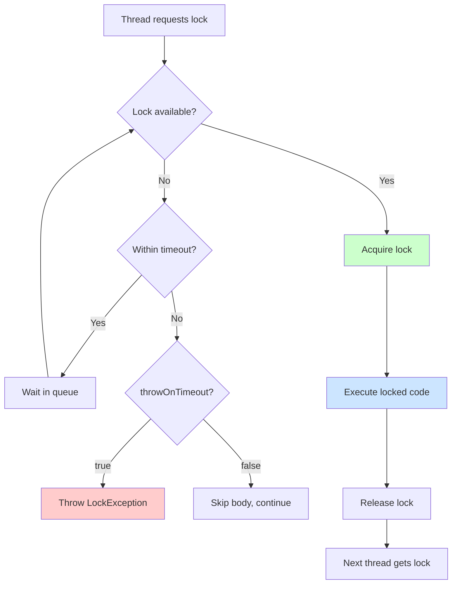
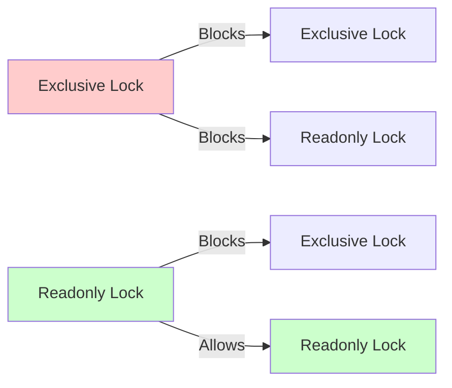
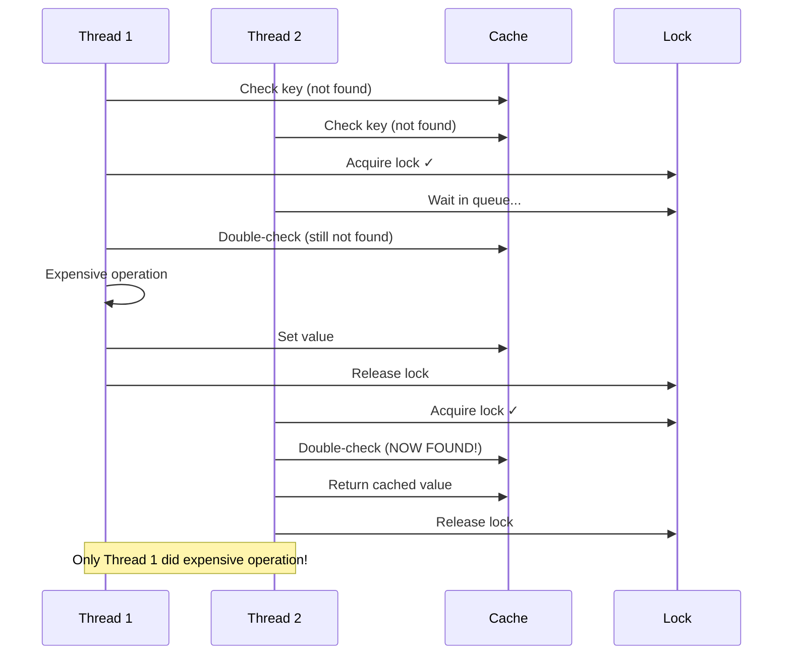
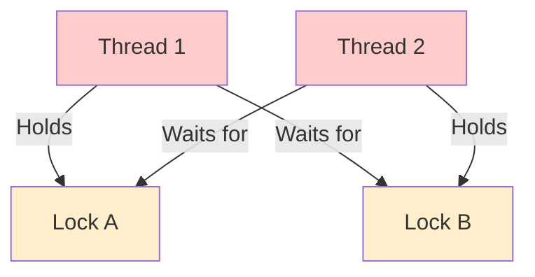

# 🔒 Code Locking & Synchronization

> BoxLang provides powerful thread-safe locking mechanisms for synchronizing access to shared resources with named locks, scope locks, and full Java interop support.

Locking is essential for multi-threaded applications where multiple requests or threads access shared resources. BoxLang's locking system uses Java's **ReentrantReadWriteLock** internally, providing robust, high-performance synchronization with support for both exclusive (write) and readonly (read) locks.

## 📋 Table of Contents

- [Lock Basics](#lock-basics)
- [Lock Types](#lock-types)
- [Named Locking](#named-locking)
- [Scope Locking](#scope-locking)
- [Lock Attributes](#lock-attributes)
- [Double-Check Locking Pattern](#double-check-locking-pattern)
- [Deadlock Prevention](#deadlock-prevention)
- [Advanced: Java Interop Locking](#advanced-java-interop-locking)
- [Best Practices](#best-practices)

## 🎯 Lock Basics

BoxLang provides the `lock` component/construct for thread-safe synchronization:

```js
// Script syntax
lock name="mylock" timeout=10 {
    // Synchronized code here
    criticalOperation()
}

// Template syntax
<bx:lock name="mylock" timeout="10">
    <!-- Synchronized code here -->
</bx:lock>

// CFML compatibility
<cflock name="mylock" timeout="10">
    <!-- Synchronized code here -->
</cflock>
```

### When to Use Locks

Use locks when:
- ✅ Multiple threads access shared data
- ✅ Writing to shared variables (application, server, session scopes)
- ✅ Reading shared data that might be modified
- ✅ Ensuring atomic operations
- ✅ Preventing race conditions
- ✅ Coordinating access to external resources

### Lock Flow Diagram



## 🔐 Lock Types

BoxLang supports two lock types based on Java's **ReentrantReadWriteLock**:

### 1. Exclusive Locks (Write Locks)

**Exclusive locks** allow only **ONE thread** to access the locked code at a time. Use for read/write operations on shared data.

```js
lock name="config-update" type="exclusive" timeout=10 {
    // Only ONE thread can execute this at a time
    application.config = loadNewConfig()
    application.lastUpdate = now()
}
```

**Characteristics:**
- ✅ Single-thread access only
- ✅ Blocks all other threads (both exclusive and readonly)
- ✅ Use for writing or modifying shared data
- ✅ First-come, first-served basis

### 2. Readonly Locks (Read Locks)

**Readonly locks** allow **MULTIPLE threads** to access the locked code simultaneously. Use for read-only operations on shared data.

```js
lock name="config-read" type="readonly" timeout=10 {
    // Multiple threads can execute this concurrently
    myValue = application.config.getSetting( "key" )
}
```

**Characteristics:**
- ✅ Multiple concurrent readers allowed
- ✅ Blocked by exclusive locks
- ✅ Use for reading shared data
- ✅ Better performance for read-heavy workloads

### Lock Type Comparison

| Feature | Exclusive | Readonly |
|---------|-----------|----------|
| **Concurrent Access** | ❌ No (single thread) | ✅ Yes (multiple threads) |
| **Blocks Exclusive** | ✅ Yes | ✅ Yes |
| **Blocks Readonly** | ✅ Yes | ❌ No |
| **Use For** | Writing/Modifying | Reading only |
| **Performance** | Lower throughput | Higher throughput |
| **Default** | ✅ Yes | ❌ No |

### Lock Type Interactions



## 📛 Named Locking

**Named locks** use a string identifier to coordinate access across the entire BoxLang server.

### Basic Named Lock

```js
lock name="cache-population" timeout=10 type="exclusive" {
    if ( !cache.exists( "mykey" ) ) {
        myData = expensiveOperation()
        cache.set( "mykey", myData )
    }
}
```


**Global Scope**: Lock names are **server-wide** and shared across ALL applications running on the same BoxLang instance. Use unique, descriptive names to avoid conflicts between applications.


### Naming Conventions

Use descriptive, namespaced lock names to avoid collisions:

```js
// ❌ Bad: Generic names risk conflicts
lock name="update" timeout=10 { }
lock name="cache" timeout=10 { }

// ✅ Good: App-prefixed names
lock name="myapp-config-update" timeout=10 { }
lock name="myapp-cache-users" timeout=10 { }

// ✅ Good: Module-prefixed names
lock name="shop.cart.checkout" timeout=10 { }
lock name="cms.content.publish" timeout=10 { }

// ✅ Good: Include resource identifier
lock name="user-profile-#userId#" timeout=10 { }
lock name="order-process-#orderId#" timeout=10 { }
```

### Lock Name Characteristics

- **Case-Sensitive**: `"MyLock"` and `"mylock"` are different locks
- **Server-Wide**: Shared across all applications on the server
- **Dynamic**: Can use variables/expressions in names
- **Must be Non-Empty**: Empty strings not allowed

### Named Lock Examples

#### Example 1: Cache Population

```js
function getUserData( userId ) {
    cacheKey = "user-#userId#"
    data = cache.get( cacheKey )

    if ( isNull( data ) ) {
        // Use lock to prevent thundering herd
        lock name="user-cache-#userId#" timeout=5 type="exclusive" {
            // Double-check inside lock
            data = cache.get( cacheKey )
            if ( isNull( data ) ) {
                data = db.getUserById( userId )
                cache.set( cacheKey, data )
            }
        }
    }

    return data
}
```

#### Example 2: Counter Increment

```js
lock name="visitor-counter" timeout=10 type="exclusive" {
    application.visitorCount = ( application.visitorCount ?: 0 ) + 1
}
```

#### Example 3: Multiple Locks with Different Names

```js
// Lock for user profile updates
lock name="profile-update-#userId#" timeout=10 type="exclusive" {
    updateUserProfile( userId, profileData )
}

// Lock for account balance updates
lock name="balance-update-#userId#" timeout=10 type="exclusive" {
    updateAccountBalance( userId, amount )
}

// These locks are independent - they don't block each other
```

## 🎯 Scope Locking

**Scope locks** synchronize access to entire BoxLang scopes: `application`, `server`, `session`, `request`.

### Scope Lock Syntax

```js
lock scope="application" timeout=10 type="exclusive" {
    application.counter += 1
}

lock scope="session" timeout=10 type="readonly" {
    userName = session.user.name
}
```

### How Scope Locks Work

Each scope has a unique internal lock name generated from the scope name and instance hash:

```java
// From BaseScope.java
lockName = scopeName.getName() + new Object().hashCode()
```

This ensures each scope instance (e.g., each session) has its own lock.

### Available Scopes

| Scope | Lock Granularity | Use Case |
|-------|------------------|----------|
| **`application`** | Per application | Application-wide shared data |
| **`server`** | Per server | Server-wide shared data |
| **`session`** | Per session | User-specific session data |
| **`request`** | Per request | Request-scoped coordination |

### Scope Lock Examples

#### Example 1: Application Counter

```js
// Write lock for incrementing
lock scope="application" timeout=10 type="exclusive" {
    application.visitorCount = ( application.visitorCount ?: 0 ) + 1
}

// Read lock for reading
lock scope="application" timeout=10 type="readonly" {
    count = application.visitorCount
}
```

#### Example 2: Session Data Update

```js
lock scope="session" timeout=10 type="exclusive" {
    session.cart.items.append( newItem )
    session.cart.total += newItem.price
}
```

#### Example 3: Server-Wide Configuration

```js
lock scope="server" timeout=10 type="exclusive" {
    server.maintenanceMode = true
    server.lastUpdate = now()
}
```


**Performance Warning**: Scope locks are **coarse-grained** - they lock the ENTIRE scope. This can become a performance bottleneck in high-traffic applications. Prefer **named locks** with specific names for fine-grained control.


### Scope Lock vs Named Lock

```js
// ❌ Coarse: Locks entire application scope
lock scope="application" timeout=10 {
    application.users.brad.lastLogin = now()
}

// ✅ Fine-grained: Locks only this user's data
lock name="user-update-brad" timeout=10 {
    application.users.brad.lastLogin = now()
}
```

## ⚙️ Lock Attributes

Complete reference for all `lock` component attributes:

| Attribute | Type | Required | Default | Description |
|-----------|------|----------|---------|-------------|
| **`name`** | string | ⚠️ * | - | Lock name (server-wide unique identifier). Cannot be empty. |
| **`scope`** | string | ⚠️ * | - | Scope to lock (`application`, `server`, `session`, `request`) |
| **`timeout`** | integer | ✅ Yes | - | Maximum seconds to wait for lock. `0` = wait forever. |
| **`type`** | string | ❌ No | `"exclusive"` | Lock type: `"exclusive"` or `"readonly"` |
| **`throwOnTimeout`** | boolean | ❌ No | `true` | Throw `LockException` on timeout? |

**\* Mutually Exclusive**: Must provide either `name` OR `scope`, but not both.

### Attribute Details

#### `name` - Lock Name
- **Server-wide** unique identifier
- **Case-sensitive**
- Can use expressions: `name="lock-#userId#"`
- Cannot be empty string
- Mutually exclusive with `scope`

#### `scope` - Scope Name
- Values: `application`, `server`, `session`, `request`
- Locks entire scope
- Mutually exclusive with `name`

#### `timeout` - Wait Time
- **Positive integer**: Wait N seconds for lock
- **Zero (0)**: Wait forever (until lock acquired)
- If lock not acquired within timeout, behavior depends on `throwOnTimeout`


**Timeout Best Practice**: Always use the **minimum timeout** necessary. Large timeouts can block threads and reduce throughput.


#### `type` - Lock Type
- **`"exclusive"`** (default): Single-thread access (write lock)
- **`"readonly"`**: Multi-thread access (read lock)
- Case-insensitive

#### `throwOnTimeout` - Timeout Behavior
- **`true`** (default): Throws `LockException` if timeout reached
- **`false`**: Skips lock body silently and continues execution

### Attribute Examples

```js
// Exclusive lock with exception on timeout
lock name="mylock" timeout=10 type="exclusive" throwOnTimeout=true {
    // Single-thread access
}

// Readonly lock, skip on timeout
lock name="mylock" timeout=5 type="readonly" throwOnTimeout=false {
    // Multi-thread access, skip if busy
}

// Wait forever for exclusive lock
lock name="critical-section" timeout=0 type="exclusive" {
    // Will wait indefinitely
}

// Dynamic lock name
lock name="user-#userId#" timeout=10 {
    // Per-user lock
}

// Scope lock with readonly
lock scope="application" timeout=10 type="readonly" {
    // Read application data
}
```

## 🔄 Double-Check Locking Pattern

The **double-check locking** pattern prevents race conditions where multiple threads check a condition, then compete to initialize a resource.

### The Problem: Race Condition

```js
// ❌ Bad: Race condition - multiple threads can initialize
function loadData() {
    myData = cache.get( "mykey" )

    if ( isNull( myData ) ) {
        // Multiple threads pass this check
        lock name="cache-load" timeout=10 type="exclusive" {
            // ALL waiting threads will execute this!
            myData = expensiveOperation()  // Called multiple times!
            cache.set( "mykey", myData )
        }
    }

    return myData
}
```

**Problem**: If 10 threads are waiting at the lock, all 10 will execute the expensive operation!

### The Solution: Double-Check Pattern

```js
// ✅ Good: Double-check prevents race condition
function loadData() {
    myData = cache.get( "mykey" )

    if ( isNull( myData ) ) {
        lock name="cache-load" timeout=10 type="exclusive" {
            // Double-check INSIDE the lock
            myData = cache.get( "mykey" )
            if ( isNull( myData ) ) {
                // Only ONE thread executes this
                myData = expensiveOperation()
                cache.set( "mykey", myData )
            }
        }
    }

    return myData
}
```

### Double-Check Pattern Diagram



### Real-World Examples

#### Example 1: Cache Population

```js
function getConfig() {
    config = cache.get( "app-config" )

    if ( isNull( config ) ) {
        lock name="config-load" timeout=10 type="exclusive" {
            // Double-check inside lock
            config = cache.get( "app-config" )
            if ( isNull( config ) ) {
                // Load from database (expensive)
                config = db.query( "SELECT * FROM config" )
                // Parse and transform (expensive)
                config = parseAndValidate( config )
                // Cache for 1 hour
                cache.set( "app-config", config, 3600 )
            }
        }
    }

    return config
}
```

#### Example 2: Singleton Initialization

```js
component singleton {
    property name="instance"

    function getInstance() {
        if ( isNull( variables.instance ) ) {
            lock name="singleton-init" timeout=10 type="exclusive" {
                // Double-check
                if ( isNull( variables.instance ) ) {
                    variables.instance = new ExpensiveObject()
                }
            }
        }
        return variables.instance
    }
}
```

#### Example 3: Application Initialization

```js
function onApplicationStart() {
    if ( !structKeyExists( application, "initialized" ) ) {
        lock scope="application" timeout=30 type="exclusive" {
            // Double-check
            if ( !structKeyExists( application, "initialized" ) ) {
                application.datasource = configureDatasource()
                application.cache = initializeCache()
                application.services = loadServices()
                application.initialized = true
            }
        }
    }
}
```

### Why Double-Check Works

1. **First Check** (outside lock): Fast path - avoids lock overhead when value exists
2. **Second Check** (inside lock): Prevents race condition - ensures only one thread initializes
3. **Lock Protection**: Guarantees atomic initialization


**Best Practice**: Always use double-check locking when initializing expensive resources that multiple threads might try to create simultaneously!


## ⚠️ Deadlock Prevention

A **deadlock** occurs when threads are waiting for locks held by each other, creating a cycle that cannot be broken.

### Deadlock Example

```js
// Thread 1
lock name="lockA" timeout=10 {
    lock name="lockB" timeout=10 {
        // Do work
    }
}

// Thread 2 - DEADLOCK!
lock name="lockB" timeout=10 {
    lock name="lockA" timeout=10 {
        // Never executes - waiting forever
    }
}
```

### Deadlock Diagram



### Deadlock Prevention Strategies

#### 1. Consistent Lock Ordering

Always acquire locks in the **same order** across all code:

```js
// ✅ Good: Consistent ordering everywhere
function operation1() {
    lock name="lockA" timeout=10 {
        lock name="lockB" timeout=10 {
            // Work
        }
    }
}

function operation2() {
    // SAME ORDER: A then B
    lock name="lockA" timeout=10 {
        lock name="lockB" timeout=10 {
            // Work
        }
    }
}
```

#### 2. Use Minimal Timeout

Always set reasonable timeouts so locks auto-release:

```js
// ✅ Good: Timeout prevents infinite deadlock
lock name="mylock" timeout=10 {
    // Will timeout and throw exception after 10 seconds
}

// ❌ Bad: Infinite wait
lock name="mylock" timeout=0 {
    // Could wait forever if deadlocked
}
```

#### 3. Avoid Nested Locks

Simplest solution - don't nest locks:

```js
// ✅ Better: Separate, non-nested locks
lock name="operation1" timeout=10 {
    doWork1()
}

lock name="operation2" timeout=10 {
    doWork2()
}
```

#### 4. Use Lock Hierarchies

Establish a hierarchy and always lock from top to bottom:

```js
// Hierarchy: Global -> Application -> User
lock name="global-config" timeout=10 {
    lock name="app-#appId#-config" timeout=10 {
        lock name="user-#userId#-prefs" timeout=10 {
            // Work
        }
    }
}
```

### Deadlock Recovery

BoxLang's locks automatically release on:
- ✅ **Timeout**: Lock acquisition times out
- ✅ **Exception**: Thread throws exception
- ✅ **Thread Termination**: Thread ends abnormally

```js
try {
    lock name="mylock" timeout=10 throwOnTimeout=true {
        riskyOperation()
    }
} catch ( LockException e ) {
    // Timeout occurred - lock automatically released
    logError( "Lock timeout: #e.lockName#" )
    // Attempt recovery or retry
}
```

### Deadlock Best Practices

✅ **Always use timeouts** - Never use `timeout=0` in production
✅ **Consistent ordering** - Document and enforce lock order
✅ **Minimize lock scope** - Lock smallest code section possible
✅ **Avoid nesting** - Use single locks when possible
✅ **Use named locks** - More precise than scope locks
✅ **Log lock acquisitions** - Track lock usage patterns
✅ **Monitor lock times** - Identify bottlenecks


**Critical**: BoxLang uses Java's `ReentrantReadWriteLock` internally, which **automatically releases locks** on timeout or thread termination, preventing infinite deadlocks. However, large timeouts can still block threads and reduce throughput!


## ☕ Advanced: Java Interop Locking

BoxLang's full Java interop allows you to use **native Java synchronization** mechanisms directly for advanced locking scenarios.

### Using Java ReentrantLock

Java's `ReentrantLock` provides explicit lock/unlock control:

```js
// Create a Java ReentrantLock
lock = new java:java.util.concurrent.locks.ReentrantLock()

try {
    // Acquire lock
    lock.lock()

    // Critical section
    application.counter += 1

} finally {
    // ALWAYS unlock in finally
    lock.unlock()
}
```

### Using Java ReentrantReadWriteLock

BoxLang's `lock` component uses this internally:

```js
// Create read/write lock
rwLock = new java:java.util.concurrent.locks.ReentrantReadWriteLock()
readLock = rwLock.readLock()
writeLock = rwLock.writeLock()

// Multiple readers
readLock.lock()
try {
    data = application.config
} finally {
    readLock.unlock()
}

// Single writer
writeLock.lock()
try {
    application.config = newConfig
} finally {
    writeLock.unlock()
}
```

### Using Java Synchronized Blocks

Java's `synchronized` keyword via BoxLang:

```js
// Create a monitor object
monitor = new java:java.lang.Object()

// Synchronized block
synchronized( monitor ) {
    // Only one thread can execute this
    criticalOperation()
}
```


**Note**: BoxLang doesn't have native `synchronized` keyword, but you can call Java synchronized methods or use Java lock objects directly.


### Using Java Semaphores

Control access with permits:

```js
// Create semaphore with 3 permits
semaphore = new java:java.util.concurrent.Semaphore( 3 )

try {
    // Acquire permit (blocks if none available)
    semaphore.acquire()

    // Max 3 threads execute simultaneously
    doWork()

} finally {
    // Release permit
    semaphore.release()
}
```

### Using Java CountDownLatch

Wait for multiple threads to complete:

```js
// Create latch for 5 threads
latch = new java:java.util.concurrent.CountDownLatch( 5 )

// Each thread counts down
thread action="run" {
    doWork()
    latch.countDown()
}

// Main thread waits for all 5
latch.await()
println( "All threads completed!" )
```

### Using Java CyclicBarrier

Synchronize threads at a barrier point:

```js
// Create barrier for 3 threads
barrier = new java:java.util.concurrent.CyclicBarrier( 3 )

thread action="run" {
    doPhase1()
    barrier.await()  // Wait for others
    doPhase2()
}
```

### Using Java Atomic Variables

Lock-free atomic operations:

```js
// Atomic integer
counter = new java:java.util.concurrent.atomic.AtomicInteger( 0 )

// Thread-safe increment
counter.incrementAndGet()
counter.addAndGet( 5 )

// Compare and set
counter.compareAndSet( 0, 1 )

// Atomic reference
ref = new java:java.util.concurrent.atomic.AtomicReference()
ref.set( myObject )
current = ref.get()
```

### Using Java ConcurrentHashMap

Thread-safe map without explicit locks:

```js
// Create thread-safe map
map = new java:java.util.concurrent.ConcurrentHashMap()

// Thread-safe operations
map.put( "key", "value" )
value = map.get( "key" )
map.putIfAbsent( "key", "default" )
map.computeIfAbsent( "key", () -> expensiveComputation() )
```

### Advanced Pattern: Custom Lock Manager

```js
component {
    property name="locks" default="#new java:java.util.concurrent.ConcurrentHashMap()#"

    function getLock( name ) {
        return locks.computeIfAbsent(
            name,
            () -> new java:java.util.concurrent.locks.ReentrantLock()
        )
    }

    function withLock( name, callback ) {
        lock = getLock( name )
        lock.lock()
        try {
            return callback()
        } finally {
            lock.unlock()
        }
    }
}

// Usage
lockManager = new LockManager()
result = lockManager.withLock( "mylock", () -> {
    return expensiveOperation()
} )
```

### Comparison: BoxLang vs Java Locking

| Feature | BoxLang `lock` | Java Locks | Use When |
|---------|----------------|------------|----------|
| **Syntax** | Simple, declarative | Explicit lock/unlock | BoxLang: Simplicity |
| **Auto-release** | ✅ Automatic | ❌ Manual finally | BoxLang: Safety |
| **Timeout** | ✅ Built-in | Manual | BoxLang: Deadlock prevention |
| **Read/Write** | ✅ Built-in types | Manual handling | BoxLang: Simplicity |
| **Advanced Control** | ❌ Limited | ✅ Full control | Java: Fine-grained |
| **Lock-free** | ❌ No | ✅ Atomics | Java: Performance |
| **Semaphores** | ❌ No | ✅ Yes | Java: Permits |
| **Barriers** | ❌ No | ✅ Yes | Java: Coordination |


**Best Practice**: Use BoxLang's `lock` component for most cases. It's safer (auto-releases), simpler (declarative), and has built-in timeouts. Use Java locks only when you need advanced features like semaphores, barriers, or lock-free atomic operations.


### Java Interop Examples

#### Example 1: Rate Limiting with Semaphore

```js
component {
    property name="semaphore" default="#new java:java.util.concurrent.Semaphore( 10 )#"

    function processRequest() {
        acquired = semaphore.tryAcquire( 5, createObject("java", "java.util.concurrent.TimeUnit").SECONDS )

        if ( acquired ) {
            try {
                return handleRequest()
            } finally {
                semaphore.release()
            }
        } else {
            throw( "Rate limit exceeded" )
        }
    }
}
```

#### Example 2: Atomic Counter

```js
component singleton {
    property name="requestCount" default="#new java:java.util.concurrent.atomic.AtomicLong()#"

    function incrementAndGet() {
        return requestCount.incrementAndGet()
    }

    function get() {
        return requestCount.get()
    }
}
```

#### Example 3: Thread-Safe Cache

```js
component {
    property name="cache" default="#new java:java.util.concurrent.ConcurrentHashMap()#"

    function get( key ) {
        return cache.computeIfAbsent( key, ( k ) -> loadFromDatabase( k ) )
    }

    function set( key, value ) {
        cache.put( key, value )
    }
}
```

## 💡 Best Practices

### 1. Use Minimum Timeouts

```js
// ❌ Bad: Large timeout blocks threads
lock name="mylock" timeout=60 {
    quickOperation()
}

// ✅ Good: Minimal timeout
lock name="mylock" timeout=2 {
    quickOperation()
}
```

### 2. Prefer Named Locks Over Scope Locks

```js
// ❌ Bad: Locks entire application scope
lock scope="application" timeout=10 {
    application.users.brad.status = "active"
}

// ✅ Good: Fine-grained named lock
lock name="user-status-brad" timeout=10 {
    application.users.brad.status = "active"
}
```

### 3. Always Use Double-Check Pattern

```js
// ✅ Good: Prevents race conditions
if ( condition ) {
    lock name="init" timeout=10 {
        if ( condition ) {  // Double-check
            initialize()
        }
    }
}
```

### 4. Use Descriptive Lock Names

```js
// ❌ Bad: Generic names
lock name="lock1" timeout=10 { }

// ✅ Good: Descriptive names
lock name="cache-user-#userId#-profile" timeout=10 { }
```

### 5. Handle Timeouts Appropriately

```js
try {
    lock name="mylock" timeout=5 throwOnTimeout=true {
        criticalOperation()
    }
} catch ( LockException e ) {
    logError( "Lock timeout on: #e.lockName#" )
    // Fallback or retry
}
```

### 6. Use Readonly Locks for Read Operations

```js
// ✅ Good: Multiple readers allowed
lock name="config-read" type="readonly" timeout=10 {
    setting = application.config.get( "key" )
}

// Exclusive only when writing
lock name="config-write" type="exclusive" timeout=10 {
    application.config.set( "key", value )
}
```

### 7. Keep Lock Scope Minimal

```js
// ❌ Bad: Large lock scope
lock name="mylock" timeout=10 {
    prepareData()       // Doesn't need lock
    criticalSection()   // Needs lock
    cleanup()           // Doesn't need lock
}

// ✅ Good: Minimal lock scope
prepareData()
lock name="mylock" timeout=10 {
    criticalSection()   // Only lock critical section
}
cleanup()
```

### 8. Document Lock Dependencies

```js
/**
 * Updates user profile
 *
 * Locks required:
 * - user-profile-{userId} (exclusive)
 * - cache-user-{userId} (exclusive)
 *
 * Lock order: profile then cache (prevent deadlock)
 */
function updateUserProfile( userId, data ) {
    lock name="user-profile-#userId#" timeout=10 {
        lock name="cache-user-#userId#" timeout=10 {
            // Update logic
        }
    }
}
```

### 9. Monitor Lock Performance

```js
startTime = getTickCount()
lock name="mylock" timeout=10 {
    operation()
}
duration = getTickCount() - startTime

if ( duration > 1000 ) {
    logWarning( "Lock held for #duration#ms - potential bottleneck" )
}
```

### 10. Use Java Locks for Advanced Scenarios

```js
// ✅ When you need lock-free atomics
counter = new java:java.util.concurrent.atomic.AtomicInteger()

// ✅ When you need semaphores
limiter = new java:java.util.concurrent.Semaphore( 100 )

// ❌ For basic locking, use BoxLang lock component
lock name="simple" timeout=10 { }
```

## 📋 Summary

BoxLang locking provides powerful thread synchronization:

✅ **Two Lock Types** - Exclusive (write) and Readonly (read)

✅ **Named Locks** - Server-wide locks by name

✅ **Scope Locks** - Lock entire BoxLang scopes

✅ **Automatic Release** - Locks release on timeout/exception

✅ **Timeout Control** - Prevent infinite deadlocks

✅ **ReentrantReadWriteLock** - High-performance Java locks internally

✅ **Java Interop** - Full access to Java concurrency APIs

✅ **Deadlock Prevention** - Built-in timeout mechanisms


**Pro Tip**: Use named locks with double-check pattern for most scenarios. Reserve scope locks for coarse-grained operations, and use Java locks only when you need advanced features like semaphores or lock-free atomics!


## 🔗 Related Documentation

- [Threading](threading.md) - Concurrent execution
- [Variable Scopes](variable-scopes.md) - Understanding BoxLang scopes
- [Exception Management](exception-management.md) - Handling LockException
- [Java Integration](../boxlang-framework/java-integration.md) - Java interop details
- [Java Concurrency Tutorial](https://docs.oracle.com/javase/tutorial/essential/concurrency/sync.html) - Oracle's Java synchronization guide
