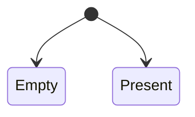

# Attempts

Attempts in BoxLang are an enhanced Java [Optional](https://www.developer.com/java/java-optional-object/).  It acts as a fluent container of a value or expression that can be null, truthy, falsey, or exist.  It then provides fluent methods to interact with the potential value or expression.

Attempts are also immutable, so you can chain methods to handle the value more functionally, but it never mutates the original value.  It can also be seeded with validation information to create validation pipelines.

```cfscript
attempt( userService.get( rc.id ).isLoaded() )
    .ifPresent( user -> populate( user ).save() )
    .orThrow( "UserNotFoundException" )
```

In this example, you can see that the expression creates a value to check if the user requested exists and is loaded.  Then, you can fluently populate and save the user if the user is present or throw an exception. &#x20;


BoxLang internally will return `Attempts` in many BIFS and internal operations.


## Why

Attempts will allow you to use more declarative and functional programming techniques than dealing with nulls or falsey values.  It provides a better API for developers to follow and absorb. You will ultimately write concise and more readable code that is easier to maintain and test.

## States



An attempt can only have two states:  **present** or **empty**.  They can be retrieved with two methods:

* `isEmpty():boolean`&#x20;
* `isPresent():boolean`

The rules for evaluating that we have a value **present** are:

* The value is not `null`
* If the value is castable to BoxLang Boolean, is it `true`
* If not castable, we have a value, so it's **present**.

We also have another method called `isNull(),` which specifically checks whether the value is `null` only!

## Creation

You can create attempts using our BIF `attempt()`.

### Empty

To create empty attempts, don't pass anything:

```cfscript
emptyAttempt = attempt()
```

Remember that this is an empty attempt, you can change it's value.

### With Potential Value

If you pass a value into the BIF, that value will be stored in the attempt, which can later be evaluated for existence.  You can pass a value or an expression that could be `null`.

```cfscript
attempt( userService.get( rc.id ) )
attempt( userService.get( rc.id ).isLoaded() )
attempt( getBoxCache().get( "my-cache-value" ) )
attempt( getStudentWithName( "majano" ) )
```

## Usage

We can interact with it now that we have created an attempt or received one.  Here is the arsenal of methods available to create fluent execution chains.&#x20;

### equals( object ):boolean

This allows you to compare if two attempts are equal.

```cfscript
if( attempt1.equals( attempt2 ) ){
    .. do this
}
```

### filter( function ):Attempt

If a value is present and matches the given closure/lambda, it returns an Attempt describing the value; otherwise, it returns an empty Attempt.

```cfscript
attempt( userService.findById( 25 ) )
    .filter( u -> u.getAge() >= 21 )
    .ifPresentOrElse( 
        u -> println( "The user is of legal drinking age" ),
        println( "The user is not of legal drinking age" )
    )
```

### flatMap( function ):Attempt

If a value is present, it returns the result of applying the given `Attempt`-bearing mapping function to the value; otherwise, it returns an empty `Attempt`.  Using `flatMap` allows you to avoid nested attempt objects and directly get the transformed result.  The `getEmail()` method returns an attempt, not a value.

```cfscript
class User{
    property email
    
    ...
    
    Attempt getEmail(){
        return attempt( email )
    }
}

// Use flatMap to retrieve and transform the email if present
attempt( userService.getUserByEmail( "alice@example.com" ) )
    .flatMap( .getEmail )
    .map( .getToken( 2, "@" ) )
    .ifPresentOrElse(
        domain -> println( "Email domain: " + domain),
        () -> println("Email not present")
    );
```
