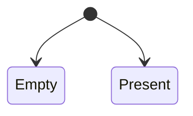

# Attempts

Attempts in BoxLang are an enhanced Java [Optional](https://www.developer.com/java/java-optional-object/).  It acts as a fluent container of a value or expression that can be null, truthy, falsey, or exist.  It then provides fluent methods to interact with the potential value or expression.

Attempts are also immutable, so you can chain methods to handle the value more functionally, but it never mutates the original value.  It can also be seeded with validation information to create validation pipelines.

```java
attempt( userService.get( rc.id ).isLoaded() )
    .ifPresent( user -> populate( user ).save() )
    .orThrow( "UserNotFoundException" )
```

In this example, you can see that the expression creates a value to check if the user requested exists and is loaded.  Then, you can fluently populate and save the user if the user is present or throw an exception. &#x20;


BoxLang internally will return `Attempts` in many BIFS and internal operations.


## Why

Attempts will allow you to use more declarative and functional programming techniques than dealing with nulls or falsey values.  It provides a better API for developers to follow and absorb. You will ultimately write concise and more readable code that is easier to maintain and test.

## States



An attempt can only have two states:  **present** or **empty**.  They can be retrieved with two methods:

* `isEmpty():boolean`&#x20;
* `isPresent():boolean`

The rules for evaluating that we have a value **present** are:

* The value is not `null`
* If the value is castable to BoxLang Boolean, is it `true`
* If not castable, we have a value, so it's **present**.

We also have another method called `isNull(),` which specifically checks whether the value is `null` only!

```cfscript
attempt( null )
    .isEmpty() // true
    
attempt( null )
    .isPresent() // false
    
attempt( "hello" )
    .isPresent() // true
```

## Creation

You can create attempts using our BIF `attempt()`.

### Empty

To create empty attempts, don't pass anything:

```cfscript
emptyAttempt = attempt()
```

Remember that this is an empty attempt, you can change it's value.

### With Potential Value

If you pass a value into the BIF, that value will be stored in the attempt, which can later be evaluated for existence.  You can pass a value or an expression that could be `null`.

```cfscript
attempt( userService.get( rc.id ) )
attempt( userService.get( rc.id ).isLoaded() )
attempt( getBoxCache().get( "my-cache-value" ) )
attempt( getStudentWithName( "majano" ) )
```

## Usage

We can interact with it now that we have created an attempt or received one.  Here is the arsenal of methods available to create fluent execution chains.&#x20;

### equals( object ):boolean

This allows you to compare if two attempts are equal.

```cfscript
if( attempt1.equals( attempt2 ) ){
    .. do this
}
```

### filter( function ):attempt

If a value is present and matches the given closure/lambda, it returns an Attempt describing the value; otherwise, it returns an empty Attempt.

```cfscript
attempt( userService.findById( 25 ) )
    .filter( u -> u.getAge() >= 21 )
    .ifPresentOrElse( 
        u -> println( "The user is of legal drinking age" ),
        println( "The user is not of legal drinking age" )
    )
```

### flatMap( function ):attempt

If a value is present, it returns the result of applying the given `Attempt`-bearing mapping function to the value; otherwise, it returns an empty `Attempt`.  Using `flatMap` allows you to avoid nested attempt objects and directly get the transformed result.  The `getEmail()` method returns an attempt, not a value.

```cfscript
class User{
    property email
    
    ...
    
    Attempt getEmail(){
        return attempt( email )
    }
}

// Use flatMap to retrieve and transform the email if present
attempt( userService.getUserByEmail( "alice@example.com" ) )
    .flatMap( .getEmail )
    .map( .getToken( 2, "@" ) )
    .ifPresentOrElse(
        domain -> println( "Email domain: " + domain),
        () -> println("Email not present")
    );
```

### get():any

Get the value of the attempt. If the attempt is empty it will throw an exception.

```cfscript
user = attempt( userService.findById( rc.id ) ).get()
myData = getBoxCache().get( "my-id" )

if( myData.exists() ){
    println( myData.get() )
}
```

### getOrDefault( other ):any / orElse( other )

If a value is present, returns the value, otherwise returns the other passed value passed.  You can use the `getOrDefaul() , orElse()` function according to your readability needs.

```cfscript
myData = getBoxCache()
    .get( "my-id" )
    .getOrDefault( "not available" );
    
myData = getBoxCache()
    .get( "my-id" )
    .orElse( "not found" );
```

### ifEmpty( consumer ):attempt / ifFailed()

If the attempt is NOT present, run the consumer. This returns the same attempt.  Please note that you can use the `ifEmpty() or the ifFailed()` alias, in order to improve your readability.

```cfscript
user = attempt( userService.findById( rc.id ) )
    .ifEmpty( () -> println( "The user with id [#rc.id#] was not found" ) )
    
attempt( dataService.saveData( data ) )
    .ifFailed( () -> log.error( "the data was not saved correctly" ) )
    
attempt( apiService.getUserData( rc.id ) )
    .ifFailed( () -> println( "The data call failed" ) )
```

### ifPresent( action ):attempt / ifSuccessful()

If a value is present, performs the given action with the value, otherwise does nothing.  You can use either `ifPresent() or ifSuccessful()` depending on your fluency

```cfscript
attempt( apiService.getUserData( rc.id ) )
    // store the data in my rc scope
    .ifPresent( data -> rc.user = data )
    // show an error message
    .ifFailed( () -> println( "The data call failed" ) )
    
attempt( apiService.getUserData( rc.id ) )
    // store the data in my rc scope
    .ifSuccessful( data -> rc.user = data )
    // show an error message
    .ifFailed( () -> println( "The data call failed" ) )
```

### ifPresentOrElse( action, action ):attempt

If a value is present, performs the given action with the value, otherwise performs the given empty-based action.

```cfscript
attempt( apiService.getUserData( rc.id ) )
    .ifPresentOrElse( 
        data -> rc.user = data,
        () -> println( "The data call failed" )
    )
```

### map( mapper ):attempt

Map the attempt to a new value with a supplier if it exists, else it's ignored and returns the same attempt.

```cfscript
attempt( user.getEmail() )
    .map( .toUpperCase )
    ifPresent( email -> println( "The email is [#email#]" ) )
    
attempt( userService.findById( rc.id ) )
    .map( .getMemento )
    .getOrDefault( {} )
```

### or( supplier ):attempt

If a value is present, returns the Attempt, otherwise returns an Attempt produced by the supplying function.  This is great for doing n-tier level lookups.

```cfscript
attempt( dataService.findGlobally() )
    // If the previous api call produced nothing, try our backup server
    .or( dataService.findLocally() )
    .orThrow( "Data not found anywhere" )
```

### orElseGet( supplier ):any

This is similar to the `getOrDefault(), orElse()` methods, but with the caveat that this method calls the supplier closure/lambda, and whatever that produces is used.  This is great for dynamically producing the result.

```cfscript
attempt( dataService.findGlobally() )
    // If the previous api call produced nothing, try our backup server
    .or( dataService.findLocally() )
    // If still not found, then produce it
    .orElseGet( () -> dataService.produceData() )
```

### orThrow( \[throwable|message] ):any

If a value is present, returns the value, otherwise throws a `NoElementException` if no exception is passed.

If you pass in a message, it will throw an exception with that message

If you pass in your own Exception object, it will throw that exception object

```cfscript
function getData(){
    return attempt( dataService.findGlobally() )
    // If the previous api call produced nothing, try our backup server
    .or( dataService.findLocally() )
    .orThrow()
}

function getUser( required id ){
    return attempt( userService.findById( id ) )
        .orThrow( "User with id [#id#] not found" );
}
```

### stream()

If a value is present, returns a sequential Stream containing only that value, otherwise returns an empty Stream.  Let's say we have a list of `Person` objects, each with an optional `Address` field. We want to extract a list of all city names from those persons who actually have an address.

```cfscript
people = [
    new Person( "Luis", attempt( new Address( "New York" ) ),
    new Person( "Jaime", attempt() ),
    new Person( "Jon", attempt( new Address( "Grand Rapids" ) ),
    new Person( "Ana", attempt() ),
    new Person( "Mario", attempt() ),
    new Person( "Edgardo", attempt( new Address( "San Salvador" ) ),
]

cities = people
    // get a stream of the array of people
    .stream()
    // extract the address attempt from each person
    .map( .getAddress )
    // Flatten the Attempt<Address> into a stream of Address objects
    // Empty attempts are discarded
    .flatMap( .stream )
    // Extract the city from the address
    .map( .getCity )
    // convert into a list
    .toList()
```

### toString()

Returns the string representation of the value, if any.

```cfscript
println( attempt().toString() ) // Attempt.empty
println( attempt( "hello" ).toString() ) // Attempt[hello]
```

## Validation Usage

The usage section focused on traditional usage for the attempt class.  In this section, we will expand the usage to also include custom validation.  The process of validation is:

1. Use the `to{Method}()` matchers to register what the value should match against.
2. Validate using `isValid():boolean` to see if the value matches your validation matcher.
3. Use the `ifValid( consumer )` that if the attempt is valid it will call your closure/lambda with the value of the attempt.
4. Use the `ifInvalid( action )` that if the attempt is invalid it will call the action

If the state of the attempt is empty, then `isValid()` will always be empty.

### Matchers

The available matchers are:

* `toBe( other )` - Stores a value to explicitly match against
* `toBeBetween( min, max )` - Validates the attempt to be between a range of numbers This assumes the value is a number or castable to a number.  The range is inclusive/boxed.
* `toBeType( type )` - Validates the attempt to be a specific BoxLang type that you can pass to the `isValid` function.  Check out the [isValid](../reference/built-in-functions/decision/IsValid.md) function
* `toMatchRegex( pattern, [caseSensitive=true] )` - Validates the attempt to match a regex pattern with case sensitivity This assumes the value is a string or castable to a string
* `toSatisfy( predicate )` - Register a validation function to the attempt. This function will be executed when the attempt is evaluated It must return TRUE for the attempt to be valid.  This is the most flexible approach as your closure/lambda will validate the incoming result attempt as it sees fit.

The matcher registration can happen at any time as long as it is before an `isValid()` call.

```cfscript
attempt( "luis" ).toBe( "luis" ).isValid()

attempt( getCreditScore() )
    .toBeBetween( 700, 800 )
    .ifValid( score -> processApplication( score ) )
    .ifInvalid( denyApplication() )
    
    
attempt( getUserData() )
    .toBeType( "struct" )
    
attempt( getHTTPCall().error )
    .toMatchRegex( "^status\:200" )
    .ifInvalid( () -> throw( "exception" ) )
    
attempt( getUser() )
    .toSatisfy( user -> user.age > 4 && user.age < 10 )
    .ifValid( user -> processRequest( user ) )

```

