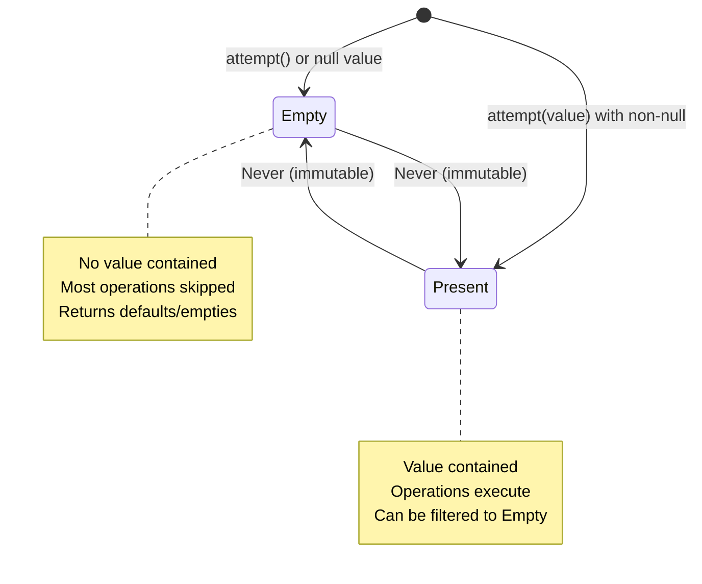
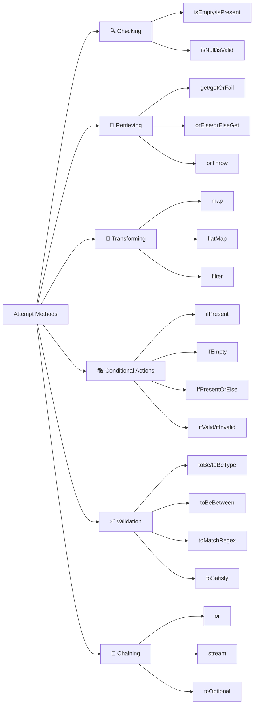
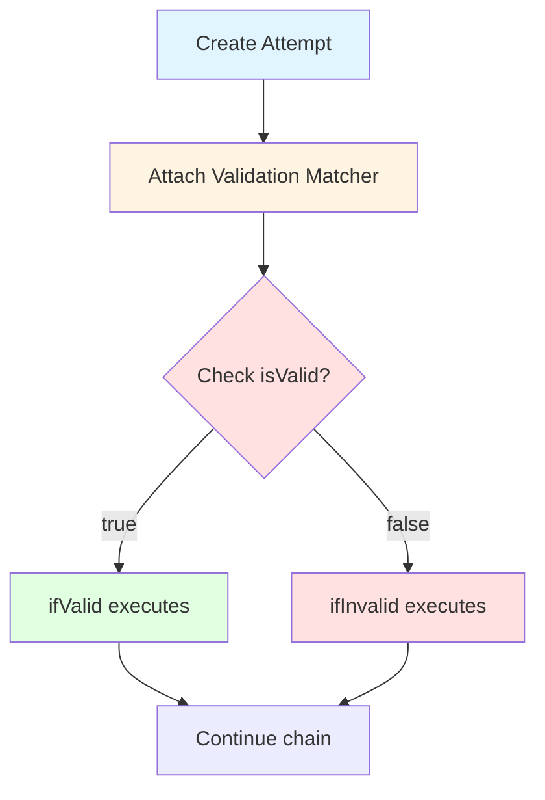

# 🎯 Attempts

Attempts in BoxLang are an enhanced Java [Optional](https://www.developer.com/java/java-optional-object/) that provides a **fluent, functional approach** to handling nullable values. Think of an Attempt as a smart container that can hold a value or be empty, with powerful methods for safely working with that value without null pointer exceptions.


**Key Benefits**: Attempts eliminate verbose null checks, enable declarative validation pipelines, and make your code more readable and maintainable through functional chaining patterns.


## 🌟 Why Use Attempts?

Attempts provide several advantages over traditional null handling:

- ✅ **Eliminate null checks** - No more `if (isNull(value))` everywhere
- ✅ **Fluent API** - Chain operations naturally: `.map().filter().orElse()`
- ✅ **Built-in validation** - Attach validation rules to create pipelines
- ✅ **Immutable** - Chain methods without mutating original values
- ✅ **Functional programming** - Write declarative, composable code
- ✅ **Error handling** - Convert missing values to exceptions or defaults gracefully

### Traditional vs Attempt Approach

```js
// ❌ Traditional approach - verbose and error-prone
user = userService.get( rc.id );
if ( isNull( user ) ) {
    throw( "UserNotFoundException" );
}
email = user.getEmail();
if ( isNull( email ) ) {
    throw( "Email not found" );
}
domain = email.listLast( "@" );

// ✅ Attempt approach - clean and declarative
attempt( userService.get( rc.id ) )
    .flatMap( user -> user.getEmail() )
    .map( email -> email.listLast( "@" ) )
    .ifPresentOrElse(
        domain -> println( "Domain: #domain#" ),
        () -> throw( "User or email not found" )
    );
```

Attempts are also **unmodifiable**, so you can chain methods to handle the value more functionally, but it never mutates the original value. It can also be seeded with validation information to create validation pipelines.

## 💻 Attempts in Code

Let's see practical examples of Attempts in action:

```js
// Simple value retrieval with default
cacheValue = attempt( getBoxCache().get( "user-123" ) )
    .orElse( "not-found" );

// Complex pipeline with validation
attempt( userService.get( rc.id ) )
    .filter( user -> user.isActive() )
    .map( user -> user.getEmail() )
    .ifPresentOrElse(
        email -> sendWelcome( email ),
        () -> logError( "No active user found" )
    );

// Multi-tier fallback lookup
data = attempt( dataService.findGlobally( id ) )
    .or( () -> dataService.findLocally( id ) )
    .or( () -> dataService.findInCache( id ) )
    .orElseGet( () -> dataService.createDefault( id ) );

// Validation pipeline
attempt( getCreditScore() )
    .toBeBetween( 700, 850 )
    .ifValid( score -> approveApplication( score ) )
    .ifInvalid( () -> denyApplication() );
```


**BoxLang Integration**: Many BoxLang BIFs and internal operations return `Attempts`, making it easy to integrate attempt-based patterns throughout your codebase.


## 🔄 Attempt States

An Attempt can exist in only **two states**:


```mermaid
stateDiagram-v2
    [*] --> Empty: attempt() or null value
    [*] --> Present: attempt(value) with non-null

    Empty --> Present: Never (immutable)
    Present --> Empty: Never (immutable)

    note right of Empty
        No value contained
        Most operations skipped
        Returns defaults/empties
    end note

    note right of Present
        Value contained
        Operations execute
        Can be filtered to Empty
    end note
```

### State Checking Methods

| Method | Returns | Description |
|--------|---------|-------------|
| `isEmpty()` | boolean | ✅ Core check - true if no value present |
| `isPresent()` | boolean | ✅ Core check - true if value exists |
| `isNull()` | boolean | 🔍 Value check - true if value is null |
| `hasFailed()` | boolean | 📝 Alias for `isEmpty()` - more readable for error handling |
| `wasSuccessful()` | boolean | 📝 Alias for `isPresent()` - more readable for success cases |

### Rules for Present State

An attempt is **present** if and only if:
- ✅ The value is **not null**

An attempt is **empty** if:
- ❌ The value is **null**
- ❌ Created with `attempt()` (no arguments)

### Examples

```js
// Empty attempts
attempt()
    .isEmpty();           // ✅ true
    .isPresent();         // ❌ false
    .hasFailed();         // ✅ true
    .wasSuccessful();     // ❌ false

attempt( null )
    .isEmpty();           // ✅ true
    .isNull();            // ✅ true

// Present attempts
attempt( "hello" )
    .isPresent();         // ✅ true
    .isEmpty();           // ❌ false
    .wasSuccessful();     // ✅ true

attempt( 0 )              // Even 0 is present!
    .isPresent();         // ✅ true

attempt( false )          // Even false is present!
    .isPresent();         // ✅ true

attempt( "" )             // Even empty string is present!
    .isPresent();         // ✅ true
```


**Important**: Only `null` makes an attempt empty. Empty strings, zero, false, and empty arrays/structs are all **present** values!


## 🏗️ Creating Attempts

Create attempts using the `attempt()` BIF (Built-In Function).

### Empty Attempt

Create an empty attempt by calling `attempt()` with no arguments:

```js
emptyAttempt = attempt();

emptyAttempt.isEmpty();      // true
emptyAttempt.isPresent();    // false
```


**Immutability**: Remember that attempts are **immutable** - you cannot change an empty attempt to a present one, or vice versa. Each operation returns a new attempt.


### Attempt with Value

Pass any value or expression to create an attempt that may be present or empty:

```js
// Direct values
attempt( "hello" );              // Present
attempt( 123 );                  // Present
attempt( null );                 // Empty
attempt( [ 1, 2, 3 ] );         // Present

// Expressions that might return null
attempt( userService.get( rc.id ) );
attempt( getBoxCache().get( "user-123" ) );
attempt( queryExecute( sql ).recordCount ? query : null );

// Function calls
attempt( getStudentByName( "luis" ) );
attempt( apiService.fetchUserData( userId ) );

// Struct access (might not exist)
attempt( config.database?.host );
```

### Creation Patterns

```js
// From service layer - might return null
user = attempt( userService.findById( 42 ) );

// From cache - might not be cached
cachedData = attempt( cacheGet( "myKey" ) );

// From API call - might fail
apiResult = attempt( httpGet( "https://api.example.com/data" ) );

// From database query - might return no rows
firstRow = attempt( queryExecute( "SELECT * FROM users WHERE id = ?" , [id] ).getRow( 1 ) );

// Conditional creation
validUser = attempt( user.isActive() ? user : null );
```

## 🛠️ Working with Attempts

Once you have an attempt, you can interact with it using a rich set of fluent methods. These methods fall into several categories:


```mermaid
graph LR
    A[Attempt Methods] --> B[🔍 Checking]
    A --> C[🎯 Retrieving]
    A --> D[🔄 Transforming]
    A --> E[🎭 Conditional Actions]
    A --> F[✅ Validation]
    A --> G[🔗 Chaining]

    B --> B1[isEmpty/isPresent]
    B --> B2[isNull/isValid]

    C --> C1[get/getOrFail]
    C --> C2[orElse/orElseGet]
    C --> C3[orThrow]

    D --> D1[map]
    D --> D2[flatMap]
    D --> D3[filter]

    E --> E1[ifPresent]
    E --> E2[ifEmpty]
    E --> E3[ifPresentOrElse]
    E --> E4[ifValid/ifInvalid]

    F --> F1[toBe/toBeType]
    F --> F2[toBeBetween]
    F --> F3[toMatchRegex]
    F --> F4[toSatisfy]

    G --> G1[or]
    G --> G2[stream]
    G --> G3[toOptional]
```

<details>

<summary>📖 Method Reference</summary>

### 🔍 State Checking Methods

#### `isEmpty():boolean`

Returns `true` if the attempt has no value (is null).

```js
attempt( null ).isEmpty();        // true
attempt( "value" ).isEmpty();     // false
```

#### `isPresent():boolean`

Returns `true` if the attempt contains a value (not null).

```js
attempt( "hello" ).isPresent();   // true
attempt( null ).isPresent();      // false
```

#### `isNull():boolean`

Returns `true` if the value is null.

```js
attempt( null ).isNull();         // true
attempt( 0 ).isNull();            // false
```

#### `hasFailed():boolean` / `wasSuccessful():boolean`

Fluent aliases for `isEmpty()` and `isPresent()` for more readable code.

```js
attempt( apiCall() )
    .hasFailed();                  // Same as isEmpty()

attempt( processData() )
    .wasSuccessful();              // Same as isPresent()
```

#### `equals( object ):boolean`

Compare two attempts for equality.

```js
attempt1 = attempt( "hello" );
attempt2 = attempt( "hello" );
attempt3 = attempt( "world" );

attempt1.equals( attempt2 );       // true
attempt1.equals( attempt3 );       // false

// Empty attempts are equal
attempt().equals( attempt() );     // true
```

### 🎯 Value Retrieval Methods

#### `get():any` / `getOrFail():any`

Get the value of the attempt. **Throws exception** if the attempt is empty.

```js
user = attempt( userService.findById( rc.id ) ).get();

// Throws NoElementException if empty
try {
    value = attempt( null ).get();  // ❌ Throws!
} catch ( any e ) {
    println( "No value present!" );
}

// getOrFail() is an alias for clarity
data = attempt( apiCall() ).getOrFail();
```


**Warning**: Only use `get()` when you're **certain** the value exists, or wrap in try/catch. Consider using `orElse()`, `orElseGet()`, or `orThrow()` for safer alternatives.


#### `orElse( defaultValue ):any` / `getOrDefault( defaultValue ):any`

Returns the value if present, otherwise returns the provided default.

```js
// orElse - functional style
username = attempt( session.username )
    .orElse( "Anonymous" );

// getOrDefault - more explicit
cacheValue = attempt( cacheGet( "key" ) )
    .getOrDefault( "not-found" );

// With complex defaults
config = attempt( loadConfig() )
    .orElse( { defaultSettings: true } );
```

#### `orElseGet( supplier ):any` / `getOrSupply( supplier ):any`

Returns the value if present, otherwise executes the supplier function and returns its result.

```js
// Only calls createDefault() if attempt is empty
data = attempt( fetchFromCache( id ) )
    .orElseGet( () -> createDefault( id ) );

// Expensive operation only when needed
user = attempt( getUserFromCache( userId ) )
    .getOrSupply( () -> {
        // Only runs if cache miss
        return userService.findById( userId );
    } );

// Multiple fallback layers
result = attempt( primarySource() )
    .orElseGet( () -> backupSource() );
```


**Performance Tip**: Use `orElseGet()` with a lambda when the default value is expensive to compute. It's only called if the attempt is empty. Use `orElse()` for simple values that are cheap to create.


#### `orThrow( [type], [message|exception] ):any`

Returns the value if present, otherwise throws an exception.

```js
// Throws NoElementException with default message
user = attempt( userService.findById( rc.id ) )
    .orThrow();

// Custom message
user = attempt( userService.findById( rc.id ) )
    .orThrow( "User with id [#rc.id#] not found" );

// Custom exception type and message
user = attempt( userService.findById( rc.id ) )
    .orThrow( "UserNotFoundException", "User #rc.id# does not exist" );

// Custom exception object
user = attempt( validateInput( data ) )
    .orThrow( new ValidationException( "Invalid data provided" ) );
```

### 🔄 Transformation Methods

#### `map( mapper ):attempt`

Transform the value if present by applying a function. Returns a new attempt with the transformed value.

```js
// Simple transformation
upperEmail = attempt( user.getEmail() )
    .map( email -> email.ucase() )
    .orElse( "" );

// Chaining transformations
fullName = attempt( user.getName() )
    .map( name -> name.trim() )
    .map( name -> name.ucase() )
    .orElse( "UNKNOWN" );

// Extract property
userDTO = attempt( userService.findById( rc.id ) )
    .map( user -> user.getMemento() )
    .orElse( {} );

// Multiple steps
domain = attempt( user.getEmail() )
    .map( email -> email.listLast( "@" ) )
    .map( domain -> domain.lcase() )
    .orElse( "unknown.com" );
```


**Map vs FlatMap**: Use `map()` when your mapper function returns a **regular value**. Use `flatMap()` when your mapper function returns an **Attempt**.


#### `filter( predicate ):attempt`

If a value is present and matches the given predicate, returns an Attempt with the value; otherwise, returns an empty Attempt.

```js
// Filter by age
attempt( userService.findById( 25 ) )
    .filter( user -> user.getAge() >= 21 )
    .ifPresentOrElse(
        user -> println( "User is of legal age" ),
        () -> println( "User is underage" )
    );

// Filter active users
activeUsers = users
    .map( userId -> attempt( userService.findById( userId ) ) )
    .filter( attempt -> attempt.isPresent() )
    .map( attempt -> attempt.get() )
    .filter( user -> user.isActive() );

// Multiple filters
validEmail = attempt( user.getEmail() )
    .filter( email -> email.len() > 0 )
    .filter( email -> email.findNoCase( "@" ) > 0 )
    .orElse( "no-email@example.com" );
```

#### `flatMap( mapper ):attempt`

Apply a function that returns an Attempt, flattening the result to avoid nested Attempts. Use this when your mapping function itself returns an Attempt.

**The Problem:** If `getEmail()` returns an Attempt and you use `map()`, you get `Attempt<Attempt<String>>` (nested).

**The Solution:** `flatMap()` automatically unwraps one level, giving you `Attempt<String>`.

```js
// Example: User.bx class
class User {
    property email;

    function getEmail() {
        // Returns an Attempt, not a String
        return attempt( variables.email );
    }
}

// ❌ Using map() creates nested Attempt<Attempt<String>>
nested = attempt( userService.findById( userId ) )
    .map( user -> user.getEmail() );  // Returns Attempt<Attempt<String>>

// ✅ Using flatMap() flattens to Attempt<String>
email = attempt( userService.findById( userId ) )
    .flatMap( user -> user.getEmail() )  // Returns Attempt<String>
    .orElse( "no-email@example.com" );
```

### Complete Example: Before and After

```js
// ❌ Traditional approach - verbose null checks
user = userService.findUserById( userId );
if ( isNull( user ) ) {
    throw( "Unable to find user" );
}

emailAttempt = user.getEmail();
if ( emailAttempt.isEmpty() ) {
    throw( "Email not present" );
}

email = emailAttempt.get();
domain = email.listLast( "@" );
println( "Email domain: #domain#" );

// ✅ Attempt approach - clean and declarative
attempt( userService.findUserById( userId ) )
    .flatMap( user -> user.getEmail() )       // Unwraps Attempt<String> from getEmail()
    .map( email -> email.listLast( "@" ) )    // Regular transformation
    .ifPresentOrElse(
        domain -> println( "Email domain: #domain#" ),
        () -> println( "Email not present" )
    );
```

### Chaining Multiple FlatMaps

```js
// Assume these methods return Attempts
class User {
    function getProfile() { return attempt( variables.profile ); }
}

class Profile {
    function getAddress() { return attempt( variables.address ); }
}

class Address {
    function getCity() { return attempt( variables.city ); }
}

// Chain through nested Attempts
city = attempt( userService.findById( userId ) )
    .flatMap( user -> user.getProfile() )
    .flatMap( profile -> profile.getAddress() )
    .flatMap( address -> address.getCity() )
    .orElse( "Unknown City" );
```

### 🎭 Conditional Action Methods

#### `ifPresent( action ):attempt` / `ifSuccessful( action ):attempt`

Execute an action if a value is present. Returns the same attempt for chaining.

```js
// Store data if API call succeeded
attempt( apiService.getUserData( rc.id ) )
    .ifPresent( data -> rc.user = data );

// ifSuccessful is an alias for better readability
attempt( saveToDatabase( record ) )
    .ifSuccessful( result -> logSuccess( "Saved record #result.id#" ) );

// Chaining multiple actions
attempt( userService.findById( rc.id ) )
    .ifPresent( user -> {
        populate( user, rc );
        user.save();
        logAudit( "User updated" );
    } );
```

#### `ifEmpty( action ):attempt` / `ifFailed( action ):attempt`

Execute an action if the attempt is empty. Returns the same attempt for chaining.

```js
// Log when user not found
attempt( userService.findById( rc.id ) )
    .ifEmpty( () -> log.warn( "User #rc.id# not found" ) );

// ifFailed is an alias for error handling contexts
attempt( apiCall() )
    .ifFailed( () -> metrics.incrementFailureCount() );

// Combined with ifPresent
attempt( processPayment( order ) )
    .ifSuccessful( receipt -> sendConfirmation( receipt ) )
    .ifFailed( () -> notifyAdmin( "Payment failed for order #order.id#" ) );
```

#### `ifPresentOrElse( presentAction, emptyAction ):attempt`

Execute one of two actions based on whether the value is present.

```js
// Handle both success and failure cases
attempt( apiService.getUserData( rc.id ) )
    .ifPresentOrElse(
        data -> rc.user = data,
        () -> rc.user = getGuestUser()
    );

// With complex logic
attempt( fetchLatestData() )
    .ifPresentOrElse(
        data -> {
            cache.set( "latest", data );
            updateUI( data );
        },
        () -> {
            log.error( "Failed to fetch latest data" );
            useStaleData();
        }
    );
```

### 🔗 Chaining and Fallback Methods

#### `or( supplier ):attempt`

If empty, returns a new Attempt produced by the supplier function. Great for fallback chains.

```js
// Try multiple sources in order
data = attempt( findInCache( id ) )
    .or( () -> attempt( findInDatabase( id ) ) )
    .or( () -> attempt( findInArchive( id ) ) )
    .orElse( null );

// Multi-tier lookup with different sources
user = attempt( userService.findGlobally( userId ) )
    .or( () -> userService.findLocally( userId ) )
    .or( () -> userService.findInCache( userId ) )
    .orThrow( "User not found anywhere" );

// Try primary, then backup server
apiResult = attempt( primaryAPI.getData() )
    .or( () -> {
        log.warn( "Primary API failed, trying backup" );
        return backupAPI.getData();
    } )
    .orElseGet( () -> getDefaultData() );
```

### 🌊 Stream Integration

#### `stream():Stream<T>`

Convert the attempt to a Java Stream. If present, returns a single-element stream; if empty, returns an empty stream.

```js
// Filter out empty attempts when processing collections
people = [
    { name: "Luis", address: attempt( { city: "New York" } ) },
    { name: "Jaime", address: attempt() },
    { name: "Jon", address: attempt( { city: "Grand Rapids" } ) },
    { name: "Ana", address: attempt() },
    { name: "Edgardo", address: attempt( { city: "San Salvador" } ) }
];

// Extract cities from people who have addresses
cities = people
    .stream()
    .map( person -> person.address )        // Get Attempt<Address>
    .flatMap( attempt -> attempt.stream() ) // Flatten: discards empties
    .map( address -> address.city )         // Extract city
    .toList();
// Result: ["New York", "Grand Rapids", "San Salvador"]

// Count successful operations
successCount = operations
    .stream()
    .map( op -> attempt( op.execute() ) )
    .flatMap( attempt -> attempt.stream() )
    .count();
```

#### `toOptional():Optional<T>`

Convert the attempt to a Java `Optional` for interoperability with Java code.

```js
// When calling Java libraries expecting Optional
javaService = createObject( "java", "com.example.Service" );

boxlangAttempt = attempt( getData() );
javaOptional = boxlangAttempt.toOptional();

javaService.processData( javaOptional );
```

### 🔧 Utility Methods

#### `toString():String`

Get a string representation of the attempt.

```js
println( attempt().toString() );         // "Attempt.empty"
println( attempt( "hello" ).toString() ); // "Attempt[hello]"
println( attempt( 123 ).toString() );     // "Attempt[123]"
println( attempt( null ).toString() );    // "Attempt.empty"

// Useful for debugging
log.debug( "User attempt: #userAttempt.toString()#" );
```

#### `hashCode():int` / `equals( object ):boolean`

Standard Java object methods for use in collections and comparisons.

```js
// Create a map with attempts as keys
attemptMap = {};
attempt1 = attempt( "key1" );
attemptMap[ attempt1 ] = "value1";

// Equality comparison
if ( attempt1.equals( attempt2 ) ) {
    println( "Attempts are equal" );
}
```

</details>

<details>

<summary>✅ Validation Pipelines</summary>

Attempts provide powerful validation capabilities that let you attach validation rules and create validation pipelines. This is perfect for input validation, business rules, and data quality checks.

### Validation Flow


```mermaid
graph TD
    A[Create Attempt] --> B[Attach Validation Matcher]
    B --> C{Check isValid?}
    C -->|true| D[ifValid executes]
    C -->|false| E[ifInvalid executes]
    D --> F[Continue chain]
    E --> F

    style A fill:#e1f5ff
    style B fill:#fff4e1
    style C fill:#ffe1e1
    style D fill:#e1ffe1
    style E fill:#ffe1e1
```

### Validation Process

1. **Attach Matcher** - Use `to{Method}()` to register validation rules
2. **Check Validity** - Use `isValid():boolean` to test if value matches rules
3. **Conditional Actions** - Use `ifValid()` / `ifInvalid()` for conditional execution


**Important**: If the attempt is **empty**, `isValid()` always returns **false**, regardless of validation rules.


### 🎯 Validation Matchers

#### `toBe( value ):attempt`

Validate that the value exactly equals another value.

```js
// Exact match validation
attempt( "admin" )
    .toBe( "admin" )
    .isValid();              // true

attempt( getUserRole() )
    .toBe( "administrator" )
    .ifValid( role -> grantFullAccess() )
    .ifInvalid( () -> restrictAccess() );

// Numeric equality
attempt( getStatusCode() )
    .toBe( 200 )
    .ifValid( () -> processSuccess() );
```

#### `toBeBetween( min, max ):attempt`

Validate that a numeric value falls within a range (inclusive).

```js
// Credit score validation
attempt( getCreditScore() )
    .toBeBetween( 700, 850 )
    .ifValid( score -> approveApplication( score ) )
    .ifInvalid( () -> denyApplication() );

// Age verification
attempt( user.age )
    .toBeBetween( 18, 120 )
    .ifValid( age -> processAdultContent() )
    .ifInvalid( () -> redirectToError() );

// Temperature range check
attempt( getSensorReading() )
    .toBeBetween( -50, 50 )
    .ifInvalid( () -> triggerAlert( "Temperature out of range!" ) );

// Price validation
attempt( product.price )
    .toBeBetween( 0.01, 999999.99 )
    .ifValid( price -> addToCart( product ) );
```

#### `toBeType( type ):attempt`

Validate against BoxLang types using the `isValid()` BIF type system.

```js
// Struct validation
attempt( getUserData() )
    .toBeType( "struct" )
    .ifValid( data -> processUserData( data ) );

// Email validation
attempt( input.email )
    .toBeType( "email" )
    .ifValid( email -> sendConfirmation( email ) )
    .ifInvalid( () -> showError( "Invalid email address" ) );

// URL validation
attempt( config.apiEndpoint )
    .toBeType( "url" )
    .ifInvalid( () -> throw( "Invalid API endpoint" ) );

// UUID validation
attempt( request.sessionId )
    .toBeType( "uuid" )
    .ifValid( id -> loadSession( id ) );

// Common types: string, numeric, boolean, date, struct, array, query, email, url, uuid, xml
```


**Type Reference**: See the [isValid() BIF documentation](../reference/built-in-functions/decision/IsValid.md) for all available type validators.


#### `toMatchRegex( pattern, [caseSensitive=true] ):attempt`

Validate against a regular expression pattern.

```js
// Phone number format
attempt( user.phone )
    .toMatchRegex( "^\d{3}-\d{3}-\d{4}$" )
    .ifValid( phone -> sendSMS( phone ) );

// HTTP status pattern
attempt( getHTTPCall().status )
    .toMatchRegex( "^2\d{2}$" )  // 2xx success codes
    .ifValid( () -> processSuccessfulResponse() )
    .ifInvalid( () -> handleError() );

// Case-insensitive matching
attempt( getCountryCode() )
    .toMatchRegex( "^(US|CA|MX)$", false )  // case-insensitive
    .ifValid( code -> setShippingRates( code ) );

// Username format validation
attempt( input.username )
    .toMatchRegex( "^[a-zA-Z0-9_]{3,20}$" )
    .ifInvalid( () -> addError( "Invalid username format" ) );

// Postal code validation
attempt( address.postalCode )
    .toMatchRegex( "^\d{5}(-\d{4})?$" )  // US ZIP code
    .ifValid( zip -> validateAddress() );
```

#### `toSatisfy( predicate ):attempt`

Custom validation using a closure/lambda. Most flexible approach.

```js
// Custom business rule
attempt( getUser() )
    .toSatisfy( user -> user.age >= 21 && user.country == "US" )
    .ifValid( user -> allowAlcoholPurchase( user ) );

// Complex validation logic
attempt( order )
    .toSatisfy( order -> {
        return order.total > 0
            && order.items.len() > 0
            && !order.isCancelled();
    } )
    .ifValid( order -> processPayment( order ) );

// Multiple conditions
attempt( password )
    .toSatisfy( pwd -> {
        hasLength = pwd.len() >= 8;
        hasUpper = reFind( "[A-Z]", pwd );
        hasLower = reFind( "[a-z]", pwd );
        hasNumber = reFind( "[0-9]", pwd );
        return hasLength && hasUpper && hasLower && hasNumber;
    } )
    .ifInvalid( () -> addError( "Password does not meet requirements" ) );

// External validation function
attempt( userData )
    .toSatisfy( data -> validationService.validateUser( data ) )
    .ifValid( data -> createAccount( data ) );
```

### 🎨 Validation Method Reference

| Method | Returns | Description |
|--------|---------|-------------|
| `isValid()` | boolean | ✅ Returns true if value is present AND passes validation rules |
| `ifValid( action )` | attempt | 🎯 Executes action if value is valid |
| `ifInvalid( action )` | attempt | ❌ Executes action if value is invalid or empty |

```js
// Check validity
isGoodScore = attempt( getCreditScore() )
    .toBeBetween( 700, 850 )
    .isValid();  // true or false

// Execute on valid
attempt( getCreditScore() )
    .toBeBetween( 700, 850 )
    .ifValid( score -> println( "Excellent credit: #score#" ) );

// Execute on invalid
attempt( getCreditScore() )
    .toBeBetween( 700, 850 )
    .ifInvalid( () -> println( "Credit score below threshold" ) );

// Both together
attempt( getCreditScore() )
    .toBeBetween( 700, 850 )
    .ifValid( score -> approveApplication( score ) )
    .ifInvalid( () -> denyApplication() );
```

### 🔗 Validation Pipeline Examples

#### Multi-Stage Validation

```js
// Validate user registration
attempt( registrationForm )
    .toBeType( "struct" )
    .toSatisfy( form -> form.keyExists( "email" ) && form.keyExists( "password" ) )
    .flatMap( form -> attempt( form.email ).toBeType( "email" ) )
    .flatMap( email -> attempt( form.password ).toSatisfy( pwd -> pwd.len() >= 8 ) )
    .ifValid( () -> createUser( registrationForm ) )
    .ifInvalid( () -> showValidationErrors() );
```

#### API Input Validation

```js
// Validate API request
function processAPIRequest( requestData ) {
    return attempt( requestData )
        .toBeType( "struct" )
        .toSatisfy( data -> data.keyExists( "apiKey" ) )
        .toSatisfy( data -> validateApiKey( data.apiKey ) )
        .ifValid( data -> executeRequest( data ) )
        .ifInvalid( () -> throw( type="InvalidRequest", message="Invalid API request" ) )
        .orThrow();
}
```

#### Form Validation Pipeline

```js
// Age verification form
attempt( form.age )
    .toBeType( "numeric" )
    .toBeBetween( 0, 150 )
    .toSatisfy( age -> age >= 21 )
    .ifValid( age -> {
        session.ageVerified = true;
        redirectTo( "restricted-content" );
    } )
    .ifInvalid( () -> {
        addError( "Must be 21 or older" );
        redirectTo( "age-verification" );
    } );
```

### 💡 Validation Best Practices

1. ✅ **Attach validators early** - Register validation rules as soon as you create the attempt
2. ✅ **Use specific validators** - Prefer `toBeType()` and `toMatchRegex()` over generic `toSatisfy()` when possible
3. ✅ **Chain validations** - Combine multiple validators for complex rules
4. ✅ **Handle both paths** - Use both `ifValid()` and `ifInvalid()` for complete flow control
5. ✅ **Return attempts from validators** - Enable fluent validation chains
6. ✅ **Document validation rules** - Comment complex `toSatisfy()` predicates
7. ✅ **Test empty cases** - Remember that empty attempts are always invalid

```js
// ✅ Good: Clear, specific, handles both cases
attempt( getCreditScore() )
    .toBeBetween( 700, 850 )
    .ifValid( score -> approveApplication( score ) )
    .ifInvalid( () -> denyApplication() );

// ❌ Avoid: Unclear, doesn't handle invalid case
score = attempt( getCreditScore() ).get();
if ( score >= 700 && score <= 850 ) {
    approveApplication( score );
}
```
</details>

---

<details open>

<summary>📚 Best Practices Summary</summary>

### When to Use Attempts

✅ **Good Use Cases:**
- **External API calls** - Network requests that may fail or return null
- **Database queries** - Queries that may return no results
- **Configuration lookups** - Config values that may not exist
- **File operations** - File reads that may fail
- **User input processing** - Form data that may be missing or invalid
- **Optional calculations** - Operations that may not produce a result
- **Service responses** - Backend services that may timeout or error

❌ **Avoid Using Attempts For:**
- Simple null checks - Use elvis operator instead
- Values that are never null - Unnecessary overhead
- Control flow logic - Use conditionals instead
- Exception handling - Use try/catch for exception control

### Design Patterns

#### 1. 🎯 Fail Fast with `orThrow()`

```js
// Validate immediately, throw if missing
config = attempt( getConfig( "apiKey" ) )
    .orThrow( "Missing API key configuration" );
```

#### 2. 🔄 Transform Chains

```js
// Clean transformation pipelines
result = attempt( getUserId() )
    .map( id -> loadUser( id ) )
    .map( user -> user.profile )
    .filter( profile -> profile.isActive )
    .orElse( getDefaultProfile() );
```

#### 3. 🎭 Conditional Logic

```js
// Handle presence/absence elegantly
attempt( getOptionalFeature() )
    .ifPresent( feature -> enableFeature( feature ) )
    .ifEmpty( () -> useDefaultBehavior() );
```

#### 4. 🔗 Fallback Chains

```js
// Try multiple sources in order
data = attempt( getPrimaryCache() )
    .or( () -> attempt( getSecondaryCache() ) )
    .or( () -> attempt( getDatabaseValue() ) )
    .orElseGet( () -> computeDefault() );
```

#### 5. ✅ Validation Pipelines

```js
// Multi-stage validation
attempt( formData )
    .toBeType( "struct" )
    .toSatisfy( data -> data.keyExists( "email" ) )
    .flatMap( data -> attempt( data.email ).toBeType( "email" ) )
    .ifValid( data -> processForm( data ) )
    .ifInvalid( () -> showErrors() );
```

### Performance Considerations

1. **Immutability Cost** - Each operation creates a new attempt; minimize in hot loops
2. **Validation Overhead** - Matchers add small overhead; cache validation results if needed
3. **Closure Creation** - Lambdas in `map`/`flatMap` have allocation cost; extract to functions in tight loops
4. **Stream Integration** - Converting to streams adds overhead; only use when needed

```js
// ✅ Good: Single transformation chain
results = data.map( item ->
    attempt( processItem( item ) )
        .map( result -> transform( result ) )
        .orElse( defaultValue )
);

// ❌ Avoid: Creating unnecessary attempts in loops
for ( item in data ) {
    // Creates attempt object every iteration even if not needed
    temp = attempt( item ).orElse( item );
}
```

### Code Style Guidelines

1. **Use descriptive variable names** for attempts:
   ```js
   userAttempt = attempt( loadUser( id ) );
   configAttempt = attempt( getConfig( key ) );
   ```

2. **Prefer method chaining** for readability:
   ```js
   // ✅ Good
   attempt( data )
       .map( transform )
       .filter( validate )
       .orElse( defaultValue );
   ```

3. **Extract complex lambdas** to separate functions:
   ```js
   // ✅ Good
   function validateUser( user ) {
       return user.age >= 18 && user.email.len() > 0;
   }

   attempt( getUser() )
       .toSatisfy( validateUser )
       .ifValid( processUser );
   ```

4. **Use `orElse()` for simple defaults**, `orElseGet()` for computed defaults:
   ```js
   // Simple value - use orElse
   name = attempt( user.name ).orElse( "Anonymous" );

   // Computed value - use orElseGet (lambda only runs if needed)
   data = attempt( getCache() ).orElseGet( () -> expensiveComputation() );
   ```

### Common Mistakes to Avoid

❌ **Don't call `get()` without checking**:
```js
// Bad - throws if empty
value = attempt( data ).get();

// Good - safe default
value = attempt( data ).orElse( defaultValue );
```

❌ **Don't use `map()` when you need `flatMap()`**:
```js
// Bad - returns Attempt<Attempt<T>>
attempt( id ).map( id -> attempt( loadUser( id ) ) );

// Good - returns Attempt<T>
attempt( id ).flatMap( id -> attempt( loadUser( id ) ) );
```

❌ **Don't ignore validation rules**:
```js
// Bad - validation never checked
attempt( data )
    .toBeBetween( 1, 100 )
    .orElse( defaultValue );  // Validation ignored!

// Good - check validation explicitly
attempt( data )
    .toBeBetween( 1, 100 )
    .filter( value -> attempt( value ).toBeBetween( 1, 100 ).isValid() )
    .orElse( defaultValue );
```

❌ **Don't create attempts for values you know exist**:
```js
// Bad - unnecessary
value = attempt( 42 ).orElse( 0 );

// Good - direct assignment
value = 42;
```

</details>

---

## 🔗 Related Documentation

- [Conditionals](../../conditionals.md) - Control flow and logical operators
- [Exception Management](../../exception-management.md) - Error handling and try/catch
- [Null and Nothingness](../../null-and-nothingness.md) - Understanding null values in BoxLang
- [Closures](../../closures.md) - Lambda expressions and functional programming
- [Operators](../../operators.md) - Elvis operator and safe navigation
- [isValid() BIF](../../reference/built-in-functions/decision/IsValid.md) - Type validation reference

---

## 🎓 Summary

The **Attempt** class is BoxLang's answer to safe optional value handling with built-in validation. It provides:

- ✅ **Null Safety** - Eliminates null pointer errors
- ✅ **Validation** - Built-in type and custom validation rules
- ✅ **Fluent API** - Chainable operations for clean code
- ✅ **Functional Style** - Map, filter, flatMap for transformations
- ✅ **Explicit Handling** - Forces you to think about empty cases
- ✅ **Composability** - Easily combine with other attempts

Use attempts whenever you're dealing with values that **might not exist** or **might be invalid**, and let the type system guide you to handle both cases correctly.


**Pro Tip**: Start using attempts for API calls, database queries, and configuration lookups. Once you're comfortable, expand usage to form validation and data transformation pipelines.

