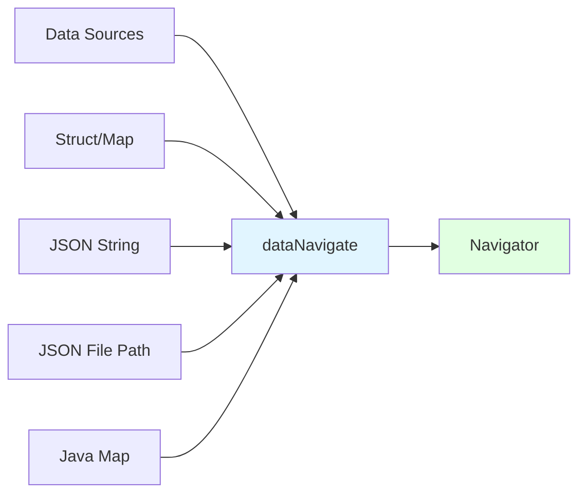
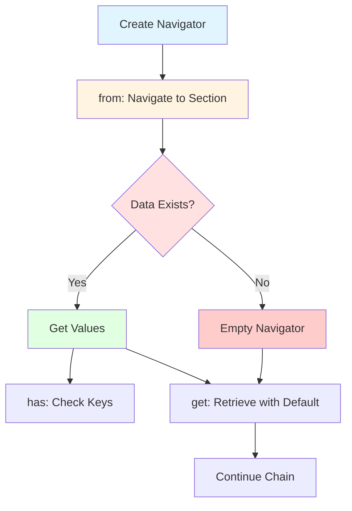

# Data Navigators

Data Navigators are a powerful BoxLang feature that provides a fluent, chainable interface for safely navigating and extracting data from complex data structures. Whether you're working with JSON files, API responses, configuration data, or nested structures, Data Navigators eliminate the need for verbose null checking and provide elegant error handling.

## 🎯 Why Use Data Navigators?

Data Navigators solve common problems when working with complex data:

✅ **Safe Navigation** - No more "key doesn't exist" errors when traversing nested structures

✅ **Fluent Interface** - Chainable methods that read like natural language

✅ **Dynamic Typing** - BoxLang automatically handles type conversions

✅ **Multiple Data Sources** - Works with JSON strings, files, structures, maps, and more

✅ **Flexible Extraction** - Get values with defaults, throw on missing data, or check existence

✅ **Conditional Processing** - Execute code only when values are present

✅ **Immutable Navigation** - Each navigation returns a new navigator, safe for concurrent use

### Traditional vs Navigator Approach

```js
// ❌ Traditional: Verbose null checking
if ( structKeyExists( config, "database" ) ) {
    if ( structKeyExists( config.database, "connection" ) ) {
        if ( structKeyExists( config.database.connection, "pool" ) ) {
            maxSize = config.database.connection.pool.maxSize ?: 10;
        } else {
            maxSize = 10;
        }
    } else {
        maxSize = 10;
    }
} else {
    maxSize = 10;
}

// ✅ With Navigator: Clean and safe
maxSize = dataNavigate( config ).get( ["database", "connection", "pool", "maxSize"], 10 );
```

## 🚀 Getting Started

### Creating a Data Navigator

Use the `dataNavigate()` BIF to create a navigator from various data sources:



```js
// From a structure
config = {
    "app": {
        "name": "MyApp",
        "version": "1.0.0",
        "database": {
            "host": "localhost",
            "port": 5432,
            "ssl": true
        }
    }
};
nav = dataNavigate( config );

// From a JSON string
jsonData = '{"users": [{"name": "Alice", "age": 30}, {"name": "Bob", "age": 25}]}';
nav = dataNavigate( jsonData );

// From a JSON file
nav = dataNavigate( "/path/to/config.json" );

// From a Java Map
javaMap = createObject( "java", "java.util.HashMap" ).init();
javaMap.put( "key", "value" );
nav = dataNavigate( javaMap );
```


**Auto-Detection**: The `dataNavigate()` BIF automatically detects the data source type - if it's a valid file path, it loads the JSON file; if it's a string with JSON syntax, it parses it; otherwise, it treats it as a structure.


### Basic Navigation

Navigate through nested structures using the fluent interface:



```js
// Setup test data
appConfig = {
    "application": {
        "name": "BoxLang App",
        "version": "2.0.0",
        "features": {
            "caching": true,
            "logging": {
                "level": "INFO",
                "appenders": [ "console", "file" ]
            }
        }
    }
};

nav = dataNavigate( appConfig );

// Navigate to a specific section
loggingNav = nav.from( ["application", "features", "logging"] );

// Get values with defaults
logLevel = loggingNav.get( "level", "DEBUG" );
println( "Log Level: #logLevel#" ); // "INFO"

// Check if values exist
if ( loggingNav.has( "appenders" ) ) {
    appenders = loggingNav.get( "appenders" );
    println( "Appenders: #appenders.toList()#" );
}
```


**Chaining**: Every navigation method returns a navigator, so you can chain operations fluently: `dataNavigate(data).from("a").from("b").get("c", default)`


## JSONPath-Style Path Expressions

In addition to variadic-key navigation, DataNavigator supports JSONPath-style expressions in `get()`, `has()`, and `query()`. These expressions let you navigate nested data using a compact string syntax with dot notation, array indexing, recursive descent, wildcards, slices, and filters.

| Syntax | Description | Example |
|--------|-------------|---------|
| **Dot notation** | Navigate nested object keys | `boxlang.settings.hello` |
| **Array index** | Access a 1-based array element | `keywords[1]` |
| **Recursive descent** | Find the first or all matching keys anywhere in the tree | `..hello` |
| **Wildcard** | Match all struct values or array items | `boxlang.settings.*`, `keywords[*]` |
| **Slice** | Match a range of array elements | `keywords[1:2]` |
| **Filter** | Match array elements by condition | `items[?(@.active == true)]` |
| **Whitespace tolerance** | Ignore leading/trailing and separator-adjacent whitespace | `..hello`, `keywords [ * ]` |

```js
nav = dataNavigate( config );

// Dot notation for nested structs
nav.get( "boxlang.settings.hello" );   // "luis"

// 1-based array indexing
nav.get( "keywords[1]" );              // "test"

// Recursive descent — finds first match anywhere in the tree
nav.get( "..hello" );                  // "luis"

// Whitespace tolerant
nav.get( "   ..hello" );               // "luis"
```

When a single string argument contains `.` or `[`, it is treated as a path expression. Plain keys without these characters and multi-argument calls use the original variadic-key behavior unchanged.

## 🧭 Core Navigation Methods

### `from( key ):Navigator` / `from( [key1, key2, ...] ):Navigator`

Navigate to a specific segment in the data structure. Returns a new navigator scoped to that segment.

```js
// Single-level navigation
userNav = dataNavigate( userData ).from( "profile" );
dbNav = dataNavigate( config ).from( "database" );

// Multi-level navigation (nested path)
loggingNav = dataNavigate( config ).from( ["application", "features", "logging"] );

// Chained navigation (multiple calls)
deepNav = dataNavigate( complexData )
    .from( "api" )
    .from( "v1" )
    .from( "endpoints" )
    .from( "users" );

// Safe navigation - returns empty navigator if path doesn't exist
missingNav = dataNavigate( config ).from( ["nonexistent", "path"] );
println( missingNav.isEmpty() ); // true
```


**Type Safety**: The `from()` method requires the target to be a struct/map. If you navigate to a non-struct value (like a string or number), it throws a `BoxRuntimeException`.


### `has( key ):boolean` / `has( [key1, key2, ...] ):boolean`

Check if a key or nested path exists in the current segment. Supports variadic keys and JSONPath-style path expressions.

```js
nav = dataNavigate( config );

// Check single key
hasDatabase = nav.has( "database" );        // true/false

// Check nested path (variadic)
hasSSLConfig = nav.has( ["database", "ssl", "enabled"] );

// JSONPath-style path expressions
nav.has( "boxlang.settings.hello" );            // true
nav.has( "..hello" );                           // true - recursive descent
nav.has( "keywords[*]" );                       // true - wildcard
nav.has( "keywords[1:2]" );                     // true - slice
nav.has( "items[?(@.active == true)]" );        // true - filter
nav.has( "items[?(@.active == true)].name" );   // true - filter + key
nav.has( "settings.nullable" );                 // true, even when value is null

// Use in conditionals
if ( nav.has( ["features", "caching"] ) ) {
    setupCaching();
}

// Combined with from()
cacheNav = nav.from( "cache" );
if ( cacheNav.has( ["redis", "host"] ) ) {
    connectToRedis( cacheNav.get( ["redis", "host"] ) );
}
```

### `isEmpty():boolean` / `isPresent():boolean`

Check if the current segment is empty or has data.

```js
nav = dataNavigate( config );

// Check current segment
userNav = nav.from( "users" );
if ( userNav.isPresent() ) {
    println( "Users section exists and has data" );
}

if ( userNav.isEmpty() ) {
    println( "Users section is empty or doesn't exist" );
    useDefaultUsers();
}

// Common pattern: Check before processing
cacheNav = nav.from( "cache" );
if ( cacheNav.isPresent() ) {
    configureCaching( cacheNav );
} else {
    disableCaching();
}
```

## 🎯 Data Extraction Methods

### `get( key, [default] ):Object` / `get( [key1, key2, ...], [default] ):Object`

Get a value from the data structure using nested keys. Returns the value or default if not found. When called with a single string containing `.` or `[`, it is treated as a JSONPath-style path expression.

```js
nav = dataNavigate( appConfig );

// Single key
appName = nav.get( "name" );                    // Raw value or null

// Nested keys (variadic path navigation)
dbHost = nav.get( ["database", "host"] );         // Traverse nested structure
sslEnabled = nav.get( ["database", "ssl", "enabled"] );

// JSONPath-style path expressions (single string with dots/brackets)
dotPath = nav.get( "boxlang.settings.hello" );  // "luis"
arrayItem = nav.get( "keywords[1]" );           // 1-based index
recursive = nav.get( "..hello" );               // Deep search, first match

// With default value
timeout = nav.get( ["application", "timeout"], 30 );
retries = nav.get( ["application", "retries"], 3 );
apiUrl = nav.get( ["api", "baseUrl"], "https://api.example.com" );

// Complex types work too (automatic casting)
dbConfig = nav.get( "database" );               // Returns struct
serverList = nav.get( "servers" );              // Returns array
```


**Dynamic Typing**: BoxLang's dynamic nature means `get()` automatically handles type conversions. Maps become Structs, Lists become Arrays. You usually don't need the typed getters unless you need explicit casting.


### `getOrThrow( key ):Object` / `getOrThrow( [key1, key2, ...] ):Object`

Get a value or throw a `BoxRuntimeException` if the key doesn't exist. Use for required configuration.

```js
nav = dataNavigate( config );

// Required configuration - throws if missing
apiKey = nav.getOrThrow( "api", "key" );
dbHost = nav.getOrThrow( "database", "host" );
secretToken = nav.getOrThrow( "security", "token" );

// Use in initialization where missing config should fail fast
function initializeApp( configPath ) {
    nav = dataNavigate( configPath );

    // These MUST exist or app won't start
    appName = nav.getOrThrow( "app", "name" );
    version = nav.getOrThrow( "app", "version" );
    environment = nav.getOrThrow( "app", "environment" );

    return { appName, version, environment };
}
```


**Fail Fast**: Use `getOrThrow()` for critical configuration that must exist. This prevents runtime errors later and makes configuration requirements explicit.


### Typed Getter Methods

For explicit type conversion, use typed getters. Each method casts the value to the specified type.

| Method | Return Type | Purpose |
|--------|-------------|---------|
| `getAsString( key, [default] )` | String | Cast to string |
| `getAsString( [key1, key2, ...], [default] )` | String | Cast to string (nested path) |
| `getAsBoolean( key, [default] )` | Boolean | Cast to boolean |
| `getAsBoolean( [key1, key2, ...], [default] )` | Boolean | Cast to boolean (nested path) |
| `getAsInteger( key, [default] )` | Integer | Cast to integer (32-bit) |
| `getAsInteger( [key1, key2, ...], [default] )` | Integer | Cast to integer (nested path) |
| `getAsLong( key, [default] )` | Long | Cast to long (64-bit) |
| `getAsLong( [key1, key2, ...], [default] )` | Long | Cast to long (nested path) |
| `getAsDouble( key, [default] )` | Double | Cast to double/decimal |
| `getAsDouble( [key1, key2, ...], [default] )` | Double | Cast to double/decimal (nested path) |
| `getAsDate( key, [default] )` | DateTime | Cast to DateTime object |
| `getAsDate( [key1, key2, ...], [default] )` | DateTime | Cast to DateTime (nested path) |
| `getAsStruct( key, [default] )` | IStruct | Cast to struct/map |
| `getAsStruct( [key1, key2, ...], [default] )` | IStruct | Cast to struct/map (nested path) |
| `getAsArray( key, [default] )` | Array | Cast to array |
| `getAsArray( [key1, key2, ...], [default] )` | Array | Cast to array (nested path) |
| `getAsKey( key, [default] )` | Key | Cast to Key object |
| `getAsKey( [key1, key2, ...], [default] )` | Key | Cast to Key object (nested path) |

```js
nav = dataNavigate( serverConfig );

// Explicit type casting
port = nav.getAsInteger( "server", "port", 8080 );           // 8080 (integer)
timeout = nav.getAsLong( "server", "timeout", 5000 );        // 5000L (long)
loadFactor = nav.getAsDouble( "server", "loadFactor", 0.75 ); // 0.75 (double)
sslEnabled = nav.getAsBoolean( "server", "ssl", false );     // true/false
lastUpdated = nav.getAsDate( "server", "lastUpdated" );      // DateTime

// Complex types
dbConfig = nav.getAsStruct( "database" );                    // IStruct
serverList = nav.getAsArray( "servers" );                    // Array
keyName = nav.getAsKey( "keyField", "defaultKey" );          // Key object

// Useful when parsing configuration strings
maxConnections = nav.getAsInteger( "pool", "max", "10" );    // Parses "10" to 10
retryEnabled = nav.getAsBoolean( "retry", "enabled", "yes" ); // Parses "yes" to true
```


**When to Use Typed Getters**: Use typed getters when you need guaranteed type conversion (e.g., parsing string config values to numbers) or when working with APIs that expect specific types. Otherwise, `get()` is usually sufficient thanks to BoxLang's dynamic typing.


### `query( path ):Array`

Query the data structure using a path expression and return all matching values as an Array. Unlike `get()`, which returns a single value, `query()` fans out at wildcards, slices, and filters to collect every match. Null values that are explicitly reachable are preserved in the result.

```js
nav = dataNavigate( config );

// Single match is wrapped in an array
nav.query( "name" );                     // [ "BoxLang Test Module" ]

// Recursive descent collects all matches
nav.query( "..hello" );                  // [ "luis" ]

// Wildcard — all struct values or array elements
nav.query( "keywords[*]" );              // [ "test", "example" ]
nav.query( "boxlang.settings.*" );       // [ "luis" ]

// Slice — 1-based inclusive range
nav.query( "keywords[1:2]" );            // [ "test", "example" ]

// Filter — only elements matching the condition
nav.query( "items[?(@.active == true)]" );
// Result:
// [
//   { "name": "alpha", "active": true },
//   { "name": "gamma", "active": true }
// ]

// Null values are preserved
nav.query( "settings.nullable" );        // [ null ]
```

### `getByKey( key ):Object`

Get a value by exact key lookup — dots and brackets are treated as literal characters, not path separators. Use this when your data contains keys like `"value.sep"`.

```js
nav = dataNavigate( {
    "value.sep": "root",
    "settings": { "value.sep": "nested" }
} );

nav.getByKey( "value.sep" );                    // "root"
nav.from( "settings" ).getByKey( "value.sep" ); // "nested"
nav.getByKey( "settings.value.sep" );           // null (exact key lookup only)

// Compare with get() which interprets dots as path navigation:
nav.get( "settings.value.sep" );                // "nested" (path navigation)
```

### `hasByKey( key ):boolean`

Check if an exact key exists, treating dots and brackets as literal characters.

```js
nav = dataNavigate( {
    "value.sep": "root",
    "settings": { "value.sep": "nested" }
} );

nav.hasByKey( "value.sep" );                    // true
nav.from( "settings" ).hasByKey( "value.sep" ); // true
nav.hasByKey( "settings.value.sep" );           // false (exact key doesn't exist)
```

## 🎭 Conditional Processing

### `ifPresent( key, consumer ):Navigator`

Execute a function if a key exists in the current segment. Returns the navigator for chaining.

```js
nav = dataNavigate( userProfile );

// Execute if key exists
nav.ifPresent( "email", ( email ) -> {
    println( "User email: #email#" );
    sendWelcomeEmail( email );
} );

// Process optional configuration
nav.ifPresent( "analytics", ( analyticsConfig ) -> {
    enableAnalytics( analyticsConfig );
    println( "Analytics enabled" );
} );

// Chain multiple conditional checks
nav
    .ifPresent( "email", ( email ) -> sendEmail( email ) )
    .ifPresent( "phone", ( phone ) -> sendSMS( phone ) )
    .ifPresent( "pushToken", ( token ) -> sendPush( token ) );
```

### `ifPresentOrElse( key, consumer, orElseAction ):Navigator`

Execute a function if key exists, otherwise execute an alternative action.

```js
nav = dataNavigate( userProfile );

// Execute with fallback
nav.ifPresentOrElse(
    "phone",
    ( phone ) -> {
        println( "Calling: #phone#" );
        makePhoneCall( phone );
    },
    () -> {
        println( "No phone number available" );
        sendEmailInstead();
    }
);

// Configuration with fallback
nav.ifPresentOrElse(
    "cache",
    ( cacheConfig ) -> setupCaching( dataNavigate( cacheConfig ) ),
    () -> {
        println( "No cache configuration, using defaults" );
        setupDefaultCaching();
    }
);

// Notification strategy
nav.ifPresentOrElse(
    "preferredContact",
    ( method ) -> contactVia( method ),
    () -> useDefaultContactMethod()
);
```


**Fluent Conditionals**: Both methods return the navigator, allowing you to chain multiple conditional operations together for clean, readable code.


### Practical Examples

#### Configuration Management

```javascript
// Load application configuration
function loadAppConfig( configPath ) {
    var nav = dataNavigate( configPath )

    return {
        "appName": nav.get( ["app", "name"], "Unknown App" ),
        "version": nav.get( ["app", "version"], "1.0.0" ),
        "debug": nav.get( ["app", "debug"], false ),
        "database": {
            "host": nav.get( ["database", "host"], "localhost" ),
            "port": nav.get( ["database", "port"], 5432 ),
            "ssl": nav.get( ["database", "ssl"], true )
        },
        "cache": {
            "enabled": nav.get( ["cache", "enabled"], true ),
            "provider": nav.get( ["cache", "provider"], "memory" ),
            "ttl": nav.get( ["cache", "ttl"], 3600 )
        }
    }
}

// Usage
appConfig = loadAppConfig( "/app/config.json" )
println( "Starting " & appConfig.appName & " v" & appConfig.version )
```

#### API Response Processing

```javascript
// Process API response data
function processUserData( apiResponse ) {
    var nav = dataNavigate( apiResponse )
    var users = [ ]

    // Check if response is successful
    if ( nav.getAsBoolean( "success", false ) ) {
        // Navigate to user data
        var userNav = nav.from( ["data", "users"] )

        if ( userNav.isPresent() ) {
            var userArray = userNav.getAsArray( "items", [ ] )

            for ( var userData in userArray ) {
                var userDataNav = dataNavigate( userData )

                users.append( {
                    "id": userDataNav.get( "id" ),
                    "name": userDataNav.get( ["profile", "fullName"], "Unknown" ),
                    "email": userDataNav.get( ["contact", "email"] ),
                    "active": userDataNav.get( ["status", "active"], false ),
                    "lastLogin": userDataNav.get( ["activity", "lastLogin"] )
                } )
            }
        }
    }

    return users
}

// Usage with API response
apiResponse = '
{
    "success": true,
    "data": {
        "users": {
            "items": [
                {
                    "id": "123",
                    "profile": {"fullName": "Alice Johnson"},
                    "contact": {"email": "alice@example.com"},
                    "status": {"active": true},
                    "activity": {"lastLogin": "2024-01-15T10:30:00Z"}
                }
            ]
        }
    }
}
'

users = processUserData( apiResponse )
```

#### Feature Flag Management

```javascript
// Feature flag configuration
function createFeatureManager( configData ) {
    var nav = dataNavigate( configData )

    return {
        "isEnabled": ( feature ) -> {
            return nav.get( ["features", feature, "enabled"], false )
        },

        "getConfig": ( feature ) -> {
            var featureNav = nav.from( ["features", feature] )
            if ( featureNav.isEmpty() ) {
                return { }
            }

            return {
                "enabled": featureNav.get( "enabled", false ),
                "rolloutPercent": featureNav.get( "rollout", 100 ),
                "environments": featureNav.get( "environments", [ ] ),
                "config": featureNav.get( "config", { } )
            }
        },

        "shouldShowForUser": ( feature, userID ) -> {
            var config = this.getConfig( feature )
            if ( !config.enabled ) return false

            // Simple hash-based rollout
            var userHash = hash( userID ).left( 2 ).parseInt( 16 )
            return ( userHash % 100 ) < config.rolloutPercent
        }
    }
}

// Usage
featureConfig = '
{
    "features": {
        "newDashboard": {
            "enabled": true,
            "rollout": 50,
            "environments": ["staging", "production"]
        },
        "betaFeature": {
            "enabled": false
        }
    }
}
'

features = createFeatureManager( featureConfig )

if ( features.isEnabled( "newDashboard" ) ) {
    println( "New dashboard is enabled" )
}
```

#### Database Configuration

```javascript
// Multi-environment database configuration
function getDatabaseConfig( environment = "development" ) {
    var nav = dataNavigate( "/config/database.json" )
    var envNav = nav.from( ["environments", environment] )

    // Fallback to default if environment not found
    if ( envNav.isEmpty() ) {
        envNav = nav.from( "environments", "default" )
    }

    var config = {
        "driver": envNav.get( "driver", "mysql" ),
        "host": envNav.get( "host", "localhost" ),
        "port": envNav.get( "port", 3306 ),
        "database": envNav.get( "database", "myapp" ),
        "username": envNav.get( "username", "root" ),
        "password": envNav.get( "password", "" ),
        "ssl": envNav.get( "ssl", false ),
        "pooling": {
            "enabled": envNav.get( ["pool", "enabled"], true ),
            "maxConnections": envNav.get( ["pool", "max"], 10 ),
            "timeout": envNav.get( ["pool", "timeout"], 30 )
        }
    }

    // Apply global settings
    var globalNav = nav.from( "global" )
    if ( globalNav.isPresent() ) {
        config.charset = globalNav.get( "charset", "utf8" )
        config.timezone = globalNav.get( "timezone", "UTC" )
    }

    return config
}

// Usage
dbConfig = getDatabaseConfig( "production" )
```

#### Log Configuration Processing

```javascript
// Parse logging configuration
function setupLogging( logConfigPath ) {
    var nav = dataNavigate( logConfigPath )
    var loggers = [ ]

    // Get global log level
    var globalLevel = nav.get( ["logging", "level"], "INFO" )

    // Process appenders
    var appendersNav = nav.from( ["logging", "appenders"] )
    if ( appendersNav.isPresent() ) {

        // Console appender
        appendersNav.ifPresent( "console", consoleConfig -> {
            var consoleNav = dataNavigate( consoleConfig )
            loggers.append( {
                "type": "console",
                "level": consoleNav.get( "level", globalLevel ),
                "pattern": consoleNav.get( "pattern", "%d{yyyy-MM-dd HH:mm:ss} - %m%n" ),
                "colored": consoleNav.get( "colored", true )
            } )
        } )

        // File appender
        appendersNav.ifPresent( "file", fileConfig -> {
            var fileNav = dataNavigate( fileConfig )
            loggers.append( {
                "type": "file",
                "level": fileNav.get( "level", globalLevel ),
                "path": fileNav.get( "path", "/logs/app.log" ),
                "maxSize": fileNav.get( "maxSize", "10MB" ),
                "maxFiles": fileNav.get( "maxFiles", 5 )
            } )
        } )
    }

    return loggers
}
```

### Error Handling and Validation

#### Safe Navigation Patterns

```javascript
// Safe navigation with validation
function getSecureConfig( configPath ) {
    try {
        var nav = dataNavigate( configPath )

        // Validate required sections exist
        if ( !nav.has( "security" ) ) {
            throw( type: "ConfigurationError", message: "Security configuration missing" )
        }

        var secNav = nav.from( "security" )

        return {
            "encryption": {
                "algorithm": secNav.getOrThrow( "encryption", "algorithm" ),
                "keyLength": secNav.get( ["encryption", "keyLength"], 256 ) // Keep as number
            },
            "authentication": {
                "provider": secNav.get( ["auth", "provider"], "local" ),
                "timeout": secNav.get( ["auth", "timeout"], 3600 ) // Keep as number
            }
        }

    } catch ( any e ) {
        writeLog( "Failed to load security config: " & e.message, "error" )
        return getDefaultSecurityConfig()
    }
}

function getDefaultSecurityConfig() {
    return {
        "encryption": {
            "algorithm": "AES",
            "keyLength": 256
        },
        "authentication": {
            "provider": "local",
            "timeout": 3600
        }
    }
}
```

#### Graceful Degradation

```javascript
// Load configuration with graceful fallbacks
function loadConfigWithFallbacks( primaryPath, fallbackPath ) {
    var config = { }

    // Try primary configuration
    try {
        var primaryNav = dataNavigate( primaryPath )
        config = extractConfig( primaryNav )
        println( "Loaded primary configuration from: " & primaryPath )
    } catch ( any e ) {
        writeLog( "Primary config failed: " & e.message, "warn" )

        // Try fallback configuration
        try {
            var fallbackNav = dataNavigate( fallbackPath )
            config = extractConfig( fallbackNav )
            println( "Loaded fallback configuration from: " & fallbackPath )
        } catch ( any e2 ) {
            writeLog( "Fallback config failed: " & e2.message, "error" )
            config = getHardcodedDefaults()
            println( "Using hardcoded default configuration" )
        }
    }

    return config
}

function extractConfig( nav ) {
    return {
        "app": nav.get( "name", "DefaultApp" ),
        "port": nav.get( ["server", "port"], 8080 ),
        "debug": nav.get( "debug", false )
    }
}
```

## Advanced Patterns

#### Configuration Inheritance

```javascript
// Implement configuration inheritance
function buildInheritedConfig( environment ) {
    var nav = dataNavigate( "/config/app.json" )
    var config = { }

    // Start with base configuration
    var baseNav = nav.from( "base" )
    if ( baseNav.isPresent() ) {
        config = extractAllSettings( baseNav )
    }

    // Apply environment-specific overrides
    var envNav = nav.from( ["environments", environment] )
    if ( envNav.isPresent() ) {
        var envConfig = extractAllSettings( envNav )
        config = mergeConfigs( config, envConfig )
    }

    return config
}

function mergeConfigs( base, override ) {
    // Simple merge - in practice you'd want deep merging
    var merged = duplicate( base )
    for ( var key in override ) {
        merged[ key ] = override[ key ]
    }
    return merged
}
```

#### Dynamic Configuration Validation

```javascript
// Validate configuration structure
function validateConfig( configData ) {
    var nav = dataNavigate( configData )
    var errors = [ ]

    // Required fields
    var required = [
        [ "app", "name" ],
        [ "app", "version" ],
        [ "database", "host" ]
    ]

    for ( var path in required ) {
        if ( !nav.has( path ) ) {
            errors.append( "Missing required field: " & path.toList( "." ) )
        }
    }

    // Type validations
    nav.ifPresent( "server", serverConfig -> {
        var serverNav = dataNavigate( serverConfig )
        var port = serverNav.get( "port" )

        if ( port != null && ( !isNumeric( port ) || port <= 0 || port > 65535 ) ) {
            errors.append( "Invalid port number: " & port )
        }
    } )

    return {
        "valid": errors.isEmpty(),
        "errors": errors
    }
}
```

## 💡 Best Practices

### 1. Use Meaningful Defaults

Always provide sensible defaults for optional configuration values.

```js
// ✅ Good: Provides complete default configuration
serverConfig = nav.get( "server", {
    "host": "localhost",
    "port": 8080,
    "ssl": false,
    "timeout": 30,
    "maxConnections": 100
} );

// ✅ Good: Individual defaults for each value
host = nav.get( ["server", "host"], "localhost" );
port = nav.get( ["server", "port"], 8080 );
ssl = nav.get( ["server", "ssl"], false );
```

### 2. Validate Critical Configuration

Use `getOrThrow()` for required configuration that must exist.

```js
// ✅ Good: Fail fast on missing critical config
apiKey = nav.getOrThrow( "api", "key" );
dbHost = nav.getOrThrow( "database", "host" );
secretToken = nav.getOrThrow( "security", "token" );

// ❌ Avoid: Silent failures on critical config
apiKey = nav.get( ["api", "key"] ); // Returns null, error happens later
```

### 3. Leverage Dynamic Typing

BoxLang automatically handles type conversions with `get()` - use typed getters only when needed.

```js
// ✅ Good: Simple get() for most cases (dynamic typing handles it)
enabled = nav.get( ["feature", "enabled"], false );      // boolean
maxRetries = nav.get( ["http", "maxRetries"], 3 );       // number
serverName = nav.get( ["server", "name"], "default" );   // string
dbConfig = nav.get( "database" );                       // struct

// ⚠️ Only use typed getters when you need explicit casting
port = nav.getAsInteger( "server", "port", "8080" );   // Parses string "8080" to 8080
```

### 4. Check Sections Before Processing

Use `isPresent()` / `isEmpty()` to check if a section exists before working with it.

```js
// ✅ Good: Check before processing
cacheNav = nav.from( "cache" );
if ( cacheNav.isPresent() ) {
    setupCaching( cacheNav );
} else {
    println( "No cache configuration, using defaults" );
    useDefaultCaching();
}

// ✅ Good: Use ifPresent for conditional setup
nav.ifPresent( "analytics", ( config ) -> {
    enableAnalytics( dataNavigate( config ) );
} );
```

### 5. Use Conditional Methods for Optional Features

Leverage `ifPresent()` and `ifPresentOrElse()` for clean conditional logic.

```js
// ✅ Good: Clean conditional processing
nav
    .ifPresent( "email", ( email ) -> sendEmail( email ) )
    .ifPresent( "sms", ( phone ) -> sendSMS( phone ) )
    .ifPresent( "push", ( token ) -> sendPush( token ) );

// ✅ Good: With fallback
nav.ifPresentOrElse(
    "customLogger",
    ( config ) -> setupCustomLogger( config ),
    () -> setupDefaultLogger()
);
```

### 6. Structure Navigation Logically

Navigate to sections once and reuse the navigator.

```js
// ✅ Good: Navigate once, reuse
dbNav = nav.from( ["database", "connection"] );
host = dbNav.get( "host", "localhost" );
port = dbNav.get( "port", 5432 );
maxPool = dbNav.get( ["pool", "max"], 10 );

// ❌ Avoid: Repeated navigation
host = nav.get( ["database", "connection", "host"], "localhost" );
port = nav.get( ["database", "connection", "port"], 5432 );
maxPool = nav.get( ["database", "connection", "pool", "max"], 10 );
```

### 7. Log Configuration Decisions

Log when using fallbacks or defaults for troubleshooting.

```js
// ✅ Good: Log configuration decisions
timeout = nav.get( "api", "timeout" );
if ( isNull( timeout ) ) {
    timeout = 30;
    println( "No API timeout configured, using default: 30s" );
}

// ✅ Good: Use ifPresentOrElse with logging
nav.ifPresentOrElse(
    "redis",
    ( config ) -> {
        println( "Using Redis configuration" );
        setupRedis( dataNavigate( config ) );
    },
    () -> {
        println( "No Redis config, using in-memory cache" );
        setupMemoryCache();
    }
);
```

### 8. Handle Multiple Data Sources

Use try/catch for graceful fallbacks when loading from multiple sources.

```js
// ✅ Good: Graceful fallback chain
function loadConfig() {
    try {
        return dataNavigate( "/etc/app/config.json" );
    } catch ( any e ) {
        try {
            return dataNavigate( "/app/config/default.json" );
        } catch ( any e2 ) {
            return dataNavigate( getHardcodedDefaults() );
        }
    }
}
```

### 9. Validate Before Use

Combine navigators with validation for robust configuration loading.

```js
// ✅ Good: Validate required fields
function loadValidatedConfig( configPath ) {
    nav = dataNavigate( configPath );

    // Validate required sections exist
    if ( !nav.has( ["app", "name"] ) ) {
        throw( type="ConfigError", message="Missing app.name" );
    }
    if ( !nav.has( ["database", "host"] ) ) {
        throw( type="ConfigError", message="Missing database.host" );
    }

    return nav;
}
```

### 10. Keep Navigation Chains Readable

Break long navigation chains into logical steps.

```js
// ✅ Good: Readable steps
appNav = nav.from( "application" );
featuresNav = appNav.from( "features" );
cacheConfig = featuresNav.get( "caching" );

// ❌ Avoid: Long, hard-to-read chains
cacheConfig = nav.from( "application" ).from( "features" ).get( "caching" );
```

---

## 📋 Method Reference Summary

| Category | Method | Returns | Description |
|----------|--------|---------|-------------|
| **Navigation** | `from( key )` | Navigator | Navigate to a single nested segment |
| | `from( [key1, key2, ...] )` | Navigator | Navigate to a nested segment using an array path |
| | `has( key )` | boolean | Check if a single key exists |
| | `has( [key1, key2, ...] )` | boolean | Check if a nested path exists (supports JSONPath expressions) |
| | `hasByKey( key )` | boolean | Check if exact key exists (no path parsing) |
| | `isEmpty()` | boolean | Check if segment is empty |
| | `isPresent()` | boolean | Check if segment has data |
| **Retrieval** | `get( key, [default] )` | Object | Get single key value with optional default (supports JSONPath expressions) |
| | `get( [key1, key2, ...], [default] )` | Object | Get nested value with optional default |
| | `getOrThrow( key )` | Object | Get single key value or throw exception |
| | `getOrThrow( [key1, key2, ...] )` | Object | Get nested value or throw exception |
| | `getByKey( key )` | Object | Get value by exact key lookup (no path parsing) |
| | `query( path )` | Array | Get all matching values as array (JSONPath multi-result) |
| | `getAsString( key, [default] )` | String | Get value as string |
| | `getAsString( [key1, key2, ...], [default] )` | String | Get nested value as string |
| | `getAsBoolean( key, [default] )` | Boolean | Get value as boolean |
| | `getAsBoolean( [key1, key2, ...], [default] )` | Boolean | Get nested value as boolean |
| | `getAsInteger( key, [default] )` | Integer | Get value as integer |
| | `getAsInteger( [key1, key2, ...], [default] )` | Integer | Get nested value as integer |
| | `getAsLong( key, [default] )` | Long | Get value as long |
| | `getAsLong( [key1, key2, ...], [default] )` | Long | Get nested value as long |
| | `getAsDouble( key, [default] )` | Double | Get value as double |
| | `getAsDouble( [key1, key2, ...], [default] )` | Double | Get nested value as double |
| | `getAsDate( key, [default] )` | DateTime | Get value as date |
| | `getAsDate( [key1, key2, ...], [default] )` | DateTime | Get nested value as date |
| | `getAsStruct( key, [default] )` | IStruct | Get value as struct |
| | `getAsStruct( [key1, key2, ...], [default] )` | IStruct | Get nested value as struct |
| | `getAsArray( key, [default] )` | Array | Get value as array |
| | `getAsArray( [key1, key2, ...], [default] )` | Array | Get nested value as array |
| | `getAsKey( key, [default] )` | Key | Get value as Key object |
| | `getAsKey( [key1, key2, ...], [default] )` | Key | Get nested value as Key object |
| **Conditional** | `ifPresent( key, consumer )` | Navigator | Execute if key exists |
| | `ifPresentOrElse( key, consumer, orElse )` | Navigator | Execute with fallback |

---

## 🎓 Summary

Data Navigators offer a robust and fluent way to work with complex data structures in BoxLang. They eliminate common errors, provide excellent defaults, and make configuration management both safe and readable.

**Key Benefits:**

✅ **Safe Navigation** - No null pointer exceptions when traversing data
✅ **Dynamic Typing** - Automatic type conversion for most use cases
✅ **Fluent API** - Chainable methods that read naturally
✅ **Flexible Sources** - JSON files, strings, structures, and maps
✅ **Error Handling** - Graceful fallbacks and validation capabilities
✅ **Immutable** - Thread-safe navigation operations
✅ **Conditional Processing** - Execute code only when data is present
✅ **JSONPath Expressions** - Compact syntax for dot notation, indexing, wildcards, slices, and filters
✅ **Exact-Key Access** - `getByKey()` / `hasByKey()` for keys containing dots or brackets
✅ **Multi-Result Queries** - `query()` returns all matching values as an array

Whether you're processing API responses, managing application configuration, or working with complex data structures, Data Navigators make your code more robust and maintainable.


**Pro Tip**: Start using Data Navigators for all configuration loading and API response processing. The safe navigation and built-in defaults will prevent entire classes of runtime errors.


---

## 🔗 Related Documentation

- [Structures](../../structures.md) - Working with BoxLang structs
- [JSON](../../json.md) - JSON parsing and serialization
- [Null and Nothingness](../../null-and-nothingness.md) - Understanding null values
- [Attempts](./attempts.md) - Another pattern for safe value handling
- [Operators](../../operators.md) - Elvis operator and safe navigation
