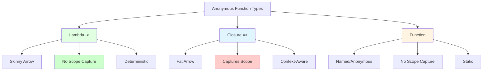

# 🎯 Lambdas: Deterministic Pure Functions

> Lambdas are deterministic functions that operate only on their arguments and local variables - they do NOT capture surrounding scope.

Lambdas are BoxLang's implementation of pure, deterministic functions using the **skinny arrow (`->`)** syntax. Unlike [Closures](../closures.md) which capture surrounding scope, lambdas are isolated and only work with what they're explicitly given.

## 🔬 What Makes Lambdas Special?

**Lambdas** are fundamentally different from **closures** and **functions** in BoxLang:

✅ **Deterministic** - Same inputs always produce same outputs

✅ **No Scope Capture** - Cannot access variables from surrounding scope

✅ **Pure Functions** - Only use arguments passed in and local variables

✅ **Predictable** - No side effects from external state

✅ **Thread-Safe** - Safe for parallel operations without race conditions

✅ **Testable** - Easy to test due to deterministic behavior


**Critical Difference**: Lambdas use the **skinny arrow** `->` and DO NOT capture scope. This is fundamentally different from closures which use the **fat arrow** `=>` and DO capture scope. See [Closures](../closures.md) for scope-capturing functions.


### Lambda vs Closure vs Function



| Feature | Lambda `->` | Closure `=>` | Function |
|---------|------------|--------------|----------|
| **Syntax** | `( args ) -> expression` | `( args ) => expression` | `function( args ) { }` |
| **Scope Capture** | ❌ No | ✅ Yes | ❌ No |
| **Deterministic** | ✅ Yes | ❌ No | ✅ Yes |
| **Thread-Safe** | ✅ Yes | ⚠️ Depends | ✅ Yes |
| **Use Case** | Pure transforms | Context-aware logic | General purpose |

## 📝 Lambda Syntax

Lambdas use the **skinny arrow** `->` operator:

```js
// Basic lambda syntax
myLambda = ( arg1, arg2 ) -> arg1 + arg2

// Single argument (parentheses optional)
double = n -> n * 2

// No arguments
getConstant = () -> 42

// Multi-line with explicit return
calculate = ( x, y ) -> {
    result = x * y
    return result + 10
}

// With type hints
multiply = ( numeric a, numeric b ) -> a * b
```

### Syntax Rules

| Form | Syntax | Return Behavior |
|------|--------|----------------|
| **Single expression** | `( args ) -> expression` | Implicit return |
| **Multi-line** | `( args ) -> { statements }` | Explicit `return` required |
| **No arguments** | `() -> expression` | Parentheses required |
| **Single argument** | `arg -> expression` | Parentheses optional |
| **Multiple arguments** | `( arg1, arg2 ) -> expression` | Parentheses required |


**Implicit Return**: Single-expression lambdas automatically return the expression result. Multi-line lambdas require explicit `return` statements.


## 🚫 No Scope Capture

The defining characteristic of lambdas is that they **cannot access surrounding scope**. They are completely isolated.

### What Lambdas Can Access

✅ **Arguments** - Parameters passed to the lambda

✅ **Local Variables** - Variables declared inside the lambda

✅ **Built-in Functions** - BoxLang BIFs (Built-In Functions)

✅ **Static Values** - Literals and constants

### What Lambdas Cannot Access

❌ **Outer Variables** - Variables from surrounding scope

❌ **Class Properties** - `this.property` references

❌ **Closure Scope** - Parent function's local variables

❌ **Global State** - Unless passed as arguments

### Scope Isolation Example

```js
// Variable in outer scope
multiplier = 10
threshold = 5

// ❌ Lambda CANNOT access outer scope variables
// This will throw an error!
try {
    badLambda = ( n ) -> n * multiplier  // Error: multiplier not in scope
    result = badLambda( 5 )
} catch ( any e ) {
    println( "Error: Lambda cannot access outer scope!" )
}

// ✅ Lambda works with arguments only
goodLambda = ( n, factor ) -> n * factor
result = goodLambda( 5, 10 )  // 50 - works!

// ✅ Lambda can use local variables
validLambda = ( n ) -> {
    localFactor = 10  // Local to lambda
    return n * localFactor
}
result = validLambda( 5 )  // 50 - works!

// ❌ Lambda cannot access outer variables
filterLambda = ( item ) -> item > threshold  // Error: threshold not in scope

// ✅ Pass outer values as arguments instead
filterWithArg = ( item, min ) -> item > min
numbers = [ 1, 3, 5, 7, 9 ]
filtered = numbers.filter( ( n ) -> filterWithArg( n, 5 ) )
```

### Comparison: Lambda vs Closure

```js
multiplier = 10

// ✅ Closure CAN access outer scope (fat arrow =>)
closureFn = ( n ) => n * multiplier
println( closureFn( 5 ) )  // 50 (uses outer multiplier)

// ❌ Lambda CANNOT access outer scope (skinny arrow ->)
lambdaFn = ( n ) -> n * multiplier  // Error!

// ✅ Lambda needs it passed as argument
lambdaFn = ( n, mult ) -> n * mult
println( lambdaFn( 5, 10 ) )  // 50 (deterministic)
```

## ⚡ Deterministic Behavior

Lambdas are **deterministic** - given the same inputs, they always produce the same output. This makes them predictable and safe.

### Deterministic Example

```js
// ✅ Pure lambda - always returns same result for same input
add = ( a, b ) -> a + b
println( add( 2, 3 ) )  // 5
println( add( 2, 3 ) )  // 5 (always 5)

// ✅ Mathematical operations - deterministic
square = n -> n * n
cube = n -> n * n * n
absolute = n -> n < 0 ? -n : n

// ✅ String operations - deterministic
toUpper = str -> str.uCase()
trim = str -> str.trim()
reverse = str -> str.reverse()
```

### Non-Deterministic Operations

Some operations would break determinism - these require external state that lambdas cannot access:

```js
// ❌ Cannot use current time (external state)
// getTimestamp = () -> now()  // Error: now() needs context

// ❌ Cannot use random (non-deterministic)
// getRandom = () -> randRange( 1, 10 )  // Non-deterministic

// ❌ Cannot access database (external state)
// getUser = id -> queryExecute( "SELECT * FROM users WHERE id = ?", [ id ] )

// ✅ But you can pass results as arguments
processUser = ( userData ) -> {
    return {
        fullName: userData.firstName & " " & userData.lastName,
        isActive: userData.status == "active"
    }
}
```

## 🔄 Common Use Cases

### 1. Array Transformations

Lambdas are perfect for pure data transformations:

```js
numbers = [ 1, 2, 3, 4, 5 ]

// Simple transformations
doubled = numbers.map( n -> n * 2 )
// [2, 4, 6, 8, 10]

squared = numbers.map( n -> n * n )
// [1, 4, 9, 16, 25]

// Filtering with pure logic
evens = numbers.filter( n -> n % 2 == 0 )
// [2, 4]

greaterThanThree = numbers.filter( n -> n > 3 )
// [4, 5]

// Reducing
sum = numbers.reduce( ( acc, n ) -> acc + n, 0 )
// 15

product = numbers.reduce( ( acc, n ) -> acc * n, 1 )
// 120
```

### 2. String Processing

```js
words = [ "hello", "world", "boxlang", "rocks" ]

// Pure string transformations
uppercase = words.map( w -> w.uCase() )
// ["HELLO", "WORLD", "BOXLANG", "ROCKS"]

lengths = words.map( w -> w.len() )
// [5, 5, 8, 5]

longWords = words.filter( w -> w.len() > 5 )
// ["boxlang"]

firstLetters = words.map( w -> w.left( 1 ) )
// ["h", "w", "b", "r"]
```

### 3. Object/Struct Transformations

```js
users = [
    { name: "Alice", age: 30 },
    { name: "Bob", age: 25 },
    { name: "Charlie", age: 35 }
]

// Extract properties
names = users.map( u -> u.name )
// ["Alice", "Bob", "Charlie"]

ages = users.map( u -> u.age )
// [30, 25, 35]

// Transform objects
adults = users.filter( u -> u.age >= 30 )
// [{ name: "Alice", age: 30 }, { name: "Charlie", age: 35 }]

// Calculate derived values
avgAge = users.map( u -> u.age ).reduce( ( sum, age ) -> sum + age, 0 ) / users.len()
// 30
```

### 4. Sorting

```js
numbers = [ 5, 2, 8, 1, 9, 3 ]

// Ascending sort
ascending = numbers.sort( ( a, b ) -> a - b )
// [1, 2, 3, 5, 8, 9]

// Descending sort
descending = numbers.sort( ( a, b ) -> b - a )
// [9, 8, 5, 3, 2, 1]

// Sort objects
products = [
    { name: "Widget", price: 25 },
    { name: "Gadget", price: 15 },
    { name: "Doohickey", price: 30 }
]

byPrice = products.sort( ( a, b ) -> a.price - b.price )
// Sorted by price ascending
```

### 5. Validation & Predicates

```js
// Pure validation functions
isPositive = n -> n > 0
isEven = n -> n % 2 == 0
isOdd = n -> n % 2 != 0
inRange = ( n, min, max ) -> n >= min && n <= max

// Email validation (pure string check)
isValidEmail = email -> email.reFind( "@" ) > 0 && email.reFind( "\." ) > 0

// String validation
isEmpty = str -> str.len() == 0
hasMinLength = ( str, min ) -> str.len() >= min
```

## 🎨 Practical Examples

### Example 1: Data Pipeline

```js
// Pure transformation pipeline using lambdas
rawData = [ "  hello  ", "  WORLD  ", "  BoxLang  " ]

cleaned = rawData
    .map( s -> s.trim() )                    // Remove whitespace
    .map( s -> s.lCase() )                   // Lowercase
    .map( s -> s.left( 1 ).uCase() & s.right( s.len() - 1 ) )  // Capitalize
    .filter( s -> s.len() > 3 )              // Filter short words

println( cleaned )
// ["Hello", "World", "Boxlang"]
```

### Example 2: Number Processing

```js
// Process array of numbers with pure functions
numbers = [ -5, -2, 0, 3, 7, 12, 15 ]

result = numbers
    .filter( n -> n > 0 )           // Only positive
    .map( n -> n * n )              // Square them
    .filter( n -> n < 100 )         // Less than 100
    .reduce( ( sum, n ) -> sum + n, 0 )  // Sum

println( result )  // 67 (9 + 49 + 9)
```

### Example 3: Price Calculator

```js
items = [
    { name: "Book", price: 15.99, quantity: 2 },
    { name: "Pen", price: 2.50, quantity: 5 },
    { name: "Notebook", price: 8.75, quantity: 3 }
]

// Calculate total using lambdas
lineItems = items.map( item -> {
    return {
        name: item.name,
        subtotal: item.price * item.quantity
    }
} )

total = lineItems
    .map( item -> item.subtotal )
    .reduce( ( sum, subtotal ) -> sum + subtotal, 0 )

println( "Total: $#numberFormat( total, '0.00' )#" )
// Total: $70.73
```

### Example 4: Functional Composition

```js
// Compose pure functions
add10 = n -> n + 10
multiply2 = n -> n * 2
square = n -> n * n

// Apply transformations in sequence
result = [ 5 ]
    .map( add10 )      // 15
    .map( multiply2 )  // 30
    .map( square )     // 900

println( result[ 1 ] )  // 900
```

## 💡 Best Practices

### 1. Keep Lambdas Pure

```js
// ✅ Good: Pure lambda, no external dependencies
isAdult = age -> age >= 18

// ❌ Avoid: Would need external variable (not possible with lambdas anyway)
// minAge = 18
// isAdult = age -> age >= minAge  // Error!

// ✅ Good: Pass as argument
isAboveMin = ( age, minimum ) -> age >= minimum
```

### 2. Use Lambdas for Simple Transformations

```js
// ✅ Good: Simple, pure transformation
numbers.map( n -> n * 2 )

// ✅ Good: Simple predicate
numbers.filter( n -> n > 0 )

// ❌ Avoid: Complex logic in lambda (use function instead)
numbers.filter( n -> {
    // Many lines of complex logic...
    // Better as a named function
} )
```

### 3. Leverage Determinism for Testing

```js
// ✅ Lambdas are easy to test - always same result
add = ( a, b ) -> a + b
assert( add( 2, 3 ) == 5 )
assert( add( 2, 3 ) == 5 )  // Always true

// ✅ Test edge cases easily
divide = ( a, b ) -> b == 0 ? 0 : a / b
assert( divide( 10, 2 ) == 5 )
assert( divide( 10, 0 ) == 0 )  // Safe division
```

### 4. Use for Parallel Operations

```js
// ✅ Lambdas are thread-safe for parallel processing
largeArray = [ 1..1000000 ]

// Safe for parallel map (when supported)
results = largeArray.map( n -> n * n )

// No race conditions - each lambda is isolated
```

### 5. Compose Small Lambdas

```js
// ✅ Good: Small, focused lambdas
numbers
    .filter( n -> n > 0 )
    .map( n -> n * 2 )
    .filter( n -> n < 100 )

// ❌ Avoid: Doing too much in one lambda
numbers.map( n -> {
    if ( n > 0 ) {
        doubled = n * 2
        if ( doubled < 100 ) {
            return doubled
        }
    }
    return null
} ).filter( n -> !isNull( n ) )
```

### 6. Name Complex Lambdas

```js
// ✅ Good: Named for clarity
isValidAge = age -> age >= 18 && age <= 120
isValidEmail = email -> email.reFind( "@" ) > 0

users
    .filter( u -> isValidAge( u.age ) )
    .filter( u -> isValidEmail( u.email ) )

// ❌ Avoid: Inline complex logic repeatedly
users
    .filter( u -> u.age >= 18 && u.age <= 120 )
    .filter( u -> u.email.reFind( "@" ) > 0 )
```

## ⚠️ Common Mistakes

### Mistake 1: Trying to Access Outer Scope

```js
factor = 10

// ❌ Wrong: Lambda cannot access 'factor'
multiply = n -> n * factor  // Error!

// ✅ Correct: Pass as argument
multiply = ( n, f ) -> n * f
result = multiply( 5, factor )
```

### Mistake 2: Side Effects

```js
counter = 0

// ❌ Wrong: Lambda should not have side effects
// increment = n -> { counter++; return n; }  // Breaks determinism

// ✅ Correct: Return new value
increment = n -> n + 1
```

### Mistake 3: Using Non-Deterministic Functions

```js
// ❌ Avoid: Random is non-deterministic
// getRandom = () -> randRange( 1, 10 )

// ✅ Good: Pure transformation
addRandomAmount = ( value, randomValue ) -> value + randomValue
```

### Mistake 4: Confusing Lambda and Closure Syntax

```js
multiplier = 10

// ❌ Wrong arrow: Using => when you need ->
// badLambda = ( n ) => n * multiplier  // This is a closure!

// ✅ Correct: Use -> for lambdas
goodLambda = ( n, mult ) -> n * mult

// ✅ Or use => if you need scope capture (but that's a closure)
goodClosure = ( n ) => n * multiplier  // Closure, not lambda
```

## 🔧 When to Use Lambdas vs Closures

### Use Lambdas (`->`) When:

✅ Pure data transformations

✅ Mathematical operations

✅ String manipulations

✅ Array/collection operations

✅ Sorting and filtering

✅ Validation predicates

✅ Deterministic behavior required

✅ Thread-safety is important


### Use Closures (`=>`) When:

✅ Need to access surrounding scope

✅ Event handlers

✅ Callbacks with context

✅ State management

✅ Delayed execution with captured variables

✅ Dynamic behavior based on environment


```js
// Lambda: Pure transformation
numbers.map( n -> n * 2 )

// Closure: Uses outer variable
multiplier = 2
numbers.map( n => n * multiplier )

// Lambda: Needs argument
process = ( data, config ) -> transformData( data, config )

// Closure: Captures config
config = loadConfig()
process = data => transformData( data, config )
```

## 📋 Summary

**Lambdas** in BoxLang are pure, deterministic functions perfect for functional programming:

✅ **Skinny Arrow** - Use `->` syntax

✅ **No Scope Capture** - Only arguments and local variables

✅ **Deterministic** - Same inputs = same outputs

✅ **Thread-Safe** - No shared state concerns

✅ **Pure Functions** - No side effects

✅ **Testable** - Easy to test and verify

✅ **Composable** - Chain together easily


**Pro Tip**: Use lambdas (`->`) for pure transformations and closures (`=>`) when you need scope access. Lambdas are safer for parallel operations and easier to reason about due to their deterministic nature!


---

## 🔗 Related Documentation

- [Closures](../closures.md) - Context-aware functions with scope capture (`=>`)
- [Functions](../reference/functions.md) - User-defined functions
- [Arrays](../arrays.md) - Array methods that use lambdas
- [Structures](../structures.md) - Struct methods with lambdas
- [Variable Scopes](../variable-scopes.md) - Understanding BoxLang scopes
