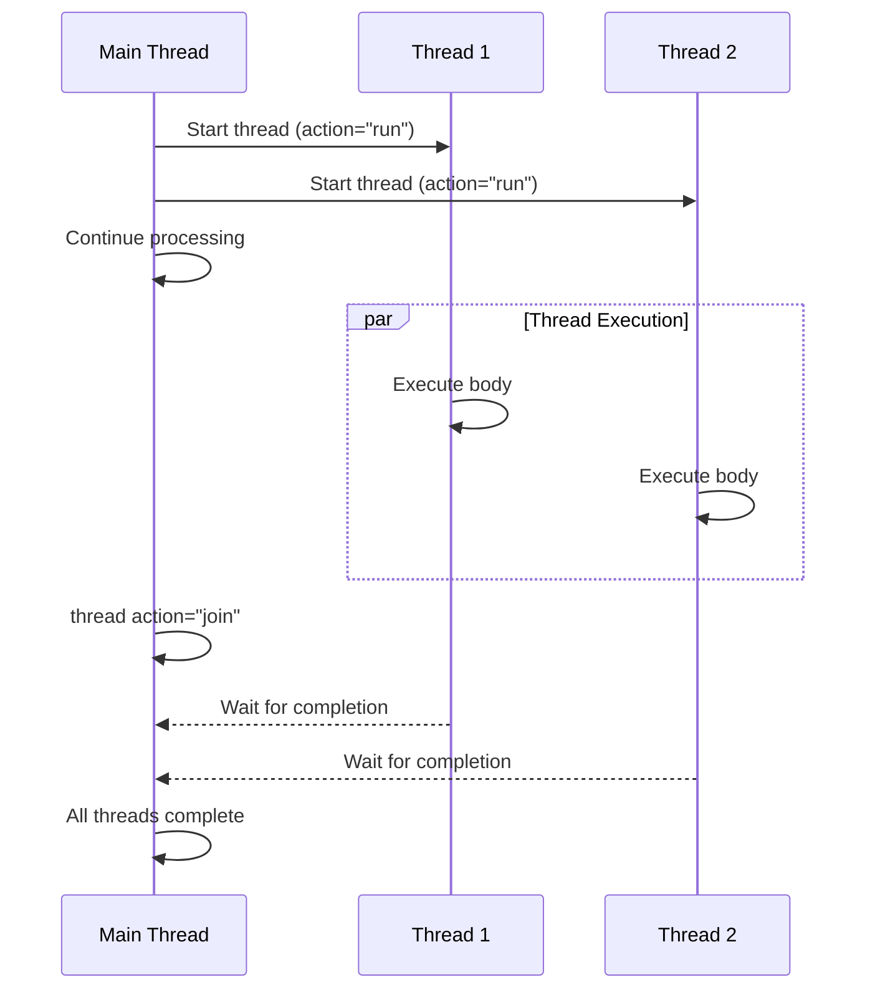
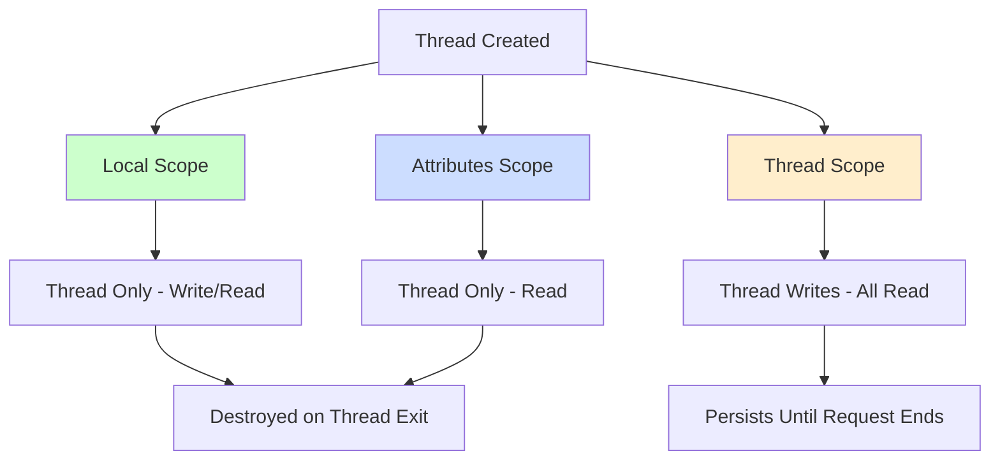

# 🧵 Threading

BoxLang provides **native threading constructs** for simple asynchronous execution, allowing you to execute code in separate threads. Threads are independent streams of execution that can run simultaneously and asynchronously within a single request.

## 📋 Table of Contents

- [Overview](#overview)
- [When to Use Threading vs Async Programming](#when-to-use-threading-vs-async-programming)
- [Thread Syntax](#thread-syntax)
- [Thread Actions](#thread-actions)
- [Thread Scopes](#thread-scopes)
- [Thread Debugging](#thread-debugging)
- [Built-In Functions (BIFs)](#built-in-functions-bifs)
- [Virtual Threads (Java 21+)](#virtual-threads-java-21)
- [Thread Metadata](#thread-metadata)
- [Best Practices](#best-practices)
- [Common Pitfalls](#common-pitfalls)

## 🎯 Overview

BoxLang threading allows you to:

✅ Execute code asynchronously in separate threads

✅ Continue request processing without waiting for threads

✅ Wait for threads to complete with `join`

✅ Pass data to threads via attributes

✅ Control thread priority and lifecycle

✅ Use virtual threads for lightweight concurrency (Java 21+)

### Thread Execution Flow



## 🔀 When to Use Threading vs Async Programming

BoxLang provides **two approaches** to asynchronous programming:

| Feature | Native Threading | Async Programming (BoxFutures) |
|---------|-----------------|-------------------------------|
| **Complexity** | Simple, straightforward | Advanced, composable |
| **Use Case** | Fire-and-forget tasks | Chained async operations |
| **Control** | Basic (run, join, terminate) | Fine-grained (pipelines, executors) |
| **Composition** | Limited | Highly composable |
| **Error Handling** | Manual | Built-in exception handling |
| **Return Values** | Via thread scope | Direct return values |
| **Best For** | Simple parallel tasks | Complex async workflows |


**Advanced Async Programming**: For more control over asynchronous operations, use **BoxFutures** with `runAsync()`, completable futures, and executor services. See [Asynchronous Programming](../boxlang-framework/asynchronous-programming/) for details.


## ⚠️ A Fair Warning About Threading


**Concurrency is Hard!** Once you enter the world of multithreaded programming, be prepared for:

- **Thread Safety Issues** - Shared data must be properly synchronized
- **Race Conditions** - Multiple threads accessing shared resources simultaneously
- **Difficult Debugging** - `writedump() + abort` won't work in threads
- **Deadlocks** - Threads waiting indefinitely for resources
- **Memory Leaks** - Data stored in thread scope persists after completion
- **Non-Deterministic Behavior** - Execution order is unpredictable


### Thread Safety Requirements

```js
// ❌ NOT Thread-Safe: Shared counter
variables.counter = 0

thread name="thread1" {
    for ( i = 1; i <= 1000; i++ ) {
        variables.counter++  // Race condition!
    }
}

thread name="thread2" {
    for ( i = 1; i <= 1000; i++ ) {
        variables.counter++  // Race condition!
    }
}

thread action="join" name="thread1,thread2"
// Result: unpredictable (not 2000!)
```

```js
// ✅ Thread-Safe: Locking
variables.counter = 0

thread name="thread1" {
    for ( i = 1; i <= 1000; i++ ) {
        lock scope="application" type="exclusive" {
            variables.counter++
        }
    }
}

thread name="thread2" {
    for ( i = 1; i <= 1000; i++ ) {
        lock scope="application" type="exclusive" {
            variables.counter++
        }
    }
}

thread action="join" name="thread1,thread2"
// Result: 2000 (guaranteed)
```

## 🐛 Thread Debugging

Traditional debugging techniques don't work in threads. Use these approaches:

### Debugging Functions

| Function | Purpose | Output |
|----------|---------|--------|
| `println()` | Write to console output | Console |
| `writeOutput()` | Write to output stream | Output |
| `writedump( output="console" )` | Dump complex objects | Console |
| `writeLog()` | Write to log files | Log file |

### Debugging Examples

```js
thread name="debugThread" {
    // Console output
    println( "Thread started at: " & now() )
    println( jsonSerialize( myComplexObject ) )

    // Dump to console (not browser)
    writedump( var="Processing item: #item.name#", output="console" )
    writedump( var=myComplexObject, output="console" )

    // Logging - most reliable
    writeLog(
        text = "Thread processing started",
        type = "information",
        file = "myapp-threads"
    )

    try {
        // Your thread logic
        processData()
        writeLog( text="Thread completed successfully", type="info" )
    } catch ( any e ) {
        // Log exceptions
        writeLog(
            text = "Thread error: #e.message#",
            type = "error",
            file = "myapp-threads"
        )
        println( "ERROR: " & e.message )
    }
}
```

### Debug Output Destinations

```js
// Console output (visible in terminal/IDE)
println( message )

// Output stream
writeOutput( message )

// Console dump
<bx:dump var="#data#" output="console" />

// Application log (logs/application.log)
writeLog( text="Message" )

// Custom log file (logs/myfile.log)
writeLog( text="Message", file="myfile" )

// Error log (logs/error.log)
writeLog( text="Error occurred", type="error" )
```


**Pro Tip**: Use `writeLog()` with custom log files for production thread debugging. Console output only works in development environments.


## 📝 Thread Syntax

BoxLang provides multiple syntax options for creating threads:

### Script Syntax

```js
thread
    name = "uniqueThreadName"
    action = "run"
    priority = "normal"
    attributeName = "attributeValue"
{
    // Thread body executes in separate thread
    // Variables declared here are in thread local scope
}
```

### Template Syntax

```xml
<bx:thread name="myThread" action="run" priority="normal">
    <!-- Thread body -->
</bx:thread>
```

### Thread Attributes

| Attribute | Type | Required | Default | Description |
|-----------|------|----------|---------|-------------|
| `name` | string | Yes (for run) | Auto-generated | Unique identifier for the thread |
| `action` | string | No | `run` | Action to perform: `run`, `join`, `sleep`, `terminate` |
| `priority` | string | No | `normal` | Thread priority: `high`, `low`, `normal` |
| `duration` | integer | Conditional | - | Milliseconds to sleep (required for `action="sleep"`) |
| `timeout` | integer | No | - | Milliseconds to wait for join before timeout |
| `virtual` | boolean | No | `false` | Use virtual threads (Java 21+) |
| `*` (custom) | any | No | - | Custom attributes passed to `attributes` scope |

## 🎬 Thread Actions

### Action: `run` (Create and Execute)

Creates a new thread and executes the body asynchronously.

```js
// Simple thread
thread name="dataProcessor" action="run" {
    // Process data in background
    processLargeDataset()
}

// Thread continues executing while main thread continues
println( "Main thread continues..." )
```

### Action: `join` (Wait for Completion)

Waits for one or more threads to complete before continuing.

```js
// Start multiple threads
thread name="thread1" action="run" {
    sleep( 1000 )
    thread.result1 = "Done 1"
}

thread name="thread2" action="run" {
    sleep( 1500 )
    thread.result2 = "Done 2"
}

// Wait for both threads to complete
thread action="join" name="thread1,thread2"

// Both threads are complete now
println( thread1.result1 )  // "Done 1"
println( thread2.result2 )  // "Done 2"
```

**Join with Timeout:**

```js
thread name="slowThread" action="run" {
    sleep( 10000 )  // 10 seconds
}

// Wait max 2 seconds
thread action="join" name="slowThread" timeout=2000

// Check if thread is still running
if ( isThreadAlive( "slowThread" ) ) {
    println( "Thread still running after timeout" )
}
```

**Join All Threads:**

```js
// Wait for ALL threads in the request
thread action="join"  // No name = join all
```

### Action: `sleep` (Pause Thread)

Pauses the current thread for specified duration.

```js
thread name="worker" action="run" {
    println( "Starting work..." )

    // Pause this thread for 2 seconds
    thread action="sleep" duration=2000

    println( "Resuming work..." )
}
```

### Action: `terminate` (Force Stop)

Forcibly terminates a running thread.

```js
thread name="longRunning" action="run" {
    // Long running operation
    for ( i = 1; i <= 1000000; i++ ) {
        processItem( i )
    }
}

// Terminate the thread
thread action="terminate" name="longRunning"
```


**Warning**: `terminate` forcibly stops a thread. This can leave resources in inconsistent states. Use with caution and prefer cooperative cancellation with `threadInterrupt()`.


## 🏗️ Complete Thread Examples

### Example 1: Fire-and-Forget Background Task

```js
// Send email without blocking main thread
thread name="emailSender" action="run" to=userEmail subject=subject body=body {
    try {
        mailService = new MailService()
        mailService.send(
            to = attributes.to,
            subject = attributes.subject,
            body = attributes.body
        )
        writeLog( "Email sent to #attributes.to#" )
    } catch ( any e ) {
        writeLog( text="Email failed: #e.message#", type="error" )
    }
}

// Main thread continues immediately
return "Email queued for delivery"
```

### Example 2: Parallel Data Processing

```js
// Process data in parallel threads
data = [ batch1, batch2, batch3, batch4 ]

for ( i = 1; i <= arrayLen( data ); i++ ) {
    thread name="processor#i#" action="run" batch=data[i] batchNum=i {
        try {
            results = processBatch( attributes.batch )
            thread.results = results
            thread.processed = arrayLen( results )
        } catch ( any e ) {
            thread.error = e.message
        }
    }
}

// Wait for all threads to complete
thread action="join"

// Collect results
totalProcessed = 0
for ( i = 1; i <= arrayLen( data ); i++ ) {
    threadName = "processor#i#"
    if ( isDefined( "thread.#threadName#.processed" ) ) {
        totalProcessed += evaluate( "thread.#threadName#.processed" )
    }
}

println( "Processed #totalProcessed# items across #arrayLen(data)# threads" )
```

### Example 3: Thread with Priority

```js
// High priority thread
thread name="urgent" action="run" priority="high" {
    processUrgentRequest()
}

// Low priority background task
thread name="cleanup" action="run" priority="low" {
    cleanupOldFiles()
}
```

### Example 4: Cooperative Thread Cancellation

```js
// Start a cancellable thread
thread name="worker" action="run" {
    for ( i = 1; i <= 10000; i++ ) {
        // Check for interrupt signal
        if ( isThreadInterrupted() ) {
            writeLog( "Thread interrupted, cleaning up..." )
            break
        }
        processItem( i )
    }
}

// Later: signal thread to stop gracefully
threadInterrupt( "worker" )
```

<details>
<summary>🔭 Thread Scopes</summary>

## 🔭 Thread Scopes

BoxLang provides three scopes for managing thread data:

### Scope Overview



| Scope | Write Access | Read Access | Lifetime | Use Case |
|-------|-------------|-------------|----------|----------|
| **Local** | Thread only | Thread only | Thread duration | Internal thread variables |
| **Thread** | Thread only | All threads + main | Request duration | Share results with main thread |
| **Attributes** | None (read-only) | Thread only | Thread duration | Pass input data to thread |

### 1. Thread Local Scope

Variables declared without scope prefix go into the thread's local scope - **completely isolated** from other threads.

```js
thread name="worker1" {
    // Local scope - thread private
    var counter = 0
    localVar = "thread private"  // Also local scope

    for ( i = 1; i <= 100; i++ ) {
        counter++
    }

    println( counter )  // 100
}

// ❌ Cannot access from main thread
// println( counter )  // ERROR: variable not found
```

### 2. Thread Scope (Shared Output)

The `thread` scope allows threads to **write data** that the main thread can **read**.

#### Writing to Thread Scope (Inside Thread)

```js
thread name="dataFetcher" {
    // Write using thread scope
    thread.result = queryDatabase()
    thread.status = "completed"
    thread.recordCount = 42

    // Or write using thread name
    dataFetcher.timestamp = now()

    // Or using bxthread.threadName
    bxthread.dataFetcher.executionTime = 1234
}
```

#### Reading from Thread Scope (Outside Thread)

```js
// Wait for thread to complete
thread action="join" name="dataFetcher"

// Read using thread scope
println( thread.dataFetcher.result )
println( thread.dataFetcher.status )

// Or read using thread name directly
println( dataFetcher.recordCount )

// Or using bxthread
println( bxthread.dataFetcher.timestamp )
```

#### Complete Example

```js
// Start multiple threads
thread name="userQuery" {
    thread.users = queryExecute( "SELECT * FROM users" )
    thread.count = users.recordCount()
}

thread name="orderQuery" {
    thread.orders = queryExecute( "SELECT * FROM orders" )
    thread.count = orders.recordCount()
}

// Wait for both
thread action="join" name="userQuery,orderQuery"

// Access results from main thread
println( "Users: #userQuery.count#" )
println( "Orders: #orderQuery.count#" )

// Can also use thread scope
println( "Total: #thread.userQuery.count + thread.orderQuery.count#" )
```


**Memory Leak Warning**: Thread scope data persists until the **entire request completes**, even after the thread finishes. Don't store large objects in thread scope unnecessarily!



**Isolation**: Thread scoped variables are **only accessible within the request** that created them. Other requests cannot access thread scope data.


### 3. Attributes Scope (Input Parameters)

Pass data **into threads** using attributes - any attribute not recognized as a built-in attribute becomes available in the `attributes` scope.

```js
// Pass data to thread via custom attributes
userData = { name: "John", email: "john@example.com" }
configSettings = { timeout: 30, retries: 3 }

thread
    name="emailSender"
    action="run"
    user=userData           // Custom attribute
    config=configSettings   // Custom attribute
    priority="high"         // Built-in attribute
{
    // Access via attributes scope
    emailAddress = attributes.user.email
    userName = attributes.user.name
    maxRetries = attributes.config.retries

    sendEmail( emailAddress, userName, maxRetries )
}
```


**CRITICAL - Deep Copy Behavior**: All attribute values are **deep copied (duplicated)** when passed to threads!

- Simple values: Copied (safe)
- Arrays/Structs: **Entire collection duplicated** (expensive)
- Objects: **Entire object graph duplicated** (very expensive)

This ensures thread safety but can have significant performance implications!


#### Attribute Copy Example

```js
// Large data structure
largeArray = []
for ( i = 1; i <= 10000; i++ ) {
    largeArray.append( { id: i, data: "..." } )
}

// ❌ Bad: Expensive deep copy
thread name="processor" data=largeArray {
    // largeArray was DUPLICATED - memory intensive!
    processData( attributes.data )
}

// ✅ Better: Use shared scope
variables.sharedData = largeArray
thread name="processor" {
    // Access directly from variables scope - no copy
    processData( variables.sharedData )
}
```

### Scope Access Patterns

```js
thread name="demo" customAttr="passed value" {
    // LOCAL SCOPE - thread private
    var local1 = "private"
    local2 = "also private"

    // THREAD SCOPE - shared with main thread
    thread.result = "shared output"
    demo.status = "running"
    bxthread.demo.timestamp = now()

    // ATTRIBUTES SCOPE - read input (deep copied)
    inputValue = attributes.customAttr

    // SHARED SCOPES - access main thread data
    appData = application.config
    sessionData = session.user
    requestData = request.context
}

// After join:
// ✅ Can read: thread.demo.result, demo.status
// ❌ Cannot read: local1, local2, inputValue
// ✅ Can read: application.config (shared scope)
```

</details>

<details>
<summary>🧪 Built-In Functions (BIFs)</summary>

## 🧪 Built-In Functions (BIFs)

BoxLang provides several BIFs for thread management:

### Thread Management BIFs

| BIF | Purpose | Example |
|-----|---------|---------|
| `threadNew()` | Create thread from closure | `threadNew( () => processData() )` |
| `threadJoin()` | Wait for thread completion | `threadJoin( "myThread", 5000 )` |
| `threadTerminate()` | Force stop a thread | `threadTerminate( "myThread" )` |
| `threadInterrupt()` | Signal thread to stop | `threadInterrupt( "myThread" )` |
| `isInThread()` | Check if in thread context | `if ( isInThread() ) { ... }` |
| `isThreadAlive()` | Check if thread is running | `if ( isThreadAlive( "myThread" ) ) { ... }` |
| `isThreadInterrupted()` | Check interrupt status | `if ( isThreadInterrupted() ) { break }` |

### `threadNew()` - Functional Approach

Create threads from closures/lambdas instead of using `thread` construct:

```js
// Create thread from closure
myThread = threadNew(
    () => {
        println( "Thread executing" )
        processData()
    },
    { priority: "high", virtual: true },
    "myThreadName"
)

// Thread is automatically started
// Wait for completion
myThread.join()
```

**With Parameters:**

```js
// Pass data via attributes
userData = { name: "John", id: 123 }

myThread = threadNew(
    () => {
        // Access via attributes scope
        println( "Processing user: #attributes.user.name#" )
        processUser( attributes.user )
    },
    { user: userData },  // Custom attributes
    "userProcessor"
)
```

### `threadJoin()` - Wait for Completion

```js
// Join single thread with timeout
threadJoin( "myThread", 5000 )  // Wait max 5 seconds

// Join multiple threads
threadJoin( "thread1,thread2,thread3", 10000 )

// Join all threads (no name)
threadJoin()  // Wait for all threads indefinitely
```

### `isInThread()` - Context Detection

```js
function processItem( item ) {
    if ( isInThread() ) {
        // Running in thread - use thread-safe logging
        writeLog( "Processing #item.id#" )
    } else {
        // Running in main thread - can use dump
        writedump( item )
    }

    return doProcess( item )
}
```

### `isThreadAlive()` - Status Check

```js
thread name="worker" action="run" {
    sleep( 5000 )
}

sleep( 1000 )

if ( isThreadAlive( "worker" ) ) {
    println( "Thread still running" )
    thread action="join" name="worker" timeout=2000

    if ( isThreadAlive( "worker" ) ) {
        println( "Thread timeout - terminating" )
        threadTerminate( "worker" )
    }
}
```

### Cooperative Cancellation Pattern

```js
// Start long-running thread
thread name="processor" {
    for ( i = 1; i <= 100000; i++ ) {
        // Check for interrupt signal
        if ( isThreadInterrupted() ) {
            writeLog( "Thread interrupted at item #i#" )
            // Clean up resources
            cleanup()
            break
        }

        processItem( i )
    }
}

// Later: signal thread to stop gracefully
sleep( 2000 )
threadInterrupt( "processor" )

// Wait for clean shutdown
threadJoin( "processor", 5000 )
```

</details>

## ☁️ Virtual Threads (Java 21+)

BoxLang supports **virtual threads** (Project Loom) for lightweight, scalable concurrency.

### What are Virtual Threads?

Virtual threads are:
- **Lightweight** - Millions can run simultaneously
- **Efficient** - Lower memory footprint than platform threads
- **Scalable** - Perfect for I/O-bound workloads
- **Drop-in** - Same API as regular threads

### Using Virtual Threads

```js
// Create virtual thread
thread name="vthread" action="run" virtual=true {
    // This runs on a virtual thread
    fetchDataFromAPI()
}

// Or with threadNew()
vthread = threadNew(
    () => fetchDataFromAPI(),
    { virtual: true },
    "apiThread"
)
```

### When to Use Virtual Threads

✅ **Use Virtual Threads For:**
- I/O-bound operations (HTTP calls, database queries)
- High concurrency scenarios (thousands of threads)
- Blocking operations (file I/O, network)

❌ **Don't Use Virtual Threads For:**
- CPU-intensive computations
- Operations using `synchronized` blocks heavily
- Code requiring thread-local storage

### Virtual Thread Example

```js
// Process 10,000 HTTP requests concurrently
urls = getURLList()  // 10,000 URLs

for ( url in urls ) {
    // Create virtual thread for each request
    thread name="fetch#url.id#" action="run" virtual=true url=url {
        response = httpGet( attributes.url )
        thread.result = response.status
    }
}

// Wait for all to complete
thread action="join"

println( "Processed #arrayLen(urls)# requests" )
```

## 📊 Thread Metadata

Each thread automatically tracks metadata accessible via the thread scope:

### Metadata Properties

| Property | Type | Description |
|----------|------|-------------|
| `name` | string | Thread name |
| `status` | string | `NOT_STARTED`, `RUNNING`, `COMPLETED`, `TERMINATED`, `INTERRUPTED` |
| `startTime` | datetime | When thread started |
| `endTime` | datetime | When thread finished |
| `elapsedTime` | numeric | Execution time in milliseconds |
| `priority` | string | Thread priority (`high`, `normal`, `low`) |
| `error` | struct | Exception details if thread failed |
| `output` | string | Buffered output from thread |

### Accessing Metadata

```js
thread name="worker" action="run" {
    sleep( 1000 )
    thread.customData = "my result"
}

thread action="join" name="worker"

// Access metadata
println( "Status: #worker.status#" )
println( "Elapsed: #worker.elapsedTime# ms" )
println( "Custom: #worker.customData#" )
println( "Started: #worker.startTime#" )
println( "Ended: #worker.endTime#" )
```

### Error Handling

```js
thread name="errorTest" action="run" {
    throw( "Something went wrong!" )
}

thread action="join" name="errorTest"

// Check for errors
if ( errorTest.status == "TERMINATED" && structKeyExists( errorTest, "error" ) ) {
    println( "Thread failed: #errorTest.error.message#" )
    println( "Type: #errorTest.error.type#" )
    println( "Detail: #errorTest.error.detail#" )
}
```

<details open>
<summary>✅ Best Practices</summary>

## ✅ Best Practices

### 1. Always Name Your Threads

```js
// ✅ Good: Named threads
thread name="emailSender" { ... }
thread name="dataProcessor" { ... }

// ❌ Bad: Auto-generated names
thread action="run" { ... }  // Hard to track
```

### 2. Use Join for Data Dependencies

```js
// ✅ Good: Wait for data
thread name="dataFetch" { thread.data = fetchData() }
thread action="join" name="dataFetch"
useData( dataFetch.data )

// ❌ Bad: Race condition
thread name="dataFetch" { thread.data = fetchData() }
useData( dataFetch.data )  // May not be ready yet!
```

### 3. Minimize Shared Data

```js
// ✅ Good: Thread-local data
thread name="worker" {
    var result = processData()  // Local scope
    thread.finalResult = result // Only final result shared
}

// ❌ Bad: Shared mutable state
thread name="worker" {
    variables.result = processData()  // Race conditions!
}
```

### 4. Use Locks for Shared Resources

```js
// ✅ Good: Locked shared access
thread name="writer1" {
    lock name="dataLock" type="exclusive" {
        application.counter++
    }
}

thread name="writer2" {
    lock name="dataLock" type="exclusive" {
        application.counter++
    }
}
```

### 5. Always Handle Exceptions

```js
// ✅ Good: Exception handling
thread name="worker" {
    try {
        riskyOperation()
        thread.status = "success"
    } catch ( any e ) {
        writeLog( text="Thread error: #e.message#", type="error" )
        thread.status = "failed"
        thread.error = e
    }
}
```

### 6. Clean Up Resources

```js
// ✅ Good: Resource cleanup
thread name="fileProcessor" {
    var fileHandle = fileOpen( path )
    try {
        processFile( fileHandle )
    } finally {
        fileClose( fileHandle )  // Always close
    }
}
```

### 7. Use Timeouts for Joins

```js
// ✅ Good: Timeout protection
thread name="worker" { longRunningTask() }
thread action="join" name="worker" timeout=5000

if ( isThreadAlive( "worker" ) ) {
    writeLog( "Thread timeout - taking action" )
    threadTerminate( "worker" )
}
```

</details>

<details>
<summary>⚠️ Common Pitfalls</summary>

## ⚠️ Common Pitfalls

### 1. ❌ Race Conditions on Shared State

```js
// ❌ WRONG: Unprotected shared state
variables.results = []
thread name="thread1" {
    variables.results.append( processData1() )  // Race condition!
}
thread name="thread2" {
    variables.results.append( processData2() )  // Race condition!
}

// ✅ RIGHT: Use thread scope or locking
thread name="thread1" {
    thread.results = processData1()  // Thread-local
}
thread name="thread2" {
    thread.results = processData2()  // Thread-local
}
```

### 2. ❌ Forgetting Deep Copy of Attributes

```js
// ❌ Problem: Unexpected behavior
myObject = new LargeObject()
thread name="worker" obj=myObject {
    // attributes.obj is a COPY - changes don't affect original!
    attributes.obj.status = "modified"
}
// myObject.status is still unchanged!

// ✅ Solution: Use shared scope for mutable objects
variables.myObject = new LargeObject()
thread name="worker" {
    variables.myObject.status = "modified"  // Affects original
}
```

### 3. ❌ Using writedump() + abort()

```js
// ❌ WRONG: Doesn't work in threads
thread name="debug" {
    writedump( var=data )
    abort  // Doesn't work in threads!
}

// ✅ RIGHT: Use println() or logging
thread name="debug" {
    println( "Data: #jsonSerialize(data)#" )
    // Or use writeLog()
    writeLog( text="Data: #jsonSerialize(data)#" )
}
```

### 4. ❌ Ignoring Thread Safety

```js
// ❌ WRONG: Race condition
variables.counter = 0
for ( i = 1; i <= 10; i++ ) {
    thread name="inc#i#" {
        variables.counter++  // NOT THREAD-SAFE!
    }
}

// ✅ RIGHT: Use locking
variables.counter = 0
for ( i = 1; i <= 10; i++ ) {
    thread name="inc#i#" {
        lock scope="application" type="exclusive" {
            variables.counter++
        }
    }
}
```

### 5. ❌ Thread Scope Memory Leaks

```js
// ❌ WRONG: Large data persists until request ends
thread name="processor" {
    thread.hugeDataset = loadMillionsOfRecords()
    thread.result = processData( thread.hugeDataset )
}

// ✅ RIGHT: Only store results
thread name="processor" {
    var hugeDataset = loadMillionsOfRecords()  // Local scope
    thread.result = processData( hugeDataset )  // Only result shared
}
```

</details>

## 🔗 Next Steps: Advanced Async Programming

Native threading is great for simple parallelism, but for **advanced async workflows**, explore:

### 🚀 BoxFutures & Async Programming

For complex async operations, use the **Asynchronous Programming** framework:

- **`runAsync()`** - Return-value based async with CompletableFutures
- **Async Pipelines** - Chain async operations with `then()`, `thenRun()`, `thenCompose()`
- **Parallel Collections** - `array.parallel()`, `struct.parallel()`
- **Executor Services** - Custom thread pools with `executorNew()`
- **Advanced Error Handling** - `exceptionally()`, `whenComplete()`
- **Async Composition** - `allOf()`, `anyOf()`, `race()`


**Recommendation**: Use native threading for simple fire-and-forget tasks. Use BoxFutures for complex async workflows with return values, error handling, and composition.


**Learn More:**
- [Asynchronous Programming Guide](../boxlang-framework/asynchronous-programming/)
- [BoxFutures Documentation](../boxlang-framework/asynchronous-programming/async-programming.md)
- [Parallel Collections](../boxlang-framework/asynchronous-programming/parallel-computations.md)
- [Scheduled Tasks](../boxlang-framework/asynchronous-programming/scheduled-tasks.md)

## 📚 Related Documentation

- [Locking](locking.md) - Thread synchronization and locks
- [Variable Scopes](variable-scopes.md) - Understanding BoxLang scopes
- [Exception Handling](exception-management.md) - Error handling patterns
- [Asynchronous Programming](../boxlang-framework/asynchronous-programming/) - Advanced async with BoxFutures
