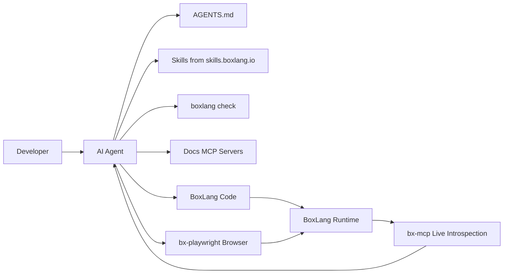

# Agentic Development

BoxLang is a software productivity platform built for developers **and** the AI agents working beside them. Agents build better software on platforms that are predictable, well documented, and complete. This section shows how to set up a BoxLang project so your agent is productive from the first prompt.

## 🎯 Why BoxLang Works Well for Agents

| Trait | What it means for an agent |
| --- | --- |
| **Batteries included** | Files, HTTP, JDBC, async, caching, scheduling, templating, logging, and AI ship with the platform. The agent wires up fewer libraries and makes fewer choices. |
| **Conventions** | `Application.bx` lifecycle, module layouts, configuration in `boxlang.json`, and consistent BIF naming give agents patterns to follow. |
| **Skills** | Installable `SKILL.md` playbooks from [skills.boxlang.io](https://skills.boxlang.io) teach the agent how to perform specific BoxLang tasks the idiomatic way. |
| **Docs over MCP** | The documentation is available to agents as MCP servers, so they read current docs instead of guessing. |
| **Live introspection** | With BoxLang+, the `bx-mcp` module lets an agent inspect a running server through MCP, with access control. |
| **Java underneath** | 100% Java interoperability gives the agent the whole JVM ecosystem when it needs it. |
| **Fast validation** | `boxlang check` validates syntax without running code, so agents can verify every edit. |
| **One runtime, many targets** | The same code runs on the CLI, web servers, containers, and serverless platforms. |

## 🧰 The Agentic Toolkit


[ai-setup.md](ai-setup.md)



[skills-and-guidelines.md](skills-and-guidelines.md)



[validate-your-code.md](validate-your-code.md)



[boxlang-mcp.md](boxlang-mcp.md)



[end-to-end-with-playwright.md](end-to-end-with-playwright.md)



[boxlang-ide.md](boxlang-ide.md)



[agent-ready-checklist.md](agent-ready-checklist.md)


## 🚀 Fastest Path

1. Install [BoxLang](../installation/README.md).
2. Install the BoxLang developer skills: `npx skills add ortus-boxlang/skills/boxlang-developer`. See [Skills & Guidelines](skills-and-guidelines.md).
3. Add a project `AGENTS.md` and connect the docs MCP servers. See [AI Setup](ai-setup.md).
4. Have your agent validate every edit with `boxlang check`. See [Validate Your Code](validate-your-code.md).
5. Building a web application? Use [ColdBox](../../boxlang-framework/mvc.md) and its `coldbox ai install` wizard.
6. Want your agent to see a running server? Try [BoxLang MCP](boxlang-mcp.md).
7. Want your agent to use the app it builds, in a real browser? See [Build an App End to End](end-to-end-with-playwright.md) with bx-playwright.


**Building a BoxLang web app? Start from [cbGenesis](https://cbgenesis.coldbox.org).** It's a production-ready ColdBox starter with `AGENTS.md`, 90+ framework skills, and six project-specific skills already wired in - the fastest way to build a BoxLang web application with an AI agent at hand. In one measured run, an agent using cbGenesis's skills needed 42% fewer tool calls and 34% less time than one exploring the same codebase from scratch. `coldbox create app skeleton=cbgenesis`



**Try every BoxLang+ module free for 60 days.** The trial starts automatically the first time you start a BoxLang server or CLI with a BoxLang+ module installed. No sign-up and no key. Enterprise support and premium modules are available when you [join us](https://www.boxlang.io/plans).


## 🤖 Building AI Features, Not Just With AI

Agentic development is about using agents to write your application. BoxLang also lets you build AI into your application with chat, agents, tools, memory, RAG, and MCP through the [BoxLang AI](../../boxlang-ai/README.md) module.
