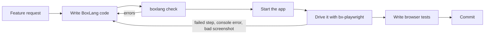

# Build an App End to End

An agent that writes code but never runs the application is guessing. With [bx-playwright](../../boxlang-framework/modularity/playwright.md), the agent closes the loop: it builds a feature, starts the app, uses it in a real browser like a person would, sees what is broken, fixes it, and leaves browser tests behind so the feature stays working.

## 🔁 The Loop



1. **Write** the feature: handlers, views, classes.
2. **Validate** every edit with [`boxlang check`](validate-your-code.md).
3. **Run** the app, for example with `boxlang-miniserver`.
4. **Drive** it with bx-playwright: visit pages, fill forms, click, read the accessibility snapshot, check for console errors and accessibility issues, and take screenshots to look at.
5. **Fix** whatever the browser shows is wrong, and repeat.
6. **Keep** the verification as browser tests, so the next change cannot silently break the feature.

## 🧰 Setup

Install the module, the browser, and the skills that teach the agent how to use them:

```bash
install-bx-module bx-playwright
bxPlaywright install chromium
bxPlaywright doctor

npx skills add ortus-boxlang/skills/boxlang-developer
npx skills add ortus-boxlang/skills/boxlang-modules/bx-playwright
```

Then tell the agent about the loop in your project's `AGENTS.md`:

```markdown
## Verifying Changes

- Validate every edited file with `boxlang check`.
- Start the app with `boxlang-miniserver --port 8080` and verify every UI change in a
  real browser with bx-playwright (see the bx-playwright skills). Use
  `page.snapshot( options = { mode : "ai" } )` to read pages and `ref=eN` selectors to act.
- A change is done when its browser test passes, the page has no console errors,
  and `assertNoAccessibilityIssues()` passes.
- Look at the screenshots you take before saying a UI change is finished.
```

## 🤖 What the Agent Runs

A verification script the agent writes and runs after building a sign-up page:

```js
// verify-signup.bxs
playwright( { baseURL : "http://localhost:8080" } ).browse( ( page ) => {
    page.visit( "/signup" )
        .assertTitle( "Sign up" )
        .fill( "Email", "new.user@example.com" )
        .fill( "Password", "Sup3r-secret" )
        .click( "Create account" )
        .assertPathIs( "/welcome" )
        .assertSee( "Welcome" )
        .assertNoConsoleErrors()
        .assertNoAccessibilityIssues()
        .screenshot( "signup-done.png", { fullPage : true } )

    // What the agent reads to decide its next step
    println( page.snapshot( options = { mode : "ai" } ) )
} )
```

```bash
boxlang verify-signup.bxs
```

Everything the agent needs to recover is in the output:

* **Accessibility snapshots** are compact and token efficient, with refs (`[ref=e12]`) the agent can act on directly: `page.click( "ref=e12" )`.
* **Errors are typed and explain the fix**: `Playwright.Timeout`, `Playwright.AssertionFailed` and `Playwright.ActionFailed` carry Playwright's call log and a `detail` with what to try next.
* **Screenshots** let a multimodal agent look at the result, not just the DOM.
* **`help()`** on any object (`page.help( "fill" )`) and `bxPlaywright help --json` describe the API, so the agent does not have to guess.

## ✅ What the Agent Leaves Behind

The same steps become a browser test that runs in CI:

```js
describe( "Sign up", () => {
    it( "creates an account and lands on the welcome page", () => {
        playwright( [ "ci" ], { baseURL : "http://localhost:8080" } ).browse( ( page ) => {
            page.visit( "/signup" )
                .fill( "Email", "new.user@example.com" )
                .fill( "Password", "Sup3r-secret" )
                .click( "Create account" )
                .assertPathIs( "/welcome" )
                .assertScreenshotMatches( "welcome" )
        } )
    } )
} )
```

The `ci` profile keeps screenshots, traces, and videos when a test fails, so both you and the agent can see what went wrong. `assertScreenshotMatches()` catches visual regressions and writes a diff image with the changed pixels in red.

## 💬 Example Prompt

```text
Add a sign-up page to this BoxLang app: email and password, validation errors inline,
and a welcome page after success. Follow AGENTS.md: validate with boxlang check, run the
app, verify the flow in a real browser with bx-playwright, look at the screenshots, and
add a browser test for the happy path and for a duplicate email.
```

## 🔗 Going Further

* **Record instead of write**: `bxPlaywright codegen http://localhost:8080 --output=flow.bxs` records your clicks as bx-playwright code the agent can build on.
* **No shell access?** `bxPlaywright mcp` starts Playwright's MCP server, so MCP-only agents can still drive the browser.
* **AI features inside your app**: give a BoxLang AI agent a browser with [Browser Agents](../../boxlang-ai/browser-agents.md).
* **Full documentation** for agents and humans: [bxplaywright.boxlang.io](https://bxplaywright.boxlang.io), also as [llms.txt](https://bxplaywright.boxlang.io/llms.txt).
