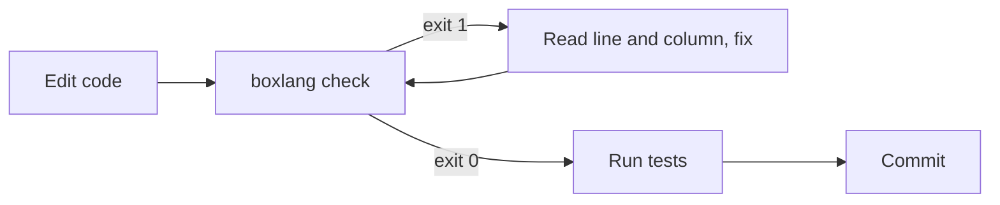

# Validate Your Code

Agents write code quickly, and some of it will not parse. The `boxlang check` command gives your agent a fast, safe way to find out. It parses BoxLang and CFML source files and reports syntax errors **without executing the code or compiling it**. It is the BoxLang equivalent of `bash -n` or `node --check`.

Because it uses the same parsers as the runtime, a file that fails `boxlang check` will fail at runtime.

## 🔁 The Agent Loop



1. The agent edits or creates a file.
2. It runs `boxlang check` on the file or directory.
3. On exit code `1`, it reads the line, column, and message, fixes the file, and checks again.
4. On exit code `0`, it moves on to tests.

## ⚡ Commands

Check specific files:

```bash
boxlang check models/User.bx handlers/Main.bx
```

Check a directory recursively:

```bash
boxlang check --source ./src
```

Print only failures:

```bash
boxlang check --source ./src --quiet
```

Get machine-readable output for an agent or tool to parse:

```bash
boxlang check --source ./src --format json
```

| Option | Description |
| --- | --- |
| `--source <PATH>` | File or directory to check. Directories are scanned recursively |
| `--format <text\|json>` | Output format. Default is `text` |
| `-q, --quiet` | Suppress success output. Failures are always shown |

Supported files: `.bx`, `.bxs`, `.bxm`, `.cfc`, `.cfm`, `.cfs`.

Exit code `0` means every file is valid. Exit code `1` means at least one file has a syntax error or the command was used incorrectly.

See the full [BoxLang Syntax Check](../ide-tooling/boxlang-syntax-check.md) reference.

## 🎨 Pair It With the Formatter

Syntax and style are separate checks:

```bash
boxlang check --source ./src
boxlang format --check --source ./src
```

`boxlang format --check` exits non-zero when formatting drift exists. See the [BoxLang Formatter](../ide-tooling/boxlang-formatter.md).

## 🧠 Install the Skill

The `boxlang-syntax-check` skill teaches your agent the command, the options, how to read the output, and the fix loop above.

```bash
npx skills add ortus-boxlang/skills/boxlang-developer/syntax-check
```

It is also included when you install the whole BoxLang developer set:

```bash
npx skills add ortus-boxlang/skills/boxlang-developer
```

See [Skills & Guidelines](skills-and-guidelines.md) for more.

## 📄 Tell the Agent in AGENTS.md

Skills are found when relevant, but a project rule makes it reliable:

```markdown
## Validation

After every edit to a `.bx`, `.bxs`, `.bxm`, or `.cfc` file, run `boxlang check <file>`.
Before finishing, run `boxlang check --source ./src` and `boxlang format --check --source ./src`.
Fix all reported errors before running tests.
```

## 🚦 Enforce It Automatically

A git pre-commit hook:

```bash
#!/usr/bin/env bash
boxlang check --source ./src --quiet || {
  echo "Syntax errors found. Commit aborted."
  exit 1
}
```

A CI step, before your tests:

```yaml
- name: Syntax check
  run: boxlang check --source ./src
```


`boxlang check` validates syntax only. It cannot catch runtime errors, wrong arguments, or failing logic. Always run your tests too.

