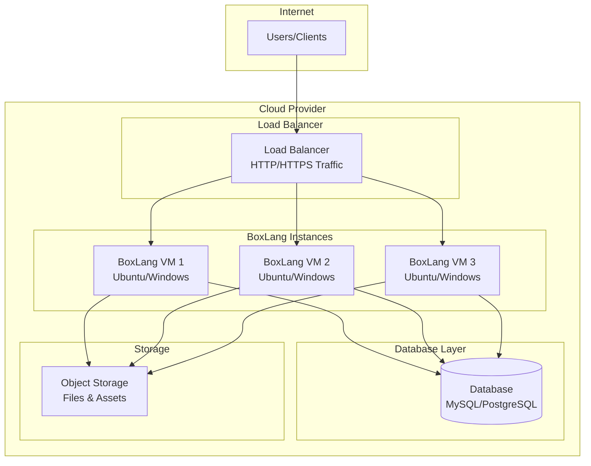

# BoxLang Cloud Servers

Setting up BoxLang servers on various cloud platforms involves a series of steps to ensure efficient deployment and management. Below is a brief introduction to setting up BoxLang servers on AWS, Azure, Google Cloud, and IBM Cloud.  You can find much more information here: [https://boxlang.io/hosting](https://boxlang.io/hosting)



<figure><figcaption></figcaption></figure>

BoxLang Cloud Servers provide ready-to-use virtual machines optimized for running BoxLang applications. Available on multiple cloud platforms with both Windows and Ubuntu configurations, these solutions streamline deployment and offer seamless scalability for developers and enterprises.

## **Available Platforms:**

* **Amazon Web Services (AWS)** - Ubuntu & Windows AMIs
* **Microsoft Azure** - Ubuntu Virtual Machines
* **Google Cloud Platform** - Coming Soon

### Key Features & Advantages

* Pre-configured & optimized - Instantly deploy a fully set-up BoxLang runtime.
* Cloud-ready & scalable - Take full advantage of a powerful infrastructure.
* Enterprise-grade security - Enhanced protection for a reliable environment.
* Cost-effective - Pay only for the resources you actually use.

***

## [Amazon Web Services](amazon-web-services.md)

AWS offers Elastic Compute Cloud (EC2) instances for running BoxLang servers. To deploy:

1. Launch an EC2 instance within your desired region.
2. Choose an appropriate instance type (e.g., t2.micro for low traffic).
3. Configure security groups to allow relevant traffic on required ports (e.g., HTTP, HTTPS).

## [Azure](microsoft-azure.md)

Azure provides Virtual Machines (VMs) for hosting BoxLang:

1. Create a virtual machine (VM) in the Azure Portal with the required resources.
2. Select a suitable VM size based on your specific needs.
3. Set up network security groups to manage inbound and outbound traffic.

## Google Cloud (Coming Soon)

Google Cloud offers Compute Engine virtual machines for BoxLang deployment:

1. Create a VM instance via the Google Cloud Console.
2. Choose machine type and region accordingly.
3. Set firewall rules for your server requests.

Each platform provides comprehensive documentation and support to guide you through specific setup requirements and optimizations.
