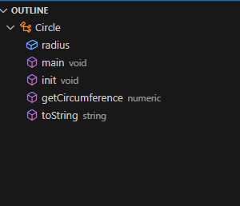
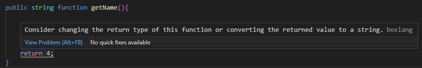
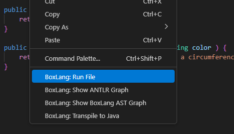
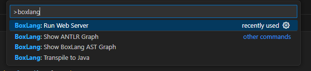

# IDE & Tooling

## CLI Tools

We have a collection of CLI tools available to every OS installation:


[boxlang-compiler.md](boxlang-compiler.md)



[cfml-feature-audit.md](cfml-feature-audit.md)



[cfml-to-boxlang-transpiler.md](cfml-to-boxlang-transpiler.md)


## BoxLang IDE

We have an official first-party extension for VSCode. You can find it in the [VSCode marketplace](https://marketplace.visualstudio.com/items?itemName=ortus-solutions.vscode-boxlang).

## Features at a Glance

* Language server integration
  * Inline documentation
  * Language hints
  * Type information (experimental)
* Built-in debugger
* Mini BoxLang web server for quick development/testing

## Language Server

The extension bundles a language server based on the BoxLang runtime that gives VSCode access to the same information used when executing your sourcecode. This provides us the ability to display rich information right in the editor.

Some features provided by the language server are

Code outlines

<figure><figcaption></figcaption></figure>

Function definition

<figure><figcaption></figcaption></figure>

Type hinting (experimental - must configure in settings)

<figure><figcaption></figcaption></figure>

Much functionality is still provided through the old JavaScript API. It is being converted to use the language server ASAP.

## Debugger

The debugger is implemented in Java using the JDP. It provides complete control over a running BoxLang application.

The extension provides quick ways to run your BoxLang programs. Simply right-click within a `.bxs` file or class (`.bx`) that implements a main method and select "BoxLang: Run File".

<figure><figcaption></figcaption></figure>

You can use it to debug command line scripts or the built-in web server.

<figure><figcaption></figcaption></figure>

## Mini Web Server

The MinServer provides a lightweight web runtime powered by undertow. Simply hit `ctrl+shift+p` to bring up the command palette and select "BoxLang: Run Web Server". When you run the command it will open up the MinServer on the configured port (defaults to 8085) and open your browser.

<figure><figcaption></figcaption></figure>

The web server will automatically be configured to use your projects directory as the web root. You will be prompted to select your web root if you have more than one folder open in your workspace.

## Contributing

Checkout the [git repository](https://github.com/ortus-boxlang/vscode-boxlang) for our extension.

Feel free to create an issue if you are having any problemsor want to create a feature request. Pull requests are welcome as well.
