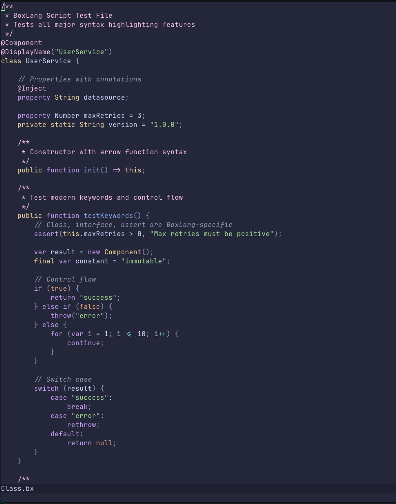

# BoxLang Neovim Plugin

Vim syntax highlighting for BoxLang - a dynamic JVM language and runtime.

## 📖 Overview



This plugin provides comprehensive syntax highlighting for BoxLang script files (`.bx`, `.bxs`) and template files (`.bxm`). It includes support for:

* **Script Syntax** - Pure BoxLang script with modern language features
* **Template Syntax** - Markup-based BoxLang with `bx:` tags and HTML
* **Cross-Syntax Embedding** - Template islands in script files and `<bx:script>` blocks in templates

## ✨ Features

### BoxLang Script Syntax (`.bx`, `.bxs`)

* **Modern Keywords**: `class`, `interface`, `assert`, `final`, `package`, `abstract`, `static`
* **Control Flow**: `if`, `else`, `for`, `while`, `do`, `switch`, `case`, `try`, `catch`, `finally`
* **Operators**:
  * Standard: `+`, `-`, `*`, `/`, `%`, `^`, `&`, `&&`, `||`, `!`
  * Comparison: `==`, `!=`, `<>`, `>`, `<`, `>=`, `<=`
  * Strict equality: `===`, `!==`
  * Elvis operator: `?:`
  * Bitwise (BoxLang-specific): `b|`, `b&`, `b^`, `b~`, `b<<`, `b>>`, `b>>>`
* **Functions**:
  * Arrow functions: `=>`
  * Lambda functions: `->`
  * Static BIF references: `::`
* **Annotations**: `@name(...)` with complex parameter support
* **String Interpolation**: `#expression#` within strings
* **Comments**: `//`, `/* */`, `/** */` (JavaDoc-style)
* **Component Islands**: Triple backtick template blocks embedded in script
* **Data Structures**: Arrays, structs, queries
* **Scopes**: `variables`, `local`, `arguments`, `request`, `session`, `application`, `server`, etc.

### BoxLang Template Syntax (`.bxm`)

* **HTML Support**: Custom lightweight HTML syntax highlighting
  * Multi-color support: Distinct colors for special tags (`html`, `head`, `body`, `script`, `style`, `link`) vs standard tags
  * `DOCTYPE` highlighting
  * Full HTML comments support `<!-- -->`
  * Integration within BoxLang tags
* **bx: Tags**: Native BoxLang component tags
  * Control flow: `<bx:if>`, `<bx:elseif>`, `<bx:else>`, `<bx:for>`, `<bx:while>`, `<bx:switch>`, `<bx:case>`
  * Output: `<bx:output>`
  * Functions: `<bx:function>`, `<bx:argument>`, `<bx:return>`
  * Error handling: `<bx:try>`, `<bx:catch>`, `<bx:finally>`, `<bx:throw>`, `<bx:rethrow>`
  * Components: `<bx:component>`, `<bx:interface>`, `<bx:property>`
  * Utility: `<bx:set>`, `<bx:include>`, `<bx:import>`, `<bx:param>`
  * Advanced: `<bx:lock>`, `<bx:thread>`, `<bx:transaction>`, `<bx:abort>`, `<bx:exit>`
* **Expression Interpolation**: `#expression#` in text and attributes
* **Template Comments**: `<!--- ... --->`
* **Embedded Script**: `<bx:script>` blocks with full script syntax highlighting
* **Code Folding**: Automatic folding for tag regions

## ⚡ Installation

### Using [lazy.nvim](https://github.com/folke/lazy.nvim) (Lua)

Add this to your plugin configuration (e.g., `lua/plugins/boxlang.lua`):

```lua
return {
  {
    "ortus-boxlang/vim-boxlang",
    ft = { "boxlang", "boxlangTemplate" }, -- Optional: lazy load on filetype
    init = function()
       -- Any custom configuration here
    end,
  }
}
```

### Using [vim-plug](https://github.com/junegunn/vim-plug)

Add to your `.vimrc` or `init.vim`:

```vim
Plug 'ortus-solutions/vim-boxlang'
```

Then run:

```vim
:PlugInstall
```

### Using [Vundle](https://github.com/VundleVim/Vundle.vim)

Add to your `.vimrc`:

```vim
Plugin 'ortus-solutions/vim-boxlang'
```

Then run:

```vim
:PluginInstall
```

### Using [Pathogen](https://github.com/tpope/vim-pathogen)

```bash
cd ~/.vim/bundle
git clone https://github.com/ortus-solutions/vim-boxlang.git
```

### Manual Installation

1.  Clone this repository:

    ```bash
    git clone https://github.com/ortus-solutions/vim-boxlang.git
    ```
2.  Copy the files to your vim runtime directory:

    ```bash
    cp -r vim-boxlang/syntax ~/.vim/
    cp -r vim-boxlang/ftdetect ~/.vim/
    ```

### NeoVim

For NeoVim, use the same installation methods but replace `~/.vim` with:

* Linux/macOS: `~/.config/nvim`
* Windows: `~/AppData/Local/nvim`

## 📄 File Extensions

The plugin automatically detects and applies syntax highlighting based on file extensions:

* **`.bx`** - BoxLang script class/component files → Uses `boxlang` syntax
* **`.bxs`** - BoxLang script files (executable) → Uses `boxlang` syntax
* **`.bxm`** - BoxLang template/markup files → Uses `boxlangTemplate` syntax

## ⚙️ Manual Filetype Setting

If automatic detection doesn't work, you can manually set the filetype:

```vim
" For script files
:setfiletype boxlang

" For template files
:setfiletype boxlangTemplate
```

Or add to your file:

```boxlang
// For .bx/.bxs files, add at the top:
// vim: set filetype=boxlang:
```

```html
<!--- For .bxm files, add at the top: --->
<!--- vim: set filetype=boxlangTemplate: --->
```

## 🎨 Syntax Highlighting Examples

### Script Example (`.bx`, `.bxs`)

```boxlang
/**
 * BoxLang class example with modern syntax
 */
@Component
class UserService {

    property String name;
    property Number age;

    public function init() {
        this.name = "BoxLang";
        return this;
    }

    /**
     * Get user with arrow function
     */
    public function getUser() => {
        return {
            name: this.name,
            age: this.age,
            active: true
        };
    }

    // Lambda function
    public function filter(array data) {
        return data.filter((item) -> item.active === true);
    }

    // Bitwise operations
    public function bitwiseExample() {
        var flags = 5 b| 3;  // Bitwise OR
        return flags b& 1;    // Bitwise AND
    }
}
```

### Template Example (`.bxm`)

```html
<!--- BoxLang template example --->
<bx:output>
    <h1>Welcome to #variables.appName#!</h1>

    <bx:if condition="user.isLoggedIn()">
        <p>Hello, #user.getName()#</p>
    <bx:else>
        <p>Please log in</p>
    </bx:if>

    <bx:for array="#items#" index="i" item="item">
        <div class="item-##i##">
            #item.name#
        </div>
    </bx:for>
</bx:output>

<bx:script>
    // Embedded script with full syntax highlighting
    function loadData() {
        var data = queryExecute("SELECT * FROM users");
        return data;
    }
</bx:script>
```

## 🚀 BoxLang-Specific Features

This syntax file is specifically designed for **BoxLang**, not CFML/ColdFusion. Key differences:

* Uses `bx:` prefix for tags (not `cf`)
* Highlights `class` keyword (BoxLang native, vs CFML's `component`)
* Supports bitwise operators (`b|`, `b&`, `b^`, `b~`, `b<<`, `b>>`, `b>>>`)
* Strict equality operators (`===`, `!==`)
* Arrow functions (`=>`) and lambda functions (`->`)
* `assert` statement
* `castas` operator
* Modern keywords: `final`, `package`, `interface` as first-class

A separate CFML syntax file is available for ColdFusion compatibility mode.

## 🎨 Customization

You can customize the highlighting by adding to your `.vimrc`:

```vim
" Example: Change keyword color
hi boxlangKeyword ctermfg=cyan guifg=#00ffff

" Example: Change string color
hi boxlangStringSingle ctermfg=green guifg=#00ff00
hi boxlangStringDouble ctermfg=green guifg=#00ff00

" Example: Customize operator color
hi boxlangOperator ctermfg=yellow guifg=#ffff00

" Example: Make bitwise operators stand out
hi boxlangBitwiseOp ctermfg=magenta guifg=#ff00ff
```

## 📁 Code Folding

The syntax files include folding support for major code blocks:

```vim
" Enable folding in your .vimrc
set foldenable
set foldmethod=syntax
set foldlevelstart=10

" Toggle fold with 'za'
" Open all folds with 'zR'
" Close all folds with 'zM'
```

Folds are automatically created for:

* Classes and interfaces
* Functions
* Control structures (`if`, `for`, `while`, `switch`, `try`)
* Tag regions in templates

## 🔧 Troubleshooting

### Syntax highlighting not working

1.  Verify filetype is set correctly:

    ```vim
    :set filetype?
    ```
2.  Check if syntax is enabled:

    ```vim
    :syntax on
    ```
3.  Reload the syntax file:

    ```vim
    :syntax clear
    :edit
    ```

### Colors look wrong

Ensure your color scheme supports the standard vim highlight groups. You can test with a built-in scheme:

```vim
:colorscheme desert
:colorscheme murphy
```

## 🤝 Contributing

Contributions are welcome! Please:

1. Fork the repository
2. Create a feature branch
3. Make your changes
4. Test with various BoxLang files
5. Submit a pull request
