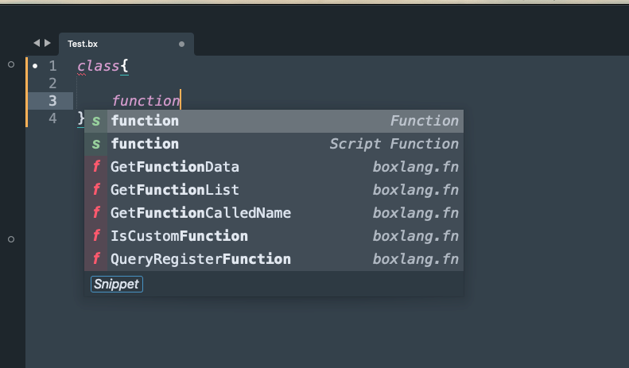
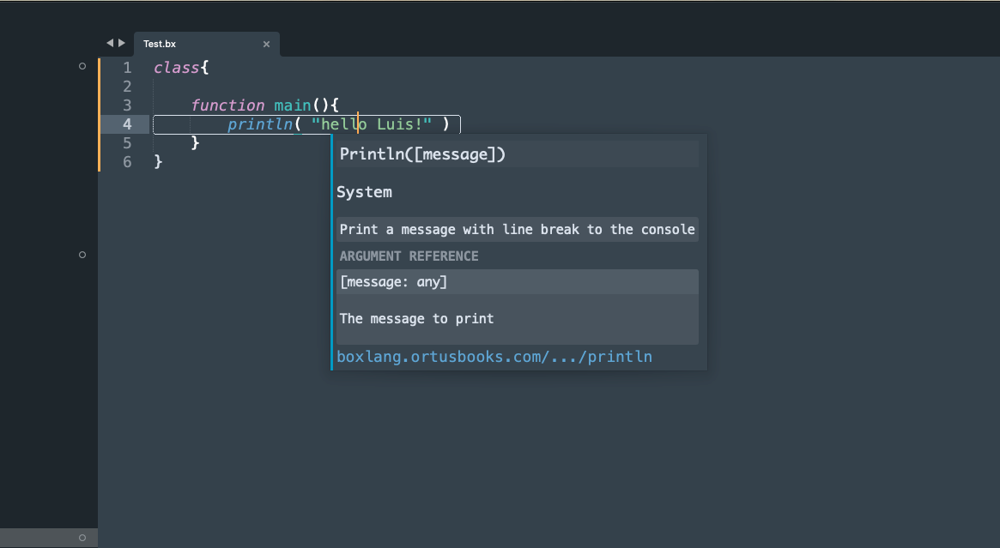
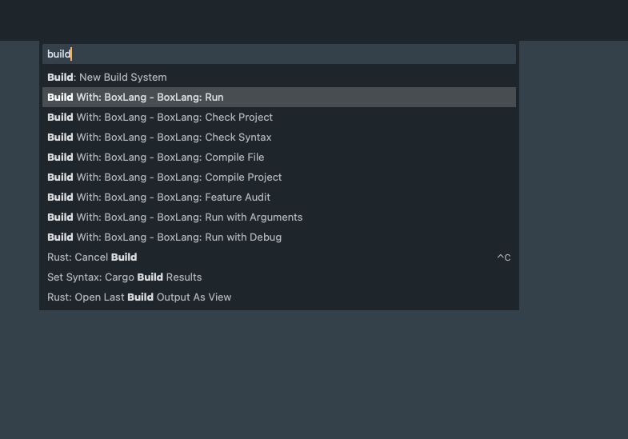
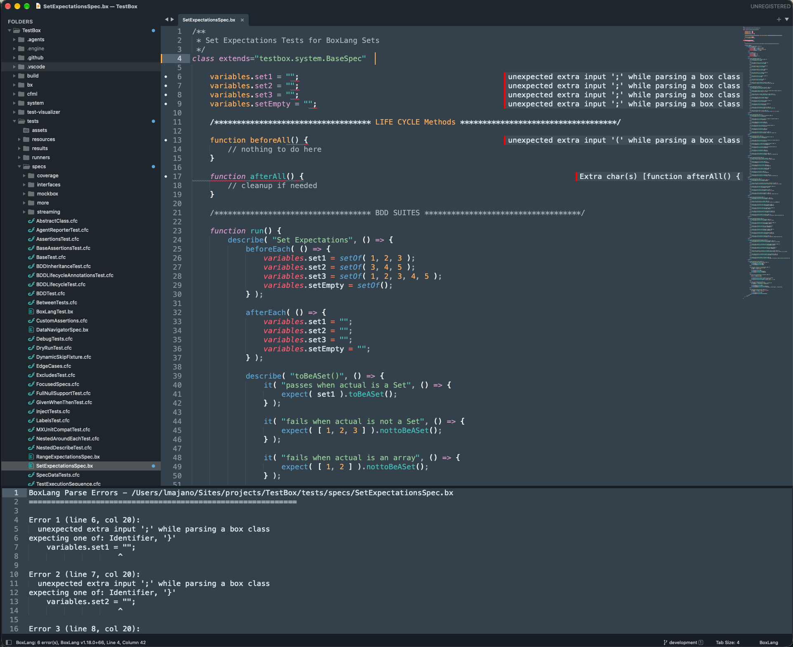
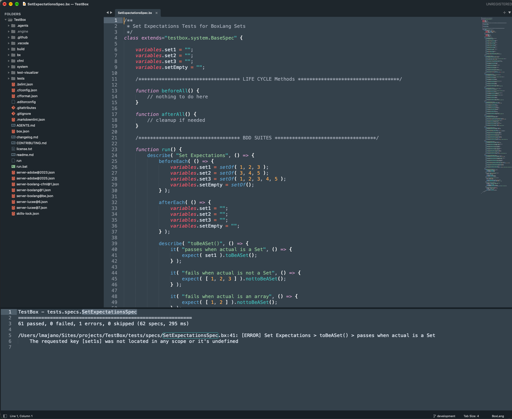
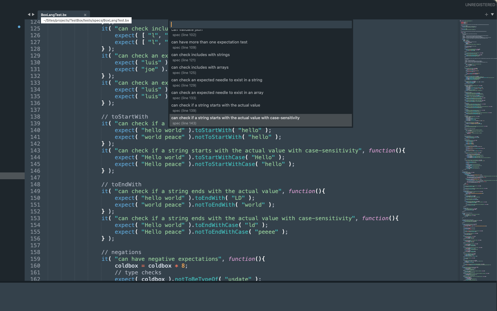

# BoxLang Sublime Text Package

[](https://github.com/ortus-boxlang/sublimetext-boxlang/actions/workflows/tests.yml) [](https://opensource.org/licenses/Apache-2.0)

Comprehensive BoxLang language support for **Sublime Text 4**. The package provides syntax highlighting, intelligent completions with 940+ built-in functions, syntax error checking, a TestBox runner, inline documentation, code formatting, type inference, and a full build system, all powered by the BoxLang CLI.



***

## 📋 Requirements

| Dependency   | Version         | Notes                                                                        |
| ------------ | --------------- | ---------------------------------------------------------------------------- |
| Sublime Text | 4 (Build 4180+) | Editor platform                                                              |
| BoxLang CLI  | 1.17.0+         | Required for parsing, syntax checking, formatting, and compilation           |
| TestBox      | 7.0+            | Optional, only for the TestBox runner     |
| Python       | 3.11+           | Plugin runtime (bundled with Sublime Text 4)                                 |


Syntax highlighting works without BoxLang installed. The full feature set (completions, syntax checking, formatting, build system, TestBox) needs the `boxlang` CLI. BoxLang can be installed with [BVM](../installation/boxlang-version-manager-bvm.md), the [Quick Installer](../installation/boxlang-quick-installer.md), or Homebrew. The package detects all of them.


***

## ⚡ Installation

### Via Package Control (Recommended)

1. Open the Command Palette (`Cmd+Shift+P` on macOS / `Ctrl+Shift+P` on Windows/Linux)
2. Select **Package Control: Install Package**
3. Search for `BoxLang` and press Enter
4. Restart Sublime Text when prompted

### Manual Installation

Clone the repository directly into your Sublime Text `Packages` directory. The folder must be named `BoxLang`:

```bash
# macOS
git clone https://github.com/ortus-boxlang/sublimetext-boxlang.git \
  ~/Library/Application\ Support/Sublime\ Text/Packages/BoxLang

# Linux
git clone https://github.com/ortus-boxlang/sublimetext-boxlang.git \
  ~/.config/sublime-text/Packages/BoxLang

# Windows
git clone https://github.com/ortus-boxlang/sublimetext-boxlang.git \
  "%APPDATA%\Sublime Text\Packages\BoxLang"
```

Restart Sublime Text after cloning.

### How the package finds BoxLang

The package looks for the BoxLang executable in this order:

1. The `boxlang_executable_path` setting
2. Standard install locations: `~/.bvm/current/bin/boxlang` (or `$BVM_HOME`), `/opt/homebrew/bin/boxlang`, `/usr/local/bin/boxlang`, `~/.local/bin/boxlang`, and `C:\BoxLang` on Windows
3. Your `PATH`


On macOS, an app launched from the Dock or Spotlight does not read your shell profile, so its `PATH` can differ from your Terminal's. If BoxLang is reported as not found, or the wrong one is picked, set `boxlang_executable_path` explicitly. Run **BoxLang: Show Version Info** to see what the package found.


### Optional: Enhanced File Icons

Install **A File Icon** from Package Control to display BoxLang-branded per-extension icons (`.bx`, `.bxs`, `.bxm`) in the sidebar. Without it, Sublime Text still uses native scope-based fallback icons configured by the package.

***

## 🧙 First Run & Setup Wizard

On first launch, the **BoxLang Setup Wizard** will automatically run to configure the package:

1. **Detect BoxLang** — Checks if the `boxlang` CLI can be found and shows the detected version
2. **Configure CFML Support** — Optionally enable `.cfc`/`.cfm`/`.cfs` file handling (disabled by default, and auto-disabled if the CFML package is already installed)
3. **Quick Tips** — Displays essential keyboard shortcuts to get you started

You can re-run the wizard at any time from the Command Palette: **BoxLang: Run Setup Wizard**

***

## ✨ Features

### 🎨 Syntax Highlighting

Full syntax highlighting for all BoxLang file types:

| Extension | Type             | Description                                       |
| --------- | ---------------- | ------------------------------------------------- |
| `.bx`     | Script class     | OOP classes with full BoxLang script syntax       |
| `.bxs`    | Script-only file | Executable BoxLang scripts                        |
| `.bxm`    | Markup template  | HTML templates with embedded `<bx:script>` blocks |

The script syntax (`source.boxlang`) supports:

* **Modern keywords** — `class`, `interface`, `abstract`, `final`, `static`, `assert`
* **Control flow** — `if`/`else`, `for`/`while`/`do`, `switch`/`case`, `try`/`catch`/`finally`, and two-variable loops such as `for ( key, value in struct )`
* **Functions** — Named, anonymous, arrow (`=>`), and lambda (`->`) expressions
* **Operators** — Standard, comparison, strict equality (`===`, `!==`), spread, rest, ternary, and range operators (`..`, `..<`, `>..`, `>..<`)
* **Literals** — Strings with `#expression#` interpolation, arrays, structs, `set{ }`, `sb{ }`, booleans, null, hex numbers
* **Classes** — Inner classes and local classes, and inner-class imports with `$`
* **Scopes** — `variables`, `this`, `arguments`, `request`, `session`, `application`, `server`, `cgi`, and more
* **Annotations** — `@name(...)` with full parameter support
* **Imports** — `import` statements with dot-path resolution
* **Destructuring** — Array and struct destructuring bindings

The markup syntax (`embedding.boxlang.markup`) delegates embedded `<bx:script>` and `<bx:function>` blocks to the full script highlighter.

### 🤖 Intelligent Completions

The package ships with a rich completion engine driven by JSON data generated from the BoxLang documentation:

| Category                    | Count | Details                                                           |
| --------------------------- | ----- | ----------------------------------------------------------------- |
| Built-In Functions (BIFs)   | 940+  | 639 core + 303 module (sets, date setters, scheduler, AI, and more) |
| BoxLang Tags (`bx:`)        | 86    | 49 core + 37 module, with attribute completions                   |
| Member Functions            | 370+  | Per native type: string, array, struct, query, date, list, xml    |
| Dot-Path Completions        | —     | `import`, `new`, `createObject()` dot-path navigation             |
| Type-Aware Completions      | —     | Inferred-type member method suggestions                           |
| Component Index Completions | —     | Project-wide class scanning with inheritance resolution           |

Completion style is configurable per setting (see the Settings section below):

* **`basic`** — Function name only
* **`required`** (default) — Name + required parameters as snippet
* **`full`** — Name + all parameters as snippet

### 📚 Inline Documentation

| Feature         | Trigger              | Description                                                                          |
| --------------- | -------------------- | ------------------------------------------------------------------------------------ |
| F1 Popup        | `F1`                 | Full documentation popup with parameter reference table                              |
| Hover Docs      | Mouse hover          | Quick info popup when hovering over a symbol                                         |
| Completion Docs | During auto-complete | Parameter hints visible alongside completion suggestions                             |
| Go to Docs      | Via popup link       | Opens [boxlang.ortusbooks.com](https://boxlang.ortusbooks.com) to the relevant page  |

### ✅ Syntax Checking

The package runs [`boxlang check`](boxlang-syntax-check.md) (BoxLang 1.17+) to find syntax errors without executing your code. Errors appear in several places at once:

| Where                | What you see                                                                 |
| -------------------- | ---------------------------------------------------------------------------- |
| The line             | A squiggly underline                                                         |
| The gutter           | An icon on each line with an error, with a hover popup showing the full text |
| The end of the line  | The first line of the error message, inline                                  |
| The error panel      | Every error, with `F4` / `Shift+F4` to jump between them                     |
| The status bar       | `BoxLang: 3 error(s)`                                                        |

When it runs:

* **On save** (default) — every time a `.bx`, `.bxs`, or `.bxm` file is saved. CFML extensions are included when CFML fallback is enabled.
* **While typing** (opt-in) — set `boxlang_check_on_type` to `true`. The unsaved buffer is checked after a pause of `boxlang_check_on_type_delay_ms` (default 1000 ms) and the panel does not open.
* **On demand** — **BoxLang: Check Syntax** checks the current file and **BoxLang: Check Project** checks every file in the project. Both are also available as build variants (see the Build System section below) with clickable errors.


If your BoxLang is older than 1.17 the check is skipped and the status bar says why.


### 🧪 TestBox

Run [TestBox](https://testbox.ortusbooks.com) specs from the Command Palette:

| Command                                   | Runs                                                                                           |
| ----------------------------------------- | ---------------------------------------------------------------------------------------------- |
| **BoxLang: TestBox Run Bundle (Current File)** | The bundle for the current file                                                           |
| **BoxLang: TestBox Run Spec at Cursor**   | The `it()`, `test()`, `then()` call or `function testXxx()` above the cursor, or the enclosing `describe()` suite |
| **BoxLang: TestBox Run All Tests**        | Everything in `directory` (default `tests.specs`)                                              |
| **BoxLang: TestBox Run Last**             | Repeats the previous run                                                                       |

By default tests run through TestBox's **BoxLang runner** (`BoxLangRunner.bx`, TestBox 7+). The package searches the project and parent folders for these common layouts:

* `testbox/system/runners/BoxLangRunner.bx` — installed at the project root
* `lib/testbox/system/runners/BoxLangRunner.bx` — installed under `lib`
* `system/runners/BoxLangRunner.bx` — the TestBox source checkout

Results appear in an output panel with clickable `file:line` failures, and failing lines in open files get a squiggle, gutter icon, and inline message.

If the runner is not found, choose **Set a local BoxLangRunner.bx path** or **Use an HTTP runner**. The selected value is saved in the open project's `.sublime-project` file under `settings.boxlang_testbox`, and the test run is retried. A saved Sublime project is required for this setup flow.

You can also configure the CLI runner path directly. Use an absolute path or a path relative to the project root:

```json
{
  "settings": {
    "boxlang_testbox": {
      "runner_path": "lib/testbox/system/runners/BoxLangRunner.bx"
    }
  }
}
```

#### Using a web runner

A web runner is opt-in per project. Add the runner URL to the project's `.sublime-project`:

```json
{
  "settings": {
    "boxlang_testbox": {
      "http_runner_url": "http://localhost:8080/tests/runner.bxm"
    }
  }
}
```

The package then runs tests over HTTP with `reporter=json` (plus `bundles`, `directory`, `testSpecs`, or `testSuites` as needed) and shows the results the same way. The web server must already be running.

| `boxlang_testbox` key | Default         | Description                                                                |
| --------------------- | --------------- | -------------------------------------------------------------------------- |
| `runner_path`         | `""`            | Path to `BoxLangRunner.bx`, relative to the project root. Empty = auto-detect |
| `http_runner_url`     | `""`            | Web runner URL. Empty = use the BoxLang runner                             |
| `directory`           | `"tests.specs"` | Dot-path directory used by **Run All Tests**                               |
| `extra_args`          | `[]`            | Extra BoxLang runner arguments, for example `["--labels=unit"]`            |
| `timeout`             | `300`           | Seconds to wait for a run                                                  |

### 🧭 Navigating Symbols

| Where                                    | What you get                                                                                         |
| ---------------------------------------- | ---------------------------------------------------------------------------------------------------- |
| **Goto Symbol** (`Cmd/Ctrl+R`)           | Classes (including inner and local classes) and functions, in script and `bx:function` tag form     |
| **BoxLang: Go to Property**              | Every `property` declaration in the file                                                             |
| **BoxLang: Go to TestBox Spec or Suite** | Every `describe()`, `it()` style call and xUnit test function in the file                            |

### 🔎 Version Info

**BoxLang: Show Version Info** re-detects BoxLang and shows which one the package is using:

```
BoxLang Version Info
============================================================
Version      : 1.18.0+1
Executable   : /Users/you/.local/bin/boxlang
Source       : Quick installer (user)
Features     : syntax check available
BOXLANG_HOME : /Users/you/.boxlang (default, variable not set)

Project      : /Users/you/work/app
  .boxlang.json : not found

Upgrade      : install-boxlang --check-update
```

The **Source** line says how BoxLang was installed: BVM, Homebrew, the Quick Installer (user or system), the Windows installer, your `boxlang_executable_path` setting, or `PATH`. When BVM is installed, the report also shows `bvm current`, the project's `.bvmrc`, the installed versions, and a warning when the `.bvmrc` version is not the one that is active. In that case the status bar adds `(.bvmrc 1.17.6)` after the version. Nothing BVM-specific appears for other install types.

### 🛠️ Developer Tools

* **Code Formatting** — Format the current file with `boxlang format` via `Shift+Alt+F` or **BoxLang: Format Code** in the Command Palette. Optionally enable `boxlang_format_on_save` to format automatically.
* **Go to Definition** — `Ctrl/Cmd+Click` on any class or function reference to jump to its definition file.
* **Status Bar** — Shows the BoxLang CLI version, indexing progress, and error counts directly in the Sublime Text status bar.
* **DI Property Injection** — `Shift+Alt+D` inserts a dependency injection property template (configurable via `boxlang_di_property` setting).
* **Controller/View Toggle** — `Ctrl+F1` toggles between controller and view files based on configured folder names.

### 🔧 Optional CFML Fallback

The package leaves `.cfc`, `.cfm`, and `.cfs` files to the dedicated CFML package by default. To enable BoxLang syntax and completions for those extensions, set `boxlang_enable_cfml_fallback` to `true` in **Preferences: BoxLang Settings**. The setup wizard disables this option if it detects the CFML package, avoiding conflicts.

### 🖼️ Screenshots

<figure><figcaption><p>Context-aware completions</p></figcaption></figure>

<figure><figcaption><p>Inline documentation</p></figcaption></figure>

<figure><figcaption><p>Build variants</p></figcaption></figure>

<figure><figcaption><p>Syntax diagnostics</p></figcaption></figure>

<figure><figcaption><p>TestBox results</p></figcaption></figure>

<figure><figcaption><p>TestBox spec navigation</p></figcaption></figure>

***

## ⌨️ Key Bindings

| Action                    | macOS                | Linux / Windows      |
| ------------------------- | -------------------- | -------------------- |
| Show inline documentation | `F1`                 | `F1`                 |
| Toggle controller/view    | `Ctrl+F1`            | `Ctrl+F1`            |
| Format code               | `Shift+Option+F`     | `Shift+Alt+F`        |
| Inject DI property        | `Shift+Option+D`     | `Shift+Alt+D`        |
| Insert `writeDump()`      | `Ctrl+Option+D`      | `Ctrl+Alt+D`         |
| Insert `writeOutput()`    | `Ctrl+Shift+O`       | `Ctrl+Shift+O`       |
| Insert `abort;`           | `Ctrl+Option+A`      | `Ctrl+Alt+A`         |
| Wrap selection in `##`    | `#` (with selection) | `#` (with selection) |
| Go to definition          | `Cmd+Click`          | `Ctrl+Click`         |
| Next error                | `F4`                 | `F4`                 |
| Previous error            | `Shift+F4`           | `Shift+F4`           |
| Build & run current file  | `Cmd+B`              | `Ctrl+B`             |


On macOS, if `F1` / `F4` trigger media keys, hold `Fn` first or remap them in System Preferences.


***

## 🎛️ Command Palette

Open the Command Palette and type `BoxLang`:

| Command                                  | What it does                                                              |
| ---------------------------------------- | ------------------------------------------------------------------------- |
| **BoxLang: Show Version Info**           | Show the BoxLang version, executable, install type, and project details   |
| **BoxLang: Check Syntax**                | Check the current file for syntax errors                                  |
| **BoxLang: Check Project**               | Check every file in the project                                           |
| **BoxLang: Next Error / Previous Error** | Jump between syntax errors                                                |
| **BoxLang: TestBox Run ...**             | Run the bundle, the spec at the cursor, all tests, or the last run        |
| **BoxLang: Go to TestBox Spec or Suite** | Jump to a `describe()` or `it()` in the current file                      |
| **BoxLang: Go to Property**              | Jump to a `property` declaration in the current file                      |
| **BoxLang: Go to Definition**            | Jump to the definition of the class or function under the cursor          |
| **BoxLang: Format Code**                 | Format the current file with `boxlang format`                             |
| **BoxLang: Show Documentation**          | Show the inline documentation popup                                       |
| **BoxLang: Open Documentation Website**  | Open [BoxLang documentation](https://boxlang.ortusbooks.com)               |
| **BoxLang: Get Support**                 | Open [BoxLang support plans](https://www.boxlang.io/plans)                 |
| **TestBox: Open Documentation Website**  | Open [TestBox documentation](https://testbox.ortusbooks.com)               |
| **BoxLang: Toggle Controller/View**      | Switch between a controller and its view                                  |
| **BoxLang: Inject Property**             | Insert a dependency injection property                                    |
| **BoxLang: Index Active Project**        | Re-index the project for component completions                            |
| **BoxLang: Create Project File**         | Create a `.sublime-project` file for the current folder                   |
| **BoxLang: Run Setup Wizard**            | Re-run the first-run wizard                                               |

***

## 🔨 Build System

The package registers a **BoxLang** build system with eight variants, selectable from **Tools → Build With**:

| Variant                | Command                                                  | Use Case                         |
| ---------------------- | -------------------------------------------------------- | -------------------------------- |
| **Run**                | `boxlang "$file"`                                        | Execute the current file         |
| **Run with Arguments** | `boxlang "$file" ${args}`                                | Execute with custom CLI args     |
| **Run with Debug**     | `boxlang --bx-debug "$file"`                             | Run with debug output            |
| **Compile File**       | `boxlang compile --source "$file" --target "./bin"`      | Compile a single file to bytecode |
| **Compile Project**    | `boxlang compile --source "$file_path" --target "./bin"` | Compile the entire project       |
| **Check Syntax**       | `boxlang check "$file"`                                  | Validate syntax without running  |
| **Check Project**      | `boxlang check --source "$project"`                      | Validate every file in the project |
| **Feature Audit**      | `boxlang featureaudit --source "$file_path"`             | Audit CFML→BoxLang compatibility |

The check variants print `file: Line: N Col: N - message`, so errors in the build output are clickable.

***

## ⚙️ Settings

Open settings via the Command Palette: **Preferences: BoxLang Settings**

### Key Settings

| Setting                                      | Default      | Description                                                              |
| -------------------------------------------- | ------------ | ------------------------------------------------------------------------ |
| `boxlang_executable_path`                    | `null`       | Custom path to the BoxLang CLI executable                                |
| `boxlang_enable_cfml_fallback`               | `false`      | Enable `.cfc`/`.cfm`/`.cfs` file handling                                |
| `boxlang_bif_completions`                    | `"required"` | BIF completion style: `basic`, `required`, or `full`                     |
| `boxlang_class_completions`                  | `"required"` | Component completion style: `basic`, `required`, or `full`               |
| `boxlang_class_completion_names`             | `"basic"`    | Include return type in completion name: `basic` or `full`                |
| `boxlang_instantiated_component_completions` | `true`       | Enable variable-to-component member completions                          |
| `boxlang_hover_docs`                         | `true`       | Show documentation popup on mouse hover                                  |
| `boxlang_completion_docs`                    | `true`       | Show parameter hints alongside auto-complete suggestions                 |
| `boxlang_inline_doc_regions_highlight`       | `true`       | Highlight documentation regions in the editor                            |
| `boxlang_check_on_save`                      | `true`       | Run `boxlang check` when a file is saved                                 |
| `boxlang_check_show_panel`                   | `true`       | Open the error panel when a check finds errors                           |
| `boxlang_check_on_type`                      | `false`      | Also check while typing (debounced, checks the unsaved buffer)           |
| `boxlang_check_on_type_delay_ms`             | `1000`       | Delay after the last keystroke before checking (minimum 100)             |
| `boxlang_error_gutter_icons`                 | `true`       | Show a gutter icon on lines with syntax errors                           |
| `boxlang_error_inline_annotations`           | `true`       | Show the first line of each error at the end of the line                 |
| `boxlang_format_on_save`                     | `false`      | Auto-format the current file on save                                     |
| `boxlang_auto_compile_on_save`               | `false`      | Auto-compile to `./bin` on save                                          |
| `boxlang_compile_target`                     | `"./bin"`    | Compilation target directory for auto-compile                            |
| `boxlang_testbox_enabled`                    | `true`       | Enable the TestBox commands                                              |
| `boxlang_status_bar_enabled`                 | `true`       | Show BoxLang information in the status bar                               |

### Project Configuration

Add BoxLang-specific settings to your `.sublime-project` file to enable project-wide component indexing, dot-path resolution, and a project web runner for TestBox:

```json
{
  "settings": {
    "boxlang_class_folders": [
      {
        "path": "model",
        "variable_names": ["{class}", "{class_folder_singularized}"],
        "accessors": true
      }
    ],
    "boxlang_testbox": {
      "http_runner_url": "http://localhost:8080/tests/runner.bxm"
    }
  },
  "mappings": [
    { "path": "/absolute/path/to/project", "mapping": "/" }
  ]
}
```

* **`boxlang_class_folders`** — Folders to index for component completions. `variable_names` controls which variable name patterns map to indexed components; `accessors` enables getter/setter completions for component properties.
* **`boxlang_testbox`** — Per-project TestBox runner settings. See the TestBox section above.
* **`mappings`** — Maps absolute file system paths to logical dot-path roots, enabling `createObject()` and `import` resolution across the project.

Trigger a manual re-index via the Command Palette: **BoxLang: Index Active Project**

***

## 📝 Code Snippets

The package includes 19 built-in snippets activated by their trigger word followed by `Tab`:

| Trigger            | Description                                              |
| ------------------ | -------------------------------------------------------- |
| `bxclass`          | Class declaration with `extends`                         |
| `bxinterface`      | Interface declaration                                    |
| `bxcomponent`      | Component declaration                                    |
| `bxfunc`           | Function declaration                                     |
| `bxtest`           | Test block (`describe`/`it`)                             |
| `bxtry`            | Try/catch block                                          |
| `bxfor`            | For loop                                                 |
| `bxforeach`        | For-in loop                                              |
| `bxif`             | If statement                                             |
| `bxscript`         | `<bx:script>` block                                      |
| `bxlocalclass`     | Local or inner class                                     |
| `bxabstract`       | Abstract class                                           |
| `bxset`            | Set literal                                              |
| `bxrange`          | Range                                                    |
| `bxclassmap`       | Class reference as a constructor, `map( User )`          |
| `bxtransformer`    | `queryExecute` with a query transformer                  |
| `bxscheduler`      | `schedulerNew()` with a server-fixed task                |
| `bxtask`           | Scheduled task with `.onOneServer()`                     |
| `bxclassintercept` | Class instantiation interception point                   |

***

## 🔧 CFML Support

By default, CFML file types (`.cfc`, `.cfm`, `.cfs`) are **not** handled by the BoxLang package to avoid conflicts with the dedicated CFML package. To enable CFML fallback support, set the following in **Preferences: BoxLang Settings**:

```json
{
  "boxlang_enable_cfml_fallback": true
}
```

When enabled, the BoxLang syntax and completion engine will also apply to CFML files. The setup wizard automatically disables this option if it detects the CFML package is already installed.

***

## 🩺 Troubleshooting

### Which BoxLang is Sublime Text using?

Run **BoxLang: Show Version Info**. It shows the version, the executable path, and how BoxLang was installed. To pin an exact BoxLang, set `boxlang_executable_path` in **Preferences: BoxLang Settings**:

```json
{ "boxlang_executable_path": "/Users/you/.local/bin/boxlang" }
```

To see which Java a BoxLang runs on, use a Terminal:

```bash
which boxlang
head -40 "$(which boxlang)"
echo "$JAVA_HOME"
java -version
```

### The status bar shows `[warning][cds] The shared archive file version ...`

This is a JVM warning, not a package error. The Java running BoxLang does not match the class data sharing archive it was built with, and the JVM prints a line before BoxLang's own output. Since package version 1.2.1 the package skips JVM warning lines when reading the version and JSON output. To remove the warning itself, make BoxLang start on the JDK it expects: reinstall it (`bvm install latest --force` for BVM, `install-boxlang --force` for the Quick Installer) or point `JAVA_HOME` at the matching JDK.

### Syntax errors are not shown

* Confirm BoxLang is 1.17 or newer in **BoxLang: Show Version Info**. Older versions do not have `boxlang check`.
* Confirm `boxlang_check_on_save` is `true` and the file has one of the supported extensions.

### TestBox says the runner was not found

The package checks `./testbox`, `./lib/testbox`, and the TestBox source-checkout layout `./system/runners/BoxLangRunner.bx`. If your runner is elsewhere, choose **Set a local BoxLangRunner.bx path** when prompted or add `runner_path` under `settings.boxlang_testbox` in your `.sublime-project`. To use a web runner, choose **Use an HTTP runner** or configure `http_runner_url` in the same project setting. The prompt saves the value and retries the run.

### Verify an install from the command line

The package repository includes a smoke test that exercises `boxlang check` and the TestBox runner against your real install:

```bash
python3 scripts/local_smoke_test.py --testbox /path/to/testbox
```

***

## ⚠️ Known Limitations

1. **AST for `.bxm`** — `boxlang --bx-printast` does not yet support markup template files; the package uses a flexible tag tokenizer instead of the AST parser for `.bxm` files.
2. **AST class parsing** — `class` declarations are parsed as sequential statements rather than `BoxClassDeclaration` nodes, requiring statement pattern matching.
3. **Java introspection** — `createObject("java", "...")` calls resolve to the generic `"any"` type; per-class Java method completions are deferred to a future phase.
4. **In-memory index** — The component index is not persisted to disk and is rebuilt fresh each Sublime Text session.
5. **MCP server** — The BoxLang MCP server integration is available but deferred to a future phase.
6. **Property and spec symbols** — These are available through the **Go to Property** and **Go to TestBox Spec or Suite** commands rather than **Goto Symbol**, because the grammar cannot tell a property name or spec name from other identifiers and strings.

***

## 🤝 Contributing

Contributions are welcome. See the [contributing guidelines](https://github.com/ortus-boxlang/sublimetext-boxlang/blob/main/CONTRIBUTING.md) for the full workflow and conventions.

### Run the test suite

The package uses pytest with TestBox-style expectations. From the repository root:

```bash
python3 -m pytest tests/
make test
make test-unit
make test-integration
make test-coverage
make test-report
make test-watch
```

### Package architecture

The package uses the BoxLang AST for `.bx` and `.bxs` files and a flexible tag tokenizer for `.bxm` templates. Completions and documentation come from plugins for built-ins and tags, BoxLang documentation, indexed components, dot paths, inferred types, `Application.bx` lifecycle methods, and symbols in the current file. Type inference is intentionally medium-depth: it uses literals, `new` and `createObject()` expressions, known BIF return types, assignments, dot chains, and indexed component metadata.

### Refresh completion data

Completion data is generated from the [BoxLang documentation repository](https://github.com/ortus-boxlang/boxlang-docs) with `scripts/generate_completions.py`. It produces the BIF, tag, member-function, and function-parameter JSON used by completions and inline documentation. Coverage includes core BoxLang and modules such as compat-cfml, image-manipulation, web-support, bx-csv, bx-jwt, bx-redis, bx-spreadsheet, and other BoxLang modules.

```bash
# First run: clone boxlang-docs and generate the data
python3 scripts/generate_completions.py --clone

# After documentation or BoxLang updates
python3 scripts/generate_completions.py --update

# Use a docs checkout at a custom location
python3 scripts/generate_completions.py --update --docs-path /path/to/boxlang-docs
```

The generator requires Python 3.11+ and uses only the standard library. Review `[warn]` output, then commit all four generated JSON files together from `src/plugins_/basecompletions/json/`.

For parser and plugin changes, preserve AST-only parsing for `.bx`/`.bxs`, derive self-closing tags from BoxLang `@BoxComponent` annotations, extend the `BoxlangPlugin` base class, and keep type inference medium-depth. Parsing, formatting, and compilation should continue to delegate to the BoxLang CLI.

***

Built by [Ortus Solutions](https://www.ortussolutions.com) for the BoxLang community. Architecture inspired by the [sublimetext-cfml](https://github.com/jcberquist/sublimetext-cfml) package, reimagined from the ground up for BoxLang.
