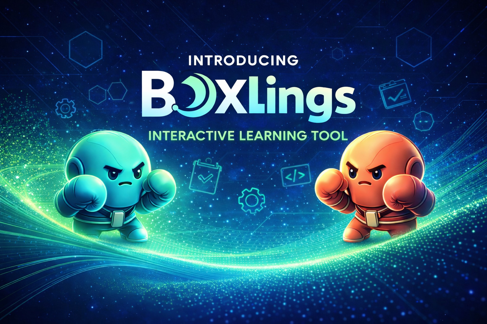
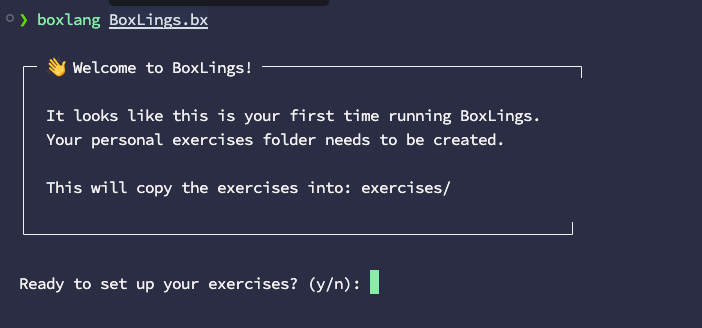
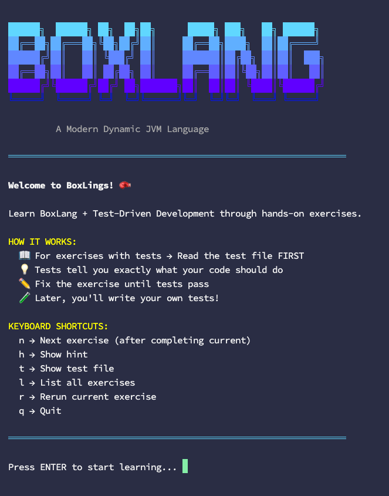

# Interactive Learning with BoxLings

<figure><figcaption></figcaption></figure>

**BoxLings** is an interactive CLI learning tool for BoxLang, inspired by Rustlings. It teaches the language through progressive exercises where you fix intentional issues and use tests to verify behavior.


BoxLings is built in BoxLang and teaches both BoxLang fundamentals and Test-Driven Development (TDD/BDD) workflows.


BoxLings is part of the practical BoxLang tooling ecosystem:

* Hands-on learning with immediate feedback
* Test-first learning using TestBox specs
* A real-world CLI workflow for everyday BoxLang usage
* It's also a CLI app built in BoxLang



## Quick Start

```bash
git clone https://github.com/ortus-boxlang/boxlings.git
cd boxlings
boxlang BoxLings.bx init
boxlang BoxLings.bx
```

<figure><figcaption></figcaption></figure>

<figure><figcaption></figcaption></figure>


## What You Will Practice

* Core language syntax and program structure
* Variables, functions, arrays, structs, and strings
* Error handling, testing patterns, and async workflows
* Scripts (`.bxs`), classes (`.bx`), and templates (`.bxm`)


## Learn More

* Repository: [https://github.com/ortus-boxlang/boxlings](https://github.com/ortus-boxlang/boxlings)
