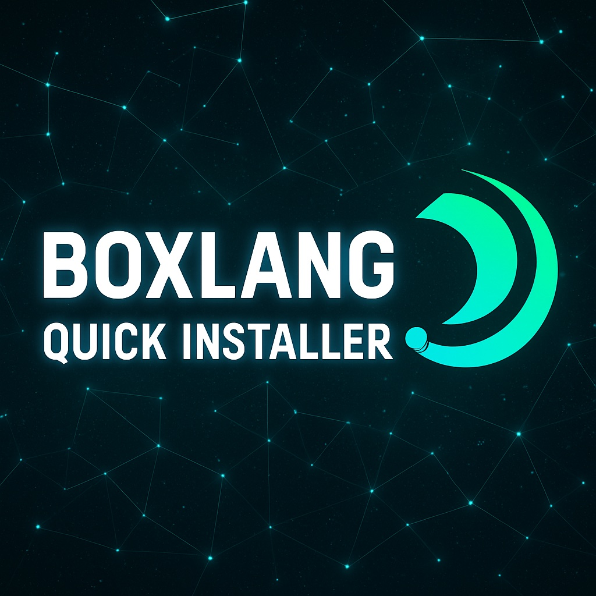

# BoxLang Quick Installer

<div data-full-width="false"><figure><figcaption><p>BQI</p></figcaption></figure></div>

The BoxLang Quick Installer provides convenient installation scripts for Mac, Linux, and Windows systems to get BoxLang up and running in minutes. Choose between a single-version installer for simplicity or BVM (BoxLang Version Manager) for advanced version management.

### 🚀 Quick Start

**Mac and Linux:**

```bash
# Single version (simple)
/bin/bash -c "$(curl -fsSL https://install.boxlang.io)"

# Version manager (advanced)
/bin/bash -c "$(curl -fsSL https://install-bvm.boxlang.io)"
```

**Windows:**

```powershell
# Single version (simple)
powershell -NoExit -Command "iex ((New-Object System.Net.WebClient).DownloadString('https://install-windows.boxlang.io'))"
```

#### Verify Installation

```bash
# Check BoxLang version
boxlang --version

# Start BoxLang REPL
boxlang

# Start MiniServer
boxlang-miniserver --port 8080
```

### 📋Requirements <a href="#requirements-7" id="requirements-7"></a>

You should be able to grab the Java 21 JRE for your OS and CPU arch here: [Download Java 21 JRE](https://adoptium.net/temurin/releases/?package=jre\&version=21)



We recommend using [homebrew](https://brew.sh/) to get started on a Mac with the **BoxLang** requirements. If not, you must download the requirements separately from the link above.

```bash
brew install openjdk@21
```

Once the requirements are installed, move down to the quick installer.



### 📦 Installation Options

#### Option 1: Single-Version Installer (Recommended for Most Users)

**Choose this if you:**

* 📌 Need one BoxLang version system-wide
* 🎯 Want the simplest possible installation
* 🏢 Are setting up production servers
* ⚡ Want the fastest installation with minimal overhead

**Features:**

* ✅ Installs latest stable BoxLang version
* ✅ Sets up BoxLang runtime and MiniServer
* ✅ Includes all helper scripts
* ✅ Automatic PATH configuration
* ✅ User or system-wide installation options

#### Option 2: BVM (BoxLang Version Manager)

**Choose this if you:**

* 🔄 Work on multiple projects needing different BoxLang versions
* 🧪 Want to test code against different BoxLang releases
* 🚀 Need to switch between stable and snapshot versions
* 📦 Want centralized management of BoxLang installations
* 🛠️ Are a BoxLang developer or advanced user

**Features:**

* ✅ Install and manage multiple BoxLang versions
* ✅ Switch between versions with one command
* ✅ List local and remote versions
* ✅ Clean uninstall capabilities
* ✅ Health check and diagnostics

### ⚙️ Command Options

Here are the available options for the install command.

| Option                 | Short | Description                                        |
| ---------------------- | ----- | -------------------------------------------------- |
| `--help`               | `-h`  | Show this help message                             |
| `--uninstall`          |       | Remove BoxLang from the system                     |
| `--check-update`       |       | Check if a newer version is available              |
| `--system`             |       | Force system-wide installation (requires sudo)     |
| `--force`              |       | Force reinstallation even if already installed     |
| `--with-commandbox`    |       | Install CommandBox without prompting               |
| `--without-commandbox` |       | Skip CommandBox installation                       |
| `--yes`                | `-y`  | Use defaults for all prompts (installs CommandBox) |

#### Notes

* Use `--system` when you want to install BoxLang for all users on the system
* The `--force` option is useful when you need to reinstall or update an existing installation
* `--yes` automatically accepts all defaults, including installing CommandBox
* `--with-commandbox` and `--without-commandbox` give you explicit control over CommandBox installation

### 🛠️ What Gets Installed

#### Core Components

* **BoxLang Runtime** (`boxlang`, `bx`) - The main BoxLang Runtime Engine
* **BoxLang MiniServer** (`boxlang-miniserver`, `bx-miniserver`) - Lightweight web application server

#### Helper Scripts

* **install-bx-module** - Install modules from ForgeBox
* **install-jre** (Windows) - Install Java Runtime Environment

#### Directory Structure

```
~/.boxlang/           # BoxLang home directory
├── bin/              # Executable binaries
├── lib/              # Core libraries
├── scripts/          # Installed scripts

# System installation locations:
System Wide: /usr/local/bin/       # Binaries (Linux/Mac)
Local User: ~/.local/bin/          # Binaries (Linux/Mac)

C:\BoxLang\  # Installation directory (Windows)
```

### 📖 Help Command

Always make sure to run the `--help` command to get the latest and greatest command usage.

```bash
📦 BoxLang® Quick Installer v@build.version@

This script installs the BoxLang® runtime, MiniServer and tools on your system.

Usage:
  install-boxlang [version] [options]
  install-boxlang --help

Arguments:
  [version]         (Optional) Specify which version to install
                    - 'latest' (default): Install the latest stable release
                    - 'snapshot': Install the latest development snapshot
                    - '1.2.0': Install a specific version number

Options:
  --help, -h            Show this help message
  --uninstall           Remove BoxLang from the system
  --check-update        Check if a newer version is available
  --system              Force system-wide installation (requires sudo)
  --force               Force reinstallation even if already installed
  --with-commandbox     Install CommandBox without prompting
  --without-commandbox  Skip CommandBox installation
  --yes, -y             Use defaults for all prompts (installs CommandBox)

Examples:
  install-boxlang
  install-boxlang latest
  install-boxlang snapshot
  install-boxlang 1.2.0
  install-boxlang --force
  install-boxlang --with-commandbox
  install-boxlang --without-commandbox
  install-boxlang --yes
  install-boxlang --uninstall
  install-boxlang --check-update
  sudo install-boxlang --system

Non-Interactive Usage:
  🌐 Install with CommandBox: curl -fsSL https://boxlang.io/install.sh | bash -s -- --with-commandbox
  🌐 Install without CommandBox: curl -fsSL https://boxlang.io/install.sh | bash -s -- --without-commandbox
  🌐 Install with defaults: curl -fsSL https://boxlang.io/install.sh | bash -s -- --yes
```

### 🎯 Detailed Usage

#### Single-Version Installer Commands

```bash
# Install latest stable version
install-boxlang

# Install specific version
install-boxlang --version 1.2.0

# Install snapshot version
install-boxlang --snapshot

# System-wide installation (requires sudo)
sudo install-boxlang --system

# Uninstall BoxLang
install-boxlang --uninstall

# Get help
install-boxlang --help
```

#### Module Management

```bash
# Install a module globally
install-bx-module bx-orm

# Install multiple modules
install-bx-module bx-orm,bx-mail,bx-db

# Install to specific directory
install-bx-module bx-orm --directory ./modules

# Install specific version
install-bx-module bx-orm@1.0.0

# Get help
install-bx-module --help
```

### 🌐 Running Applications

#### BoxLang Runtime

```bash
# Start REPL
boxlang

# Run a class
boxlang Task.bx

# Run a script
boxlang myscript.bxs

# Execute inline code
boxlang -c "println('Hello BoxLang!')"

# Compile to bytecode
boxlang compile myscript.bx

# Show version
boxlang --version
```

#### BoxLang MiniServer

```bash
# Start with default settings
boxlang-miniserver

# Specify port
boxlang-miniserver --port 8080

# Set web root
boxlang-miniserver --webroot ./public

# Enable development mode
boxlang-miniserver --dev

# Show all options
boxlang-miniserver --help
```

### 🔧 Configuration

#### Environment Variables

```bash
# BoxLang home directory
export BOXLANG_HOME=~/.boxlang

# Java options for BoxLang
export BOXLANG_OPTS="-Xmx2g -Xms512m"

# Module search paths
export BOXLANG_MODULES_PATH="./modules:~/.boxlang/modules"
```

### 🐛 Troubleshooting

#### Common Issues

**BoxLang not found after installation:**

```bash
# Restart terminal or reload profile
source ~/.bashrc  # or ~/.zshrc

# Check PATH
echo $PATH | grep boxlang
```

**Java not found:**

```bash
# Check Java installation
java -version

# Install Java 21 (Ubuntu/Debian)
sudo apt install default-jdk

# Install Java 21 (macOS)
brew install openjdk@21
```

**Permission denied errors:**

```bash
# Fix permissions for user installation
chmod +x ~/.boxlang/bin/*

# Or use system installation
sudo install-boxlang --system
```

**Module installation fails:**

```bash
# Check network connectivity
curl -I https://forgebox.io

# Clear module cache
rm -rf ~/.boxlang/modules/.cache

# Install with verbose output
install-bx-module bx-orm --verbose
```

#### Getting Help

```bash
# Command-specific help
install-boxlang --help
install-bx-module --help
bvm help

# Health check (BVM only)
bvm doctor

# Verbose output for debugging
install-boxlang --verbose
install-bx-module --verbose
```

### 📚 Resources

#### Documentation

* 📖 [Official Documentation](https://boxlang.io/docs)
* 🚀 [Getting Started Guide](https://boxlang.io/docs/getting-started)
* 📋 [Language Reference](https://boxlang.io/docs/reference)
* 🔧 [Module Development](https://boxlang.io/docs/modules)

#### Community

* 💬 [Discord Community](https://boxlang.io/discord)
* 📧 [Mailing List](https://boxlang.io/mailing-list)
* 🐛 [Issue Tracker](https://github.com/ortus-boxlang/boxlang/issues)
* 💡 [Feature Requests](https://github.com/ortus-boxlang/boxlang/discussions)

#### Examples

* 🧑‍💻 [Interactive Playground](https://try.boxlang.io)
* 📁 [Sample Applications](https://github.com/ortus-boxlang/bx-demos)
* 🎓 [Tutorials](https://learn.boxlang.io)

### 🤝 Contributing

We welcome contributions! Here's how you can help:

#### Reporting Issues

1. Check existing [issues](https://ortussolutions.atlassian.net/browse/BLINSTALL)
2. Create a detailed bug report with:
   * Operating system and version
   * BoxLang version
   * Steps to reproduce
   * Expected vs actual behavior

#### Contributing Code

1. Fork the repository
2. Create a feature branch: `git checkout -b feature/amazing-feature`
3. Make your changes
4. Add tests if applicable
5. Update documentation
6. Submit a pull request

#### Testing

Help test new features and releases:

```bash
# Install snapshot for testing
bvm install snapshot
bvm use snapshot

# Report any issues found
```

### 📄 License

This project is licensed under the Apache License, Version 2.0.

### 🆘 Support

#### Community Support (Free)

* 🌐 Website: https://boxlang.io
* 📖 Documentation: https://boxlang.ortusbooks.com
* 💾 GitHub: https://github.com/ortus-boxlang/boxlang
* 💬 Community: https://community.ortussolutions.com/
* 🧑‍💻 Try: https://try.boxlang.io
* 📧 Mailing List: https://newsletter.boxlang.io

#### Professional Support

* 🫶 Enterprise Support: https://boxlang.io/plans
* 🎓 Training: https://learn.boxlang.io
* 🔧 Consulting: https://www.ortussolutions.com/services/development
* 📞 Priority Support: [Available with enterprise plans](https://boxlang.io/plans)

***

Made with ♥️ in USA 🇺🇸, El Salvador 🇸🇻 and Spain 🇪🇸
