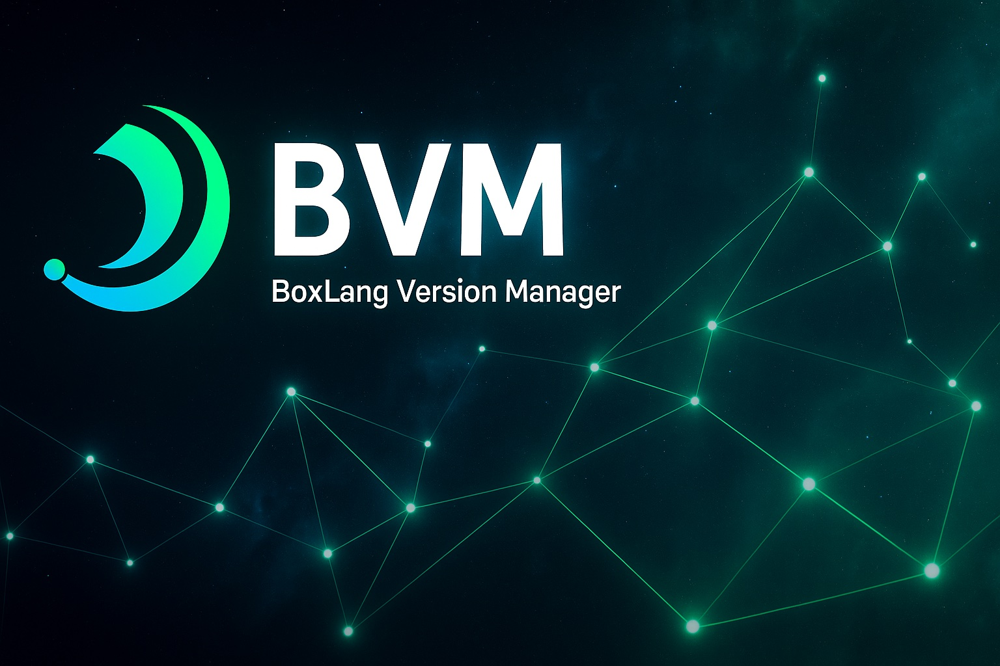

# BoxLang Version Manager (BVM)

<figure><figcaption><p>BoxLang Version Manager</p></figcaption></figure>

# BVM - BoxLang Version Manager

BVM is a simple version manager for BoxLang, similar to jenv or nvm. It allows you to easily install, manage, and switch between different versions of BoxLang.

## BVM vs Single-Version Installer

**Choose BVM if you:**

- 🔄 Work on multiple projects that might need different BoxLang versions
- 🧪 Want to test your code against different BoxLang releases
- 🚀 Need to switch between stable and snapshot versions
- 📦 Want centralized management of BoxLang installations
- 🛠️ Are a BoxLang developer or advanced user

**Choose the single-version installer (`install-boxlang.sh`) if you:**

- 📌 Only need one BoxLang version system-wide
- 🎯 Want the simplest possible installation
- 🏢 Are setting up production servers with a specific BoxLang version
- ⚡ Want the fastest installation with minimal overhead

**Both installers provide identical functionality:**

- ✅ Same BoxLang runtime and MiniServer
- ✅ Same helper scripts (`install-bx-module`, `install-bx-site`, etc.)
- ✅ Same command-line tools (`boxlang`, `bx`, `boxlang-miniserver`, etc.)
- ✅ Same installation quality and reliability

The only difference is that BVM adds version management capabilities on top.

## Features

- 📦 **Install complete BoxLang environment** - runtime, MiniServer, and helper scripts
- 🔄 **Switch between versions easily** - change your active BoxLang version with one command
- 📋 **List installed versions** - see what's installed locally with `bvm list` or `bvm ls`
- 🌐 **List remote versions** - see what's available for download with `bvm list-remote` or `bvm ls-remote`
- 🗑️ **Clean Removal** - remove versions you no longer need with `bvm remove`, or `bvm rm`
- 🔍 **Health check** - verify your BVM installation with `bvm doctor` or `bvm health`
- 🧹 **Cache management** - clean up downloaded files with `bvm clean`
- 🚀 **Execute BoxLang components** - run BoxLang, MiniServer through BVM with version management
- 🔗 **Seamless integration** - wrapper scripts make all tools available in PATH
- ⚡ **Command aliases** - convenient short aliases for all major commands
- 🛠️ **Helper script integration** - all BoxLang helper scripts work with active version
- 🎯 **Smart version detection** - automatically detects actual version numbers from installations
- 🆙 **Built-in update checker** - check for BVM updates and upgrade easily
- 🗑️ **Uninstall BVM** - Remove completely BVM, versions, etc.

## Version Detection & Management

BVM now intelligently detects actual version numbers when installing "latest" or "snapshot" versions, providing clear and accurate version tracking.

### How Version Detection Works

When you install using aliases like "latest" or "snapshot", BVM:

1. **Downloads the requested version** (latest stable or development snapshot)
2. **Inspects the BoxLang JAR file** to extract the actual version number
3. **Installs under the detected version** (e.g., `1.2.0` or `1.3.0-snapshot`)
4. **Creates appropriate symlinks** (only for "latest" - points to the actual version)

### Benefits

- 🎯 **Clear version tracking** - `bvm list` shows actual version numbers, not generic aliases
- 📋 **Accurate history** - see exactly which versions you have installed
- 🔍 **No confusion** - distinguish between different snapshot builds
- 🔗 **Smart symlinks** - "latest" symlink for convenience, actual versions for clarity

### Example

**Before** (old behavior):

```bash
$ bvm list
Installed BoxLang versions:
  * latest (current)
    snapshot
    1.1.0
```

**After** (new behavior):

```bash
$ bvm list
Installed BoxLang versions:
  * 1.2.0 (current)
    latest → 1.2.0
    1.3.0-snapshot
    1.1.0
```

## Project-Specific Versions (.bvmrc)

BVM supports project-specific version configuration through `.bvmrc` files, similar to tools like `jenv` or `nvm`. This allows different projects to automatically use different BoxLang versions.

### How .bvmrc Works

- 📁 **Per-project configuration** - Each project can have its own BoxLang version
- 🔍 **Automatic discovery** - BVM searches from current directory up to root for `.bvmrc`
- 🎯 **Simple format** - Just the version number on the first line
- 🚀 **Seamless switching** - Use `bvm use` without arguments to activate the project version

### Creating .bvmrc Files

```bash
# Set current directory to use latest BoxLang
bvm local latest

# Set specific version for a project
bvm local 1.2.0

# Show current .bvmrc version (if any)
bvm local
```

### Using .bvmrc Files

```bash
# Activate the version specified in .bvmrc
bvm use

# This will search for .bvmrc starting from current directory
# and going up the directory tree until found
```

### .bvmrc File Format

The `.bvmrc` file is simple - just put the version on the first line:

```bash
# .bvmrc examples

# Use latest stable
latest

# Use specific version
1.3.0

# Comments (lines starting with #) are ignored
# Empty lines are also ignored
```

### Example Workflow

```bash
# Set up a new project
mkdir my-boxlang-project
cd my-boxlang-project

# Configure project to use specific BoxLang version
bvm local 1.2.0

# Install the version if not already installed
bvm install 1.2.0

# Use the project version (reads from .bvmrc)
bvm use

# Verify active version
bvm current

# The .bvmrc file is created in current directory
cat .bvmrc
# Output: 1.2.0

# When you return to this directory later, just run:
bvm use  # Automatically uses 1.2.0 from .bvmrc
```

### Directory Hierarchy

BVM searches for `.bvmrc` files starting from the current directory and walking up the directory tree:

```
/home/user/projects/
├── .bvmrc (latest)          # Root project config
├── project-a/
│   ├── .bvmrc (1.2.0)      # Project A uses 1.2.0
│   └── src/                 # When in src/, uses 1.2.0 from parent
└── project-b/
    ├── .bvmrc (1.2.0)    # Project B uses 1.2.0
    └── modules/
        └── auth/            # When in auth/, uses 1.2.0 from ancestor
```

## Quick Start

### Installation

```bash
# Install BVM
curl -fsSL https://install-bvm.boxlang.io | bash

# Or download and run locally
wget https://raw.githubusercontent.com/ortus-boxlang/boxlang-quick-installer/main/src/install-bvm.sh
chmod +x install-bvm.sh
./install-bvm.sh
```

### Basic Usage

```bash
# Install the latest stable BoxLang version
bvm install latest

# Switch to the latest version
bvm use latest

# Check current version
bvm current

# List installed versions
bvm list

# Set up project-specific version
bvm local latest              # Creates .bvmrc with 'latest'
bvm use                       # Uses version from .bvmrc

# Check for BVM updates
bvm check-update

# Run BoxLang
bvm exec --version

# Get help
bvm help
# or use aliases
bvm --help
bvm -h
```

## Commands

### Version Management

- `bvm install <version>` - Install a specific BoxLang version
  - `bvm install latest` - Install latest stable release (detects and installs actual version, e.g., `1.2.0`)
  - `bvm install snapshot` - Install latest development snapshot (detects and installs actual version, e.g., `1.3.0-snapshot`)
  - `bvm install 1.2.0` - Install specific version

- `bvm use <version>` - Switch to a specific BoxLang version
  - Can use actual version numbers (e.g., `1.2.0`, `1.3.0-snapshot`) or `latest` symlink
  - `bvm use` - Use version from `.bvmrc` file (if present)
- `bvm local <version>` - Set local BoxLang version for current directory (creates `.bvmrc`)
  - `bvm local` - Show current `.bvmrc` version
- `bvm current` - Show currently active BoxLang version
- `bvm remove <version>` - Remove a specific BoxLang version (use actual version number)
  - Aliases: `bvm rm <version>`
- `bvm uninstall` - Completely uninstall BVM and all BoxLang versions

### Information

- `bvm list` - List all installed BoxLang versions (shows actual version numbers and symlinks)
  - Alias: `bvm ls`
  - Example output: `1.2.0`, `latest → 1.2.0`, `1.3.0-snapshot`
- `bvm list-remote` - List available BoxLang versions for download
  - Alias: `bvm ls-remote`
- `bvm which` - Show path to current BoxLang installation
- `bvm version` - Show BVM version
  - Aliases: `bvm --version`, `bvm -v`

### Execution

- `bvm exec <args>` - Execute BoxLang with current version
  - Alias: `bvm run <args>`
- `bvm miniserver <args>` - Start BoxLang MiniServer with current version
  - Aliases: `bvm mini-server <args>`, `bvm ms <args>`

### Maintenance

- `bvm check-update` - Check for BVM updates and optionally upgrade
- `bvm clean` - Clean cache and temporary files
- `bvm doctor` - Check BVM installation health
  - Alias: `bvm health`
- `bvm help` - Show help message
  - Aliases: `bvm --help`, `bvm -h`

## What BVM Installs

When you install a BoxLang version with BVM, it downloads and sets up:

### Core Components

- **BoxLang Runtime** (`boxlang`, `bx`) - The main BoxLang interpreter
- **BoxLang MiniServer** (`boxlang-miniserver`, `bx-miniserver`) - Web application server

### Helper Scripts

- **install-bx-module** - BoxLang module installer (available in PATH after installation)
- **install-bx-site** - BoxLang site installer (available in PATH after installation)
- **Other utility scripts** - Various helper tools

### Integration

- **Wrapper scripts** - BVM creates wrapper scripts so you can use `boxlang`, `bx`, `boxlang-miniserver`, etc. directly
- **Version management** - All tools automatically use the currently active BoxLang version
- **Helper script integration** - All helper scripts work with the currently active BoxLang version
- **Smart version detection** - Automatically detects actual version numbers from downloaded installations

## Examples

```bash
# Install and use the latest BoxLang (detects actual version)
bvm install latest    # Downloads latest, detects version (e.g., 1.2.0), installs as 1.2.0
bvm use latest        # Uses the latest symlink

# Install a development snapshot (detects actual version)
bvm install snapshot  # Downloads snapshot, detects version (e.g., 1.3.0-snapshot), installs as 1.3.0-snapshot
bvm use 1.3.0-snapshot

# Install a specific version
bvm install 1.2.0
bvm use 1.2.0

# Project-specific versions with .bvmrc
cd my-project
bvm local 1.2.0       # Creates .bvmrc with "1.2.0"
bvm use               # Uses version from .bvmrc (1.2.0)

cd ../another-project
bvm local latest      # Creates .bvmrc with "latest"
bvm use               # Uses version from .bvmrc (latest)

# Check current .bvmrc
bvm local             # Shows current .bvmrc version

# See what's installed (shows actual version numbers)
bvm list
# Example output:
#   * 1.2.0 (current)
#     latest → 1.2.0
#     1.3.0-snapshot
#     1.1.0

# or use the short alias
bvm ls

# Check what versions are available
bvm list-remote
# or use the short alias
bvm ls-remote

# Run BoxLang REPL
bvm exec
# or use the direct command (after installation)
boxlang

# Run BoxLang MiniServer
bvm miniserver
# or use the direct command
boxlang-miniserver --port 8080

# Install a BoxLang module (using helper script)
install-bx-module bx-orm

# Install a BoxLang site template (using helper script)
install-bx-site mysite

# Run a BoxLang script
bvm exec myscript.bx

# Get BoxLang version
bvm exec --version

# Check BVM health
bvm doctor

# Clean up cache
bvm clean
```

## Keeping BVM Updated

BVM includes a built-in update checker that helps you stay current with the latest version.

### Checking for Updates

```bash
# Check if a newer version of BVM is available
bvm check-update
```

### Update Process

When you run `bvm check-update`, BVM will:

1. **Check your current version** - reads from local installation
2. **Fetch the latest version** - checks the remote repository
3. **Compare versions** - determines if an update is available
4. **Show status** - displays current vs. latest version information

### Interactive Upgrade

If a newer version is available, BVM will:

- 🆙 **Display the available update** - shows current and latest version numbers
- ❓ **Prompt for confirmation** - asks if you want to upgrade
- 🚀 **Automatically upgrade** - downloads and installs the latest version if you confirm
- ✅ **Preserve your installations** - keeps all your BoxLang versions intact

### Example Update Session

```bash
$ bvm check-update

─────────────────────────────────────────────────────────────────────────────
🔄 BVM Update Checker
─────────────────────────────────────────────────────────────────────────────

🔍 Checking for BVM updates...

Current BVM version: 1.0.0
Latest BVM version:  1.1.0

🆙 A newer version of BVM is available!

Would you like to upgrade to version [1.1.0]? [Y/n]: Y

🚀 Starting BVM upgrade to version [1.1.0]...
⚡Executing upgrade using: /Users/username/.bvm/scripts/install-bvm.sh
```

### Status Messages

- 🦾 **Up to date**: "You have the latest version of BVM!"
- 🆙 **Update available**: "A newer version of BVM is available!"
- 🧑‍💻 **Development version**: "Your BVM version is newer than the latest release"

## Uninstalling BoxLang Versions and BVM

BVM provides two different uninstall options depending on your needs.

### Removing Individual BoxLang Versions

Use `bvm remove` (or `bvm rm`) to remove specific BoxLang versions you no longer need:

```bash
# Remove a specific version
bvm remove 1.1.0
# or use the alias
bvm rm 1.1.0

# List installed versions first to see what's available
bvm list
```

#### Important Notes

- **Cannot remove active version**: You cannot remove the currently active BoxLang version
- **Confirmation required**: BVM will ask for confirmation before removing a version
- **Use actual version numbers**: Use the actual version number (e.g., `1.2.0`), not aliases like `latest`

#### Example Session

```bash
$ bvm list
Installed BoxLang versions:
  * 1.2.0 (current)
    latest → 1.2.0
    1.1.0

$ bvm remove 1.1.0
Are you sure you want to uninstall BoxLang 1.1.0? [y/N]: y
✅ BoxLang 1.1.0 uninstalled successfully
```

### Completely Uninstalling BVM

Use `bvm uninstall` to completely remove BVM and all installed BoxLang versions:

```bash
bvm uninstall
```

#### What Gets Removed

- 🗑️ **All BoxLang versions** - every installed version will be deleted
- 🗑️ **BVM home directory** - `~/.bvm` and all contents
- 🗑️ **Cache files** - all downloaded installers and temporary files
- 🗑️ **Version symlinks** - `latest` and other version links

#### Complete Uninstall Process

```bash
$ bvm uninstall

⚠️  COMPLETE BVM UNINSTALL ⚠️

This will completely remove BVM and ALL installed BoxLang versions from your system!

Installed versions that will be DELETED:
  • 1.2.0 (current)
  • 1.1.0
  • latest → 1.2.0

Cache and configuration that will be DELETED:
  • ~/.bvm/cache (downloaded files)
  • ~/.bvm/versions (all BoxLang installations)
  • ~/.bvm/scripts (BVM helper scripts)
  • ~/.bvm/config (BVM configuration)

Are you absolutely sure you want to completely uninstall BVM? [y/N]: y

🔄 Uninstalling BVM...
✅ Removed BVM home directory: /Users/username/.bvm
🎉 BVM has been completely uninstalled!

Manual cleanup required:
  • Remove any BVM-related entries from your shell profile (~/.bashrc, ~/.zshrc, etc.)
  • Remove the BVM binary from your PATH if you installed it system-wide
```

#### Manual Cleanup

After running `bvm uninstall`, you may need to manually:

1. **Remove shell profile entries** - delete BVM-related lines from `~/.bashrc`, `~/.zshrc`, etc.
2. **Remove from PATH** - if you installed BVM system-wide, remove it from your PATH
3. **Restart terminal** - open a new terminal session to ensure changes take effect

## Migrating from Single-Version Installer to BVM

If you currently have BoxLang installed via `install-boxlang.sh` and want to switch to BVM for version management:

### 1. Uninstall Current BoxLang (Recommended)

```bash
# Remove system-wide installation
sudo install-boxlang.sh --uninstall

# Or remove user installation
install-boxlang.sh --uninstall
```

### 2. Install BVM

```bash
curl -fsSL https://install-bvm.boxlang.io | bash
```

### 3. Install Your Preferred BoxLang Version

```bash
# Install the same version you had before
bvm install latest  # or specific version like 1.2.0
bvm use latest
```

### 4. Verify Everything Works

```bash
bvm doctor
boxlang --version
```

**Note:** Your BoxLang home directory (`~/.boxlang`) with modules, settings, and data will be preserved during migration.

## Prerequisites

- **curl** - For downloading BoxLang releases
- **unzip** - For extracting archives
- **jq** - For parsing JSON (optional, fallback available)
- **Java 21+** - Required to run BoxLang

### Installing Prerequisites

**macOS (with Homebrew):**

```bash
brew install curl unzip jq
```

**Ubuntu/Debian:**

```bash
sudo apt update && sudo apt install curl unzip jq
```

**RHEL/CentOS/Fedora:**

```bash
sudo dnf install curl unzip jq
```

## Integration with Shell

BVM automatically adds itself and the current BoxLang version to your PATH. After installation, restart your terminal or run:

```bash
source ~/.bashrc  # or ~/.zshrc, ~/.profile, etc.
```

## Troubleshooting

### BVM not found after installation

- Restart your terminal
- Check that `~/.bvm/bin` is in your PATH
- Run `source ~/.bashrc` (or your shell's profile file)

### BoxLang not found after switching versions

- Run `bvm doctor` to check installation health
- Verify the version exists with `bvm list`
- Try `bvm use <version>` again

### Download failures

- Check your internet connection
- Verify the version exists with `bvm list-remote`
- Try clearing cache with `bvm clean`

### Health check

```bash
bvm doctor
```

This will check your BVM installation and identify any issues.

## Contributing

BVM is part of the BoxLang Quick Installer project. To contribute:

1. Fork the repository
2. Create a feature branch
3. Make your changes
4. Test thoroughly
5. Submit a pull request

## License

Licensed under the Apache License, Version 2.0. See the LICENSE file for details.

## Support

- 🌐 Website: https://boxlang.io
- 📖 Documentation: https://boxlang.io/docs
- 💾 GitHub: https://github.com/ortus-boxlang/boxlang
- 💬 Community: https://boxlang.io/community
- 🧑‍💻 Try: https://try.boxlang.io
- 🫶 Professional Support: https://boxlang.io/plans
