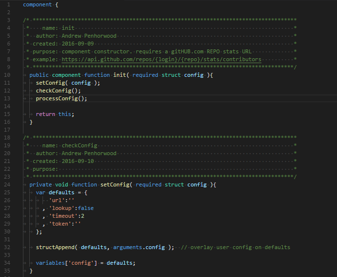
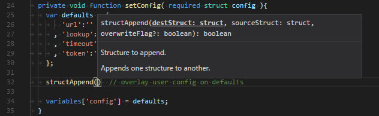
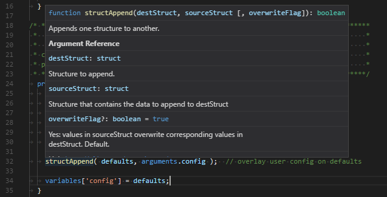
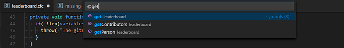
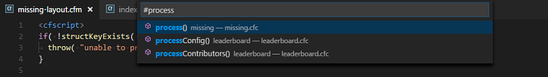
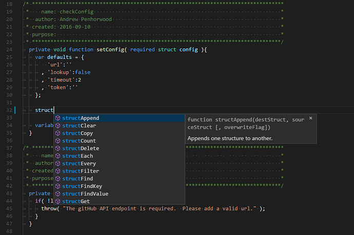
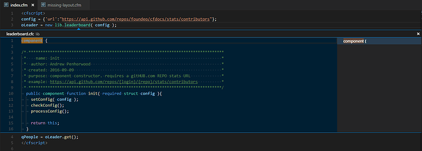

# IDE Tooling

We have IDE tooling and instructions/downloads to get started with it.

The latest download for the Extension is here:\
[Download VSCode Extension](https://drive.google.com/file/d/1DkmGiAldnLLJwcf9I56rQON9dJ5V-R1J/view?usp=drive\_link)

## BoxLang Language Support <a href="#boxlang-language-support-1" id="boxlang-language-support-1"></a>

An extension for the development of BoxLang.

### Building and Installing <a href="#building-and-installing-2" id="building-and-installing-2"></a>

For local development you can run the following commands to build the extension.

```perl
npm install

npm run build

npm run pack
```

Once the `npm run pack` command completes you should see a file in the root fo the project like `boxlang-#.#.#.vsix`. This VSIX package is the bundeled extension and should be ready to install.

You can install it via command line like so

```css
code --install-extension boxlang-0.7.1.vsix
```

Alternatively you can install the extension via UI by opening VSCode hitting `ctrl+shift+p` and selecting the command `Extensions: Install from VSIX...`. When the file picker appears navigate to your vscode-boxlang directory and select the VSIX package to install.

> Note: A PowerShell script in the root of the project named `Run-LocalInstall.ps1` can be used to build/install the extension automatically or as a an example.

### Configuring BoxLang Features <a href="#configuring-boxlang-features-3" id="configuring-boxlang-features-3"></a>

The extensions BoxLang features are primarily configured via the following settings

* `boxlang.jarpath` This should be the path to your boxlang fat jar `/path/to/project/boxlang/libs/boxlang-1.0.0-all.jar`
* `boxlang.showLexerTokens` This controls the output of the antlr4-parse to show the tokens in a file.
* `boxlang.lexerPath` The path to the antlr lexer file
* `boxlang.parserPath` The path to the antlr parser file
* `boxlang.customAntlrToolsCommand` A custom command to run instead of the configured antlr command

### Configuring the BoxLang Debugger <a href="#configuring-the-boxlang-debugger-4" id="configuring-the-boxlang-debugger-4"></a>

Eventually this extension will ship with the BoxLang debugger. For now, we have opted to provide the debugger via launch configuration.

In your BoxLang VSCode project go to the run profile `boxlang (debugger)` and hit play. It will spin up the boxlang debug server on port 4404.

In your test project folder you can now right-click on any BoxLang source file and select “BoxLang: Run File”. VSCode will conect to the BoxLang process listening to port 4404 and execute the file.

### Acknowledgements <a href="#acknowledgements-5" id="acknowledgements-5"></a>

* [`vscode-cfml`](https://github.com/vadim-sibiryanskiy-yumasoft/vscode-cfml) fork of the vscode-cfml project used as the base for this fork
* [`vscode-cfml`](https://github.com/KamasamaK/vscode-cfml) original vscode-cfml project
* [`vscode-coldfusion`](https://github.com/ilich/vscode-coldfusion/) on which the syntax highlighting is based, which was based on the next extension
* [`sublimetext-cfml`](https://github.com/jcberquist/sublimetext-cfml) as inspiration for some of the features. Some “parsing” logic (including regexes) was also used.
* [`cfdocs`](https://github.com/foundeo/cfdocs/) as the default documentation and sample images in this README
* [`vscode-php-docblocker`](https://github.com/neild3r/vscode-php-docblocker) as the basis for docblock completion

### Features <a href="#features-6" id="features-6"></a>

1.  **Syntax Highlighting**\
    Using the default theme `Dark+`\


    <figure><figcaption></figcaption></figure>
2.  **Signature Help**\
    Automatically triggers within signature of a function or can be manually triggered. This currently does not work for member functions. It is sometimes unable to work within a string.\
    Win/Linux: `Ctrl`+`Shift`+`Space`; Mac: `Cmd`+`Shift`+`Space`\


    <figure><figcaption></figcaption></figure>
3.  **Hover Documentation**\
    Displays documentation for certain entities. Currently applicable to CFML global functions, CFML global tags/attributes, user-defined functions, HTML tags, and CSS properties. Does not always consider context, so for example it may also incorrectly trigger on SQL or JavaScript functions with the same name.\
    Win/Linux: `Ctrl`+`K` `Ctrl`+`I`; Mac: `Cmd`+`K` `Cmd`+`I`\


    <figure><figcaption></figcaption></figure>
4.  **Document Symbols**\
    Search CFML symbols within a document. Also used for outline and breadcrumbs.\
    Win/Linux: `Ctrl`+`Shift`+`O`; Mac: `Cmd`+`Shift`+`O`\


    <figure><figcaption></figcaption></figure>
5.  **Workspace Symbols**\
    Search symbols within the workspace. Limited to components and their function declarations.\
    Win/Linux: `Ctrl`+`T`; Mac: `Cmd`+`T`


    <figure><figcaption></figcaption></figure>
6.  **Completion Suggestions**\
    Suggestions for global functions, global tags and attributes, enumerated values, user functions, keywords, scopes, component properties, variables, component dot-paths, docblocks, HTML tags and attributes, and CSS properties. Does not always consider context, so it may trigger inappropriately.\
    Win/Linux: `Ctrl`+`Space`; Mac: `Cmd`+`Space`


    <figure><figcaption></figcaption></figure>
7.  **Definition**\
    Provides a link to the definition of a symbol. Currently only for object creation, function usage, function return types, argument types, property types, component extends, function arguments, function local variables, template variables, and application variables.\
    _Go to Definition:_ Win/Linux: `F12`/`Ctrl`+click; Mac: `F12`\
    _Peek Definition:_ Win/Linux: `Alt`+`F12` (`Ctrl`+hover provides a smaller, alternate peek); Mac: `Opt`+`F12`\
    _Open Definition to the Side:_ Win/Linux: `Ctrl`+`K` `F12`


    <figure><figcaption></figcaption></figure>
8. **Type Definition**\
   Provides a link to the definition of the type for a symbol. This only applies to user-defined types within the same workspace.\
   _No default shortcuts_

### Settings <a href="#settings-7" id="settings-7"></a>

The following are configurable Settings (Win/Linux: `Ctrl`+`Comma`; Mac: `Cmd`+`Comma`).

#### CFML <a href="#cfml-8" id="cfml-8"></a>

This extension contributes these settings to Visual Studio Code:

* `cfml.globalDefinitions.source`: The source of the global definitions. Currently only supports CFDocs. \[_Default_: `cfdocs`]
* `cfml.cfDocs.source`: Indicates the source location type to be used for CFDocs.\
  **Values**
  * `remote`: Retrieve resources remotely from GitHub. \[_Default_]
  * `local`: Retrieve resources locally using `cfml.cfDocs.localPath`.
* `cfml.cfDocs.localPath`: \[_Optional_] Physical path to the data/language directory of CFDocs.
* `cfml.hover.enable`: Whether hover is enabled for CFML entities. \[_Default_: `true`]
* `cfml.hover.html.enable`: Whether hover is enabled for HTML entities. \[_Default_: `true`]
* `cfml.hover.css.enable`: Whether hover is enabled for CSS entities. \[_Default_: `true`]
* `cfml.signature.enable`: Whether signature help is enabled. \[_Default_: `true`]
* `cfml.suggest.enable`: Whether completion help is enabled. \[_Default_: `true`]
* `cfml.suggest.snippets.enable`: Whether included snippets are part of completion help. \[_Default_: `true`]
* `cfml.suggest.snippets.exclude`: \[_Optional_] Set of snippet keys you would like excluded from suggestions.
* `cfml.suggest.globalFunctions.enable`: Whether global functions are part of completion help. \[_Default_: `true`]
* `cfml.suggest.globalFunctions.firstLetterCase`: What case should be used for the first letter of global function suggestions. \[_Default_: `unchanged`]
* `cfml.suggest.globalTags.enable`: Whether global tags are part of completion help. \[_Default_: `true`]
* `cfml.suggest.globalTags.attributes.quoteType`: Which quote type to use when completing CFML attribute suggestion. \[_Default_: `double`]
* `cfml.suggest.globalTags.attributes.defaultValue`: Whether to populate the default value for an attribute if it has one. \[_Default_: `false`]
* `cfml.suggest.globalTags.includeAttributes.setType`: What set of attributes to include when global tag suggestion is selected. \[_Default_: `none`]
*   `cfml.suggest.globalTags.includeAttributes.custom`: A custom set of attributes to include for given tags when suggestion is selected. Tags set here override the set type.\
    **Example**

    ```json
    "cfml.suggest.globalTags.includeAttributes.custom": {
        "cfquery": [
            {
                "name": "name"
            },
            {
                "name": "datasource",
                "value": "dsn"
            }
        ]
    }
    ```
* `cfml.suggest.htmlTags.enable`: Whether HTML tags are part of completion help. \[_Default_: `true`]
* `cfml.suggest.htmlTags.attributes.quoteType`: Which quote type to use when completing HTML attribute suggestion. \[_Default_: `double`]
* `cfml.suggest.css.enable`: Whether CSS properties and values are part of completion help. \[_Default_: `true`]
* `cfml.suggest.scopes.case`: Whether the completed scopes should be uppercase or lowercase. \[_Default_: `lowercase`]
* `cfml.definition.enable`: Whether providing definitions is enabled. \[_Default_: `true`]
* `cfml.definition.userFunctions.search.enable`: Whether to search for matching functions throughout the workspace when a reliable match cannot be determined. Peek Definition will provide a list of all matches. \[_Default_: `false`]
* `cfml.indexComponents.enable`: Whether to index the components in workspace on startup. This is done on each startup and duration depends on number and complexity of components as well as hardware specifications. Editor may be unresponsive during this period. It is currently required for most features involving components to work properly. \[_Default_: `true`]
* `cfml.autoCloseTags.enable`: Whether to enable auto-closing tags for CFML. This uses the third-party extension `auto-close-tag`. This is only checked and set on startup. \[_Default_: `true`]
* `cfml.autoCloseTags.configurationTarget`: Auto-configuration target for auto-closing tags. \[_Default_: `Global`]
* `cfml.docBlock.gap`: Whether there should be a gap between the hint and other tags in a docblock. \[_Default_: `true`]
*   `cfml.docBlock.extra`: Extra tags you would like to include in every docblock\
    **Example**

    ```json
    "cfml.docBlock.extra": [
        {
            "name": "output",
            "default": "false",
            "types": [
                "component",
                "function"
            ]
        }
    ]
    ```
* `cfml.engine.name`: Name of the CFML engine against which to filter.
* `cfml.engine.version`: Version of the CFML engine against which to filter. SemVer format is preferred.
*   `cfml.mappings`: Represents CFML mappings from logicalPath to directoryPath.\
    **Examples**

    ```json
    "cfml.mappings": [
      {
        "logicalPath": "/model",
        "directoryPath": "C:\\myprojects\\projectname\\app\\model"
      }
    ]
    ```

    ```json
    "cfml.mappings": [
      {
        "logicalPath": "/model",
        "directoryPath": "/app/model",
        "isPhysicalDirectoryPath": false
      }
    ]
    ```

#### Other <a href="#other-9" id="other-9"></a>

**Emmet**

You can enable Emmet within CFML files by using the following setting:

```json
"emmet.includeLanguages": {
  "cfml": "html"
}
```

### Commands <a href="#commands-11" id="commands-11"></a>

Used in [Command Palette](https://code.visualstudio.com/docs/getstarted/userinterface#\_command-palette). Can also be bound to [Keyboard Shortcuts](https://code.visualstudio.com/docs/getstarted/keybindings).

* Refresh cache for global definitions
* Refresh cache for workspace definitions
* Toggle CFML line comment (Default: `Ctrl`+`/`)
* Toggle CFML block comment (Default: `Shift`+`Alt`+`A`)
* Open Application file for currently active document
* Go to Matching Tag
* Open CFDocs page
* Open CFML engine docs page
* Fold all functions in active editor
