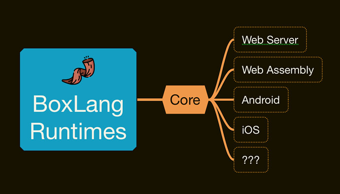

# Overview

### What is BoxLang?

<figure><figcaption></figcaption></figure>

### Goals 

To create the next-generation dynamic language for the JVM. Designed to be modular and multi-runtime.

**BoxLang** is a modern dynamic JVM language that can be deployed on multiple platforms, including all operating systems, web servers, Java application servers, AWS lambda, iOS, Android, web assembly, and more.

BoxLang combines many features from different programming languages, including Java, ColdFusion, Python, Ruby, Go, and PHP, to provide developers with a modern, fluent, and expressive syntax. It has been designed to be a highly modular and dynamic language that takes advantage of all the modern features of the JVM.

Here are some key features of BoxLang

1. **Dynamic Language**: BoxLang is dynamically typed, meaning you don’t need to declare types if you don’t want to. It can do type inference, auto-casting, and promotions between different types. The language adapts itself to its deployed runtime. It can add/remove/modify methods and properties at runtime, making it highly flexible and adaptable.
2. **Low Verbosity Syntax:** BoxLang is a low-verbosity syntax language. It is highly functional, fluent, and human-readable. Our intent with BoxLang is to make it highly expressive and low ceremony.
3. **Scripting**: BoxLang can be used for enterprise modular applications and highly reusable and quick scripting on the JVM or Cloud Lambda architectures.
4. **InvokeDynamic:** BoxLang has a solid core foundation based on the JVM’s `InvokeDynamic` features. This makes the dynamic language extremely fast, predictable, and adaptable.
5. **Java Interoperability:** BoxLang is 100% interoperable with Java. You can extend and implement Java objects, use Java annotations, declare classes, import classes, and even write in Java seamlessly. Thanks to `InvokeDynamic` and our BoxLang `DynamicObject` core, everything in BoxLang is interoperable with Java.
6. **Pure Functions and Closures:** BoxLang supports creating and using closures as a functional programming aspect. However, it also supports [lambda pure functions 2](https://en.wikipedia.org/wiki/Pure\_function) without access to the surrounding context, which makes them extremely fast and portable. Functions are first-class citizens in BoxLang. You can define them dynamically, pass them around, and execute them whenever possible, making BoxLang a highly functional language.
7. **Event-Driven Language: BoxLang has an** internal interception event bus that can extend the language's capabilities or even your applications. You can listen to almost every part of the language, parser, and runtime or collaborate with your custom events.
8. **Modular**: BoxLang has been designed internally to support the concept of BoxLang modules that can enhance every aspect of the language or your applications built with BoxLang. BoxLang is one of the first languages you can build upon using modules. You can add new built-in functions, templating components, and new/modified functions on existing classes, functionality, Runtime Debugger, and AOP aspects, or you can listen to events within the language.
9. **Professional Open-Source:** BoxLang is a professional open-source project based on the Apache 2 license. Ortus Solutions supports every aspect of the language, and you can get a BoxLang+ subscription for professional support, extended features, and modular capabilities.
10. **Multi-Platform Development:** BoxLang has been designed to run on multiple platforms. This allows you to write adaptive code for any Operating System JVM, a servlet container web server, cloud lambda functions, iOS, Android, or even the browser via our web assembly package. BoxLang© builds upon its language core to be deployed on almost any running platform, present or future.
11. **Portable, Fluent, Human Scheduled Tasks:** BoxLang Scheduled Tasks Framework provides a centralized and portable way to define and manage scheduled tasks on your servers and applications. Source control your tasking with our scheduling DSL.
12. **ColdFusion/CFML Compatible:** BoxLang supports a dual parser and transpiler to execute ColdFusion/CFML code natively (maybe more languages later). This means that you can run all your ColdFusion applications within BoxLang natively. We also provide tooling to automatically transpile your ColdFusion code to BoxLang.© if you have a + Subscription.
13. **Tooling:** We provide the core language and several tools to help developers do their job easily and efficiently. We provide a Visual Studio Code extension for the language to provide syntax highlighting, debugger, code insight, code documentation, formatting, LSP integration, and more. Our + subscribers get even more tools like enhanced debuggers, ColdFusion/CFML transformers, and more.
14. **Ecosystem:** Even though BoxLang is a new language, **it** already has an established ecosystem since every Java and ColdFusion/CFML library works with BoxLang. This was our priority when designing BoxLang, and it would automatically be able to integrate and run libraries from the Java and ColdFusion/CFML ecosystems. It ships with [CommandBox](https://www.ortussolutions.com/products/commandbox) as its package manager, server manager, task manager, and REPL tool. Almost any project in [https://central.sonatype.com/ 1](https://central.sonatype.com/) and [https://www.forgebox.io](http://www.forgebox.io/) should work with BoxLang.

### Is it ColdFusion compatible?

BoxLang had been designed with dual parsers—one for BoxLang and one for ColdFusion. The CFML parser transpiles to BoxLang at runtime or can be translated to BoxLang via our CLI tools. We try and support as much as we can from CFML. However, we have made very different decisions, and BoxLang is a fresh start for the JVM in a new language. We have introduced a compatibility module to keep old-school CFML working as it is under the BoxLang runtime.

You will have the choice to continue with CFML-compatible code or come to our new vision with BoxLang. We will support both indefinitely.

### Is BoxLang© open-source? 

BoxLang© is a professional open-source project based on the Apache 2 license. Ortus Solutions supports every aspect of the language, and you can get a BoxLang+ subscription for professional support, extended features, and modular capabilities. You can use the BoxLang open-source edition to create and deploy commercial software without paying a single cent. We love open-source; we breathe open-source. We also know that it comes with responsibilities. Your support matters to us and the project. That’s why we offer a BoxLang+ subscription so you can support further language development. You can also become a Patreon and partner with us so we can ALWAYS keep the language accessible and open-source.

### What are BoxLang + Subscriptions 

BoxLang+ is our subscription professional license for the language and its runtimes (web, android, web assembly, etc). This gives you world-class support, customizable SLAs (Service Level Agreements), custom patches, security notifications, enhanced features, modules, and more. We have a transparent and no-fuzz licensing model no matter which runtime you use or where you deploy.

We have the **+ subscription** and the **+ premium** levels.

The [Frequently Asked Questions](frequently-asked-questions/) has more information regarding [BoxLang](frequently-asked-questions/what-is-boxlang-c.md), [BoxLang+](frequently-asked-questions/what-is-boxlang+.md), [licensing information](frequently-asked-questions/how-is-boxlang+-licensed.md), [support options](frequently-asked-questions/what-type-of-support-is-available-for-boxlang-c.md), and more.

