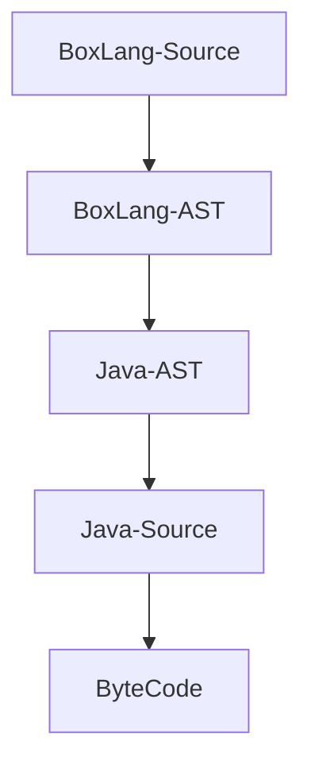
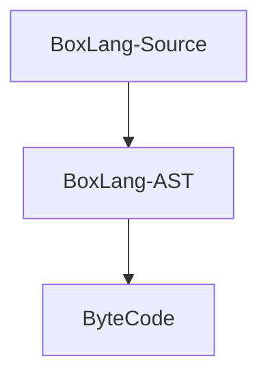

# Instructions & Interpreters

## Dynamic Language

BoxLang, a compiled programming language, operates in a unique way. It doesn’t run directly on your processor but is instead processed by a middleman known as the Java Virtual Machine. This processing occurs in the form of Java Bytecode, a low-level representation of your BoxLang code. This approach, coupled with BoxLang's dynamic nature, frees you from the typed restrictions of compile-time languages like Java, offering a more flexible programming experience.&#x20;

This means you have greater flexibility as the engine **infers** your types. It allows you to do runtime manipulations like method injections, removals, metadata programming, etc., that a typical typed language would not allow. It also allows us to escape the dreaded compile, build, deploy cycle since the BoxLang scripts will be evaluated, compiled, and executed all at runtime. This means no more re-deploying or annoying restarts, saving you valuable time and effort.

### ByteCode

BoxLang compiles to Java Byte code using two provided algorithms.

#### Debug JIT Algorithm



#### Production JIT Algorithm




Please note that the production algorithm is still being developed.  It is scheduled to be online by stable release.


### Code - Execute - Refresh - Repeat

BoxLang is a dynamic language that allows you to do just-in-time compilation, so you don't have to compile, build, and deploy.&#x20;

### Code Portability

BoxLang will convert your code into byte code and feed it into the Virtual Machine (VM) to execute it. This approach benefits you by allowing you to write BoxLang code once and, typically, execute it on many different operating systems and hardware platforms. Then, you can use our multi-runtime approach and deploy to multiple runtimes.

### Java Interop

BoxLang is 100% interoperable with Java since it runs on the JVM.  It allows you to use all third-party Java libraries, import classes, extend, implement [JSR223](../running-boxlang/jsr-223-scripting.md) scripting, and much more.

```groovy
import java.lang.System
import java.util.Date as MyDate
import ortus.boxlang.runtime.types.Array

start = new MyDate().getTime()
num = 1000
myArray = []
myCopy = Array.copyOf( myArray )

printLn( myCopy.size() )
```

### JSR-223

BoxLang is a certified [JSR-223 dynamic language](instructions-and-interpreters.md#jsr-223) that can be used by any JVM language via the Scripting API.

### Multi-Runtime

BoxLang has been designed to run in many[ different runtimes](../running-boxlang/) using our multi-runtime approach.  You can run BoxLang in any OS, web server, servlet container, docker engine, AWS Lambda, and more coming soon.

## Running from the Command Line

This is a durable way to write BoxLang code because you save your instructions into a file. That file can then be backed up, transferred, added to source control, etc.

### An Example Scripting File

We might create a file named `hello.bxs` like this:

```groovy
println( "Hello from BoxLang, printed on: " & now() )
```

Then we could run the program like this `boxlang hello.bxs` and get the following result:

```
Hello from BoxLang, printed on: {ts '2024-05-21 22:07:19'}
```

### BoxLang REPL

BoxLang ships with a memory REPL (Read Eval Print Loop) interface that you can use to test out the language.  Just run the `boxlang` binary, and you are ready to roll:

<figure><figcaption></figcaption></figure>

Keep reading our guides as you learn more about BoxLang.
