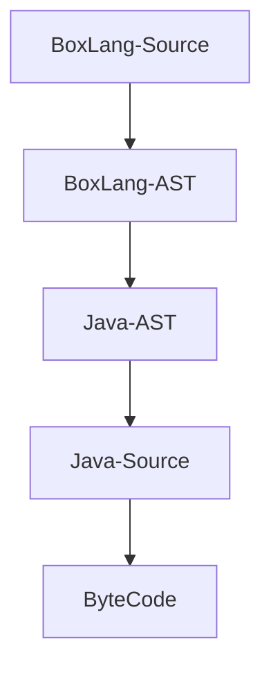
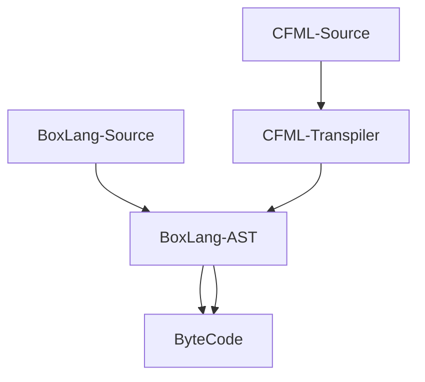
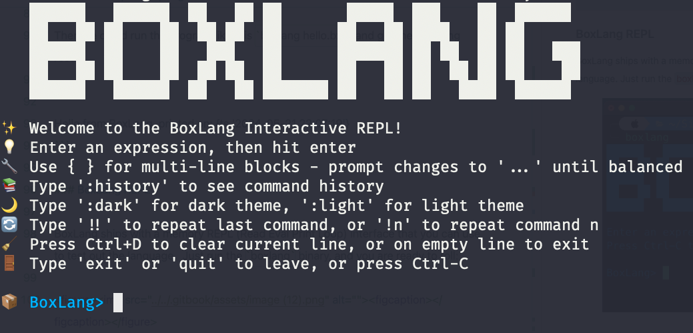

# Instructions & Interpreters

## Dynamic Language

BoxLang, a compiled programming language, operates in a unique way. It doesn’t run directly on your processor but is instead processed by a middleman known as the **Java Virtual Machine**. This processing occurs in the form of **Java Bytecode**, a low-level representation of your BoxLang **code**. This approach, coupled with BoxLang's dynamic nature, frees you from the typed restrictions of compile-time languages like Java or Kotlin, offering a more flexible programming experience.

This means you have greater flexibility as the engine **infers** your types. It allows you to do runtime manipulations like method injections, removals, metadata programming, etc., that a typical typed language would not allow. It also allows us to escape the dreaded compile, build, deploy cycle since the BoxLang scripts will be evaluated, compiled, and executed all at runtime. This means no more re-deploying or annoying restarts, saving you valuable time and effort.

### ByteCode

BoxLang compiles to Java Byte code using two provided algorithms.

#### Debug JIT Algorithm

This algorithm uses our Java Compiler to convert BoxLang source code into Java source code, which is then compiled into byte code using the Java Compiler API. This approach is slower but provides better debugging information or if a requirement is to deploy static Java source code.

>Please note that this is NOT the production algorithm or the default algorithm.


```mermaid
graph TD
  BoxLang-Source --> BoxLang-AST --> Java-AST --> Java-Source --> ByteCode
```

#### Production JIT Algorithm

This algorithm uses our custom BoxLang ASM compiler to convert BoxLang source code directly into Java Byte code. This approach is faster and is the default algorithm used by BoxLang.

Please note that BoxLang also provides a transpiler that converts CFML source code into BoxLang source code, which is then compiled into byte code using the production JIT algorithm.  This makes BoxLang **Multi-Parser** and allows you to run ColdFusion/CFML applications on the BoxLang runtime.


```mermaid
graph TD
  BoxLang-Source --> BoxLang-AST --> ByteCode
  CFML-Source --> CFML-Transpiler --> BoxLang-AST --> ByteCode
```

### Code - Execute - Refresh - Repeat

BoxLang is a dynamic language that allows you to do just-in-time compilation, so you don't have to compile, build, and deploy. You can write your BoxLang code, execute it, make changes, and re-execute it without any downtime. This is especially useful for development and testing, as you can quickly iterate on your code without the overhead of a traditional compile-deploy cycle.

### Code Portability

BoxLang will convert your code into byte code and feed it into the Virtual Machine (VM) to execute it. This approach benefits you by allowing you to write BoxLang code once and, typically, execute it on many different operating systems and hardware platforms. Then, you can use our multi-runtime approach and deploy to multiple runtimes.

Our [first-class compiler](../ide-tooling/boxlang-compiler.md) allows you to compile and package your BoxLang code for a secure and portable deployment.

### Java Interop

BoxLang is 100% interoperable with Java since it runs on the JVM.  It allows you to use all third-party Java libraries, import classes, extend, implement [JSR223](../running-boxlang/jsr-223-scripting.md) scripting, and much more.

```groovy
// BoxLang allows you to import Java classes
import java.lang.System
// Even add aliases to provide better context
import java.util.Date as MyDate
import ortus.boxlang.runtime.types.Array

start = new MyDate().getTime()
num = 1000
myArray = []
// Call static Java methods directly
myCopy = Array.copyOf( myArray )
println( myCopy.size() )
```

### JSR-223

BoxLang is a certified [JSR-223 dynamic language](../running-boxlang/jsr-223-scripting.md) that can be used by any JVM language via the Scripting API.

### Multi-Runtime

BoxLang has been designed to run in many [different runtimes](../running-boxlang/README.md) using our multi-runtime approach.  You can run BoxLang in any OS, web server, servlet container, docker engine, AWS Lambda, Google Cloud Functions, and more coming soon.

## Running from the Command Line

This is a durable way to write BoxLang code because you save your instructions into a file. That file can then be backed up, transferred, added to source control, etc.

### An Example Scripting File

We might create a file named `hello.bxs` like this:

```groovy
println( "Hello from BoxLang, printed on: " & now() )
```

Then we could run the program like this `boxlang hello.bxs` and get the following result:

```
Hello from BoxLang, printed on: {ts '2024-05-21 22:07:19'}
```

### BoxLang REPL

BoxLang ships with a memory REPL (Read Eval Print Loop) interface that you can use to test out the language.  Just run the `boxlang` binary, and you are ready to roll:

<figure><figcaption></figcaption></figure>

Keep reading our guides as you learn more about BoxLang.
