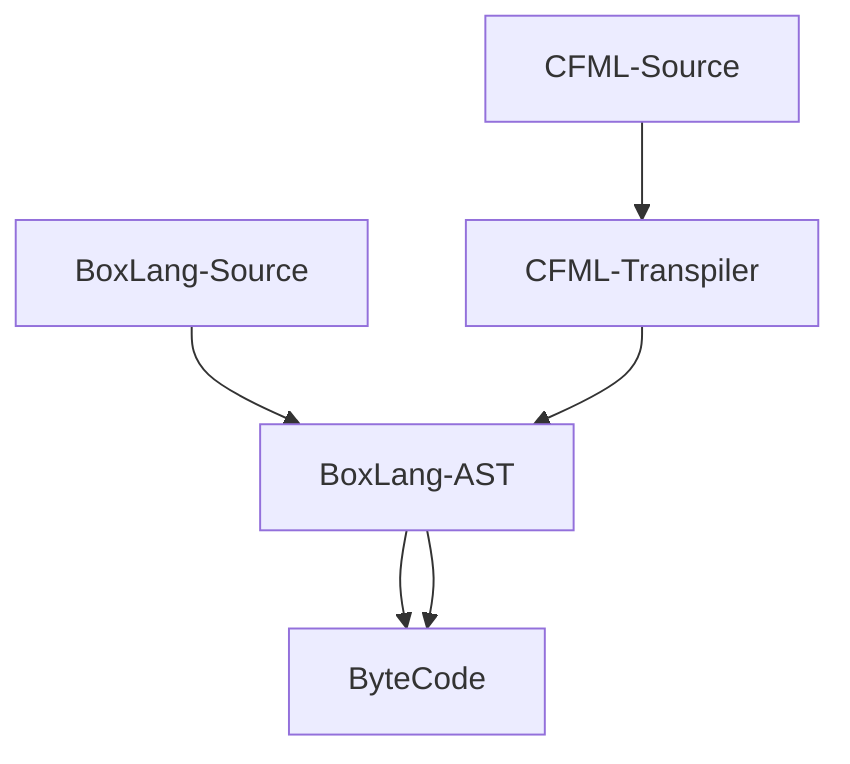
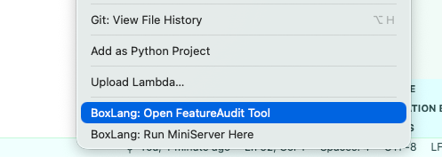
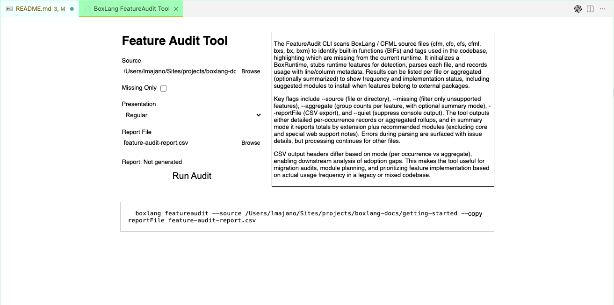

# Running ColdFusion/CFML Apps

BoxLang is an innovative language designed to seamlessly** substitute Adobe ColdFusion and Lucee in your existing projects. It offers robust functionality, ensuring compatibility with your current systems while providing enhanced performance, modern features and world-class support.



With its straightforward syntax and comprehensive toolset, BoxLang empowers developers to maintain and upgrade their applications with minimal hassle. Whether you're starting a new project or migrating an existing one, BoxLang serves as a reliable and efficient choice for modern web development needs.


**Warning**

There could be situations where certain functionality in Adobe/Lucee might not be available in BoxLang due to proprietary technology.  Please contact us to see if this will be supported or not.  We have tried to document as much as we can, but there are always edge-cases we have not covered.


## Step 1: Install BoxLang OS & CommandBox

<figure><figcaption></figcaption></figure>

Install the BoxLang **operating system** binary for your platform by following the instructions in the [Installation Guide](../../installation/README.md). **Please note that BoxLang is a multi-runtime platform, so you can install multiple versions side-by-side if needed.  This is NOT like Adobe or Lucee where they only have a web application server model.**


If you install BoxLang using our [Quick Installer](../../installation/boxlang-quick-installer.md) or our [BoxLang Version Manager (BVM)](../../installation/boxlang-version-manager-bvm.md), you will have the option to install CommandBox as well.


We start with the operating system binary in order to run command line tools to help you audit and migrate your applications.  You can also achieve this and more via our [BoxLang IDE](../../ide-tooling/README.md).  So make sure you download VSCode and install our BoxLang extension as well.

### CommandBox


[CommandBox](https://www.ortussolutions.com/products/commandbox) is our powerful package manager, cli tool and Java application server.  This will allow you to easily run and manage your BoxLang web applications.  CommandBox is the defacto enterprise Java Server for running BoxLang web applications.  We also recommend that you use CommandBox to run your BoxLang applications in development, staging, and production environments.  There is no need for a separate web server like Apache, IIS, Nginx, as CommandBox can handle all of your web serving needs and proxying.

Follow these instructions to install CommandBox: [CommandBox Installation Guide](https://commandbox.ortusbooks.com/setup/installation).


BoxLang +/++ subscribers get access to premium features in CommandBox such as multi-site support, clustering, advanced monitoring, and more.


## Step 2: Audit Your Application

We have provided a CFML auditor in order to help you identify potential compatibility issues when migrating your ColdFusion/CFML applications to BoxLang. This tool scans your codebase and generates a report highlighting areas that may require attention or modification.

You can either run it in the [command line](../../ide-tooling/cfml-feature-audit.md) or via our VSCode extension.

```bash
boxlang featureAudit --help
```

The easiest way to run the audit tool is via VSCode.

<figure><figcaption></figcaption></figure>

1. Open your project folder in VSCode and then open the command palette (Ctrl+Shift+P or Cmd+Shift+P on Mac) and type "Feature Audit"
   1. You can also right click on a folder in the file explorer and select "BoxLang: Run Feature Audit on Folder"
2. Configure the audit settings as needed (e.g., specify directories to scan, set output format).
   1. Make sure you select `Missing Only` if you only want to see potential issues, else it would report back everything it scanned.
3. Run the audit and review the generated report for any compatibility issues or recommendations.

<figure><figcaption></figcaption></figure>

This will scan your codebase and provide you with a detailed report of any potential issues or areas that may require modification for compatibility with BoxLang.  It will also tell you which modules you will need in order for your application to run properly in BoxLang.  You can then add those modules to your CommandBox server via the `server install` command or via the `server.json` file (See below).


If there is a situation where you are using a feature that is not supported in BoxLang, please [contact us](mailto:boxlang@ortussolutions.com) and we can help you find a solution or workaround.


## Step 3: CFML Engine Configuration

CommandBox allows you to easily extract the configuration of your existing ColdFusion or Lucee server and apply it to your BoxLang application using our [CFConfig Module](https://cfconfig.ortusbooks.com/). This ensures that your application runs with the same settings and environment as before.  This is done via the `CFConfig` module that ships with CommandBox.  To make sure we have the latest and greatest, please run the following command:

```bash
box install commandbox-cfconfig,commandbox-boxlang
```

Then you can extract your existing server configuration (https://cfconfig.ortusbooks.com/using-the-cli/command-overview/export-settings) by running the following command:

```bash
cfconfig export myConfig.json
cfconfig export from=serverNameToExportFrom to=myconfig.json
cfconfig export from=/path/to/server/home to=myconfig.json
```

This will produce a `.cfconfig.json` file that contains all of your server settings.  Just make sure it is in the root of your application, because CommandBox will automatically pick it up when you start your BoxLang server.


There could be the case that you already have a `.cfconfig.json` file in your application root.  If so, then you can skip the export step and just modify that file as needed.


### Custom Settings

There are cases where you could have custom settings that are not part of the standard export.  This includes:

- Custom Jar Files
- Custom JVM Arguments

#### Custom Jar Files

Custom Jar files will need to be copied over to your BoxLang server's `lib` directory found at the `{boxlang_home}/lib` path ([BoxLang Runtime Configuration](../../configuration.md)).  BoxLang supports many custom locations for finding Jar files, so please refer to the [JVM Configuration Guide](../../configuration/directives.md##java-library-paths) for more details.

#### Custom JVM Arguments

These are easy to migrate as well.  We will add them to our CommandBox `server.json` file in the `jvm` section (https://commandbox.ortusbooks.com/embedded-server/configuring-your-server/jvm-args).  Here is an example of how to add custom JVM arguments to your `server.json` file:

```json
{
  "jvm": {
    "args": [
      "-Xmx2G",
      "-Dmy.custom.property=value",
      "--add-opens=java.base/java.net=ALL-UNNAMED"
    ]
  }
}
```

or via the command line:

```bash
server set jvm.args=["-XX:+UseG1GC"]
server set jvm.args=["-XX:-CreateMinidumpOnCrash"] --append
server set jvm.args=["--add-opens=java.base/java.net=ALL-UNNAMED"] --append
```

## Step 4: Server.json Configuration

Now that we have audited our application and exported our server settings, we can now create a `server.json` file to configure our BoxLang server.  This file is used by CommandBox to configure the server settings for your BoxLang application.  It is extremely powerful and flexible, allowing you to customize your server settings to fit your specific needs.  Here is the basics that you will need to get started:

```json
{
    // Best practice is to name your server after your application
    "name":"myApp",
    "app":{
        // This is the engine to use for this server, this might have been lucee or adobe previously
        "cfengine":"boxlang@1"
    },
    // Web Server Settings
    "web":{
        // Enable directory browsing if needed
        "directoryBrowsing":true,
        // HTTP Settings
        "http":{
            "port":"8599"
        },
        // You can also add HTTPS settings here if you need to
        // URL Rewrites and Aliases
        "rewrites":{
            "enable":true
        },
        "aliases":{
        }
    },
    // Java Virtual Machine Settings
    "JVM":{
        "heapSize":"512",
        // JRE 21 is the default for BoxLang 1.x
        "javaVersion":"openjdk21_jre",
        // This is where you can add custom JVM arguments, this can be a single line or an array
        "args": [
            // The following is an example of enabling remote debugging on port 9998 for VSCode
            "-agentlib:jdwp=transport=dt_socket,server=y,suspend=n,address=9998"
        ]
    },
    // CFConfig Settings
    "cfconfig":{
        "file":".cfconfig.json"
    },
    // Get debugging information
    "env":{
        "BOXLANG_DEBUG":true
    },
    // The modules to install on server startup based on the audit
    "scripts":{
        "onServerInitialInstall":"install bx-compat-cfml,bx-esapi,bx-orm,bx-mail,bx-pdf,bx-mysql --noSave"
    }
}
```


BoxLang ships with a robust code line debugger.  You must enable it in the `server.json` and then tell VSCode about it.  Then you can do line debugging and code breakpoints to your heart's desire.  You can find more information about setting up the BoxLang debugger in VSCode [in our IDE documentation](../../ide-tooling/boxlang-debugger/commandbox-debugging.md).


Please note that the `bx-compat-cfml` module is required for BoxLang to run ColdFusion/CFML applications.  This module provides compatibility functions, settings, and components (tags) that are not natively supported in BoxLang.  You can find more information about this module [in its configuration page](../../../boxlang-framework/modularity/compat-cfml/README.md).  Make sure to include it in your `server.json` file under the `onServerInitialInstall` script section.

Make sure you configure it accordingly by placing these settings in the `.cfconfig.json`

```js
"modules": {
    "compat-cfml" : {
        "disabled" : false,
        "settings" : {
            "engine" : "adobe",
            // JSON control character auto-escaping flag
            // IF you turn to true, be aware that the entire JSON serialization will be escaped and be slower.
            "jsonEscapeControlCharacters" : true,
            // This simulates the query to empty value that Adobe/Lucee do when NOT in full null support
            // We default it to true to simulate Adobe/Lucee behavior
            "queryNullToEmpty" : true,
            // The CF -> BL AST transpiler settings
            // The transpiler is in the core, but will eventually live in this module, so the settings are here.
            "transpiler" : {
                // Turn foo.bar into foo.BAR
                "upperCaseKeys" : true,
                // Add output=true to functions and classes
                "forceOutputTrue" : true,
                // Merged doc comments into actual function, class, and property annotations
                "mergeDocsIntoAnnotations" : true
            }
        }
    }
}
```
