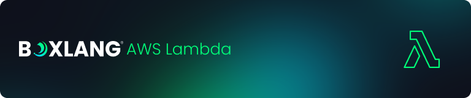

# AWS Lambda

<figure><figcaption></figcaption></figure>

## What is AWS Lambda?

<figure><figcaption></figcaption></figure>

AWS Lambda is a serverless computing service provided by Amazon Web Services (AWS) that lets you run code without provisioning or managing servers. It automatically scales applications by running code in response to events and allocates compute resources as needed, allowing developers to focus on writing code rather than managing infrastructure ([https://docs.aws.amazon.com/lambda/](https://docs.aws.amazon.com/lambda/)).

The **BoxLang AWS Runtime** allows you to code in BoxLang and create Lambda functions in this ecosystem.  We provide you a nice template so you can work with serverless: [https://github.com/ortus-boxlang/boxlang-starter-aws-lambda](https://github.com/ortus-boxlang/boxlang-starter-aws-lambda). This template will give you a turnkey application with features like:

* Unit and Integration Testing
* Java dependency management via Maven
* BoxLang dependency management
* Automatic shading and packaging
* Class compilation caching for improved performance
* Connection pooling for database operations
* Configuration management with environment overrides
* SAM CLI integration for local testing
* GitHub actions to: test, build and release automatically to AWS
* Performance monitoring and debugging capabilities



## BoxLang Lambda Handler

<figure><figcaption></figcaption></figure>

Our BoxLang AWS Handler acts as a front controller to all incoming Lambda executions.  It provides you with:

* Automatic request management to an `event` structure
* Automatic logging and tracing
* Execution of your Lambda classes by convention
* Automatic error management and exception handling
* Automatic response management and serialization
* Life-Cycle Events via our `Application.bx`
* **NEW**: Class compilation caching for improved performance
* **NEW**: Connection pooling for database operations
* **NEW**: Performance metrics and debugging capabilities
* **NEW**: Custom method resolution via headers

The BoxLang AWS runtime provides a pre-built Java handler for Lambda already configured to accept JSON in as a BoxLang Struct and then output either by returning a simple or complex object or using our `response` convention struct.  Our runtime will automatically convert your results to JSON. &#x20;

The default handler you configure your lambda with is:

```
ortus.boxlang.runtime.aws.LambdaRunner::handleRequest
```


You can see the code for the handler here: [https://github.com/ortus-boxlang/boxlang-aws-lambda/blob/development/src/main/java/ortus/boxlang/runtime/aws/LambdaRunner.java#L161](https://github.com/ortus-boxlang/boxlang-aws-lambda/blob/development/src/main/java/ortus/boxlang/runtime/aws/LambdaRunner.java#L161)


The handler will look for a `Lambda.bx`in your package and execute the `run()`method by convention.


```java
class {

    function run( event, context, response ){


    }

}
```



## Environment Variables

The following are all the environment variables the Lambda runtime can read and detect.  If they are set by you or the AWS Lambda runner, then it will use those values to alter operations.  This doesn't mean that they will exist at runtime, it just means you can set them to alter behavior.

| Environment Variable | Description |
|---------------------|-------------|
| `BOXLANG_LAMBDA_CLASS` | Absolute path to the lambda to execute. The default path is: `/var/task/Lambda.bx` Which is your lambda deployed within your zip file. |
| `BOXLANG_LAMBDA_DEBUGMODE` | Turn runtime debug mode on or off. When enabled, provides performance metrics and detailed logging. |
| `BOXLANG_LAMBDA_CONFIG` | Absolute path to a custom `boxlang.json` configuration for the runtime. Defaults to `/var/task/boxlang.json` |
| `BOXLANG_LAMBDA_CONNECTION_POOL_SIZE` | **NEW**: Configure the connection pool size for database operations. Default is 2 connections. |
| `LAMBDA_TASK_ROOT` | Lambda deployment root directory. Defaults to `/var/task` |

You can also leverage ANY environment variable to configure the BoxLang runtime using our runtime [environment conventions](../configuration.md).

### Performance Environment Variables

The runtime now includes several performance optimizations that can be controlled via environment variables:

* **Class Compilation Caching**: Lambda classes are automatically cached to avoid recompilation
* **Connection Pooling**: Database connections are pooled and reused across invocations
* **Performance Metrics**: Debug mode provides timing and memory usage information

## BoxLang AWS Template

The BoxLang default template for AWS lambda can be found here: [https://github.com/ortus-boxlang/boxlang-starter-aws-lambda](https://github.com/ortus-boxlang/boxlang-starter-aws-lambda).  The structure of the project is the following:

```
/.vscode - Some useful vscode tasks and settings
/gradle - The gradle runtime, keep in source control
/src
  + main
    + bx
      + Application.bx (Your life-cycle class)
      + Lambda.bx (Your BoxLang Lambda function)
  + resources
    + boxlang.json (A custom BoxLang configuration file)
    + boxlang_modules (Where you will install BoxLang modules)
  + test
    + java
      + com
        + myproject
          + LambdaRunnerTest.java (An integration test for your Lambda)
          + TestContext.java (A testing context for lambda)
          + TestLogger.java (A testing logger for lambda)
/workbench - AWS lambda utilities and scripts
  + config.env - Default configuration settings
  + config.local.env - Local configuration overrides (create from config.env)
  + sampleEvents/ - Sample Lambda event payloads for testing
  + template.yml - SAM template for local testing and deployment
  + *.sh - Deployment and management scripts
/box.json - Your project's dependency descriptor for CommandBox
/build.gradle - The gradle build configuration
/gradle.properties - Where you store your version and metadata
/gradlew - The gradle shell executor, keep in source control
/gradlew.bat - The gradle shell executor, keep in source control
/settings.gradle - The project settings
```

The BoxLang AWS Lambda runtime will look for a `Lambda.bx` in your package by convention and execute the `run()` method for you.

### Key Template Features

* **Configuration Management**: Hierarchical configuration system using `config.env` → `config.local.env` → environment variables
* **SAM Integration**: Full AWS SAM support for local testing and deployment
* **Maven Dependency Resolution**: Automatic dependency management via Maven
* **Performance Optimizations**: Class caching, connection pooling, and performance monitoring built-in
* **Local Testing**: Multiple Gradle tasks for local development and testing
* **AI Development Support**: Comprehensive GitHub Copilot instructions for enhanced development experience


**AI-Assisted Development**: The BoxLang AWS Lambda template includes comprehensive GitHub Copilot instructions (`.github/copilot-instructions.md`) that provide AI assistants with detailed context about:

* Project architecture and conventions
* Build system and deployment workflows
* Pascal case routing patterns
* Configuration management
* Testing strategies and file locations

This enables more accurate and contextual assistance when developing BoxLang Lambda functions.


### Building and Testing

```bash
# Create local configuration (customize as needed)
cp workbench/config.env workbench/config.local.env

# Run the tests
./gradlew test

# Build the project, create the lambda zip
# The location is /build/distributions/{project}-{version}.zip
./gradlew build

# Local testing with SAM
./gradlew runLocal          # Basic Lambda execution
./gradlew runLocalApi       # API Gateway event
./gradlew runLocalLegacy    # Legacy API Gateway event

# Start local HTTP server for API testing
./gradlew startSamServerBackground

# Clean build artifacts
./gradlew clean
```

## Lambda.bx

The Lambda function is a BoxLang class with a single function called `run()`.&#x20;

<pre class="language-groovy" data-title="Lambda.bx" data-line-numbers><code class="lang-groovy"><strong>/**
</strong> * My BoxLang Lambda
 */
class{

	function run( event, context, response ){
		response.body = {
			"error": false,
			"messages": [],
			"data": "====> Incoming event " &#x26; event.toString()
		};
		response.statusCode = 200;
	}
}
</code></pre>

### Arguments

It accepts three arguments:

<table><thead><tr><th width="137">Argument</th><th width="264">Type</th><th>Description</th></tr></thead><tbody><tr><td><code>event</code></td><td><code>Struct</code></td><td>All the incoming JSON as a BoxLang struct</td></tr><tr><td><code>context</code></td><td><code>com.amazonaws.services.lambda.runtime.Context</code></td><td>The AWS context object.  You can find much <a href="https://docs.aws.amazon.com/lambda/latest/dg/java-context.html">more information here.</a></td></tr><tr><td><code>response</code></td><td><code>Struct</code></td><td>A BoxLang struct convention for a response.</td></tr></tbody></table>


You can find more information about the AWS Context object here: [https://docs.aws.amazon.com/lambda/latest/dg/java-context.html](https://docs.aws.amazon.com/lambda/latest/dg/java-context.html)


#### Event

The `event` structure is a snapshot of the input to your lambda.  We deserialize the incoming JSON for you and give you a nice struct.

#### Context

This is an Amazon Java class that provides extensive information about the request. For more information, check out the API in the Amazon Docs ([https://docs.aws.amazon.com/lambda/latest/dg/java-context.html](https://docs.aws.amazon.com/lambda/latest/dg/java-context.html))

#### Context methods

* `getRemainingTimeInMillis()` – Returns the number of milliseconds left before the execution times out.
* `getFunctionName()` – Returns the name of the Lambda function.
* `getFunctionVersion()` – Returns the [version](https://docs.aws.amazon.com/lambda/latest/dg/configuration-versions.html) of the function.
* `getInvokedFunctionArn()` – Returns the Amazon Resource Name (ARN) that's used to invoke the function. Indicates if the invoker specified a version number or alias.
* `getMemoryLimitInMB()` – Returns the amount of memory that's allocated for the function.
* `getAwsRequestId()` – Returns the identifier of the invocation request.
* `getLogGroupName()` – Returns the log group for the function.
* `getLogStreamName()` – Returns the log stream for the function instance.
* `getIdentity()` – (mobile apps) Returns information about the Amazon Cognito identity that authorized the request.
* `getClientContext()` – (mobile apps) Returns the client context that's provided to Lambda by the client application.
* `getLogger()` – Returns the [logger object](https://docs.aws.amazon.com/lambda/latest/dg/java-logging.html) for the function.

#### Response

The `response` argument is our convention to help you build a nice return structure.  However, it is completely optional.  You can easily return a simple or complex object from your lambda, and we will convert it to JSON.

```json
response : {
  statusCode : 200,
  headers : {
    content-type :  "application/json",
    access-control-allow-origin : "*",
  },
  body : YourLambda.run() results
}
```


```groovy
/**
 * My BoxLang Lambda Simple Return
 */
class{

  function run( event, context, response ){
    return "Hello World!"
  }

}

/**
 * My BoxLang Lambda Complex Return
 */
class{

  function run( event, context, response ){
    return {
      age : 1,
      when : now(),
      data : [ 12,3234,23423 ]
    };
  }

}
```


Now you can go ahead and build your function.  You can use TestBox to unit test your `Lambda.bx` or we even include a `src/test` folder in Java, that simulates the full life-cycle of the runtime.  Just run `gradle test` or use VSCode BoxLang IDE to run the tests.  Now we go to production!

## Performance Enhancements

The BoxLang AWS Lambda runtime includes several performance optimizations:

### Class Compilation Caching

Lambda classes are automatically cached between invocations to avoid recompilation overhead:

```javascript
// Your Lambda classes are compiled once and cached
class {
    function run( event, context, response ) {
        // This class is cached after first compilation
        return processEvent( event );
    }
}
```

### Connection Pooling

Database connections are pooled and reused across Lambda invocations:

```javascript
// Configure connection pool size via environment variable
// BOXLANG_LAMBDA_CONNECTION_POOL_SIZE=5

function run( event, context, response ) {
    // Connections are automatically pooled and reused
    var results = queryExecute( "SELECT * FROM users" );
    return results;
}
```

### Performance Monitoring

Enable debug mode to get performance metrics:

```bash
# Set environment variable for performance monitoring
BOXLANG_LAMBDA_DEBUGMODE=true
```

This provides:

* Class compilation timing
* Memory usage metrics
* Request processing duration
* Connection pool statistics


## Convention-Based URI Routing

**NEW in v1.5.0**: The runtime now supports automatic routing using **PascalCase conventions**, allowing you to build multi-class Lambda functions with BoxLang easily following our conventions.

When your Lambda is exposed as a URL, the runtime can automatically route to different BoxLang classes based on the URI path:

```javascript
// URL: /products -> Products.bx
// URL: /home-savings -> HomeSavings.bx
// URL: /user-profile -> UserProfile.bx
```

### Example Multi-Class Structure

```
/src/main/bx/
  ├── Lambda.bx          # Default handler (fallback)
  ├── Products.bx        # Handles /products
  ├── HomeSavings.bx     # Handles /home-savings
  └── UserProfile.bx     # Handles /user-profile
```

Each class should implement a `run` function:

```groovy
// Products.bx
class {
    function run( event, context, response ) {
        return {
            "statusCode" : 200,
            "body" : serializeJSON( getProductCatalog() )
        };
    }

    function getProductCatalog() {
        return [
            { "id": 1, "name": "BoxLang Runtime" },
            { "id": 2, "name": "CommandBox" }
        ];
    }
}
```

### URI to Class Name Conversion

The routing follows these conventions:

* `/products` → `Products.bx`
* `/home-savings` → `HomeSavings.bx`
* `/user-profile` → `UserProfile.bx`
* `/user_profile` → `UserProfile.bx`

Hyphens and underscores are converted to PascalCase. Subdirectories are not currently supported.

## Multiple Functions Header

The runtime also allows you to create other functions inside of your Lambda that can be targeted if your AWS Lambda is exposed as an URL.  You will be able to target different functions in your `Lambda.bx` by using the following header when executing your lambda:

```bash
x-bx-function=methodName
```

This makes it incredibly flexible where you can respond to that incoming header in a different function than the one by convention.

## Lambda Modules

You can use any BoxLang module with the BoxLang Lambda runtime by installing them to the `src/resources/boxlang_modules` folder.  All modules placed there during the build process will be packaged into your lambda deployment.

```bash
# Using CommandBox to install modules directly
box install id=bx-module directory=src/resources/boxlang_modules

# Or add them to box.json and install
cd src/resources && box install
```

## Local Development & Testing

The template provides comprehensive local development and testing capabilities:

### SAM CLI Integration

```bash
# Test your function locally with different event types
./gradlew runLocal          # Basic Lambda execution
./gradlew runLocalApi       # API Gateway event simulation
./gradlew runLocalLegacy    # Legacy API Gateway event

# Start a local HTTP server for API testing
./gradlew startSamServerBackground
./gradlew stopSamServer
```

### Sample Events

The template includes sample event files in `workbench/sampleEvents/`:

* `api.json` - API Gateway event
* `event.json` - Basic Lambda event
* `event-live.json` - Production-like event for testing

### Testing Framework

The Java integration tests simulate the complete Lambda lifecycle:

```java
// Example from LambdaRunnerTest.java
@Test
public void testLambdaExecution() {
    LambdaRunner runner = new LambdaRunner();
    String result = runner.handleRequest(sampleEvent, testContext);
    assertThat(result).contains("success");
}
```

## Deploy to AWS

You can deploy your lambda using the provided deployment scripts or GitHub Actions. The template includes a comprehensive deployment system with configuration management.

### Configuration-Based Deployment

The template uses a hierarchical configuration system:

1. **Base Configuration**: `workbench/config.env` - Default settings
2. **Local Overrides**: `workbench/config.local.env` - Your custom settings
3. **Environment Variables**: Final overrides

```bash
# Create your local configuration
cp workbench/config.env workbench/config.local.env

# Edit your settings
vim workbench/config.local.env
```

Example configuration:

```bash
# AWS Settings
AWS_LAMBDA_BUCKET=my-lambda-deployments
STACK_NAME=my-boxlang-app
FUNCTION_NAME=my-function
LAMBDA_MEMORY=512
LAMBDA_TIMEOUT=30
ENVIRONMENT=development
```

### Deployment Scripts

The template provides several deployment scripts:

```bash
# Check AWS credentials and configuration
./workbench/0-check-aws.sh

# Create S3 bucket for deployments
./workbench/1-create-bucket.sh

# Deploy your Lambda function
./workbench/2-deploy.sh

# Invoke your deployed function
./workbench/3-invoke.sh

# Clean up resources
./workbench/4-cleanup.sh
```

### GitHub Actions Deployment

Below is the enhanced GitHub Action that uses the new configuration system:


The Lambda function will be created automatically via CloudFormation if it doesn't exist, or updated if it does.


```yaml
- name: Deploy BoxLang Lambda
  run: |
    ./workbench/2-deploy.sh
  env:
    AWS_REGION: ${{ secrets.AWS_REGION }}
    AWS_ACCESS_KEY_ID: ${{ secrets.AWS_PUBLISHER_KEY_ID }}
    AWS_SECRET_ACCESS_KEY: ${{ secrets.AWS_SECRET_PUBLISHER_KEY }}
    AWS_LAMBDA_BUCKET: ${{ secrets.AWS_LAMBDA_BUCKET }}
    ENVIRONMENT: ${{ github.ref == 'refs/heads/main' && 'production' || 'staging' }}
```

### SAM Template Integration

The template includes a parameterized SAM template (`workbench/template.yml`) that:

* Creates the Lambda function with proper configuration
* Sets up IAM roles and permissions
* Configures environment variables
* Provides function outputs (name, ARN) for integration

### Required Configuration

The automated deployment requires storing your credentials in your repository's secrets or environment variables:

* `AWS_REGION` - The region to deploy to
* `AWS_PUBLISHER_KEY_ID` - The AWS access key
* `AWS_SECRET_PUBLISHER_KEY` - The AWS secret key
* `AWS_LAMBDA_BUCKET` - S3 bucket for deployment artifacts

### Environment-Based Deployments

The build process supports multiple environments based on Git branches:

* **Development Branch** → `staging` environment
* **Main/Master Branch** → `production` environment

The template automatically creates appropriately named functions:

* `{functionName}-staging` - For development/staging
* `{functionName}-production` - For production releases


The `{functionName}` comes from your `FUNCTION_NAME` configuration setting.



<figure><figcaption></figcaption></figure>

Log in to the Lambda Console and click on `Create function` button.

<figure><figcaption><p>AWS Lambda Console</p></figcaption></figure>

Now let's add the basic information about our deployment:

* Add a function name: `{projectName}-staging or production`
* Choose `Java 21` as your runtime
* Choose `x86_64` as your architecture


TIP: If you choose ARM processors, you can save some money.



<figure><figcaption><p>Create a function</p></figcaption></figure>

Now, let's upload our test code. You can choose a zip/jar or s3 location. We will do a simple zip from our template:

<figure><figcaption><p>Upload Test Code</p></figcaption></figure>

<figure><figcaption></figcaption></figure>

<figure><figcaption><p>Code Uploaded</p></figcaption></figure>

Now important, let's choose the AWS Lambda Runtime Handler in the `Edit runtime settings`

<figure><figcaption></figcaption></figure>

And make sure you use the following handler address: `ortus.boxlang.runtime.aws.LambdaRunner::handleRequest` This is inside the runtime to execute our `Lambda.bx` function.


Please note that the RAM you chose for your lambda determines your CPU as well. So make sure you increase the RAM accordingly.  We have seen great results with 4GB+.



### Testing in AWS

Now click on the `Test` tab and an event name `MyTestEvent`.  You can also add anything you like in the `Event JSON` to test the input of your lambda.  Then click on `Test` and watch it do its magic.  Now go have some good fun!

<figure><figcaption></figcaption></figure>

## Runtime Source Code

The AWS Runtime source code can be found here: [https://github.com/ortus-boxlang/boxlang-aws-lambda](https://github.com/ortus-boxlang/boxlang-aws-lambda)

### Latest Runtime Features

The BoxLang AWS Lambda runtime includes several recent enhancements:

* **Maven Dependency Management**: Automatic resolution of runtime dependencies
* **Class Compilation Caching**: Improved cold start performance through class caching
* **Connection Pooling**: Database connection pooling for better performance
* **Performance Metrics**: Detailed performance monitoring in debug mode
* **Enhanced Error Handling**: Better error messages and stack traces
* **Configuration Flexibility**: Hierarchical configuration system
* **SAM Integration**: Full AWS SAM support for local development

### Performance Best Practices

For optimal performance with the BoxLang AWS Lambda runtime:

1. **Enable Class Caching**: Use `trustedCache=true` in your `boxlang.json` for production
2. **Configure Connection Pooling**: Set `BOXLANG_LAMBDA_CONNECTION_POOL_SIZE` for database workloads
3. **Memory Allocation**: Allocate sufficient memory (2GB+ recommended) for better CPU performance
4. **Static Initialization**: Use static blocks for expensive one-time setup
5. **Early Returns**: Validate input early and return immediately on errors

We welcome any pull requests, testing, documentation contributions, and feedback.
