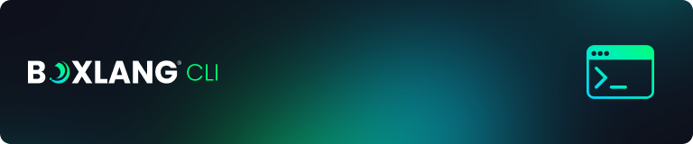

# CLI Scripting

<figure><figcaption></figcaption></figure>

BoxLang is a modern, dynamic scripting language built for more than just simple automation—it empowers you to create full-fledged, high-performance CLI applications with ease. Designed to run seamlessly on the JVM, BoxLang provides powerful scripting capabilities, a rich standard library, and first-class support for modular development.

Whether you're automating repetitive tasks, building interactive command-line tools, or developing complex CLI-driven workflows, BoxLang offers the flexibility, expressiveness, and performance you need. With intuitive syntax, robust error handling, and seamless integration with Java and other JVM-based technologies, BoxLang makes CLI scripting more efficient and enjoyable.

## Script Files <a href="#execute-a-file-9" id="execute-a-file-9"></a>

With BoxLang, you can execute a few types of files right from any OS CLI by adding them as the second argument to our `boxlang`binary:

<table><thead><tr><th width="100">File</th><th width="100">OS<select><option value="3cJlLiaj5Xge" label="Windows" color="blue"></option><option value="HW3jPH5fCWIy" label="Mac + *Nix" color="blue"></option><option value="6Tg36nA4Yujw" label="All" color="blue"></option></select></th><th>Hint</th></tr></thead><tbody><tr><td>*.bx</td><td><span data-option="6Tg36nA4Yujw">All</span></td><td>BoxLang classes with a <code>main()</code>method</td></tr><tr><td>*.bxs</td><td><span data-option="6Tg36nA4Yujw">All</span></td><td>BoxLang scripts</td></tr><tr><td>*.bxm</td><td><span data-option="6Tg36nA4Yujw">All</span></td><td>BoxLang Templating Language</td></tr><tr><td>*.cfs</td><td><span data-option="6Tg36nA4Yujw">All</span></td><td>CFML scripts (If using the <code>bx-compat-cfml</code>module)</td></tr><tr><td>*.cfm</td><td><span data-option="6Tg36nA4Yujw">All</span></td><td>CFML templates (If using the <code>bx-compat-cfml</code>module)</td></tr><tr><td>*.sh</td><td><span data-option="HW3jPH5fCWIy">Mac + *Nix</span></td><td>Shebang scripts using <code>boxlang</code>as the environment</td></tr></tbody></table>


Please note that you will need the `bx-compat-cfml`module if you want to execute CFML scripts


Here are some examples of executing the files. Just pass in the file by relative or absolute path location.



```bash
boxlang task.bx
boxlang myscript.bxs
boxlang mytemplate.bxm

boxlang /full/path/to/test.bxs
boxlang /full/path/to/Task.bx
```



```powershell
boxlang.bat task.bx
boxlang.bat myscript.bxs
boxlang.bat mytemplate.bxm
```



```ruby
java -jar boxlang-1.0.0.jar task.bx
java -jar boxlang-1.0.0.jar /full/path/to/test.bxs
```



## Other Scopes

Please note that you have access to other persistent scopes when building CLI applications:

* `application`- This scope lives as long as your application lives as well, but it is technically attached to an `Application.bx`file that activates framework capabilities for your application.
* `request`- A scope that matches a specific request for your application. We also get one per CLI app since there is no concept of sessions or user state. There is always only one request.

For CLI applications, we recommend you use the `server`or `request` scope for singleton persistence. Also note that you can use all the [caches](../configuration/caches.md) as well for persistence. You can use `application`scope if you have an `Application.bx.`

## Executing Classes

BoxLang allows you to execute any `*.bx`class as long as it has a method called `main()`by convention. All the arguments passed into the file execution will be collected and passed into the function via the `args`argument.


```java
class{

    function main( args = [] ){
        println( "Hola from my task! #now()#" )
        println( "The passed args are: " )
        println( args )
    }

}
```


The `args`argument is an array and it will contain all the arguments passed to the execution of the class.

```bash
boxlang task.bx hola --many options=test
```

If you execute this function above, the output will be:

```bash
Hola from my task! {ts '2025-02-11 22:15:44'}
The passed args are:
[
  hola,
  --many,
  options=test
]
```

Class executions are a great way to build tasks that have a deterministic approach to execution. We parse the arguments for you, and you can focus on building your task.

## Executing Scripts / Templates

In addition to executing classes, you can execute `*.bxs`scripts that can do your bidding. The difference is that this is a flat source code script that executes from the top down. It can contain functions, scope usage, imports, and create any class.


```groovy
message = "Hola from my task! #now()#"
println( message )
println( "The passed args are: " )
println( CLIGetArgs() )
```


Then, if we execute it, we can see this output:

```bash
╰─ boxlang hello.bxs hola luis=majano --test

Hola from my task! {ts '2025-02-11 22:29:44'}
The passed args are:
{
  positionals : [
      hola,
    luis=majano
  ],
  options : {
    test : true
  }
}
```

What do you see that's different? We don't have the incoming arguments as an argument since it's a script. However, we can use the `CLIGetArgs()`BIF, and it will give you a structure of two keys:

* `positionals`- An array of positional values passed to the script
* `options`- Name value pairs detected as options


You can also get the arguments via the `server.cli.parsed`variable, which already contains this structure.


```groovy
message = "Hola from my task! #now()#"
println( message )
println( "The passed args are: " )
println( server.cli.parsed )
```

Here is the output:

```bash
╰─ boxlang hello.bxs hola luis=majano --test

Hola from my task! {ts '2025-02-11 22:29:44'}
The passed args are:
{
  positionals : [
      hola,
    luis=majano
  ],
  options : {
    test : true
  }
}
```


Please note that executing templates is the same as scripts, but your template uses templating language instead, which can be helpful if you produce some markup (HTML, Markdown, etc.)


## SheBang Scripts

SheBang scripts are text files containing a sequence of commands for a computer operating system. The term "shebang" refers to the `#!` characters at the beginning of the script, which specify the interpreter that should be used to execute the script. These scripts are commonly used in Unix-like operating systems to automate tasks. You can run scripts directly from the command line using a shebang line without explicitly invoking the interpreter. BoxLang supports these scripts, so the OS sees them as just pure shell scripts, but you are coding in BoxLang scripting.


A SheBang script is just basically a `*.bxs`script.



```bash
#!/usr/bin/env boxlang

println( "Hello World! #now()#" )
println( CLIGetArgs() );
```


As you can see from the sample above, the first line is what makes it a SheBang script the operating system can use. It passes it to the `boxlang`binary for interpretation. Also, note that you can pass arguments to these scripts like any other script and the `CLIGetArgs()`or the `server.cli.parsed` variables will be there for you to use.

```bash
# Execute the script
./hola.sh

# Execute it with a name argument and a simple option
./hola.sh --name=luis -d
```

## CLI Built-In Functions

BoxLang also gives you several built-in functions for interacting with the CLI:

* `CLIClear():void` - Clears the console
* `CLIGetArgs():struct` - Return a structure of the parsed incoming arguments
* `CLIRead( [prompt] ):any`- Read input from the CLI and return the value
* `CLIExit( [exitCode=0] )`- Do a `System.exit()`with the passed-in exit code


Please note that you have a wealth of built-in functions and components that you can use to build your scripts.


## Parsed Arguments

BoxLang will automatically parse the incoming arguments into a structure of two types when using the `CLIGetArgs()`BIF or by using the `server.cli.parsed` variable.

* `options` - A structure of the options (name-value pairs) used to invoke the script
* `positionals` - An array of the positional arguments used to invoke the script

The options can be provided in the following formats, which are standard in CLI applications:

* `--option` - A boolean option that is set to `true`
* `--option=value` - An option with a value
* `--option="value"` - An option with a quoted value
* `--option='value'` - An option with a single quoted value
* `-o=value` - A shorthand option with a value
* `-o` - A shorthand boolean option that is set to `true`
* `--!option` - A negation option that is set to `false`
* `--no-{option}` - A negation option

For example, the following CLI arguments:

```bash
--debug --!verbose --bundles=Spec -o='/path/to/file' -v my/path/template
```

Will be parsed into the following struct:

```json
{
"options" :  {
   	"debug": true,
  	"verbose": false,
 	"bundles": "Spec",
	"o": "/path/to/file",
	"v": true
},
"positionals": [ "my/path/template" ]
```

### Some Ground Rules

* Options are prefixed with `--`
* Shorthand options are prefixed with `-`
* Options can be negated with `--!` or `--no-`
* Options can have values separated by =
* Values can be quoted with single or double quotes
* Repeated options will override the previous value

## Reading Input

You can easily read input from users by using our handy `CLIRead()`bif. You can also pass in a `prompt`as part of the method call.

```groovy
var exit = cliRead( "Do you want to continue? (Y/N)" ).trueFalseFormat()
if( exit ){
  cliExit()
}
```

## Producing Output

As you navigate all the built-in functions and capabilities of BoxLang, let's learn how to produce output to the system console.

* `printLn()` - Print with a line break to System out
* `print()` - Print with no line break to System out
* `writeOutput(), echo()` - Writes to the output buffer (Each runtime decides what its buffer is. The CLI is the system output, the Web is the HTML response buffer, etc)
* `writeDump()`- Takes any incoming output and will serialize to a nice string output representation. This will also do complex objects deeply.

```groovy
println( "Time is #now()#" )
```

I get the output:

```bash
╰─ boxlang test.bxs
Time is {ts '2024-05-22 22:09:56'}
```

Hooray! You have executed your first script using BoxLang. Now let's build a class with a `main( args=[] )` convention. This is similar to Java or Groovy.

```java
class{

        function main( args=[] ){

               println( "Task called with " & arguments.toString() )

                writedump( args )

        }

}
```

You can now call it with zero or more arguments!

```bash
╰─ boxlang Task.bx
Task called with {ARGS=[]}

╰─ boxlang Task.bx boxlang rocks
Task called with {ARGS=[boxlang, rocks]}
```

## Piping code <a href="#piping-code-11" id="piping-code-11"></a>

You can also pipe statements into the BoxLang binary for execution as well. This assumes script, not tags.

```bash
echo "2+2" | java -jar boxlang-1.0.0.jar
echo "2+2" | boxlang
```

or

```bash
# on *nix
cat test.cfs | java -jar boxlang-1.0.0.jar
cat test.cfs | boxlang

# on Windows
type test.cfs | java -jar boxlang-1.0.0.jar
type test.cfs | boxlang.bat
```

## Module CLI Apps

BoxLang allows you to build CLI applications as modules, making it easy to package, share, and execute reusable command-line tools. To create a module CLI app, simply add a `main( args )` method to your module's `ModuleConfig.bx` file.

When you want to execute a module as a CLI app, use the following convention:

* `module:{name}` - This will execute the module's `ModuleConfig.main( args )` method, passing any CLI arguments to it.

For example, if you have a module named `mytools`, you can run its CLI entry point like this:

```bash
boxlang module:mytools arg1 --option=value
```

This will invoke the `main( args )` method in `ModuleConfig.bx` of the `mytools` module, with all CLI arguments available in the `args` array.

### Example: ModuleConfig.bx

```java
class {

    function main( args = [] ) {
        println( "Module CLI called with args:" );
        writedump( args );
        // Your CLI logic here
    }

}
```

This approach lets you build modular CLI utilities that can be distributed and executed just like standalone scripts or classes. You can leverage all BoxLang features, scopes, and built-in functions inside your module CLI apps.


For more on modules and conventions, see the [BoxLang Modules documentation](../../boxlang-framework/modularity/README.md).


## Embedding Modules in a CLI App

BoxLang also allows you to **embed modules inside your CLI application** for distribution and local usage. This is different from creating a CLI app that executes a module's `main()` method. Embedding modules means your CLI app can include and use additional BoxLang modules as dependencies, making your CLI tool more powerful and modular.

To embed modules, use the `boxlang_modules` folder convention in your CLI app directory. You can install modules locally into this folder using the `install-bx-module` installer script with the `--local` flag:

```bash
install-bx-module bx-pdf bx-image --local
```

When your CLI app runs, BoxLang will check the `boxlang_modules` folder first for available modules, then fall back to the OS home modules. This allows you to package all required modules with your CLI app for easy distribution and predictable behavior.

**Example directory structure:**

```
mycliapp/
  myscript.bxs
  boxlang_modules/
    bx-pdf/
    bx-image/
```

Your CLI scripts and classes can then use any embedded modules as if they were installed globally.


For more on embedding and using modules, see the [BoxLang Modules documentation](../../boxlang-framework/modularity/README.md).


## Dad Joke Script

Thanks to our evangelist Raymond Camden, we have a cool dad joke script you can find in our demos: [https://github.com/ortus-boxlang/bx-demos](https://github.com/ortus-boxlang/bx-demos)

```java
class{
    variables.apiURL = "https://icanhazdadjoke.com/";

    /**
     * The first argument is a term to search dad jokes on, if not provided, a random dad joke will be fetched.
     * Example: boxlang DadJoke.bx dad
     * Example: boxlang DadJoke.bx
     */
    function main( args = [] ) {
        // Use elvis operator to check if a term was passed, else, use an empty string
        var term = ( args[ 1 ] ?: "" ).trim();

        if( !term.isEmpty() ){
            apiURL &= "search?term=" & term.urlEncodedFormat()
        }

        println( "Getting dad joke for term [#term#], please wait..." );
        bx:http url=apiURL result="result" {
            bx:httpparam type="header" name="Accept" value="application/json";
        }
        var data = JSONDeserialize( result.fileContent );

         // possible none were found, use safe navigation operator
         if( data?.results?.len() == 0 ){
            println( "No jokes found for term: #term#" );
            return cliExit();
         }

        // If we searched for a term, we need to get a random joke from the results, otherwise, just .joke
        var joke = term.isEmpty() ? data.joke : data.results[ randRange( 1, data.results.len() ) ].joke;
        println( joke );
    }

}
```

Now you execute it

```bash
// Random joke
boxlang DadJoke.bx

// Term jokes
boxlang DadJoke.bx ice
```

Let's modify it now so that we can prompt the user for the term using the `CLIRead()`BIF instead of passing it:

```java
var term = ( CLIRead( "What search term would you like to use? (Leave blank for random joke)") ).trim();
```
