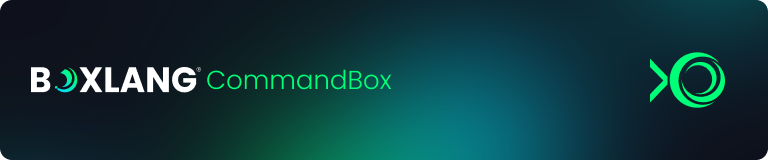

# CommandBox

<figure><figcaption></figcaption></figure>

[CommandBox](https://commandbox.ortusbooks.com/) is a standalone, native tool for Windows, Mac, and Linux that provides a Command-Line Interface (CLI) for developer productivity, tool interaction, package management, embedded JEE server, application scaffolding, and sweet ASCII art.

CommandBox seamlessly integrates to work with any of [Ortus Solutions](http://www.ortussolutions.com/products) \*Box products, but it is also open to extensibility for any BoxLang or CFML project. We have created a special servlet runtime for CommandBox so you can leverage it to deploy mission-critical and high-traffic web applications. We go even further with [CommandBox PRO](https://www.ortussolutions.com/products/commandbox-pro) as part of our [BoxLang subscriptions](https://boxlang.io/plans) to give you tons of features like JDK management, Multi-site support, Multi-SSL support, Operating System service manager, SNI support, CAC Support, and so much more.

<figure><figcaption></figcaption></figure>


Find out about CommandBox Pro [https://www.ortussolutions.com/products/commandbox-pro](https://www.ortussolutions.com/products/commandbox-pro)


You can find out more about getting started with CommandBox or CommandBox Pro in our [CommandBox documentation](https://commandbox.ortusbooks.com/getting-started-guide).

### Install the Module <a href="#versioning" id="versioning"></a>

Once installed, CommandBox needs (for the moment) the `commandbox-boxlang` module to start BoxLang servers. So let's go ahead and install it:

```bash
install commandbox-boxlang
```

This will add the right file types and handlers to CommandBox for BoxLang.

### Start up a Server

This guide is short and sweet. The hard part has been done. Now, you can start a BoxLang server like any other CommandBox server. So go to the webroot of your choosing and run:

```bash
server start cfengine=boxlang javaVersion=openjdk21_jdk
```

Enjoy your server!

### Server Home

Like any other CommandBox server, the servers will be stored in your setup's CommandBox Home. The `boxlang.json`, class folders, and modules will all be installed here.

### Installing BoxLang Modules

Just like with any server, you can also install modules into the BoxLang server.

```bash
install bx-mysql, bx-derby
```

That's it. CommandBox knows where to put them and manage them.

### Server.json

You can also make your CommandBox BoxLang server portable with a `server.json` file:

```json
{
    "name":"MyBoxLang-Server",

    "app":{
        // The BoxLang Engine
        "cfengine":"boxlang",
        // Portable Home if you want, or ignore it to place it under the
        // CommandBox Home
        "serverHomeDirectory":".boxlang"
    },

    "openBrowser":true,

    "web":{
        "rewrites":{
            "enable":true
        },
    },

    // Any Environment variables
    "env":{
        // "BOXLANG_DEBUG" : true
    },

    // Install these modules on installation
    "scripts" : {
 	"onServerInitialInstall":"install bx-mail,bx-mysql,bx-derby,bx-compat-cfml"
   }
}
```

### Environment Variables

The servlet/CommandBox runtime uses the same [env variables](./#environment-variables) as the core OS. You can find them here.


[.](./)


### Runtime Source Code

The runtime source code can be found here: [https://github.com/ortus-boxlang/boxlang-servlet](https://github.com/ortus-boxlang/boxlang-servlet)

We welcome any pull requests, testing, docs, etc.
