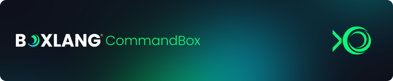

# CommandBox

<figure><figcaption></figcaption></figure>

[CommandBox](https://commandbox.ortusbooks.com/) is a standalone, native tool for Windows, Mac, and Linux that provides a Command-Line Interface (CLI) for developer productivity, tool interaction, package management, embedded JEE server, application scaffolding, and sweet ASCII art. **CommandBox is the defacto enterprise servlet deployment platform for BoxLang**, providing production-ready capabilities for mission-critical applications.

CommandBox seamlessly integrates to work with any of [Ortus Solutions](http://www.ortussolutions.com/products) \*Box products, but it is also open to extensibility for any BoxLang or CFML project. We have created a specialized servlet runtime for CommandBox that makes it the premier choice for deploying enterprise BoxLang applications with high-traffic and mission-critical requirements.

## 🚀 Enterprise Features & BoxLang Subscriptions

CommandBox becomes even more powerful with [CommandBox PRO](https://www.ortussolutions.com/products/commandbox-pro), which is included with [BoxLang+ and BoxLang++ subscriptions](https://boxlang.io/plans). When you have a **BoxLang +/++ subscription**, you automatically get access to all CommandBox PRO enterprise features:

- **🏢 Multi-site Support** - Host multiple applications on a single CommandBox instance
- **🔐 Multi-SSL Support** - Advanced SSL certificate management and SNI support
- **⚙️ Operating System Service Manager** - Run CommandBox as a system service
- **🛡️ CAC (Common Access Card) Support** - Enterprise authentication integration
- **☕ JDK Management** - Simplified Java version management
- **📊 Advanced Monitoring & Metrics** - Production-ready observability tools
- **🔧 Professional Support** - Direct access to Ortus Solutions engineering team

## 🐳 Docker Container Support

CommandBox also provides official Docker containers for containerized deployments:

```bash
# Pull the official CommandBox Docker image
docker pull ortussolutions/commandbox

# Run a BoxLang server in Docker
docker run -d \
  -p 8080:8080 \
  -v /path/to/your/app:/app \
  ortussolutions/commandbox
```

For more Docker deployment options, visit the [CommandBox Docker Hub repository](https://hub.docker.com/r/ortussolutions/commandbox).

<figure><figcaption></figcaption></figure>


**BoxLang Subscribers**: If you have a BoxLang+ or BoxLang++ subscription, you automatically get access to all CommandBox PRO features. Learn more at [https://boxlang.io/plans](https://boxlang.io/plans)

For standalone CommandBox Pro: [https://www.ortussolutions.com/products/commandbox-pro](https://www.ortussolutions.com/products/commandbox-pro)


You can find out more about getting started with CommandBox or CommandBox Pro in our [CommandBox documentation](https://commandbox.ortusbooks.com/getting-started-guide).

## 📦 Installation & Setup

### Install the BoxLang Module

Once installed, CommandBox needs (for the moment) the `commandbox-boxlang` module to start BoxLang servers. So let's go ahead and install it:

```bash
install commandbox-boxlang
```

This will add the right file types and handlers to CommandBox for BoxLang.


This will no longer be needed on CommandBox 6.1+


## 🚀 Start up a Server

Starting a BoxLang server with CommandBox is simple and powerful. Navigate to your application's webroot and run:

```bash
server start cfengine=boxlang javaVersion=openjdk21_jdk
```

### Additional Server Options

CommandBox provides extensive server configuration options for enterprise deployments:

```bash
# Start with specific JVM settings
server start cfengine=boxlang javaVersion=openjdk21_jdk --jvmArgs="-Xmx2g -Xms1g"

# Start on a specific port with SSL
server start cfengine=boxlang port=8443 SSL=true

# Start with debug mode enabled
server start cfengine=boxlang --debug

# Start in production mode with optimizations
server start cfengine=boxlang profile=production
```

Enjoy your enterprise-grade BoxLang server!

## 🏠 Server Home

Like any other CommandBox server, the servers will be stored in your setup's CommandBox Home. The `boxlang.json`, class folders, and modules will all be installed here.

## 📦 Installing BoxLang Modules

Just like with any server, you can also install modules into the BoxLang server:

```bash
# Install individual modules
install bx-mysql,bx-derby

# Install modules with specific versions
install bx-mail@1.0.0,bx-redis@latest

# Install from different sources
install bx-compat-cfml
install github:ortus-boxlang/bx-elasticsearch
```

That's it. CommandBox knows where to put them and manage them automatically.

## ⚙️ Server Configuration

### server.json

You can make your CommandBox BoxLang server portable and enterprise-ready with a comprehensive `server.json` file:

```json
{
    "name": "MyBoxLang-Server",

    "app": {
        // The BoxLang Engine
        "cfengine": "boxlang",
        // Portable Home if you want, or ignore it to place it under the
        // CommandBox Home
        "serverHomeDirectory": ".boxlang"
    },

    "openBrowser": true,

    "web": {
        "rewrites": {
            "enable": true
        },
        "SSL": {
            "enable": false,
            "port": 8443
        }
    },

    "jvm": {
        "heapSize": "2048m"
    },

    // Any Environment variables
    "env": {
        // "BOXLANG_DEBUG" : true
    },

    // Install these modules on installation
    "scripts": {
        "onServerInitialInstall": "install bx-mail,bx-mysql,bx-derby,bx-compat-cfml"
    }
}
```

### Advanced Enterprise Configuration

For production and enterprise deployments, you can leverage additional CommandBox features:

```json
{
    "name": "BoxLang-Production-Server",

    "app": {
        "cfengine": "boxlang",
        "serverHomeDirectory": "/opt/boxlang-server"
    },

    "web": {
        "host": "0.0.0.0",
        "webroot": "./webroot",
        "rewrites": {
            "enable": true
        },
        "SSL": {
            "enable": true,
            "port": 8443,
            "certFile": "/etc/ssl/certs/server.crt",
            "keyFile": "/etc/ssl/private/server.key"
        }
    },

    "jvm": {
        "heapSize": "4096m",
        "args": [
            "-XX:+UseG1GC",
            "-XX:MaxGCPauseMillis=200",
            "-Dfile.encoding=UTF-8"
        ]
    },

    "env": {
        "BOXLANG_ENVIRONMENT": "production",
        "BOXLANG_DEBUG": false
    },

    "scripts": {
        "onServerInitialInstall": "install bx-mail,bx-mysql,bx-redis,bx-elasticsearch",
        "onServerStart": "echo 'BoxLang Enterprise Server Starting...'",
        "onServerStop": "echo 'BoxLang Enterprise Server Stopping...'"
    }
}
```

## 🌍 Environment Variables

The servlet/CommandBox runtime uses the same [environment variables](./#environment-variables) as the core OS runtime. You can find detailed information about all available environment variables here.


[.](./)


## 🔧 Development & Debugging

### Custom boxlang.json Configuration

You can use your own custom `boxlang.json` file to startup the engine by using the `app.engineConfigFile` setting in your `server.json`:

```json
{
    "name": "MyBoxLang-Server",

    "app": {
        // The BoxLang Engine
        "cfengine": "boxlang",
        // Portable Home if you want, or ignore it to place it under the
        // CommandBox Home
        "serverHomeDirectory": ".engine/boxlang",
        // Custom boxlang.json file
        "engineConfigFile": ".boxlang.json"
    },

    "openBrowser": true,

    "web": {
        "rewrites": {
            "enable": true
        }
    },

    // Any Environment variables
    "env": {
        // "BOXLANG_DEBUG" : true
    },

    // Install these modules on installation
    "scripts": {
        "onServerInitialInstall": "install bx-mail,bx-mysql,bx-compat-cfml"
    }
}
```

### Debug Mode

You can enable debug mode for your BoxLang server using several approaches:

#### `--debug` flag via the `server start` command

```bash
server start --debug
```

#### `env.BOXLANG_DEBUG` environment variable

Set `env.BOXLANG_DEBUG` in your `server.json` file:

```json
"env": {
   "BOXLANG_DEBUG": true
}
```

#### `BOXLANG_DEBUG` in a .env file

Set `BOXLANG_DEBUG=true` in a .env file:

```bash
BOXLANG_DEBUG=true
```

#### `.cfconfig.json` `debugMode` setting

Or set `debuggingEnabled` in your `.cfconfig.json` server configuration file:

```json
{
    "debuggingEnabled": true
}
```

#### Custom `boxlang.json` file

Use the `app.engineConfigFile` to seed a custom `boxlang.json` file into the engine and use the normal settings in the `boxlang.json`.

## 📚 Additional Resources

### Runtime Source Code

The CommandBox servlet runtime source code can be found here: [https://github.com/ortus-boxlang/boxlang-servlet](https://github.com/ortus-boxlang/boxlang-servlet)

We welcome any pull requests, testing, documentation contributions, and feedback!

### Docker Hub

Official CommandBox Docker images: [https://hub.docker.com/r/ortussolutions/commandbox](https://hub.docker.com/r/ortussolutions/commandbox)

### Enterprise Support

For enterprise deployments and professional support:

- **BoxLang+ Subscribers**: Included CommandBox PRO features and support
- **BoxLang++ Subscribers**: Priority support with SLA guarantees
- **Standalone CommandBox PRO**: Available at [ortussolutions.com](https://www.ortussolutions.com/products/commandbox-pro)


**Ready for Production**: CommandBox with BoxLang provides enterprise-grade servlet deployment capabilities, making it the preferred choice for mission-critical applications requiring high availability, scalability, and professional support.

