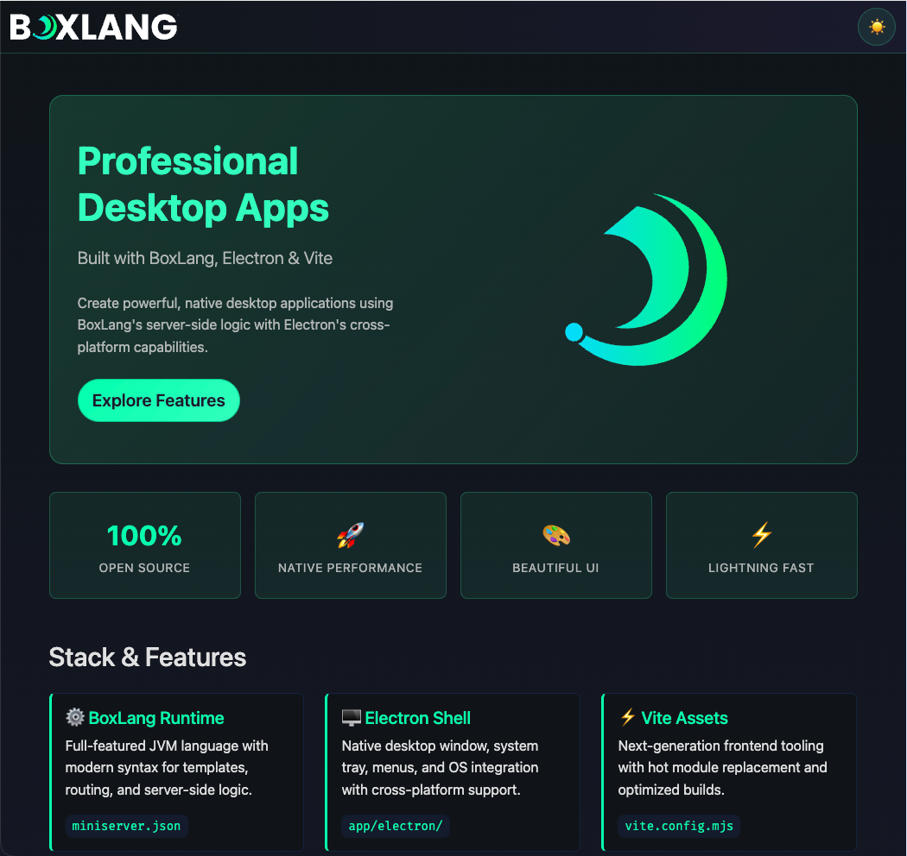
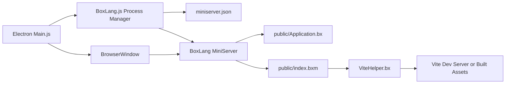
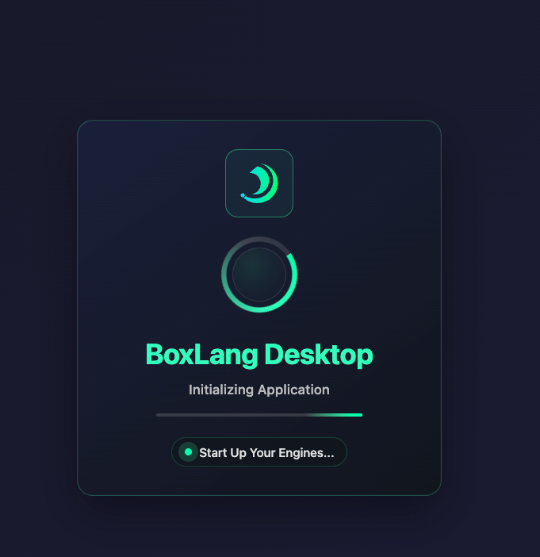
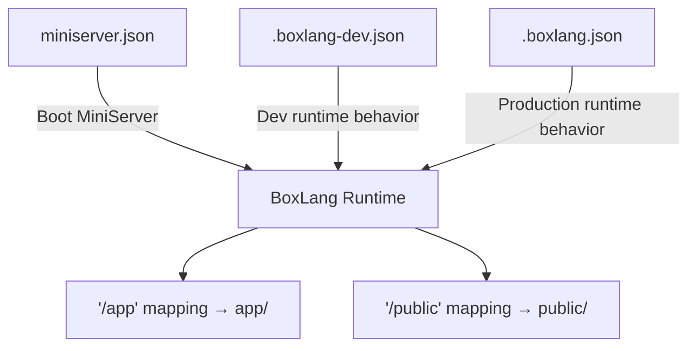

# Desktop Applications

<figure><figcaption><p>Build professional desktop apps with BoxLang and Electron</p></figcaption></figure>

BoxLang desktop applications combine three things you already know: BoxLang server-side logic running inside a local **MiniServer**, an **Electron** shell that owns the native window, tray, and menus, and a **Vite** build pipeline for modern frontend assets. The result is a cross-platform desktop app that ships a real HTTP server — not Electron's renderer process playing fetch tricks — so your BoxLang code runs exactly the same way it does on the web.

We provide a turnkey starter to get you moving immediately:



Everything the starter gives you out of the box:

- BoxLang MiniServer running inside the desktop app on a local port
- Electron shell with app menu, system tray, global shortcuts, and native window lifecycle
- Vite build pipeline for JS and SCSS assets (Alpine.js + Bootstrap 5 included)
- SQLite datasource pre-configured via `Application.bx`
- Full packaging flow for macOS, Windows, and Linux

## 📋 Table of Contents

- [Architecture](#architecture)
- [Prerequisites](#prerequisites)
- [Quick Start](#quick-start)
- [Project Structure](#project-structure)
- [Configuration](#configuration)
- [BoxLang Web Layer](#boxlang-web-layer)
- [Frontend Layer](#frontend-layer)
- [Desktop Layer](#desktop-layer)
- [Development Workflow](#development-workflow)
- [Coding Your Application](#coding-your-application)
- [Electron Forge](#electron-forge)
- [Building and Distributing](#building-and-distributing)
- [Code Signing](#code-signing)
- [Auto Updates](#auto-updates)
- [Debugging](#debugging)
- [Publishers](#publishers)
- [Cross-Platform Considerations](#cross-platform-considerations)
- [Troubleshooting](#troubleshooting)
- [Resources](#resources)

## 🏗️ Architecture

The architecture separates three concerns that each own their layer:

| Layer | Technology | Purpose |
| --- | --- | --- |
| Desktop shell | Electron | Window, tray, menus, shortcuts, native OS integration |
| Application server | BoxLang MiniServer (Undertow) | BoxLang template and class execution |
| Frontend assets | Vite + Alpine.js + Bootstrap | JS, SCSS, HMR in dev / hashed bundles in production |

### Architecture diagram



### Runtime flow

<figure><figcaption><p>Loading BoxLang Desktop Application</p></figcaption></figure>

1. Electron starts from `app/electron/Main.js`.
2. `Main.js` wires the modular components: `BoxLang`, `AppMenu`, `TrayMenu`, and `Shortcuts`.
3. `BoxLang.js` spawns the MiniServer process using the settings in `miniserver.json`.
4. `BoxLang.js` polls the server URL until it is reachable, then tells the `BrowserWindow` to load the local server address.
5. Electron renders the BoxLang application inside the desktop window as if it were a browser tab, but with full native OS integration.

### Config relationship diagram




Java 21+ must be installed on every machine that runs the desktop app. Only the BoxLang MiniServer binaries and libs are packaged inside the installer — no JRE is bundled.


## 📋 Prerequisites

- **Java 21+** — required on every machine that will run the app
- **BoxLang CLI** — install with the [Quick Installer](../installation/boxlang-quick-installer.md) or the [BoxLang Version Manager (BVM)](../installation/boxlang-version-manager-bvm.md)
- **Node.js 25+** — for Electron and Vite
- **CommandBox** — optional but useful for BoxLang dependency management (`box install`)

## ⚡ Quick Start

### 1. Get the starter

The starter lives at [https://github.com/ortus-boxlang/boxlang-starter-desktop-electron](https://github.com/ortus-boxlang/boxlang-starter-desktop-electron). You have two options:

**Option A — Use as a GitHub Template (recommended for new projects)**

Click the **"Use this template"** button on the GitHub repository page to create your own repository pre-populated with all the starter files, then clone your new repo:

```bash
git clone https://github.com/<your-org>/<your-repo>.git mydesktopapp
cd mydesktopapp
```

**Option B — Clone directly**

```bash
git clone https://github.com/ortus-boxlang/boxlang-starter-desktop-electron.git mydesktopapp
cd mydesktopapp
```

### 2. Install dependencies

```bash
# BoxLang module dependencies (if any)
box install

# Node.js dependencies (Electron, Vite, etc.)
npm install
```

### 3. Package the MiniServer runtime

The starter ships without a pre-built MiniServer. Run this once to download and extract it from the version pinned in `.bvmrc`:

```bash
npm run package:miniserver
```

This downloads MiniServer into `runtime/bin` and `runtime/lib`. The version is read from `.bvmrc`:

```
1.12.0
```


Use `npm run package:miniserver:force` to re-download over an existing runtime.


### 4. Start development mode

```bash
npm run dev
```

This launches Vite (with HMR on `127.0.0.1:3000`) and Electron in parallel. Electron waits for Vite to be ready before starting the MiniServer and loading the window.

## 📁 Project Structure

```
mydesktopapp/
├── .bvmrc                          # Pinned MiniServer version
├── miniserver.json                 # Local MiniServer control (host, port, webRoot)
├── .boxlang-dev.json               # BoxLang development runtime config
├── .boxlang.json                   # BoxLang production runtime config
├── vite.config.mjs                 # Vite build configuration
├── package.json                    # Node scripts and dependencies
│
├── app/
│   └── electron/
│       ├── Main.js                 # Electron bootstrap, window lifecycle, logging
│       ├── BoxLang.js              # MiniServer process manager
│       ├── AppMenu.js              # Native application menu
│       ├── TrayMenu.js             # System tray behavior and status
│       └── Shortcuts.js            # Global keyboard shortcuts
│
├── public/                         # BoxLang web root (served by MiniServer)
│   ├── Application.bx              # App settings, mappings, datasource bootstrap
│   ├── index.bxm                   # Default landing page template
│   └── includes/
│       ├── helpers/
│       │   └── ViteHelper.bx       # Dev/prod asset URL resolution
│       ├── images/
│       └── resources/              # Built Vite assets (generated — do not commit)
│
├── resources/
│   └── assets/
│       ├── js/                     # Source JS (Alpine.js components, etc.)
│       └── scss/                   # Source SCSS
│
├── runtime/
│   ├── Package.bx                  # MiniServer packager script
│   ├── VERSION                     # Current packaged MiniServer version
│   ├── bin/                        # MiniServer executables (generated)
│   └── lib/                        # MiniServer JARs (generated)
│
└── tests/                          # BoxLang application tests
```

### Where developers usually edit

| What you want to change | Where to look |
| --- | --- |
| UI pages and templates | `public/` |
| BoxLang business logic and models | `app/` |
| Frontend JS behavior and styles | `resources/assets/` |
| Native window, tray, menu, shortcuts | `app/electron/` |
| Server config (port, rewrites, etc.) | `miniserver.json` |
| Runtime debugMode, cache, mappings | `.boxlang-dev.json` / `.boxlang.json` |

## ⚙️ Configuration

### `miniserver.json` — server control

This is your primary runtime control file during development. It tells `BoxLang.js` how to start the MiniServer:

```json
{
    "port": 59700,
    "host": "127.0.0.1",
    "webRoot": "public",
    "serverHome": ".boxlang",
    "rewrites": true,
    "debug": false,
    "envFile": ".env"
}
```

| Setting | Purpose |
| --- | --- |
| `port` | Port for the local MiniServer — pick something that won't conflict with other apps |
| `host` | Bind to `127.0.0.1` so the server is only reachable from localhost |
| `webRoot` | Folder served as the web root (`public/` by default) |
| `serverHome` | BoxLang home directory (modules, config, compiled classes) |
| `rewrites` | Enable URL rewriting for clean URLs |
| `envFile` | Path to a `.env` file loaded into the MiniServer environment on boot |


Keep `host` set to `127.0.0.1`. Binding to `0.0.0.0` would expose the local server to the network, which is not appropriate for a desktop application.


### `.boxlang-dev.json` vs `.boxlang.json`

The BoxLang runtime reads different config files for development and production so the two environments stay predictable.

**.boxlang-dev.json** — used during `npm run dev`:

```json
{
    "debugMode": true,
    "mappings": {
        "/app": {
            "path": "${user-dir}/app",
            "external": false
        },
        "/public": "${user-dir}/public"
    }
}
```

**.boxlang.json** — used in the packaged/distributed app:

```json
{
    "debugMode": false,
    "mappings": {
        "/app": {
            "path": "${user-dir}/app",
            "external": false
        },
        "/public": "${user-dir}/public"
    }
}
```

The `/app` and `/public` mappings are present in both files. They let your BoxLang code reference classes and templates by mapping path regardless of where the app is installed on the user's machine.


Keep both files under version control. They define the application's class resolution and runtime behavior and should ship with the project.


### `.bvmrc` — MiniServer version pin

A single-line file containing the MiniServer version to download:

```
1.12.0
```

Update this when you want to upgrade. Then re-run `npm run package:miniserver:force` to fetch the new version.

## 🌐 BoxLang Web Layer

Everything inside `public/` is served by the MiniServer. This is where you write BoxLang templates, classes, and helpers.

### `public/Application.bx`

This is the BoxLang application descriptor. It runs once when the app boots and defines application-level settings, mappings, and datasources:

```js
class {

    this.name                 = "My BoxLang Desktop Application"
    this.sessionManagement    = true
    this.sessionTimeout       = createTimespan( 0, 1, 0, 0 )
    this.timezone             = "UTC"
    this.whiteSpaceManagement = "smart"

    // Mapping to the public/ folder itself
    this.mappings[ "/root" ] = getDirectoryFromPath( getCurrentTemplatePath() )

    // SQLite datasource — stored inside the project folder
    this.datasource = "boxlangDB"
    this.datasources[ "boxlangDB" ] = {
        "driver"  : "sqlite",
        "protocol": "directory",
        "database": "./.database/boxlangDB"
    }

    public boolean function onApplicationStart(){
        // Make ViteHelper available to all templates via application scope
        application.viteHelper = new includes.helpers.ViteHelper()
        return true
    }

    public boolean function onRequestStart( string targetPage ){
        return true
    }
}
```

Change `this.name`, datasource config, mappings, and lifecycle methods here as your application grows.

### `public/index.bxm`

The default landing page. It uses Bootstrap 5 and Alpine.js and calls `ViteHelper` to include the correct asset URLs:

```html
<!DOCTYPE html>
<html lang="en" data-bs-theme="dark">
<head>
    <meta charset="UTF-8">
    <title>My Desktop App</title>
    <bx:output>#application.viteHelper.styles( "app" )#</bx:output>
</head>
<body>
    <h1>Hello from BoxLang!</h1>
    <bx:output>#application.viteHelper.scripts( "app" )#</bx:output>
</body>
</html>
```

### `public/includes/helpers/ViteHelper.bx`

Resolves asset URLs based on the runtime environment:

- **Development** (`ENVIRONMENT=development`): points directly to the Vite dev server on `127.0.0.1:3000` for Hot Module Replacement.
- **Production**: reads the Vite manifest (`public/includes/resources/.vite/manifest.json`) and returns the correct hashed file URLs.

You never call this directly beyond what is already in `Application.bx`. `onApplicationStart` instantiates it once into `application.viteHelper`.

## 🎨 Frontend Layer

Source files live in `resources/assets/`:

```
resources/assets/
├── js/
│   └── app.js      # Alpine.js components, app initialization
└── scss/
    └── app.scss    # Bootstrap 5 import + overrides
```

Build output goes to `public/includes/resources/` (git-ignored — generated by Vite).

### Vite development

When you run `npm run dev`, Vite starts on `127.0.0.1:3000` with HMR. The `ViteHelper.bx` detects the `ENVIRONMENT=development` flag injected by `concurrently` and points asset tags at Vite directly.

### Production build

```bash
npm run build
```

Outputs hashed bundles into `public/includes/resources/` and writes `manifest.json`. The `ViteHelper.bx` reads the manifest in production to serve the correct file names.


Bootstrap 5 and Alpine.js are installed as regular npm packages and bundled by Vite — you are never loading them from a CDN, which keeps the desktop app fully offline.


## 🖥️ Desktop Layer

All desktop behavior lives in `app/electron/`. Each module has a single responsibility:

### `Main.js` — bootstrap and window lifecycle

Starts Electron, sets up logging to the OS log directory, creates and manages the `BrowserWindow`, and wires together all modular components:

```js
import { app, BrowserWindow } from "electron";
import { BoxLang } from './BoxLang.js';
import { AppMenu } from './AppMenu.js';
import { TrayMenu } from './TrayMenu.js';
import { Shortcuts } from './Shortcuts.js';

app.whenReady().then( async () => {
    boxLang  = new BoxLang( globalSettings );
    appMenu  = new AppMenu( globalSettings );
    trayMenu = new TrayMenu( globalSettings );
    shortcuts = new Shortcuts( globalSettings );

    await boxLang.start();
    createWindow();
} );
```

**Electron resources:**

- [app lifecycle API](https://www.electronjs.org/docs/latest/api/app)
- [BrowserWindow API](https://www.electronjs.org/docs/latest/api/browser-window)
- [NativeImage API](https://www.electronjs.org/docs/latest/api/native-image)

### `BoxLang.js` — MiniServer process manager

Handles the full lifecycle of the MiniServer child process: startup, readiness polling, crash recovery, restart, and graceful shutdown.

Key behaviors:

- Prefers the packaged `runtime/bin/boxlang-miniserver` executable; falls back to global `boxlang-miniserver` on `PATH`.
- On Unix/macOS: automatically sets execute permissions if they are missing.
- Polls the server URL at 500 ms intervals until it responds or the 30-second timeout expires.
- On crash: waits 5 seconds then restarts (suppressed if `isQuitting` is true).
- Graceful stop is triggered on `app.before-quit`.

**Node.js resources:**

- [child_process API](https://nodejs.org/docs/latest/api/child_process.html)
- [process signals](https://nodejs.org/docs/latest/api/process.html)

### `AppMenu.js` — native application menu

Defines the menu bar shown on macOS and inside the window on Windows/Linux. Extend this to add your own menu items and keyboard accelerators.

**Electron resources:**

- [Menu API](https://www.electronjs.org/docs/latest/api/menu)
- [MenuItem API](https://www.electronjs.org/docs/latest/api/menu-item)
- [Accelerator keys](https://www.electronjs.org/docs/latest/api/accelerator)

### `TrayMenu.js` — system tray

Creates the status icon in the system tray (macOS menu bar, Windows notification area, Linux status bar) with a context menu to show, hide, restart, or quit the app.

**Electron resources:**

- [Tray API](https://www.electronjs.org/docs/latest/api/tray)
- [Tray tutorial](https://www.electronjs.org/docs/latest/tutorial/tray)

### `Shortcuts.js` — global keyboard shortcuts

Registers global shortcuts that fire even when the app window is not focused.

**Electron resources:**

- [globalShortcut API](https://www.electronjs.org/docs/latest/api/global-shortcut)

## 💻 Development Workflow

### Scripts reference

| Script | What it does |
| --- | --- |
| `npm run dev` | Start Vite + Electron in development mode (HMR enabled) |
| `npm run start` | Start Electron only (assumes Vite dev server is already running) |
| `npm run build` | Build frontend assets into `public/includes/resources/` |
| `npm run prod` | Build assets then start Electron in production mode |
| `npm run preview` | Preview the Vite production build in a local server |
| `npm run lint` | Lint JS files with ESLint |
| `npm run lint:fix` | Auto-fix lint errors |
| `npm run generate:icons` | Regenerate app icons from a source PNG |
| `npm run package:miniserver` | Download MiniServer from `.bvmrc` into `runtime/` |
| `npm run package:miniserver:force` | Force re-download even if already present |
| `npm run package` | Build assets and run `electron-forge make` for all platforms |
| `npm run package:mac` | Build macOS distributions only (`--platform darwin`) |
| `npm run package:win` | Build Windows distributions only (`--platform win32`) |
| `npm run package:linux` | Build Linux distributions only (`--platform linux`) |
| `npm run package:linux:docker` | Build Linux distributions via Docker (for cross-platform builds) |
| `npm run package:full` | Package MiniServer then build all distributions |

### Typical development loop

```bash
# Terminal 1 (or just use npm run dev which runs both)
npm run dev
```

1. Edit BoxLang templates in `public/` — changes are picked up immediately since MiniServer re-processes templates on every request.
2. Edit SCSS or JS in `resources/assets/` — Vite HMR pushes changes to the Electron window instantly.
3. Edit Electron modules in `app/electron/` — you need to restart Electron (`Ctrl+C` then `npm run dev` again) for JS changes to take effect.


BoxLang templates have no compile-restart cycle. Save the file and refresh — that is all.


## ✏️ Coding Your Application

### Adding pages and templates

Create `.bxm` files anywhere under `public/`. The MiniServer serves them as BoxLang templates:

```
public/
└── dashboard.bxm
```

```html
<bx:script>
    var stats = queryExecute(
        "SELECT count(*) as total FROM records",
        {},
        { datasource: "boxlangDB" }
    )
</bx:script>

<!DOCTYPE html>
<html lang="en">
<head>
    <title>Dashboard</title>
    <bx:output>#application.viteHelper.styles( "app" )#</bx:output>
</head>
<body>
    <h1>Total Records: <bx:output>#stats.total#</bx:output></h1>
    <bx:output>#application.viteHelper.scripts( "app" )#</bx:output>
</body>
</html>
```

With rewrites enabled, `http://127.0.0.1:59700/dashboard` maps to `/dashboard.bxm`.

### Adding BoxLang classes

Place classes in `app/` or `public/includes/`. The `/app` mapping makes everything under `app/` reachable:

```
app/
└── models/
    └── RecordService.bx
```

```js
// app/models/RecordService.bx
class {

    function getAll() {
        return queryExecute(
            "SELECT * FROM records ORDER BY createdAt DESC",
            {},
            { datasource: "boxlangDB" }
        )
    }

    function save( required struct data ) {
        queryExecute(
            "INSERT INTO records ( title, body ) VALUES ( :title, :body )",
            {
                title : { value: data.title, sqltype: "varchar" },
                body  : { value: data.body,  sqltype: "varchar" }
            },
            { datasource: "boxlangDB" }
        )
    }
}
```

Create it in a template with `new /app/models/RecordService()` or add it to the application scope in `onApplicationStart`:

```js
public boolean function onApplicationStart(){
    application.viteHelper    = new includes.helpers.ViteHelper()
    application.recordService = new /app/models/RecordService()
    return true
}
```

### Using the SQLite datasource

The starter wires up a local SQLite database at `.database/boxlangDB` (the folder is created automatically). Use `queryExecute` anywhere in your templates or classes:

```js
// Create a table
queryExecute(
    "CREATE TABLE IF NOT EXISTS notes (
        id        INTEGER PRIMARY KEY AUTOINCREMENT,
        title     TEXT NOT NULL,
        body      TEXT,
        createdAt TEXT DEFAULT (datetime('now'))
    )",
    {},
    { datasource: "boxlangDB" }
)

// Insert a row
queryExecute(
    "INSERT INTO notes ( title, body ) VALUES ( :title, :body )",
    {
        title : { value: "Hello BoxLang", sqltype: "varchar" },
        body  : { value: "My first note", sqltype: "varchar" }
    },
    { datasource: "boxlangDB" }
)

// Query rows
var notes = queryExecute(
    "SELECT * FROM notes ORDER BY createdAt DESC",
    {},
    { datasource: "boxlangDB" }
)
```

### Customizing the native menu

Edit `app/electron/AppMenu.js`. Add your own items using Electron's `Menu.buildFromTemplate()` API:

```js
{ label: 'My Feature', accelerator: 'CmdOrCtrl+Shift+F', click: () => {
    mainWindow.loadURL( 'http://127.0.0.1:59700/my-feature' )
} }
```

### Adding a global keyboard shortcut

Edit `app/electron/Shortcuts.js`. Register with `globalShortcut.register`:

```js
globalShortcut.register( 'CmdOrCtrl+Shift+D', () => {
    mainWindow.loadURL( 'http://127.0.0.1:59700/dashboard' )
} )
```

### Customizing the tray menu

Edit `app/electron/TrayMenu.js`. Add items to the `contextMenu` template array:

```js
{ label: 'Open Dashboard', click: () => {
    mainWindow.show()
    mainWindow.loadURL( 'http://127.0.0.1:59700/dashboard' )
} }
```

### Application name and app ID

Edit `forge.config.cjs` in the `packagerConfig` section:

```js
packagerConfig: {
    name  : "My Desktop App",
    appId : "com.example.mydesktopapp",
    // ...
}
```

Also update `this.name` in `public/Application.bx`.

## ⚙️ Electron Forge

The starter uses [Electron Forge](https://www.electronforge.io/) as its build and packaging toolchain. Forge replaced the older `electron-builder` workflow and provides:

- A single `electron-forge make` command that packages, makes, and signs artifacts in the correct order
- First-class maker plugins for every platform (DMG, Squirrel, DEB, RPM, Flatpak, ZIP)
- A built-in publisher system for uploading artifacts to GitHub, S3, and more
- Hooks for injecting custom post-build logic at any step

The config lives in `forge.config.cjs` (CommonJS format — required by Forge):

```js
// forge.config.cjs (simplified)
module.exports = {
    packagerConfig: {
        name          : "BoxLang Starter Desktop",
        appId         : "io.boxlang.starter",
        asar          : false,   // CRITICAL — must stay false (MiniServer binary)
        icon          : "./public/includes/icon",
        osxSign       : {},      // macOS code signing (when identity is set)
        osxNotarize   : { ... }  // macOS notarization (when credentials are set)
    },
    makers : [ /* platform makers — see below */ ],
    hooks  : { postMake },       // bundles unsigned-build helpers into ZIP artifacts
    outDir : "dist/electron"
};
```


`asar` must remain `false`. `BoxLang.js` spawns `runtime/bin/boxlang-miniserver` as a real filesystem executable — enabling asar archiving would break that path lookup entirely.


### Platform makers

The starter ships makers for every supported platform:

| Maker | Platform | Output | Notes |
| --- | --- | --- | --- |
| `maker-dmg` | macOS | `.dmg` | Primary macOS distribution format |
| `maker-pkg` | macOS | `.pkg` | Alternate installer; only included when `MAC_SIGNING_IDENTITY` env var is set |
| `maker-squirrel` | Windows | `.exe` + `win-unpacked/` | No-admin, no-prompt Squirrel installer |
| `maker-zip` | All platforms | `.zip` | Universal fallback; used for auto-update distribution and CI archiving |
| `maker-deb` | Linux | `.deb` | Debian / Ubuntu |
| `maker-rpm` | Linux | `.rpm` | RHEL / Fedora (Linux hosts only) |
| `maker-flatpak` | Linux | Flatpak bundle | Sandboxed; skipped when `SKIP_FLATPAK=1` |

### `postMake` hook

After every build, the `postMake` hook automatically copies three helper files into each ZIP artifact:

| File | Purpose |
| --- | --- |
| `scripts/mac-open.sh` | Shell script to bypass macOS Gatekeeper on unsigned builds |
| `scripts/win-unblock.ps1` | PowerShell script to unblock unsigned Windows apps |
| `scripts/UNSIGNED-BUILD.md` | Instructions for users who receive an unsigned build |


These helpers ensure users always have the workaround at hand when distributing unsigned CI artifacts, without having to find them in docs.


## 📦 Building and Distributing

### Build assets only

```bash
npm run build
```

Produces hashed JS and SCSS bundles in `public/includes/resources/` and writes the Vite manifest. This step is required before packaging.

### Package for all platforms

```bash
npm run package:full
```

This runs in sequence:

1. `npm run package:miniserver` — downloads and extracts the BoxLang MiniServer into `runtime/`.
2. `npm run build` — compiles frontend assets.
3. `electron-forge make` — packages and signs the app for the current host platform.

### Package for a specific platform

```bash
# macOS only
npm run package:mac

# Windows only
npm run package:win

# Linux only
npm run package:linux

# Linux via Docker (for cross-platform builds from macOS or Windows)
npm run package:linux:docker
```

Installers land in `dist/electron/`:

| Platform | Outputs |
| --- | --- |
| macOS | `.dmg`, `.pkg` (if `MAC_SIGNING_IDENTITY` is set), `.zip` |
| Windows | `.exe` (Squirrel installer), `.zip` |
| Linux | `.deb`, `.rpm`, Flatpak bundle, `.zip` |


Electron Forge produces platform-specific artifacts. To build a macOS `.dmg` you must be on macOS. Use CI with a matrix build — for example, GitHub Actions with `macos-latest`, `windows-latest`, and `ubuntu-latest` runners — to produce all three platforms from a single pipeline.


### Updating the MiniServer version

1. Edit `.bvmrc` to the desired version number.
2. Run `npm run package:miniserver:force`.
3. Rebuild with `npm run package:full`.

## 🔐 Code Signing

Unsigned applications trigger security warnings on both macOS (Gatekeeper) and Windows (SmartScreen). Electron Forge handles signing and notarization at the correct build step automatically once credentials are configured.


Code signing is a **prerequisite for auto-updates on macOS**. Without a valid signing identity, macOS blocks auto-update payloads entirely.


### macOS

macOS requires two layers: **code signing** (certifies the author's identity) and **notarization** (Apple's automated malware scan, mandatory since macOS 10.15 Catalina).

#### Prerequisites

1. Purchase a membership in the [Apple Developer Program](https://developer.apple.com/programs/).
2. Obtain a **Developer ID Application** certificate (for distribution outside the Mac App Store).
3. Install it into your keychain via Xcode.
4. Verify it is installed: `security find-identity -p codesigning -v`

#### Configuring `forge.config.cjs`

Add `osxSign` and `osxNotarize` to `packagerConfig`. Both are already stubbed in the starter — supply credentials via environment variables:

```js
packagerConfig: {
    osxSign: {},  // empty object enables signing with auto-detected keychain identity
    osxNotarize: {
        appleId        : process.env.APPLE_ID,
        appleIdPassword: process.env.APPLE_PASSWORD,
        teamId         : process.env.APPLE_TEAM_ID
    }
}
```


Never store credentials in plaintext in `forge.config.cjs`. Always supply them as environment variables or use a stored keychain profile.


Alternative `osxNotarize` authentication options:

```js
// Option 2 — App Store Connect API key
osxNotarize: {
    appleApiKey    : process.env.APPLE_API_KEY,
    appleApiKeyId  : process.env.APPLE_API_KEY_ID,
    appleApiIssuer : process.env.APPLE_API_ISSUER
}

// Option 3 — stored keychain profile (created via `notarytool store-credentials`)
osxNotarize: {
    keychainProfile: "my-keychain-profile"
}
```

The starter's `forge.config.cjs` already conditionally includes `maker-pkg` (for `.pkg` output) when `MAC_SIGNING_IDENTITY` is set as an environment variable in CI.



### Windows

Windows signing is applied to the installer artifact at the Make step.

#### Prerequisites

1. Obtain a Windows Authenticode certificate (`.pfx`) from a vendor such as [DigiCert](https://www.digicert.com/dc/code-signing/microsoft-authenticode.htm) or [Sectigo](https://sectigo.com/ssl-certificates-tls/code-signing).


Since June 2023, private keys must be stored on FIPS 140 Level 2+ hardware storage modules. Software-based OV certificates are no longer available for purchase.


2. Install Visual Studio (free [Community Edition](https://visualstudio.microsoft.com/vs/community/) is sufficient) to get `signtool.exe`.

#### Configuring `forge.config.cjs`

The `maker-squirrel` config already accepts certificate settings via environment variables:

```js
{
    name   : "@electron-forge/maker-squirrel",
    config : {
        certificateFile    : process.env.WIN_CERT_FILE || undefined,
        certificatePassword: process.env.WIN_CERT_PASS || undefined
    }
}
```

Set `WIN_CERT_FILE` (path to your `.pfx` file) and `WIN_CERT_PASS` in your CI environment or a local `.env` file that is excluded from version control.

#### Azure Trusted Signing (modern cloud alternative)

[Azure Trusted Signing](https://azure.microsoft.com/en-us/products/trusted-signing) is Microsoft's cloud-based signing service and the most cost-effective option for eliminating SmartScreen warnings. Available to US/Canada organizations with 3+ years of verifiable business history.



## 🔄 Auto Updates

Electron Forge integrates with Electron's built-in auto-update API. The recommended approach depends on your distribution model.


A **signed application** is required for auto-updates on macOS. Configure code signing before enabling auto-updates.


### Open source apps (GitHub)

Open source desktop apps hosted on GitHub can use the free [update.electronjs.org](https://update.electronjs.org) service:

1. Configure the [GitHub Publisher](#publishers) in `forge.config.cjs`.
2. Install the `update-electron-app` package:

```bash
npm install update-electron-app
```

3. Call it at startup in `app/electron/Main.js`:

```js
import { updateElectronApp } from "update-electron-app"
updateElectronApp()
```

### Static storage (S3)

If you use the S3 publisher, refer to its documentation for configuring the app to auto-update from uploaded artifacts.

### Self-hosted update server

For private apps where you need more control (percentage rollouts, multiple release channels):

| Server | Publisher to use |
| --- | --- |
| [Nucleus](https://github.com/atlassian/nucleus) | `@electron-forge/publisher-nucleus` |
| [Nuts](https://github.com/GitbookIO/nuts) | GitHub publisher |
| [electron-release-server](https://github.com/ArekSredzki/electron-release-server) | Electron Release Server publisher |
| [Hazel](https://github.com/vercel/hazel) | GitHub publisher |



## 🐛 Debugging

Electron apps have two separate processes, each with its own debugging approach.

### Renderer process (Chromium DevTools)

Open DevTools from inside the running app:

- **Keyboard shortcut**: `Ctrl+Shift+I` (Windows/Linux) or `Cmd+Option+I` (macOS)
- **App menu**: View → Developer Tools (registered by `AppMenu.js`)

### Main process — command line

Use the `--inspect-electron` flag when starting via Forge:

```bash
npm run dev -- --inspect-electron
```

Then open [chrome://inspect](chrome://inspect/) in any Chromium-based browser and click **inspect** next to your app to attach a debugger. Use `--inspect-brk-electron` to pause at the very first line of execution.

### Main process — VS Code

Add a launch configuration to `.vscode/launch.json`:

```json
{
    "configurations": [
        {
            "type"             : "node",
            "request"          : "launch",
            "name"             : "Electron Main",
            "runtimeExecutable": "${workspaceFolder}/node_modules/@electron-forge/cli/script/vscode.sh",
            "windows": {
                "runtimeExecutable": "${workspaceFolder}/node_modules/@electron-forge/cli/script/vscode.cmd"
            },
            "cwd"    : "${workspaceFolder}",
            "console": "integratedTerminal"
        }
    ]
}
```

Open the **Run and Debug** view (`Ctrl+Shift+D`), select **Electron Main**, and press **F5** to start debugging with full breakpoint support.

### BoxLang template debugging

- Enable `"debugMode": true` in `.boxlang-dev.json` for stack traces in BoxLang template output.
- Check the MiniServer log piped to the Electron terminal for request errors.



## 📤 Publishers

Publishers take the artifacts produced by `electron-forge make` and upload them to a distribution service. Configure them in the `publishers` array of `forge.config.cjs`:

```js
module.exports = {
    // ...
    publishers: [
        {
            name  : "@electron-forge/publisher-github",
            config: {
                repository: { owner: "your-org", name: "your-repo" },
                prerelease: false
            }
        }
    ]
};
```

Run publishing with:

```bash
npx electron-forge publish
```

### Available publishers

| Publisher | Package | Best for |
| --- | --- | --- |
| GitHub Releases | `@electron-forge/publisher-github` | Open source; pairs with `update.electronjs.org` for free auto-updates |
| Amazon S3 | `@electron-forge/publisher-s3` | Private distribution + S3-hosted auto-updates |
| Electron Release Server | `@electron-forge/publisher-electron-release-server` | Self-hosted update server |
| Nucleus | `@electron-forge/publisher-nucleus` | Full-featured self-hosted update + release management |
| Bitbucket | `@electron-forge/publisher-bitbucket` | Bitbucket-hosted distribution |


All publishers default to publishing artifacts for all platforms. Add a `platforms` key to restrict which platform artifacts a specific publisher uploads.




## 🌍 Cross-Platform Considerations

| Topic | Notes |
| --- | --- |
| **Java 21+** | Must be installed separately on every target machine — the installer does not bundle a JRE |
| **Executable permissions** | On macOS/Linux, `BoxLang.js` automatically runs `chmod +x` on the MiniServer binary at startup if needed |
| **Paths** | Always use `path.join()` in Electron code — never string concatenate paths directly |
| **Icons** | Supply `.icns` (macOS), `.ico` (Windows), and `.png` (Linux) variants; use `npm run generate:icons` to regenerate from a source PNG |
| **App ID** | Use a reverse-domain identifier (e.g. `com.example.myapp`) for proper OS registration |
| **Port** | Pick a port above 49152 for the local MiniServer to avoid conflicts with system services |

## 🔧 Troubleshooting

### Server fails to start

- Run `npm run package:miniserver` to ensure `runtime/bin` and `runtime/lib` exist.
- If using global fallback, verify `boxlang-miniserver` is on your `PATH` with `which boxlang-miniserver`.
- Confirm the port in `miniserver.json` is not in use: `lsof -i :59700`.

### Permission denied on macOS/Linux

- Run `npm run package:miniserver:force` to re-extract with correct permissions.
- Manually fix with `chmod +x runtime/bin/boxlang-miniserver`.

### Missing production assets

- Run `npm run build` and confirm `public/includes/resources/.vite/manifest.json` exists.
- Check the Vite build for errors in the terminal output.

### App works in dev but fails after packaging

- Confirm Java 21+ is installed on the target machine.
- Open the packaged app's log file (macOS: `~/Library/Logs/<AppName>/main.log`; Windows: `%APPDATA%\<AppName>\logs\main.log`) for startup errors.
- Verify that `asar: false` is set in `forge.config.cjs` so the runtime files are accessible to the child process.

### BoxLang template errors

- Enable debug mode in `.boxlang-dev.json` (`"debugMode": true`) to see stack traces in the BoxLang output.
- Open Electron DevTools with `Ctrl+Shift+I` (or the **View → Developer Tools** menu item) to inspect the page.

## 📚 Resources

### BoxLang

- [BoxLang Documentation](https://boxlang.ortusbooks.com)
- [BoxLang MiniServer](miniserver.md)
- [BoxLang Web Development](../../boxlang-framework/getting-started.md)
- [Application.bx Reference](../../boxlang-framework/applicationbx.md)
- [JDBC / Database Access](../../boxlang-framework/jdbc/)

### Electron

- [Electron Documentation](https://www.electronjs.org/docs/latest)
- [BrowserWindow API](https://www.electronjs.org/docs/latest/api/browser-window)
- [app lifecycle API](https://www.electronjs.org/docs/latest/api/app)
- [Menu and MenuItem API](https://www.electronjs.org/docs/latest/api/menu)
- [Tray API](https://www.electronjs.org/docs/latest/api/tray)
- [globalShortcut API](https://www.electronjs.org/docs/latest/api/global-shortcut)
- [NativeImage API](https://www.electronjs.org/docs/latest/api/native-image)
- [Electron Forge](https://www.electronforge.io/)
- [Code Signing (macOS)](https://www.electronforge.io/guides/code-signing/code-signing-macos)
- [Code Signing (Windows)](https://www.electronforge.io/guides/code-signing/code-signing-windows)
- [Auto Update](https://www.electronforge.io/advanced/auto-update)
- [Debugging](https://www.electronforge.io/advanced/debugging)
- [Publishers](https://www.electronforge.io/config/publishers)

### Frontend

- [Vite](https://vite.dev/)
- [Alpine.js](https://alpinejs.dev/)
- [Bootstrap 5](https://getbootstrap.com/docs/5.3/)
