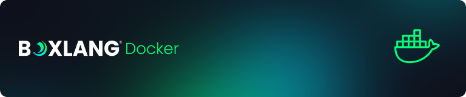

# Docker

<figure><figcaption><p>Professional BoxLang Docker images for modern containerized deployments</p></figcaption></figure>

BoxLang provides professional Docker images designed for both development and production use. Our containers are built on enterprise-grade base images with security patches, optimized for performance, and include comprehensive tooling for modern containerized applications.

## 📦 Available Images

You can find all our published images and tags here: [https://hub.docker.com/r/ortussolutions/boxlang](https://hub.docker.com/r/ortussolutions/boxlang).

### **Core Image Types**

* **CLI Images**: [ortussolutions/boxlang:cli](https://hub.docker.com/r/ortussolutions/boxlang/tags?page=1\&name=cli) - Full BoxLang CLI runtime
* **MiniServer Images**: [ortussolutions/boxlang:miniserver](https://hub.docker.com/r/ortussolutions/boxlang/tags?page=1\&name=miniserver) - Lightweight web server
* **MiniServer + Nginx**: [ortussolutions/boxlang:miniserver-nginx](https://hub.docker.com/r/ortussolutions/boxlang/tags?page=1\&name=miniserver-nginx) - Production-ready with reverse proxy

### **Base Variants**

Each image type is available in multiple variants:

* **Debian Linux** (default) - Full-featured, enterprise-ready
* **Alpine Linux** (`-alpine` suffix) - Minimal, security-focused
* **Snapshot versions** (`-snapshot` suffix) - Latest development builds

## 🖥️ CLI Images

The CLI images contain the complete BoxLang CLI runtime, allowing you to run scripts, CLI applications, schedulers, and OS integrations. Perfect for development, CI/CD pipelines, and automated tasks.

### **Available CLI Tags**

* `ortussolutions/boxlang:cli` - Latest stable CLI on Debian Linux
* `ortussolutions/boxlang:cli-alpine` - Latest stable CLI on Alpine Linux
* `ortussolutions/boxlang:cli-snapshot` - Development snapshot on Debian Linux
* `ortussolutions/boxlang:cli-alpine-snapshot` - Development snapshot on Alpine Linux

### **CLI Usage Examples**

```bash
# Pull the latest BoxLang CLI image
docker pull ortussolutions/boxlang:cli

# Check BoxLang version
docker run --rm -it ortussolutions/boxlang:cli boxlang --version

# Run the BoxLang REPL
docker run --rm -it ortussolutions/boxlang:cli boxlang

# Execute a quick code snippet
docker run --rm -it ortussolutions/boxlang:cli boxlang --bx-code "println( 'Hello, BoxLang!' )"

# Run a Task.bx script from your local directory
docker run --rm -it -v $(pwd):/app ortussolutions/boxlang:cli boxlang /app/Task.bx

# Run a Scheduler.bx script
docker run --rm -it -v $(pwd):/app ortussolutions/boxlang:cli boxlang /app/Scheduler.bx

# Development with volume mounting
docker run --rm -it -v $(pwd):/app -w /app ortussolutions/boxlang:cli boxlang your-script.bx
```

## 🌐 MiniServer Images

The MiniServer images contain the BoxLang MiniServer - a lightweight, high-performance web server designed for running BoxLang web applications, APIs, and microservices. Perfect for development, testing, and production deployments.

### **Available MiniServer Tags**

* `ortussolutions/boxlang:miniserver` - Latest stable MiniServer on Debian Linux
* `ortussolutions/boxlang:miniserver-alpine` - Latest stable MiniServer on Alpine Linux
* `ortussolutions/boxlang:miniserver-snapshot` - Development snapshot on Debian Linux
* `ortussolutions/boxlang:miniserver-alpine-snapshot` - Development snapshot on Alpine Linux

### **Key Features**

* **Auto-serving**: The MiniServer loads `/app` as the webroot directory
* **Default files**: Automatically serves `index.bxm` files
* **URL Rewrites**: Enabled by default with configurable rewrite files
* **Health checks**: Built-in health monitoring for container orchestration
* **Hot reload**: Development mode with automatic code reloading

### **MiniServer Usage Examples**

```bash
# Pull the latest BoxLang MiniServer image
docker pull ortussolutions/boxlang:miniserver

# Run a basic web server (browse to http://localhost:8080)
docker run --rm -it -p 8080:8080 ortussolutions/boxlang:miniserver

# Mount your application directory
docker run --rm -it -p 8080:8080 -v $(pwd):/app ortussolutions/boxlang:miniserver

# Run in debug mode with environment variables
docker run --rm -it -p 8080:8080 \
  -e BOXLANG_DEBUG=true \
  -e JAVA_OPTS="-Xmx1g -Xms512m" \
  -v $(pwd):/app ortussolutions/boxlang:miniserver

# Load a custom boxlang.json configuration
docker run --rm -it -p 8080:8080 \
  -v $(pwd):/app \
  -v $(pwd)/boxlang.json:/root/.boxlang/config/boxlang.json \
  ortussolutions/boxlang:miniserver

# Production deployment with custom memory settings
docker run -d --name boxlang-app \
  -p 80:8080 \
  -e MAX_MEMORY=2g \
  -e MIN_MEMORY=1g \
  -v /path/to/app:/app \
  ortussolutions/boxlang:miniserver
```

### **Health Check**

All MiniServer images include built-in health checks that monitor the server's status:

* **Interval**: 20 seconds
* **Timeout**: 30 seconds
* **Retries**: 15 attempts before marking as unhealthy
* **Endpoint**: Configurable via `HEALTHCHECK_URI` (default: `http://127.0.0.1:8080/`)

## 📦 Module Installation

The images include an automated module installer via the `BOXLANG_MODULES` environment variable. Modules are downloaded and installed at container startup.

### **Docker Compose Example**

```yaml
version: "3.8"

services:
  boxlang-app:
    image: ortussolutions/boxlang:miniserver
    environment:
      - BOXLANG_DEBUG=true
      - BOXLANG_MODULES=bx-compat-cfml,bx-esapi,bx-mysql,bx-redis
      - MAX_MEMORY=1g
      - MIN_MEMORY=512m
    volumes:
      - ./src:/app
      - ./config/boxlang.json:/root/.boxlang/config/boxlang.json
    ports:
      - "8080:8080"
    healthcheck:
      test: ["CMD", "curl", "--fail", "http://localhost:8080/"]
      interval: 30s
      timeout: 10s
      retries: 3
```

### **Available Modules**

Common modules you can install:

* `bx-compat-cfml` - ColdFusion/CFML compatibility layer
* `bx-mysql` - MySQL database connectivity
* `bx-esapi` - Enterprise Security API
* `bx-redis` - Redis cache and session storage
* `bx-mail` - Email functionality
* `bx-derby` - Derby database (development)

## ⚙️ Environment Variables

The following environment variables can be used to configure the BoxLang Docker images:

### **Core Configuration**

* `BOXLANG_CONFIG_PATH` - Path to BoxLang configuration file (default: `/root/.boxlang/config/boxlang.json`)
* `BOXLANG_DEBUG` - Enable debugging mode (default: `false`)
* `BOXLANG_HOME` - BoxLang installation home directory (default: `/root/.boxlang`)
* `BOXLANG_HOST` - Server host binding (default: `0.0.0.0`)
* `BOXLANG_MODULES` - Comma-separated list of modules to install (example: `bx-compat-cfml,bx-mysql`)
* `BOXLANG_PORT` - Server port binding (default: `8080`)

### **Server & Performance**

* `DEBUG` - Legacy debug mode flag (default: `false`)
* `JAVA_OPTS` - JVM options (default: `-Djava.awt.headless=true`)
* `HEALTHCHECK_URI` - Health check endpoint (default: `http://127.0.0.1:${PORT}/`)
* `HOST` - Server host (alias for BOXLANG\_HOST)
* `MAX_MEMORY` - Maximum heap size (default: `512m`, example: `2g`)
* `MIN_MEMORY` - Minimum heap size (default: `512m`, example: `1g`)
* `PORT` - Server port (alias for BOXLANG\_PORT)

### **Web Server Features**

* `REWRITES` - Enable URL rewrites (default: `true`)
* `REWRITE_FILE` - Rewrite configuration file (default: `index.bxm`)

### **BoxLang Environment Override**


BoxLang supports overriding any configuration setting via environment variables using the `BOXLANG_` prefix. For complete documentation, see [Environment Variable Substitution](https://boxlang.ortusbooks.com/getting-started/configuration#environment-variable-substitution).

Examples:

* `BOXLANG_DEBUGMODE=true`
* `BOXLANG_RUNTIME_CLASSGENERATION_ENABLED=false`
* `BOXLANG_RUNTIME_CUSTOMTAGSPATHS=/custom/tags`


## 🚀 Production: MiniServer with Nginx

For production deployments, we provide an experimental image combining BoxLang MiniServer with Nginx as a reverse proxy. This setup provides static file serving, SSL termination, and production-grade performance optimizations.


**Experimental Feature**: The Nginx integration is currently experimental and not recommended for critical production workloads. Use with caution and thorough testing.


### **Available Tags**

* `ortussolutions/boxlang:miniserver-nginx` - Nginx + MiniServer on Debian Linux

### **Nginx Configuration**

* **HTTP Port**: 80 (configurable via `NGINX_PORT`)
* **HTTPS Port**: 443 (configurable via `NGINX_SSL_PORT`)
* **SSL Certificate**: Self-signed certificate included
* **Custom SSL**: Mount your certificates to `/etc/nginx/ssl/`
* **Optimizations**: Production-tuned Nginx configuration for BoxLang

### **Custom SSL Certificates**

```bash
# Generate custom self-signed certificate
openssl req -x509 -nodes -newkey rsa:2048 \
    -days 365 \
    -subj "/CN=yourdomain.com" \
    -keyout ./ssl/server.key \
    -out ./ssl/server.crt

# Run with custom SSL
docker run -d -p 80:80 -p 443:443 \
  -v $(pwd):/app \
  -v $(pwd)/ssl:/etc/nginx/ssl \
  ortussolutions/boxlang:miniserver-nginx
```

### **Nginx Environment Variables**

* `NGINX_PORT` - HTTP port for Nginx (default: `80`)
* `NGINX_SSL_PORT` - HTTPS port for Nginx (default: `443`)

## 🔧 Source Code & Contributing

### **Docker Images Repository**

The complete source code for all BoxLang Docker images is available at: [https://github.com/ortus-boxlang/boxlang-docker](https://github.com/ortus-boxlang/boxlang-docker)

This repository contains:

* **Dockerfiles** for all image variants
* **Build scripts** and automation
* **Nginx configurations** for production deployments
* **Testing infrastructure** and examples
* **Documentation** and contribution guidelines

### **Image Build Process**

* **Base Images**: Eclipse Temurin JRE 21 (Debian Noble & Alpine)
* **Security**: Regular security updates and dependency patching
* **Installation**: Uses BoxLang's official quick installer
* **Optimization**: Multi-stage builds for minimal image sizes
* **Testing**: Automated testing for all image variants

### **Contributing**

We welcome contributions to improve the Docker images:

1. **Issues**: Report bugs or request features in the GitHub repository
2. **Pull Requests**: Follow the contributing guidelines in the repo
3. **Documentation**: Help improve documentation and examples
4. **Testing**: Test images in different environments and report feedback


**Professional Support**: For enterprise Docker deployments, BoxLang+ and BoxLang++ subscribers receive priority support, custom image builds, and deployment assistance. Visit [boxlang.io/plans](https://boxlang.io/plans) for more information.

