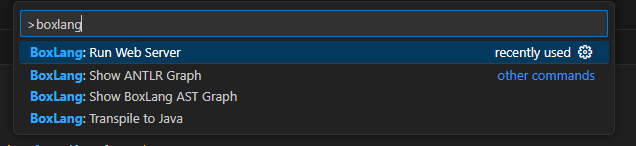

# MiniServer

<figure><figcaption></figcaption></figure>

The **BoxLang MiniServer** runtime is a **lightweight,** **lightning-fast** web server powered by Undertow. It's ideal for light-weight applications, electron apps, embedded web servers, and development. For those who desire a more robust and feature-rich servlet server implementation, we offer our [CommandBox server](commandbox.md) and [CommandBox PRO](https://boxlang.io/plans) with a BoxLang Subscription.


**Tip:** Please note that the BoxLang MiniServer is NOT a servlet server.  **There is no servlet container;** the web server is just a simple, fast, and pure Java Undertow server.



CommandBox is our open-source servlet server implementation. However, with a [Boxlang +/++ subscription](https://boxlang.io/plans), it becomes a powerhouse for mission-critical applications.  Check out all that you get with CommandBox Pro: [https://www.ortussolutions.com/products/commandbox-pro](https://www.ortussolutions.com/products/commandbox-pro)


### Starting a BoxLang MiniServer <a href="#starting-a-web-server-12" id="starting-a-web-server-12"></a>

The BoxLang core OS runtime doesn't know about a web application. Our web support runtime provides this functionality, a crucial part of the MiniServer and the Servlet (JEE, Jakarta, CommandBox) runtime. This runtime enhances the core boxlang runtime, making it multi-runtime and web deployable.

&#x20;If you use our Windows installer or our Quick Installer, you will have the `boxlang-miniserver` binary installed in your operating system.  You will use this to start servers.  Just navigate to any folder that you want to start a server in and run `boxlang-miniserver`.


Please note that our [VSCode BoxLang Extension](../ide-tooling/) can also assist you in managing and starting/stopping servers.




```bash
# Mac / *unix
cd mySite
boxlang-miniserver
```



```powershell
# Windows
cd mySite
boxlang-miniserver.bat
```



```bash
# Native Jar execution
cd mySite
java -jar /usr/local/lib/boxlang-miniserver-1.0.0.jar
```



Once you run the command, the following output will appear in your console:

```bash
+ Starting BoxLang Server...
- Web Root: /home/lmajano/Sites/temp
- Host: localhost
- Port: 8080
- Debug: false
- Config Path: null
- Server Home: null
+ Starting BoxLang Runtime...
+ Runtime Started in 2043ms
+ BoxLang MiniServer started in 2135ms
+ BoxLang MiniServer started at: http://localhost:8080
Press Ctrl+C to stop the server.
```

As you can see from the output, this is the result of the command:

* Use the current **working directory** as the web root.
* Bind to `localhost:8080` by default
* This configures the web server with some default welcome files and no rewrites.
* BoxLang will process any BoxLang or CFML files
* Uses the user's BoxLang home as the default for configuration and modules: `~/.boxlang`



**ALERT:** The BoxLang Core knows nothing of web or HTTP, so the `form`, `url`, `cookie`, and `cgi` scopes will only exist when running the BoxLang web server (but not in the REPL, etc).


That's practically it. This is a very lightweight server that can get the job done. You can also start up servers using our VSCode IDE by opening the command palette and clicking **Start** a BoxLang web server.

<figure><figcaption><p>Command Palette</p></figcaption></figure>

<figure><figcaption><p>Manage your Servers</p></figcaption></figure>

### Arguments <a href="#web-server-args-13" id="web-server-args-13"></a>

These are the supported arguments you can pass into the binary to configure the server.

<table><thead><tr><th width="351">Argument</th><th>Value</th></tr></thead><tbody><tr><td><code>--configPath path/boxlang.json</code><br><code>-c path/boxlang.json</code></td><td>Relative/Absolute location of the <code>boxlang.json</code> to use. By default it uses the <code>~/.boxlang/boxlang.json</code></td></tr><tr><td><code>--debug</code><br><code>-d</code></td><td>Put the runtime into debug mode. By default we use <code>false</code></td></tr><tr><td><code>--host ip|domain</code><br><code>-h ip|domain</code></td><td>Bind the hostname to the mini server. By default we use <code>localhost</code></td></tr><tr><td><code>--port 8080</code><br><code>-p 8080</code></td><td>The port to bind the mini server to. By default we use port <code>8080</code></td></tr><tr><td><code>--rewrites [index.bxm]</code><br><code>-r [index.bxm]</code></td><td>Enable rewrites for applications using <code>index.bxm</code> as the file to use.  You can also pass the name of the file to use: <code>--rewrites myfile.bxm</code></td></tr><tr><td><code>--serverHome path/</code><br><code>-s path/</code></td><td>The location of the BoxLang home for the miniserver. This is where it will look for the <code>boxlang.json</code>, place to put the log files, the compiled classes, load modules, and much more. <br><br>By default, we use the OS home via the <code>BOXLANG_HOME</code> environment variable which usually points to the user's home: <code>~/.boxlang/</code></td></tr><tr><td><code>--webroot path/</code><br><code>-w path/</code></td><td>The webserver root. By default, we use the directory from where you started the command.</td></tr></tbody></table>

```bash
# Custom port and webroot
boxlang-miniserver --port 80 --webroot /var/www

# Custom port and server home
boxlang-miniserver --port 80 --serverHome /var/www/servers/myServer

# Custom port and rewrites enabled
boxlang-miniserver --port 80 --rewrites
```

### Environment Variables

The `boxlang-miniserver` binary will also scan for several environment variables as overrides to the execution process.

| Env Variable                           | Purpose                                                             |
| -------------------------------------- | ------------------------------------------------------------------- |
| `BOXLANG_CONFIG = PATH`                | Override the `boxlang.json`                                         |
| `BOXLANG_DEBUG = boolean`              | Enable or disable debug mode                                        |
| `BOXLANG_HOME = directory`             | Override the server HOME directory                                  |
| `BOXLANG_HOST = ip or domain`          | Override the `localhost` default to whatever IP or domain you like. |
| `BOXLANG_PORT = 8080`                  | Override the default port                                           |
| `BOXLANG_REWRITES = boolean`           | Enable or disable URL rewrites                                      |
| `BOXLANG_REWRITE_FILE = file.bxm`      | Choose the rewrite file to use. By default, it uses `index.bxm`     |
| `BOXLANG_WEBROOT = path`               | Override the location of the web root                               |
| `BOXLANG_MINISERVER_OPTS = jvmOptions` | A list of Java options to pass to the startup command               |



Environment variables are scanned first, then the command arguments. Thus, the command arguments take precedence.


### Using 3rd Party Jars <a href="#using-3rd-party-jars-14" id="using-3rd-party-jars-14"></a>

You can load up custom third-party JARs into the runtime in two ways

1. `BOXLANG_HOME/lib` - You can place all the jars that the runtime will load in this location
   1. Remember, you can use the `--serverHome` to choose the location of the server's home
2. Add via the classpath to your runner.

Please note that if you use the `-cp` approach, then you need to use a full `java -cp` syntax or you can customize the `boxlang-miniserver` shell scripts to do your bidding.

If you want to test 3rd part libs with the web server, you’ll need to use a different syntax that uses the `-cp` (classpath) JVM arg and specifies both the boxlang jar AND a semicolon-delimited list of the jars you want to use. It’s a little annoying, but this is how Java works.

```bash
# Format
java -cp {jarpath;jarpath2} ortus.boxlang.web.MiniServer


# Example
java -cp boxlang-miniserver-1.0.0.jar;/path/to/my.jar;/path/to/another.jar ortus.boxlang.web.MiniServer
```

### Modules

The MiniServer can use any module you install into the OS home via the `install-bx-module` binary.  However, if you choose your own server home using the `server-home` argument or the environment variable.  Then, place the modules inside a `modules` directory inside the server's home.

### JVM Options

You can use the `BOXLANG_MINISERVER_OPTS` env variable to seed the Java arguments the miniserver will start with.

```bash
BOXLANG_MINISERVER_OPTS="-Xmx512m"
boxlang-miniserver
```

### Runtime Source Code

The runtime source code can be found here: [https://github.com/ortus-boxlang/boxlang-miniserver](https://github.com/ortus-boxlang/boxlang-miniserver)

We welcome any pull requests, testing, docs, etc.
